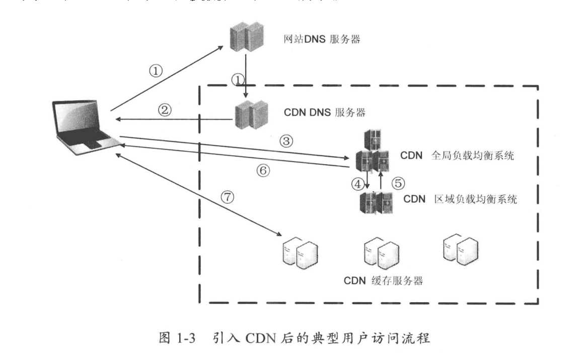
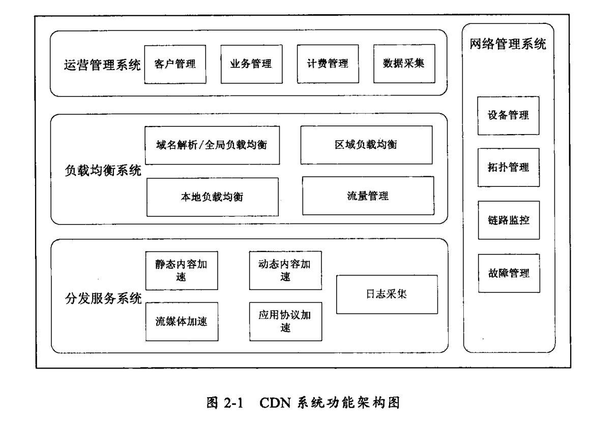
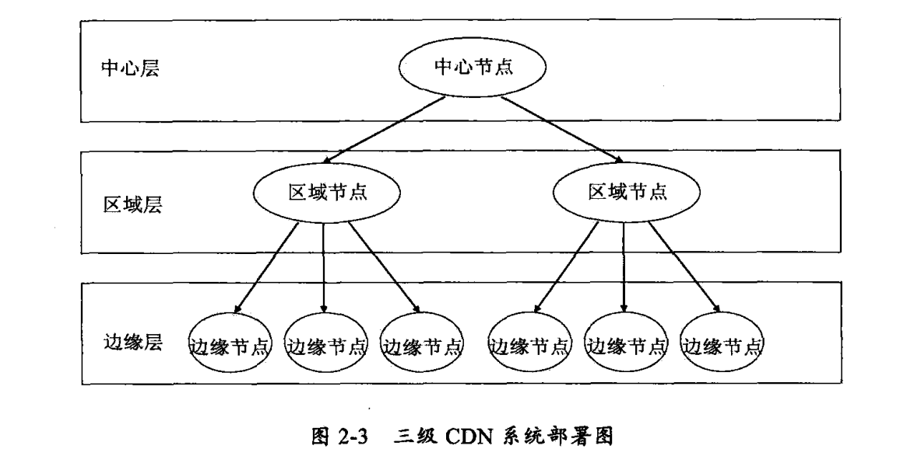
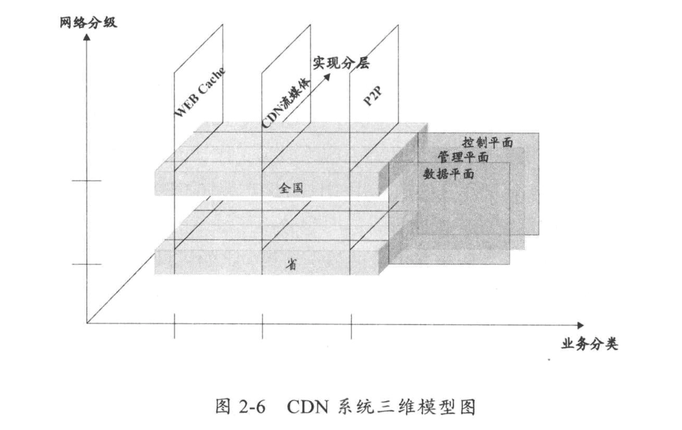
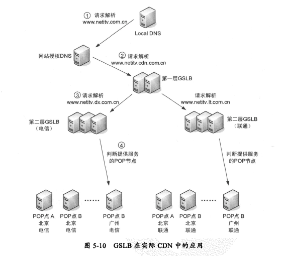
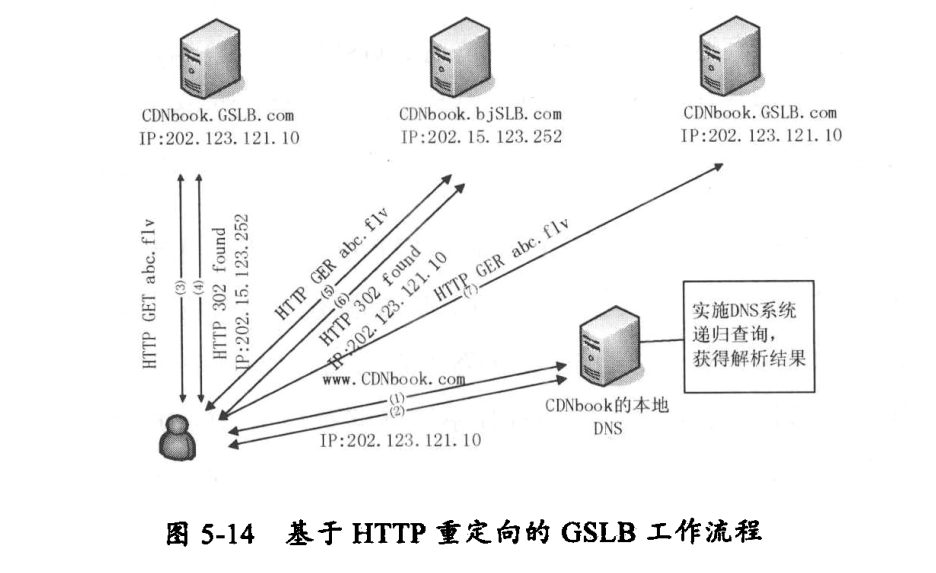

# 引言
CDN基本概念, Content Distribute Network, 内容分发网络。
产生背景, 为解决网络拥塞问题：第一公里/最后一公里/对等互联网关/长途骨干传输
CDN的基本工作过程 

<!-- more -->
# CDN技术概述
系统功能架构

系统部署架构

CDN系统分类 基于承载内容类型(网页/流媒体/文件/应用协议) 或 内容生成机制分类和分层加速服务 

# 内容缓存工作原理及实现
## 原理
正向代理, Cache设备(proxy部署在内网中)为企业网的出口网关提供代理服务/内容缓存/Internet访问控制/安全认证等功能, 用户需要配置
反向代理, Cache服务器(代理)和应用服务器部署在同一网络环境中, 有请求内容直接返回否则传给应用服务器
透明代理, 通过路由设备WCCP协议把指定用户流量直接发送给Cache(部署在内网中), 实现了正向代理功能, 但用户不需要配置

Web Cache的技术本质是缓存

## Web Cache基本实现
Web架构三处技术精华：HTML/HTTP/URI

HTTP-cookie: 保存在本地的服务器生成的用户ID文件
HTTP-sesson: 通过服务器生成全局唯一的session ID来保持会话, 保存在服务器中
两者差别可以从应用场景/安全性/性能/失效性等方面来说明

HTTPS 的安全基础是SSL, 采用对称加密和非对称加密结合的方式来进行通信
对称加密：加密和解密都是同一个密匙
非对称加密：密钥成对出现，分为公钥和私钥，公钥加密需要私钥解密，私钥加密需要公钥解密

HTTP协议中的缓存基本原则:
响应消息头告诉缓存不要保留副本 
请求需要服务器认证或安全协议, 不缓存
缓存内容已过期, 缓存服务器向源服务器确认是否可以使用当前副本直接提供服务
在有些情况如与源服务器断开情况下, 过期副本直接提供服务
响应消息不存在判断内容是否变化标记, 不缓存

## Web Cache实现关键点分析
性能指标：并发量/吞吐率/命中率/响应时间和丢包率
内容存储机制：共享存储/本地附加存储(DAS)/分布式文件系统
内容更新机制：有条件更新...

## Web Cache协议优化
tcp长连接, gzip压缩

## Web Cache安全实现机制
访问控制(ACL)/病毒防护/网络安全防护/内容加密

## 开源软件
Squid功能：Web代理/内容缓存与加速/ACL访问控制/用户认证/日志

# 集群服务与负载均衡技术
## 服务器集群技术
集群的分类: 可分为计算集群 和 负载均衡集群(CND节点) 、高可用集群
集群的系统结构: 网络层, 操作系统层, 应用层, 集群管理系统层

## Cache集群的交互方式
* 基于网络消息:
ICP：一种轻量级的消息格式(基于UDP), 访问邻居Cache服务器, 确认请求资源十分在其他服务器上
HTCP：管理一组HTTP Cache服务器并监控相关缓存活动, Web请求同ICP处理, 但后续请求可以精确应答
Cache Digest: 解决上面两种协议网络延迟和拥塞问题, Web请求只要查询服务器上保存邻居缓存信息摘要
Cache Pre-filling: 一种推送Cache内容的机制, 很好的应用的IP多播网络上

* 基于数据结构
CARP: 分布式缓存协议, 为集群定义了一张Cache服务器成员列表, 分发消息的URL哈希函数

## 负载均衡技术
* 调度算法
轮询/加权轮询/随机/加权随机/基于IP的Hash/基于IP端口的Hash/基于UDP报文Hash/最小连接/加权最小连接/最小响应时间

* 会话持续性保证技术
基于IP地址的持续性, 确保每个请求都发送到同一台服务器, 第四层负载均衡
基于cookie数据的持续性, 主要是插入和截取, 第七层负载均衡
基于SIP报文Call-Id持续性, 确保相同IP报文都发送到同一台服务器, 第七层负载均衡
基于HTTP报文头的持续性, 第七层负载均衡

* 服务器健康监测
ICMP/TCP/HTTP/FTP/DNS...

## 负载均衡部署方式
直接部署: in: client => LB => Server  out: Server => LB => client
旁挂部署: in: client => exchange => LB => Server out: Server => exchange => client

## 服务器负载均衡
* L4 基于tcpudp/ip报文头部
NAT: 网络地址转换, 将发送给虚拟IP的请求, 发送给具体服务器
DR: Direct Routeing 
* L7 基于整个报文

## 链路负载均衡
为规避运营商网络出口故障, 解决网络带宽不足等问题
根据业务流量方向分为InBound和OutBound 链路负载均衡, 前者用于外网访问内网, 后者用于内网访问外网

## 开源软件
LVS/Nginx

# 全局负载均衡工作原理
GSLB 在全网对各节点(设备)保持负载
## 基于DNS解析的GSLB
* DNS基本工作原理
根DNS服务器, 顶级域名服务器, 权威DNS服务器共同组成了DNS服务器层, 共同维护分布式层次化的数据库
本地DNS服务器：用户所在局域网或ISP网络中的域名服务器

DNS记录类型及报文格式 可以用nslookup工具查看 

|类型|原名|说明|
|:-|:-|:-|
|A记录 |Adress |域名到IP映射关系,可以有多条记录 |
|NS记录 |Name Server |域名服务器记录, 指定由哪个域名服务器来解析, 可以有多条记录 |
|SOA记录 |Start Of Authority |指定该区域的权威服务器, 只允许一条记录 |
|CNAME记录 |. |域名或主机的别名, 允许多个名字映射到一台计算机, 别名用来查询A记录|
|PTR记录 |Pointer Record |IP到域名的映射关系, 一个IP可以有多个域名 |

* 基于DNS解析的GSLB实现机制
通过CNAME方式实现负载均衡, 返回排序的IP地址
负载均衡器作为权威DNS服务器
负载均衡器作为代理DNS服务器

负载均衡策略：服务器的健康状况/地理区域距离/会话保持/响应时间/IP地址权重/会话能力阀值/往返时间
开源DNS软件: BIND

* 应用部署方式
域组：由CNAME中的别名查询到多个服务池IP
区域：用户本地DNS服务器代表的范围(联通, 电信)
服务池: 虚拟服务器集合
虚拟服务器：可以是四层交换设备进行负载均衡的一组服务器设备 

负载均衡策略, 静态策略(基于IP地址/地理位置/POP节点/成本) , 动态策略(基于POP节点健康/会话能力/物理服务器绑定/流量)

__GSLB部署关键问题:__ 网站SP接入, 用户访问调度, 异常流程, 网络攻击

## 基于应用层协议重定向GSLB
* HTTP重定向原理 302 临时性转移
* 实现机制

## 基于IP路由的GSLB
* 思科LISP协议, 封装多个IP, 网络运营商需要硬件支持

# 流媒体CDN系统的组成和关键技术
* 流媒体系统工作原理

* 流媒体协议
TRSP 远程播放控制, RTP用来提供时间信息和实现流同步, RTCP协助RTP完成质量传输控制, 
RTMP 和 HTTP Streaming 是企业自有流媒体协议
__RTP和RTCP__ 

 

__RTSP__
应用层协议, 在RTP/TTCP之上, 像遥控器控制电视一样

__RTMP__ 
flash流媒体

__HTTP Streaming__

__MPEG-2 TS__

# 动态内容和加速服务实现

# CDN商业化服务现状

# CND发展展望
