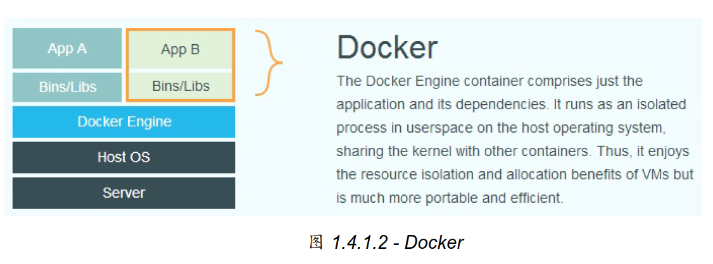
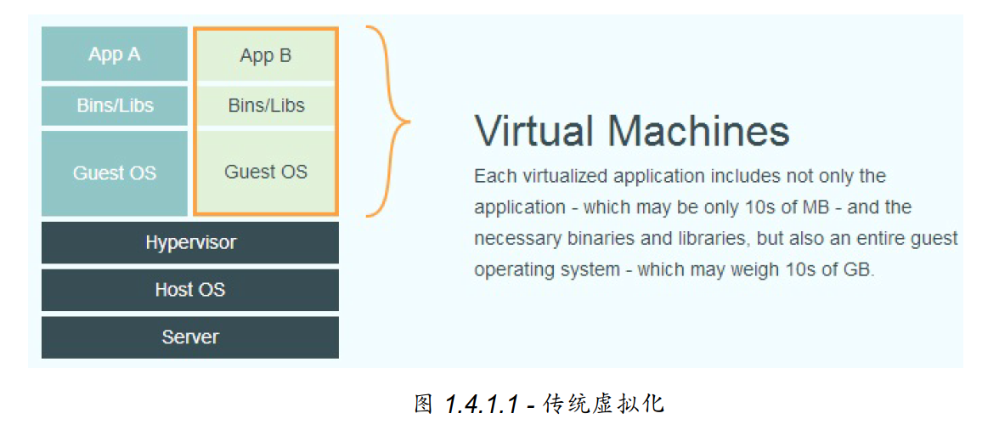

# Docker 简介
## Docker 是什么
* Docker 最初是dotCloud公司的一个内部项目
* Docker 使用go语言开发实现
* Docker 是操作系统层面的虚拟化技术

Docker 是在操作系统层面进行虚拟化, 直接复用本地主机操作系统; 而传统方式是在硬件层面实现。




## 为什么用 Docker 
优势
* 1更高效的利用系统资源(额外系统消耗忽略不计)
* 2更快速的启动时间(秒级启动, 比传统虚拟机快)
* 3一致的运行环境(开发、测试、生产环境一样)
* 4持续交付和部署(Docker构建镜像, 快速部署)
* 5更轻松的迁移(平台迁移方便)
* 6更轻松的维护和扩展(分层存储以及镜像技术, 复用和维护简单)

容器基本不消化额外的系统资源, 秒级启动, 性能很高. 启动十个进程, 需要启动10台虚拟机, 但Docker  
只需要启动十个隔离的应用即可。

# 基本概念
* 镜像(Image)
   * 一个特殊的文件系统, 包含程序,库,配置文件
   * 利用Union FS技术分层存储, 由多层文件系统联合组成, Dockerfile会一层层的构建
* 容器(Container)
   * 容器是从镜像运行时的实例, 会在镜像基础上创建一个存储层用于读写, 生命周期和容器一样 
   * 可以启、停止、删除、暂停等。容器内的进程是隔离的, 容器有自己的网络,文件系统, 进程空间, 用户空间
* 仓库(Registy)
   * 存放镜像的场所, 可以是公有仓库或者私有仓库
   * 官方[Docker Hub](https://hub.docker.com/) , 用阿里云加速, DaoCloud 等加速器下载更快

# 安装
将Docker的用户加入到Docker用户组

$ groupadd docker
$ usermod -aG docker $USER

# 使用镜像
1 获取镜像
> docker pull 

2 列出镜像
```
billing-csv-jfzx08%docker images
REPOSITORY                                      TAG                  IMAGE ID            CREATED             SIZE
20.26.38.47:5000/redo_java                      v27                  90afb9850803        2 hours ago         2.85GB
20.26.38.47:5000/suse12.2-jf                    1.8.6                3c7f01d195d9        3 hours ago         9.14GB
20.26.38.47:5000/suse12.2-zc                    1.7.6                b9afcd1d062b        4 hours ago         12.3GB
20.26.38.47:5000/suse12.2-jf                    <none>               18a1b4e851ba        6 hours ago         9.14GB
20.26.38.47:5000/suse12.2-jf                    <none>               c9ff12f7c392        6 hours ago         9.13GB
20.26.38.47:5000/suse12.2-jf                    <none>               86973ecd7035        7 hours ago         9.13GB
20.26.38.47:5000/suse12.2-zc                    <none>               a6a565cc7cd5        2 days ago          12.3GB
20.26.38.47:5000/redo_java                      v26                  71f5c0a56a15        3 days ago          2.85GB
20.26.38.47:5000/suse12.2-jf                    <none>               87bed11aa735        3 days ago          9.11GB
20.26.38.47:5000/dse-suse-12.2                  latest               9930a53d9861        3 days ago          4.9GB
20.26.38.47:5000/suse12.2-inputxdr              test5                17c4f034235b        4 days ago          3.45GB
20.26.38.47:5000/inputxdr                       v69.17               3ea2e49542c6        4 days ago          1.65GB
20.26.38.47:5000/suse12.2-decode                1.7.6                791cb433e4d0        5 days ago          5.5GB
20.26.38.47:5000/suse12.2-xc                    1.3.6                5e0f0814a1b4        5 days ago          5.29GB
20.26.38.47:5000/suse12.2-csf                   2.1                  2542b7237ccb        6 days ago          3.57GB
20.26.38.47:5000/suse12.2-zc                    1.7.4                1ab625d2ea97        7 days ago          10.7GB
20.26.38.47:5000/dse-suse-12.2                  <none>               b293ed18bbef        11 days ago         4.74GB
20.26.38.47:5000/suse12.2-decode                1.7.4                b867b33eca4e        13 days ago         5.36GB
20.26.38.47:5000/suse12.2-xc                    1.3.4                5f7c56b09631        13 days ago         5.15GB
20.26.38.47:5000/suse12.2-jf                    1.8.4                c60a266497d9        13 days ago         7.66GB
20.26.38.47:5000/dse-suse-12.2                  <none>               67e18d4bf990        2 weeks ago         4.89GB
20.26.28.55/acam/tomcat                         8.5.29-jre8-alpine   d6c75482e065        8 months ago        106MB
20.26.28.55/acam/tomcat                         v1                   d6c75482e065        8 months ago        106MB
20.26.28.55/platformv8/tomcat                   8.5.29-jre8-alpine   d6c75482e065        8 months ago        106MB
registry.yw.zj.chinamobile.com/dcos/df-client   1.9                  8f7837553678        10 months ago       276MB
```
包含了仓库, 标签, 镜像ID, 创建时间, 占用空间

镜像体积：上面命令显示的是展开后各层总和, 实际硬盘占用会小很多

```
billing-csv-jfzx08%docker system df
TYPE                TOTAL               ACTIVE              SIZE                RECLAIMABLE
Images              23                  16                  30.06GB             25.58GB (85%)
Containers          132                 25                  10.66MB             1.174MB (11%)
Local Volumes       0                   0                   0B                  0B
Build Cache                                                 0B                  0B
```
虚悬镜像：<none>  旧版本被覆盖， docker image prune 删除

中间层镜像：docker image ls -a

列出部分或指定镜像:
```
billing-csv-jfzx08%docker image ls 20.26.38.47:5000/suse12.2-jf:1.8.4
REPOSITORY                     TAG                 IMAGE ID            CREATED             SIZE
20.26.38.47:5000/suse12.2-jf   1.8.4               c60a266497d9        13 days ago         7.66GB

billing-csv-jfzx08%docker image ls -f since=20.26.38.47:5000/redo_java:v26
REPOSITORY                     TAG                 IMAGE ID            CREATED             SIZE
20.26.38.47:5000/redo_java     v27                 90afb9850803        4 hours ago         2.85GB
20.26.38.47:5000/suse12.2-jf   1.8.6               3c7f01d195d9        5 hours ago         9.14GB
20.26.38.47:5000/suse12.2-zc   1.7.6               b9afcd1d062b        6 hours ago         12.3GB
20.26.38.47:5000/suse12.2-jf   <none>              18a1b4e851ba        7 hours ago         9.14GB
20.26.38.47:5000/suse12.2-jf   <none>              c9ff12f7c392        8 hours ago         9.13GB
20.26.38.47:5000/suse12.2-jf   <none>              86973ecd7035        9 hours ago         9.13GB
20.26.38.47:5000/suse12.2-zc   <none>              a6a565cc7cd5        2 days ago          12.3GB
// 某个镜像之前的镜像, since 改成before

docker imgae ls -q
docker image ls --format "{{.ID}}:{{.Respository}}"

```

3 删除本地镜像
docker image rm $(docker image ls -q -f since=20.26.38.47:5000/redo_java:v26)
docker ls --digests

4. Dockerfile

5. 实现原理

# 操作容器


# 访问仓库


# 数据管理


# 网络


