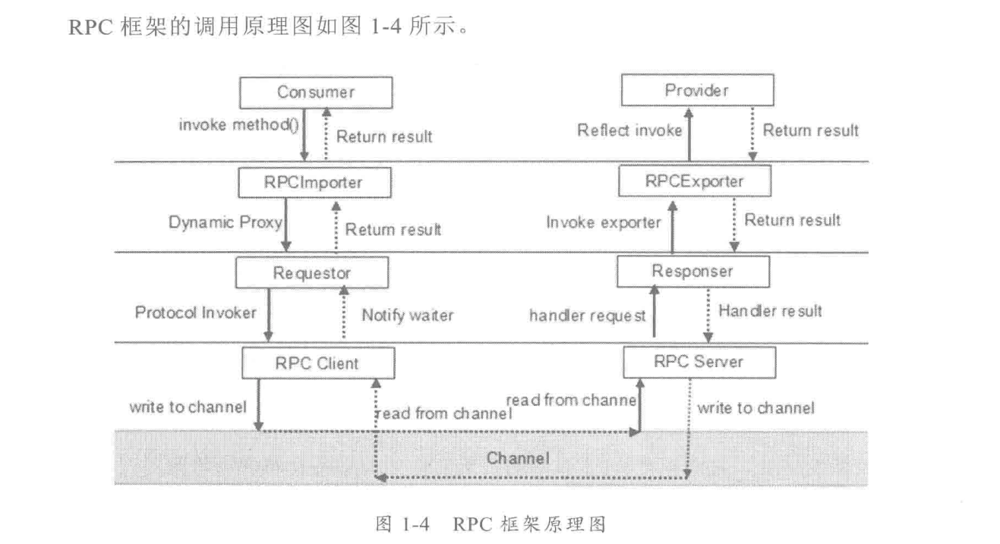

------

## 简单的RPC框架有三部分组成：
> 1 服务提供者，运行在服务端，负责提供服务接口定义和服务实现类
> 2 服务发布者，运行在RPC服务端，负责将本地服务发布成远程服务，供其他消费者调用
> 3 本地服务代理，运行在RPC客户端，通过代理调用远程服务提供者，然后将结果进行封  
返回给本地消费者

<!-- more -->
## RPC框架的调用原理如图：

## 服务治理问题
在大规模服务化之前，应用可能只是通过RPC框架，简单的暴露和引用远程服务，通过配置  
URL地址进行远程服务调用，路由则通过F5负载均衡器等进行简单的负载均衡。

当服务越来越多的时候，服务的URL配置管理变得更加困难。单纯的使用RPC就有点吃不消。  
所以在大规模分布式集群中，RPC只是作为集群的一个方法调用手段。

## RPC框架实现的几个核心技术点：
- 远程服务提供者 需要以某种形式(url/idl)提供给服务调用者

- 远程代理对象 服务调用者调用的服务实际是远程服务的本地代理

- 通信： 与具体协议无关

- 序列化：远程通信需要将对象转成二进制进行传输，不同序列化框架，支持的数据类型  
数据包大小，及性能差异很大

## PRC框架高性能设计
* I/O调度模型：同步阻塞(BIO) 还是非阻塞(NIO)
* 序列化框架的选择：文本协议、二进制协议、压缩后的二进制协议
* 线程调度模型： 串行或是并行调度，锁竞争还是无锁化

------
## 实践
### 消息定义
Header: TaskCreateTime/TaskTimeOut/SessionId/Tenantld
Body: Session String/SDL stream/ErrorInfo

### 序列化
根据不同的序列化框架做比对测试

| 框架版本  | 测试内容      | 处理次数   | 耗时(us)    | 每秒处理次数 | 每次耗时(us) |
| -  | :--- | :-     | :-     | :-      | :- |
| 1.8.x     | SJSON序列化   | 10000      | 416,225     | 24,025       | 41.62 |
| 1.8.x     | SJSON反序列化 | 10000      | 581,872     | 17,185       | 58.19 |
| 2.1.0     | SCDR序列化    | 500000     | 2,716,170   | 184,083      | 5.43 |
| 2.1.0     | SCDR反序列化  | 500000     | 3,409,015   | 146,670      | 6.82 |
| 2.1.0     | SJSON序列化   | 10000      | 1,145,281   | 8,731        | 115 |
| 2.1.0     | SJSON反序列化 | 10000      | 954,927     | 10,472       | 95.5 |
| 2.2.0     | SJSON序列化   | 10000      | 427225      | 23,407       | 42.72 |
| 2.2.0     | SJSON反序列化 | 10000      | 505211      | 19,794       | 50.52 |

### RPC服务端模型设计
#### 1 纯粹单线程模型  
> 所有工作在一个线程里实现
> 采用非阻塞I/O
> 实现单线程处理能力最大化，但没有扩展能力
> 适用于连接数少、负载轻的服务场景

#### 2 独立事件轮询线程 + 工作线程组模型
> 独立的事件轮询线程
> 工作线程可水平扩展（性能非线性扩展）
> 线程间频繁数据交换需要同步机制影响性能
> 工作线程一次只处理一个连接的任务，对于慢速连接效率不高（可能会被阻塞）
> 适用于任务量不大但业务处理耗时较大、网速快且稳定等场景

#### 3 独立端口监听 + I/O及工作线程组模型
> 独立端口监听线程，获取的新连接转发给指定的工作线程
> 工作线程负责socket连接的I/O时间轮询，以及后续的消息I/O和业务处理
> 采用非阻塞I/O，处理能力随工作线程的扩展而线性扩展
> 适用于连接数大、任务量大但业务处理耗时较小的场景

#### 4 独立端口监听 + I/O线程 + BIZ线程分组模型
> I/O事件轮询和消息收发由独立I/O线程执行
> 业务处理由独立线程执行并可扩展
> 一个I/O线程和若干和BIZ线程组成一个线程组，并可按组横向扩展
> 适用于连接数多，任务量大，任务处理耗时大的场景

