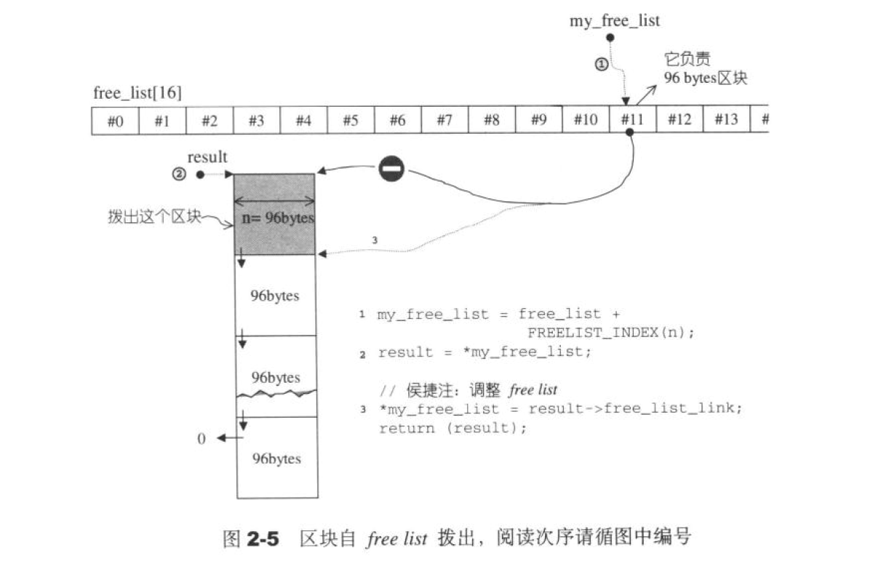

# STL概述与版本
STL六大组件, 容器/算法/迭代器/仿函数/配接器(adapters)/配置器(alloctors)

## 令人困惑的语法
### 临时对象产生和应用
for_each(begin, end, Print<int>())

<!-- more -->

### 静态常量在class里直接初始化
```
template<class T>
calss Test
{
public:
	static const int a = 1;
	static const char b = 'c';
}

```

### 操作符++/--/*
```
class Int
{
  friend ostream& operator<<(ostream& os, const Int& i);
  // prefix, same as operator--
  Int& operator++()
  {
    ++(this->m_i);
    return *this;
  }
  // postfix, same as operator--
  const Int operator++(int)
  {
    Int tmp = *this;
	++(*this);
	return tmp;
  }
  // dereference
  int& operator*() const 
  {
    return (int&)m_i;
  }
  
private:
	int m_i;
}
ostream& operator<<(ostream& os, const Int& i)
{
  os << '[' << i << ']';
  return os;
}

```

### 前闭后开


### 操作符operator() 

```
template<class T>
class Plus
{
  T operator(const T& t1, const T& t2)
  {
    return t1+t2;
  }
};

int main()
{
  Plus<int> obj;
  // 使用仿函数, 和普通函数一样
  cout<< obj(3,4) << endl;
  // 直接使用仿函数使用的临时对象, 并调用
  cout<< Plus<int>()(3,4) << endl;
}
```

## [源码获取](ftp://gcc.gnu.org/pub/gcc)
解压后在 gcc-5-20171003\libstdc++-v3\include\bits 目录

# 空间配置器
## 文件清单
stl_construct.h 定义构造析构
stl_uninitalize.h 定义内存拷贝和填充
allocate.h 定义内存分配器

## 模板分析
### 变长参数模板
接受零个或多个模板实参的模板形参
```
template<typename _T1, typename... _Args>
inline void
_Construct(_T1* __p, _Args&&... __args)
{ ::new(static_cast<void*>(__p)) _T1(std::forward<_Args>(__args)...); }
```

## 类设计
```
template<class T>
class Alloc
{
public:
	typedef size_t size_type;
	typedef T* pointer;
	typedef const T* const_pointer;
	typedef T& reference;
	typedef const T& const_reference;
	typedef T value_type;

	// 内嵌类
	template<class T1>
	struct rebind
	{typedef Alloc<T1> other;};
	
	Alloc()throw() { }
	Alloc(Alloc& rh);
	~Alloc();
	
	void allocate(); // 内存分配
	void deallocate(); // 内存释放
	void construct(); // 对象构造
	void destory(); // 对象析构
};
```

## 设计思路
> 向 heap 申请空间
> 考虑多线程状态
> 内存不足时应变处理
> 内存碎片(小的用memory pool, 大于128 bytes 才用malloc )

## allocate
allocate申请内存大于128 byte 时, 直接用new(malloc)分配
申请内存小于128 byte 时, _M_get_free_list 从空闲链表中取一块分配, 内存池由16个不同大小的链表数组(8的倍, 8~128 byte)

取到的链表头头为空, _M_refill 初始化内存池返回可用地址, _M_round_up 规整成8的整数倍
_M_allocate_chunk 申请固定内存块, 大小为 (2\*20\*(n\*sizeof(Tp))+ heap_size>>4), 返回空闲起始地址
重新调用_M_get_free_list(n*sizeof(Tp)) 
再将整个chunk中剩下的nobj-1个内存块串联起来构成一个空闲列表, 根据size获取链表数组下标返回地址

例子, _M_allocate_chunk(32, 20), 申请分配了40个32 byte块, free_list[3] 第一个交给调用者, 19个给 free_list, 余下给内存池;
若接下来调用 _M_allocate_chunk(64, 20) 只够10个, 一个交给调用者, 19个交给free_list[7];
再来调用 _M_allocate_chunk(96, 20) 则重新申请 40+n(附加量)个96 byte块......
如果heap 都没有, 从free_list 挖出一块交出, 找不到就交给malloc



## deallocate
回收也是重新放入free_list

# 迭代器
设计思路思路就是迭代器设计模式, 迭代器是一种智能指针

## 迭代器类型

## Traits 编程技法
```
template <class T>
struct MyInter
{
  typedef T value_type;
  ......
};

template <class I>
typename I::value_type  // 返回值类型, typename告诉编译器这是一个类型
func(I ite)
{
  return *ite;
}
```

参数偏特化是指对template参数更进一步的条件限制
```
template <class I>
struct iterator_traits
{
  typedef typename I::value_type value_type;
}

template <class I>
typename iterator_traits<I>::value_type  // 返回值类型, typename告诉编译器这是一个类型
func(I ite)
{
  return *ite;
}

template <class T>
struct iterator_traits
{
  typedef typename I::value_type value_type;
}

// 多这一层的好处是可以特化，支持原生指针
template <class T>
struct iterator_traits<T*>
{
  typedef T value_type;
}
```

## 

## 

# 序列容器

# 关联容器

# 算法

# 仿函数

# 配接器


