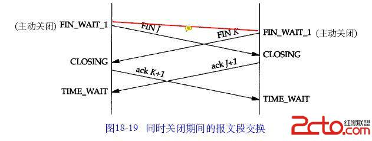
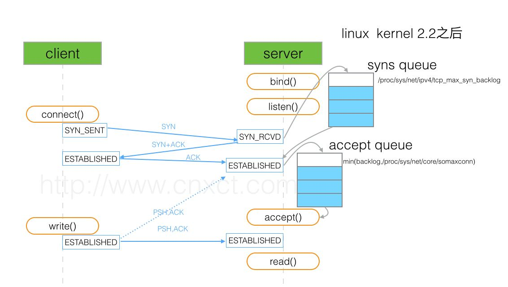

# TCP协议头部格式


DNS在应用层, TCP/UDP/PORT在传输层, IP在网络层,  ARP在数据链路层  
去掉没有协议的表示层和会话层，就是TCP/IP五层网络模型  
OSI是Open System Interconnect的缩写，意为开放式系统互联
<!-- more -->


为什么需要2MSL？
> Maximum Segment Lifetime 报文最大生存时间, 保证最后发送的ACK报文  
对端可以收到, 不然对端会重发FIN. 所以TIME_WAIT用来重发可能丢失的ACK

# 三次握手四次分手


为什么需要三次握手？
> 全双工, 告诉对方 发送/接受数据 能力OK

为什么需要四次分手？
> 为了确保数据能够完成传输(确保对端收完数据)




# TCP状态转换


# TCP如何保证可靠传输
三次握手, seq+ack, 超时重传, 流量控制, 拥塞控制

## 超时重传

## 流量控制

## 拥塞控制

# TCP粘包
TCP粘包是指发送方发送的若干包数据到接收方接收时粘成一包, 从接收缓冲区看,  
后一包数据的头紧接着前一包数据的尾

## 产生原因
> 发送方 TCP默认会使用Nagle算法: 只有上一个分组得到确认，才会发送下一个分组; 收集多个小分组，在一个确认到来时一起发送
> 接受方 没有立即处理, TCP将收到的分组保存至接收缓存里, 缓冲区会存在多个包


## 解决办法
> 发送发关闭Nagle算法, TCP_NODELAY选项
> 接受方 TCP协议没有处理机制, 通过应用层来处理
> 应用层 定义消息包头(len+type)和包体(data), 收包时循环处理

# TCP的四种定时器
> 重传计时器：Retransmission Timer
> 坚持计时器：Persistent Timer
> 保活计时器：Keeplive Timer
> 时间等待计时器：Timer_Wait Timer

# TIME_WAIT太多
压测工具主动关闭链接，产生TIME_WAIT将近3W，导致后续链接失败

## 产生原因
TIME_WAIT停留2MSL(max segment lifetime)时间

## 解决办法
```
#统计TCP套接字状态
netstat -n | awk '/^tcp/ {++S[$NF]} END {for(a in S) print a, S[a]}'

#表示开启SYN cookies。当出现SYN等待队列溢出时，启用cookies来处理，可防范少量SYN攻击，默认为0，表示关闭
net.ipv4.tcp_syncookies = 1

#表示开启重用。允许将TIME-WAIT sockets重新用于新的TCP连接，默认为0，表示关闭；
net.ipv4.tcp_tw_reuse = 1

#表示开启TCP连接中TIME-WAIT sockets的快速回收，默认为0，表示关闭
net.ipv4.tcp_tw_recycle = 1

#修改系統默认的 TIMEOUT 时间
net.ipv4.tcp_fin_timeout = 30

#查看系统本地可用端口极限值
cat /proc/sys/net/ipv4/ip_local_port_range
51_zjdev[/data01/zjgrp/zjdev]%cat /proc/sys/net/ipv4/ip_local_port_range
32768   61000
本地能向外连接61000-32768=28232个连接
```

# TCP队列
在Linux内核2.2之后，分离为两个backlog来分别限制半连接(SYN_RCVD状态)队列大小和全连接  
(ESTABLISHED状态)队列大小。
* 半连接状态为：服务器处于Listen状态时收到客户端SYN报文时放入半连接队列中，即SYN queue  
(服务器端口状态为：SYN_RCVD)
* 全连接状态为：TCP的连接状态从服务器（SYN+ACK）响应客户端后，到客户端的ACK报文到达服  
务器之前，则一直保留在半连接状态中；当服务器接收到客户端的ACK报文后，该条目将从半连  
接队列搬到全连接队列尾部，即 accept queue (服务器端口状态为：ESTABLISHED)



```
# SYN queue 队列长度
51_zjdev[/data01/zjgrp/zjdev]%cat  /proc/sys/net/ipv4/tcp_max_syn_backlog
2048

# Accept queue 队列长度
51_zjdev[/data01/zjgrp/zjdev]%cat /proc/sys/net/core/somaxconn
128

/*最终取min(128, 使用listen函数时传入的参数)。在Linux内核2.4.25之前，是写死在代码常量  
SOMAXCONN ，在Linux内核2.4.25之后，在配置文件 /proc/sys/net/core/somaxconn 中直接修改，  
或者在/etc/sysctl.conf 中配置 net.core.somaxconn = 128*/

# 查看SYN queue 溢出
[root@localhost ~]# netstat -s | grep LISTEN
102324 SYNs to LISTEN sockets dropped

# 查看Accept queue 溢出
[root@localhost ~]# netstat -s | grep TCPBacklogDrop
TCPBacklogDrop: 2334

# 查看Accept queue
[root@zhangbb ~]# ss -lnt
State      Recv-Q Send-Q                 Local Address:Port                                Peer Address:Port              
LISTEN     0      50                                 *:3306                                           *:* 

/*在LISTEN状态，其中 Send-Q 即为Accept queue的最大值，Recv-Q 则表示Accept queue中等待被服务器accept()*/
```

# Nagle与Delayed ACK
> Nagle具体的做法就是
如果发送内容大于等于 1 个 MSS， 立即发送；
如果之前没有包未被 ACK， 立即发送；
如果之前有包未被 ACK， 缓存发送内容；
如果收到 ACK， 立即发送缓存的内容。（MSS 为 TCP 数据包每次能够传输的最大数据分段）

> Delayed ACK具体的做法是(cat: /proc/sys/net/ipv4/tcp_delack_min: 没有那个文件或目录)
当有响应数据要发送时，ACK 会随响应数据立即发送给对方；
如果没有响应数据，ACK 将会延迟发送，以等待看是否有响应数据可以一起发送。在 Linux 系统中，默认这个延迟时间是 40ms；
如果在等待发送 ACK 期间，对方的第二个数据包又到达了，这时要立即发送 ACK。但是如果对方的三个数据包相继到达， 
第三个数据段到达时是否立即发送 ACK，则取决于以上两条。

A 和 B 进行数据传输 : A 运行 Nagle 算法，B 运行 Delayed ACK 算法。
如果 A 向 B 发一个数据包，B 由于 Delayed ACK 不会立即响应。而 A 使用 Nagle 算法，A 就会一直等 B 的 ACK， 
ACK 不来一直不发送第二个数据包，如果这两个数据包是应对同一个请求，那这个请求就会被耽误了 40ms。


# 发送大文件缓冲区满
解决办法, POLL_OUT/EPOLL_OUT
```
while( nLeft > 0 )
{
	nWrite = ::write( m_nSock, pBuf, nLeft);
	if(nWrite < 0)
	{
		if(errno == EINTR)
			continue;

		//LOG_ERROR(0, "errno=%d", errno);
		if(errno == EAGAIN)
		{
			struct pollfd objEvent;
			objEvent.fd = m_nSock;
			objEvent.events = (POLLOUT | POLLWRBAND | POLLERR);
			if(poll(&objEvent, 1, 1) < 0)
			{
				return nWrite;
			}
			continue;
		}
		return nWrite;
	}
}
```

# TCP keep-alive
定时发送检测包, 检测链接是否可用:
主机可达, 对方响应ack, 链接正常
主机可达, 但应用程序退出(close了还发送数据), 对发响应RST
主机可达, 但应用程序崩溃, 对方发送FIN
主机可达, 但没有响应, 超时后就撤销链接
```
net.ipv4.tcp_keepalive_time=60 
net.ipv4.tcp_keepalive_intvl=10 
net.ipv4.tcp_keepalive_probes=6
```


# wireshark 问题


## TCP Out-Of-Order

 tcp分片序列号晚送的比早送的先到达。 多半是网络拥塞，导致顺序包抵达时间不同，延时太长，或者包丢失，需要重新组合数据单元，因为他们可能是由不同的路径到达你的电脑上面。一般可以优化传输路径。

```

```

如何解决：

 https://osqa-ask.wireshark.org/questions/27662/how-to-understand-out-of-order-tcp-segments 

 https://ask.wireshark.org/question/9070/how-does-wireshark-determine-if-a-tcp-packet-is-out-of-order/ 


## TCP Dup ACK

网络拥塞，重发的ACK

 ## TCP Fast Retransmission 

网络拥塞，超时引发的数据重传。


## TCP Window Full

发送窗口数据分为三类： 发送了已经被确认，发送了还没有被确认，待发送的数据。

在网络中传输的字节数(还没有收到ACK确认)，等于对方接收窗口， Wireshark打上【TCP window Full】标记 

## TCP ZeroWindow

接收窗口满了， 也就是win=0，Wireshark显示【TCP ZeroWindow】 

## TCP Keep-Alive


## RST


## 网卡特性GRO


```
51_zjdev[/data01/zjgrp/zjdev]%ethtool -k eth0
Features for eth0:
rx-checksumming: on [fixed]
tx-checksumming: on
        tx-checksum-ipv4: off [fixed]
        tx-checksum-ip-generic: on
        tx-checksum-ipv6: off [fixed]
        tx-checksum-fcoe-crc: off [fixed]
        tx-checksum-sctp: off [fixed]
scatter-gather: on
        tx-scatter-gather: on
        tx-scatter-gather-fraglist: off [fixed]
tcp-segmentation-offload: on
        tx-tcp-segmentation: on
        tx-tcp-ecn-segmentation: on
        tx-tcp6-segmentation: on
udp-fragmentation-offload: on
generic-segmentation-offload: on
generic-receive-offload: on
large-receive-offload: off [fixed]
rx-vlan-offload: off [fixed]
tx-vlan-offload: off [fixed]
ntuple-filters: off [fixed]
receive-hashing: off [fixed]
highdma: on [fixed]
rx-vlan-filter: on [fixed]
vlan-challenged: off [fixed]
tx-lockless: off [fixed]
netns-local: off [fixed]
tx-gso-robust: off [fixed]
tx-fcoe-segmentation: off [fixed]
tx-gre-segmentation: off [fixed]
tx-ipip-segmentation: off [fixed]
tx-sit-segmentation: off [fixed]
```