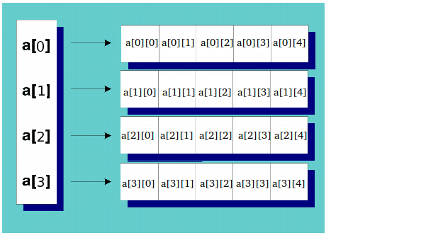

# 什么是指针
指针是一个变量，其值为另一个变量的地址，即内存位置的直接地址

<!-- more -->
```
#include <iostream>
using namespace std;
 
int main ()
{
   int  var = 20;   // 实际变量的声明
   int  *ip;        // 指针变量的声明
   ip = &var;       // 在指针变量中存储 var 的地址
 
   // 输出在指针变量中存储的地址
   cout << "Address stored in ip variable: ";
   cout << ip << endl;
 
   // 访问指针中地址的值
   cout << "Value of *ip variable: ";
   cout << *ip << endl;
 
   return 0;
}
```

# 指针数组
```
#include <iostream>
using namespace std;
const int MAX = 3;
 
int main ()
{
   int  var[MAX] = {10, 100, 200};
   int *ptr[MAX];
 
   for (int i = 0; i < MAX; i++)
   {
      ptr[i] = &var[i]; // 赋值为整数的地址
   }
   for (int i = 0; i < MAX; i++)
   {
      cout << "Value of var[" << i << "] = ";
      cout << *ptr[i] << endl;
   }
   return 0;
}
```

# 多级指针


```
// 值传递 因为有临时拷贝
void getMemory(char** p, int num)
{
  *p = (char*)malloc(num);
}

// 引用传递 直接使用
void lookup_AdjDetail(int key, const CAdjDetail*& pVal)
{
  pVal = new CAdjDetail();
}

```

# 二维数据指针


```
int rowsNum = 2;
int colsNum = 4;
// 内存分配
int** a = new int*[rowsNum];
for(int i = 0; i < rowsNum; i++)
{
	a[i] = new int[colsNum];
}
// 内存释放
for(int i = 0; i < rowsNum; i++)
{
	 delete[] a[i];
}
delete []a;
```

# 指针运算

自增或自减 都指向下一个对象 

```
CDetail* pDeductFree = (CDetail*)((char*)pQuery+sizeof(CQueryUp));
for(int i=0; i<pQuery->size; ++i)
{
  pDeductFree++;
}
```


