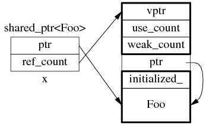
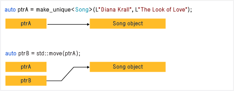

## [智能指针](https://msdn.microsoft.com/zh-cn/library/hh279674.aspx) (头文件memory)

## 小结
auto_ptr c++11已废弃, 赋值后不安全，原指针变成野指针; 不支持数据和容器一起使用
unique_ptr 替代 auto_ptr, 严格控制所有权, 不允许直接赋值, 可移动(move 后原指针为空);
shared_ptr 采用引用计数, 安全性提高; 多个 shared_ptr 对象指向同个对象，多次析构core不安全;
weak_ptr 不参与引用计数, 通过lock()访问 shared_ptr 实例拥有的对象

模板 shared_ptr 包含一个显式构造函数，可用于将右值unique_ptr转换为shared_ptr。
shared_ptr 将接管原来归unique_ptr所有的对象。

<!-- more -->

## auto_ptr
废弃原因：
1. 当把一个auto_ptr赋给另外一个auto_ptr时, 原指针变为野指针, 不安全
2. 不支持数组和在容器中使用

```
void Fun(auto_ptr<Test> p1 )
{
 cout<<p1->m_a<<endl;
}

void main( )
{
 std::auto_ptr<Test> p( new Test(5) ); 
 Fun(p);
 cout<<p->m_a<<endl;
}
```

## shared_ptr
### 使用方式
__初始化:__ 
智能指针是个模板类，可以指定类型，传入指针通过构造函数初始化。 
也可以使用make_shared函数初始化。不能将指针直接赋值给一个智能指针， 
一个是类，一个是指针。例如std::shared_ptr<int> p4 = new int(1) 写法是错误的

__拷贝和赋值: __
引用计数加1, 当计数为0时, 自动释放内存;

__方法:__
get(): 获取原始指针
reset(): 释放关联内存块的所有权，计数减一, 如果是最后一个指向该资源的shared_ptr, 就释放这块内存
unique(): 判断是否是唯一指向当前内存的shared_ptr

```
#include <iostream>
#include <memory>

int main() {
    {
        int a = 10;
        std::shared_ptr<int> ptra = std::make_shared<int>(a);
        std::shared_ptr<int> ptra2(ptra); //copy
        std::cout << ptra.use_count() << std::endl; //  2

        int b = 20;
        int *pb = &a;
        //std::shared_ptr<int> ptrb = pb;  //error
        std::shared_ptr<int> ptrb = std::make_shared<int>(b);
        ptra2 = ptrb; //assign
        pb = ptrb.get(); //获取原始指针

        std::cout << ptra.use_count() << std::endl; // 1
        std::cout << ptrb.use_count() << std::endl; // 2
    }
}
int main()
{
    auto ptr1 = std::make_shared<Resource>();
    cout << ptr1.use_count() << endl;  // output: 1
    {
        auto ptr2 = ptr1;  // 通过复制构造函数使两个对象管理同一块内存
        std::shared_ptr<Resource> ptr3;   // 初始化为空
        ptr3 = ptr1;   // 通过赋值，共享内存
        cout << ptr1.use_count() << endl;  // output: 3
        cout << ptr2.use_count() << endl;  // output: 3
        cout << ptr3.use_count() << endl;  // output: 3
    }
    // 此时ptr2与ptr3对象析构了
    cout << ptr1.use_count() << endl;  // output: 1
}
```

### 存在问题
1. 多个shared_ptr对象用一个普通指针构造, 析构时core; 用make_shared 避免

2. 用指针去创建shared_ptr, 不小心删除指针, 析构时core

3. 循环引用, 资源都不会正常释放; 用weak_ptr 避免

4. 读线程不安全, 写线程不安全

```
// ---1
void main( )
{
 int* p = new int;
 shared_ptr<int> sptr1( p);
 shared_ptr<int> sptr2( p );
}

// ---2
class Person
{
public:
    Person(const string& name):
        m_name{name}
    {
        cout << m_name << " created" << endl;
    }

    virtual ~Person()
    {
        cout << m_name << " destoryed" << endl;
    }

    friend bool partnerUp(std::shared_ptr<Person>& p1, std::shared_ptr<Person>& p2)
    {
        if (!p1 || !p2)
        {
            return false;
        }

        p1->m_partner = p2;
        p2->m_partner = p1;

        cout << p1->m_name << " is now partenered with " << p2->m_name << endl;
        return true;
    }

private:
    string m_name;
    std::shared_ptr<Person> m_partner; // std::weak_ptr<Person> m_partner;
};

int main()
{
    {
        auto p1 = std::make_shared<Person>("Lucy");
        auto p2 = std::make_shared<Person>("Ricky");
        partnerUp(p1, p2);  // 互相设为伙伴
    }

    cin.ignore(10);
    return 0;
}

int main() {
    {
        std::shared_ptr<int> sh_ptr = std::make_shared<int>(10);
        std::cout << sh_ptr.use_count() << std::endl;

        std::weak_ptr<int> wp(sh_ptr);
        std::cout << wp.use_count() << std::endl;

        if(!wp.expired()){
            std::shared_ptr<int> sh_ptr2 = wp.lock(); //get another shared_ptr
            *sh_ptr = 100;
            std::cout << wp.use_count() << std::endl;
        }
    }
    //delete memory
}

```

### 其他
1. 为什么要尽量使用 make_shared
为了节省一次内存分配, 原来 shared_ptr<Foo> x(new Foo); 需要为 Foo 和 ref_count  
各分配一次内存, 现在用 make_shared()的话, 可以一次分配一块足够大的内存, 供 Foo  
和 ref_count 对象容身, 数据结构是：



2. explicit构造函数, 不允许隐式转换
```
shared_ptr<double> pd; 
double *p_reg = new double;
pd = p_reg;                               // not allowed (implicit conversion)
pd = shared_ptr<double>(p_reg);           // allowed (explicit conversion)
shared_ptr<double> pshared = p_reg;       // not allowed (implicit conversion)
shared_ptr<double> pshared(p_reg);        // allowed (explicit conversion)
```

## weak_ptr
### 使用方式
1. 方法
* 调用lock()可以得到shared_ptr或者直接将weak_ptr转型为shared_ptr
* 调用use_count()去获取引用计数，该方法只返回强引用计数，并不返回弱引用计数
* 调用expired()方法。比调用use_count()方法速度更快

2. 解决循环引用内存不会释放问题

```
#include <iostream>
#include <memory>

int main() {
    {
        std::shared_ptr<int> sh_ptr = std::make_shared<int>(10);
        std::cout << sh_ptr.use_count() << std::endl;

        std::weak_ptr<int> wp(sh_ptr);
        std::cout << wp.use_count() << std::endl;

        if(!wp.expired()){
            std::shared_ptr<int> sh_ptr2 = wp.lock(); //get another shared_ptr
            *sh_ptr = 100;
            std::cout << wp.use_count() << std::endl;
        }
    }
    //delete memory
}
```

## unique_ptr

不允许直接赋值, 支持数组/容器/lambda 表达式, 可以作为返回值和参数

```
void useResource(const std::unique_ptr<Resource>& res)
auto ptr = std::make_unique<Resource>();
useResource(ptr);

void takeOwnerShip(std::unique_ptr<Resource>&& res)
auto ptr = std::make_unique<Resource>();
// takeOwnerShip(ptr); // 非法
takeOwnerShip(std::move(ptr)); // 必须传递右值
```

__方法__
release()：返回该对象所管理的指针，同时释放其所有权
reset()：析构其管理的对象内存，同时也可以传递进来一个新的指针对象 
swap()：交换所管理的对象 
get()：返回对象所管理的指针 
get_deleter()：返回析构其管理指针的调用函数

```
int main()
{

    std::unique_ptr<Fraction> f1{ new Fraction{ 3, 5 } };
    cout << *f1 << endl; // output: 3/5

    std::unique_ptr<Fraction> f2; // 初始化为nullptr

    // f2 = f1 // 非法，不允许左值赋值
    f2 = std::move(f1);  // 此时f1转移到f2，f1变为nullptr

    // C++14 可以使用 make_unique函数
    auto f3 = std::make_unique<Fraction>(2, 7);
    cout << *f3 << endl;  // output: 2/7

    // 处理数组，但是尽量不用这样做，因为你可以用std::array或者std::vector
    auto f4 = std::make_unique<Fraction[]>(4);
    std::cout << f4[0] << endl; // output: 0/1

    cin.ignore(10);
    return 0;
}
// 注意：无法处理数组
template<typename T, typename ... Ts>
std::unique_ptr<T> make_unique(Ts ... args)
{
    return std::unique_ptr<T> {new T{ std::forward<Ts>(args) ... }};
}
```
### 优点

1. 将一个unique_ptr赋值给另一个时, 如果源 unique_ptr是个临时右值, 编译器允许这么做
```
unique_ptr<string> demo(const char * s)
{
    unique_ptr<string> temp (new string (s))； 
    return temp；
}
unique_ptr<string> ps;
ps = demo('Uniquely special")；
```

2. 无法赋值, 可以移动; 或者release释放后reset转移


```
unique_ptr<Foo> ptr = make_unique<Foo>();
Foo* p = ptr.release();
```

```
#include <iostream>
#include <vector>
#include <memory>
#include <cstdio>
#include <fstream>
#include <cassert>
#include <functional>
 
struct B {
  virtual void bar() { std::cout << "B::bar\n"; }
  virtual ~B() = default;
};
struct D : B
{
    D() { std::cout << "D::D\n";  }
    ~D() { std::cout << "D::~D\n";  }
    void bar() override { std::cout << "D::bar\n";  }
};
 
// a function consuming a unique_ptr can take it by value or by rvalue reference
std::unique_ptr<D> pass_through(std::unique_ptr<D> p)
{
    p->bar();
    return p;
}
 
void close_file(std::FILE* fp) { std::fclose(fp); }
 
int main()
{
  std::cout << "unique ownership semantics demo\n";
  {
      auto p = std::make_unique<D>(); // p is a unique_ptr that owns a D
      auto q = pass_through(std::move(p)); 
      assert(!p); // now p owns nothing and holds a null pointer
      q->bar();   // and q owns the D object
  } // ~D called here
 
  std::cout << "Runtime polymorphism demo\n";
  {
    std::unique_ptr<B> p = std::make_unique<D>(); // p is a unique_ptr that owns a D
                                                  // as a pointer to base
    p->bar(); // virtual dispatch
 
    std::vector<std::unique_ptr<B>> v;  // unique_ptr can be stored in a container
    v.push_back(std::make_unique<D>());
    v.push_back(std::move(p));
    v.emplace_back(new D);
    for(auto& p: v) p->bar(); // virtual dispatch
  } // ~D called 3 times
 
  std::cout << "Custom deleter demo\n";
  std::ofstream("demo.txt") << 'x'; // prepare the file to read
  {
      std::unique_ptr<std::FILE, decltype(&close_file)> fp(std::fopen("demo.txt", "r"),
                                                           &close_file);
      if(fp) // fopen could have failed; in which case fp holds a null pointer
        std::cout << (char)std::fgetc(fp.get()) << '\n';
  } // fclose() called here, but only if FILE* is not a null pointer
    // (that is, if fopen succeeded)
 
  std::cout << "Custom lambda-expression deleter demo\n";
  {
    std::unique_ptr<D, std::function<void(D*)>> p(new D, [](D* ptr)
        {
            std::cout << "destroying from a custom deleter...\n";
            delete ptr;
        });  // p owns D
    p->bar();
  } // the lambda above is called and D is destroyed
 
  std::cout << "Array form of unique_ptr demo\n";
  {
      std::unique_ptr<D[]> p{new D[3]};
  } // calls ~D 3 times
}
```
