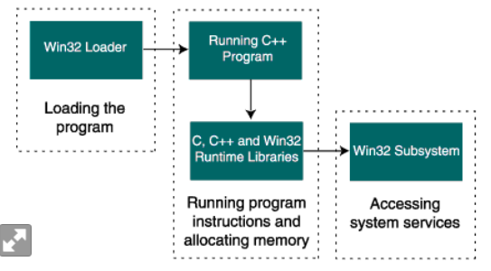
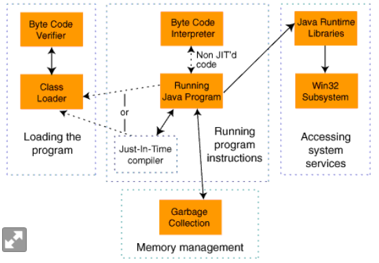

[参考文章地址](https://www.javaworld.com/article/2076593/performance-tests-show-java-as-fast-as-c--.html?page=2)

# The test suite
> * Loading Program Executable(加载程序可执行文件)
> * Running Program Instructions(运行程序指令)
> * Allocating Memory(内存分配)
> * Accessing System Resources(访问系统资源)

Environment
Platform: linux/windows
Hardware configuration: cpu,memory
Software: c++/jdk version

<!-- more -->
# Loading Program Executable(LPE)

There are two main contributors to this size difference: executable size and selective loading.

## executable size
c++一般比java大, jvm包含运行需要的库？

## selective loading

c++在执行前加载全部可执行文件。链接库加载分为静态和动态加载, 静态加载是指在执行前加载，动态加载  
是指在运行时调用对应函数。动态加载时没有类型校验, 库变更会导致不可预知的错误。

java在需要时动态加载

# Running Program Instructions(RPI)

There are two possible methods a JVM uses to do so: a bytecode interpreter or a just-in-time(JIT) compiler.
没有JIT(即时编译技术)的JVM在执行每一条指令时都会看到它，因此它不能动态地执行这些类型的优化。但是，JIT可以对整  
个类文件执行代码优化。因此，与JIT和本地C++应用程序运行的Java程序之间唯一的显著性能差异将是执行  
类文件的初始翻译所需的时间和执行的优化类型。实际应用中程序多次使用相同的类, JIT智能编译用到次数  
多的类, 因此翻译过程的开销通常是微不足道的。

编译器的优化参数也是很关键的, 例如对无效代码(Dead Code)是执行还是直接删除
c++ RTTI: Run-Time Type Identification, 主要是typeid操作符和4个类型转换关键字

| Test  | Description      | C++(sec)   | Java(JIT)    | Java(Bytecode interpreter) |
| -  | :--- | :-     | :-     | :-      | 
| Integer division  | This test loops 10 million times on an integer division.      | 1.8   | 1.8    | 4.8 |
| Dead code  | This test loops 10 million times and performs an operation that is never used.      | 3.7   | 3.7    | 9.5 |
| Dead code with Integer division	  | This test loops 10 million times and performs an operation that is never used and one that is.      | 5.7   | 5.7    | 20 |
| Floating-point division  | This test loops 10 million times on a floating-point division.      | 1.6   | 1.6    | 8.7 |
| Static method  | This test loops 10 million times calling a static method which contains an Integer division.      | 1.8   | 1.8    | 6.0 |
| Member method  | This test loops 10 million times calling a member method which contains an Integer division.      | 1.8   | 1.8    | 10 |
| Virtual member method  | The Member method test performed above is not really valid. In Java all Member methods are virtual. This test loops 10 million times calling a Virtual member method which contains an Integer division.      | 1.8   | 1.8    | 10 |
| Virtual member method with down cast and Run-Time Type Identification (RTTI)  | This test loops 10 million times calling a Virtual method on a class that has been down cast using RTTI.      | 11   | 4.3    | 12 |
| Virtual member method with invalid down cast and Run-Time Type Identification (RTTI)  | This test loops 10 million times calling a Virtual method on a class that has been down cast using RTTI.      | crash   | crash   | crash |

# Allocating Memory(AM)

JAVA的GC机制避免内存泄漏人工检查时间, 内存碎片问题。c++ 直接通过glibc来分配。
Allocating and freeing 10 million 32-bit integers took 0.812 seconds in C++ and 1.592 seconds in Java. 

# Accessing System Resources (ASR)
文件/网络操作方面, java跨平台移植方便(jdk封装)，c++无法比拟的优势

