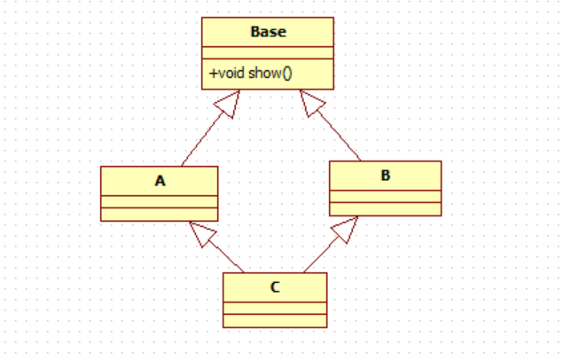

# 菱形继承是什么
封装，继承，多态，这是C++语言的三大特性，而每次在谈到继承时不可避免的要谈到一个问题：菱形继承
<!-- more-->


```
#include <iostream>
using namespace std;
class Base
{
public:
        Base() { cout<<"Base"<<endl; }
        ~Base() { cout<<"~Base"<<endl; }
        void show(){ cout << "Base::show a=" << a << endl; }
        int a=0;
};
class A : public Base
{
public:
        A() { cout<<"A"<<endl; }
        ~A() { cout<<"~A"<<endl; }
};
class B : public Base
{
public:
        B() { cout<<"B"<<endl; }
        ~B() { cout<<"~B"<<endl; }
};
class C : public A, public B
{
public:
        C() { cout<<"C"<<endl; }
        ~C() { cout<<"~C"<<endl; }
};

int main()
{
  C c;
  cout<< "sizeof(Base)="<< sizeof(Base) << endl;
  cout<< "sizeof(C)="<< sizeof(c) << endl;
}
// output: 
Base
A
Base
B
C
sizeof(Base)=4
sizeof(C)=8
~C
~B
~Base
~A
~Base
```

从输出结果来看, 构造顺序按声明的顺序，C类的大小8是有2个Base对象。当用C对象调用show方法，会产生“二义性”问题。

域限定方式可解决：
```
 C c;
 c.A::show();
```

还有就可以使用虚继承的方式

# 虚继承
虚继承是一种机制，类通过虚继承指出它希望共享虚基类的状态。对给定的虚基类，无论该类在派  
生层次中作为虚基类出现多少次，只继承一个共享的基类子对象，共享基类子对象称为虚基类。虚  
基类用virtual声明继承关系就行了。

```
#include <iostream>
using namespace std;
class Base
{
public:
        Base() { cout<<"Base"<<endl; }
        ~Base() { cout<<"~Base"<<endl; }
        void show(){ cout << "Base::show a=" << a << endl; }
        int a=0;
};
class A : virtual public Base
{
public:
        A() { cout<<"A"<<endl; }
        ~A() { cout<<"~A"<<endl; }
};
class B : virtual public Base
{
public:
        B() { cout<<"B"<<endl; }
        ~B() { cout<<"~B"<<endl; }
};
class C : public A, public B
{
public:
        C() { cout<<"C"<<endl; }
        ~C() { cout<<"~C"<<endl; }
};

int main()
{
  C c;
  cout<< "sizeof(Base)="<< sizeof(Base) << endl;
  cout<< "sizeof(C)="<< sizeof(c) << endl;
}
// output:
Base
A
B
C
sizeof(Base)=4
sizeof(C)=24
~C
~B
~A
~Base
```

输出24 = (2个8字节的C类虚基指针) + sizeof(A)+sizeof(B) = 16 + 4 + 4 

## 典型应用
```
class istream : virtual public ios{...};
class ostream : virtual public ios{...};
class iostream : public istream, public ostream{...};
```

## 注意
1. 虚继承只是解决了菱形继承中派生类多个基类内存拷贝的问题，并没有解决多重继承的二义性问题
2. 通常每个类只会初始化自己的直接基类，如果不按虚继承处理，那么在菱形继承中会出现基类被初  
始多次的情况。在虚继承中，对初始化进行了特殊处理，由最底层派生类的构造函数初始化虚基类


