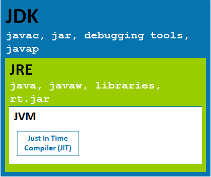

# Java特点
__why invent java ?__
	1995.5.23  sun.发布
	简单：抛弃指针、垃圾回收机制 (System.gc() ; ) 
	安全：允许用户使用指针而不允许用户操作指针
	跨平台：跨操作系统平台
	
32位(xp),指总线宽度为32位，存储内存空间的地址值，可以存储2^32个不同的值，每个地址值指向一个字节的 
地址， 故机器能够识别管理大内存空间为2^32字节(4*2^10*2^10*2^10=4G)

C++原码跨平台，编译后不跨平台，需不同平台下编译 

高级语言 => 编译 => 操作平台代码 => OS转化 => 机器平台代码(cpu指令集)
java语言 => 编译 => 二进制字节码 => JVM (不跨平台)=> 转化 => 操作平台代码 => OS转化 => 机器平台代码
<!-- more -->

# What is the difference between JRE,JVM and JDK?
JDK Java Development Kit, 编写java程序所需的开发工具包, 包含JRE, java/javac。
JRE Java Runtime Environment, JRE=JVM+Java Packages Classes+runtime libraries
JVM Java Virtual Machine, It only helps Java to be executed on the platform-independent way. 


[参考](https://javabeat.net/what-is-the-difference-between-jrejvm-and-jdk/)


# JDK安装

JDK/lib 目录下rt.jar JDK提供的基础开发类库(字节码文件); src.zip是rt.jar 的源码
```
.bash_profile
	JAVA_HOME=xxxxx                 #JDK安装目录
	CLASSPATH=.                     #字节码搜索路径
	PATH=$PATH:$JAVA_HOME/bin       #加入jdkXXX/bin目录 (jdk开发调试命令 )
	export JAVA_HOME CLASSPATH PATH

	vi MyFirstJava.java
	javac MyFirstJava.java
	java MyFirstJava
```

# Java基本概念
## __类__
  1) 一个java源文件可以定义多个类，但最多只能有一个public类，而且该public类的类名必须和文件名一致
  2) 一个java源文件在编译后形成的字节码文件个数与该源文件中定义的类的个数一致，每一个类 => 一个字节码文件
  3) 一个可运行的java类有且仅有一个主方法，而且主方法的签名(public static void main(String[] args))是固定的，是整个程序的入口方法

## __包__
  url + project_name + project_model_name, 例如 com.tarena.abs.model
 
```
package xxx.xxx.xxx;
import java.util.Scanner;
import java.util.List;
import java.util.*;

public class XXX{
		public static void main(String[] args){
				... ... ...
			}
	}
class XXX{
		... ... ...
	}
```

## __编译运行__
  javac PackageTest.java -d . | or | javac -d . PackageTest.java  
  带包编译并把编译后生成的class字节码文件放在指定目录下
  java xxx.xxx.PackageTest
  1) 启动JVM
  2) 装载类的字节码文件, 先到当前所在包下找, 再到jre/lib/xxx.jar中找, 再到CLASSPATH中找
  3) 运行类的主方法
  String => java.lang 包下 => 字节码文件在jre/lib/rt.jar中 => 默认会加载，不必配置CLASSPATH，(jre/lib/下的jar文件都会自动加载，不需配置)
                java.lang包下的所有类的使用可以不写包名，直接写类名 

```
javac -help
//...单行注释
/*
	...多行注释
	*/
/**
	...文档注释
	*/
生成文档：javadoc String.java -d(目录参数) ./docs 
```


