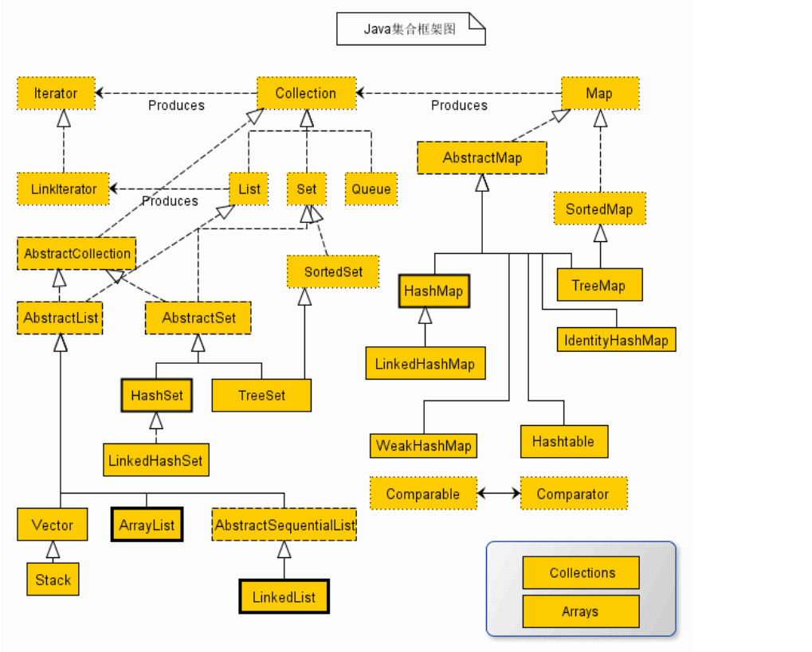

# 内部类
## 静态内部类
```
class OuterClass{
	private String name1 = "hello";
	private static String name2 = "moto";
	public static class InnerClass{//看成一个静态成员，寄居关系
		public void innerM(){
		}
	}
}
```
静态内部类中只能访问外部类的静态成员
访问方式同-->类名.静态成员
<!-- more -->
## 成员内部类
```
class OuterClass{
	private String name1 = "hello";
	private static String name2 = "moto";
	public class InnerClass{//看成一个实例成员，寄生关系
//		private OuterClass outer;
		public InnerClass(/*OuterClass outer*/){
//			this.outer = outer;
//			外部调用构造方法时编译器会自动传入外部对象参数
		}
		public void innerM(){
			System.out.println(name1 + name2);-->默认输出 OuterClass.this.name1(编译器会转化成outer.name1)(成员内部类访问外部类当前对象)
		}
	}
}

OuterClass outer = new OuterClass();
OuterClass.InnerClass  inner = outer.new InnerClass();
//OuterClass.InnerClass inner = new InnerClass(outer);
inner.innerM();
```
成员内部类可以访问外部类的所有成员
访问方式同-->外部对象引用.实例成员

## 局部内部类
```
class OuterClass{
	public Object M(){//方法中包含类, 看成方法的局部变量
		class InnerClass implements MyInter{
			final int num = 0; //
			public void innerM(){
			}
		}
		return new InnerClass();
	}
}

interface MyInter{
	public void innerM();
}

OuterClass outer = new OuterClass();
MyInter inter = outer.M();
inter.innerM();

```

若内部类方法要访问外部方法中的变量, 该变量必须是final, 否则当外部类方法执行完, 变量被GC, JDK 1.8 不需要声明为final

## 匿名内部类
```
class OuterClass{
	public MyInter M(){
		//这里将匿名内部类生成的对象当成一个方法的返回值返回
		return new MyInter(){//定义一个无名类实现MyInter接口，实现方法，生成该实现类的对象
			public void innerM(){
				// ... ... 
			}
		} ;
	}
}
```

局部内部类的特例, 无类名，无构造方法，必隐含实现接口或继承父类

# 集合
## Collection
Collection 接口是 List 接口和 Set 接口的父接口，通常情况下不被直接使用(不能对其实例化) 

|常用方法|说明|
|:-|:-|
| boolean add(E e)| 向集合中添加一个元素，E 是元素的数据类型|
| boolean addAll(Collection c)| 向集合中添加集合 c 中的所有元素|
| void clear()| 删除集合中的所有元素|
| boolean isEmpty()| 判断集合是否为空|
| Iterator iterator()	| 返回一个 Iterator 对象，用于遍历集合中的元素|
| boolean remove(Object o)| 从集合中删除一个指定元素|
| int size()| 	返回集合中元素的个数|
| boolean contains(Object o)| 判断集合中是否存在指定元素|


## List
List 接口实现了 Collection 接口，它主要有两个实现类：ArrayList 类和 LinkedList 类
ArrayList 类提供了快速的基于索引的成员访问方式，对尾部成员的增加和删除支持较好
LinkedList 类采用链表结构保存对象，这种结构的优点是便于向集合中插入或者删除元素

        ArrayList类常用方法
|方法|说明|
|:-|:-|
| E get(int index)| 获取此集合中指定索引位置的元素，E 为集合中元素的数据类型| 
| int index(Object o)| 返回此集合中第一次出现指定元素的索引，如果此集合不包含该元素，则返回 -1| 
| int lastIndexOf(Obj ect o)| 返回此集合中最后一次出现指定元素的索引，如果此集合不包含该元素，则返回 -1| 
| E set(int index, E element)| 将此集合中指定索引位置的元素修改为 element 参数指定的对象| 
| List&lt;E&gt; subList(int fromlndex, int tolndex)| 返回一个新的集合| 

      LinkedList常用方法
|方法|说明|
|:-|:-|
| void addFirst(E e)| 将指定元素添加到此集合的开头|
| void addLast(E e)| 将指定元素添加到此集合的末尾|
| E getFirst()| 返回此集合的第一个元素|
| E getLast()| 返回此集合的最后一个元素|
| E removeFirst()| 删除此集合中的第一个元素|
| E removeLast()| 删除此集合中的最后一个元素|

## Set
Set 集合也实现了 Collection 接口，它主要有两个实现类：HashSet 类和 TreeSet类
HashSet 类是按照哈希算法来存储集合中的元素, 

TreeSet 类同时实现了 Set 接口和 SortedSet 接口。SortedSet 接口是 Set 接口的子接口，可以实现对集合进行自然排序
TreeSet 只能对实现了 Comparable 接口的类对象进行排序(compareTos), 二叉树结构, 中序遍历方式

       TreeSet类的常用方法
|方法|说明|
|:-|:-|
| E first()| 返回此集合中的第一个元素|
| E last()| 返回此集合中的最后一个元素|
| SortedSet&lt;E&gt; subSet(E fromElement,E toElement)| 返回一个新的集合|
| SortedSet&lt;E&gt; headSet&lt;E toElement&gt;| 返回一个新的集合, toElement 对象之前的所有对象|
| SortedSet&lt;E&gt; tailSet(E fromElement)| 返回一个新的集合, fromElement 对象之后的所有对|

> 自己定义一个比较器和迭代器

## Map
Map 接口主要有两个实现类：HashMap 类和 TreeMap 类
Map.Entry 描述在一个Map中的一个元素（键/值对）

      Map接口的常用方法
|方法|说明|
|:-|:-|
| V get(Object key)| 返回 Map 集合中指定键对象所对应的值|
| V put(K key, V value)	| 向 Map 集合中添加键-值对，返回 key 以前对应的 value，如果不存在, 则返回 null|
| V remove(Object key)	| 从 Map 集合中删除 key 对应的键-值对，返回 key 对应的 value，如 果没有，则返回null|
| Set entrySet()| 返回 Map 集合中所有键-值对的 Set 集合, 此 Set 集合中元素的数据 类型为 Map.Entry|
| Set keySet()| 返回 Map 集合中所有键对象的 Set 集合|

遍历方法: 通过Map.keySet遍历key和value, 通过Map.entrySet使用iterator遍历key和value, 
过Map.entrySet遍历key和value, 通过Map.values()遍历所有的value，但不能遍历key

## 小结
接口：是代表集合的抽象数据类型。例如 Collection、List、Set、Map 等。之所以定义多个接口，是为了以不同的方式操作集合对象
实现（类）：是集合接口的具体实现。从本质上讲，它们是可重复使用的数据结构，例如：ArrayList、LinkedList、HashSet、HashMap。
算法：是实现集合接口的对象里的方法执行的一些有用的计算，例如：搜索和排序。这些算法被称为多态，那是因为相同的方法可以在相似的接口上有着不同的实现。


