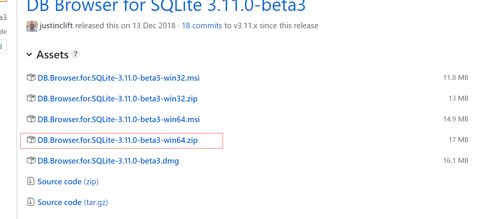
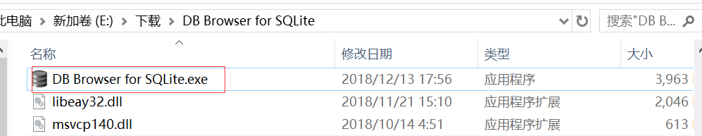
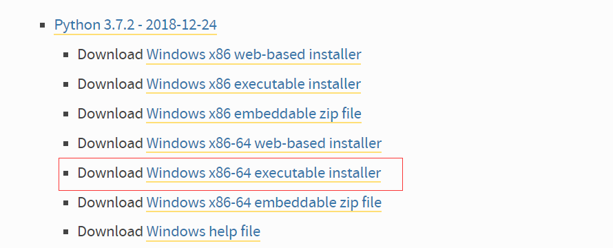

# Sqlite 简介使用
[菜鸟教程网站](http://www.runoob.com/sqlite/sqlite-tutorial.html)

# 桌面工具下载安装
SQLite Database Browser, 免费开源，支持简单的创建/打开/修改/删除 SQL 数据库。
不懂SQL小白也支持操作.

[下载地址](https://github.com/sqlitebrowser/sqlitebrowser/releases)

<!-- more -->


右键解压到当前文件夹，解压后如下(可以剪切或复制到其他目录):


进入”DB Browser for SQLite”, 找到如下*.exe，右键创建桌面快捷方式(方便使用)


# Python脚本
[python for windows download](https://www.python.org/downloads/windows/)



第三放库安装：
```
win + r
cmd
pip install openpyxl
pip install lxml

```

[openpyxl官方手册](https://openpyxl.readthedocs.io/en/stable/tutorial.html)

```
#!/usr/bin/python3
```
