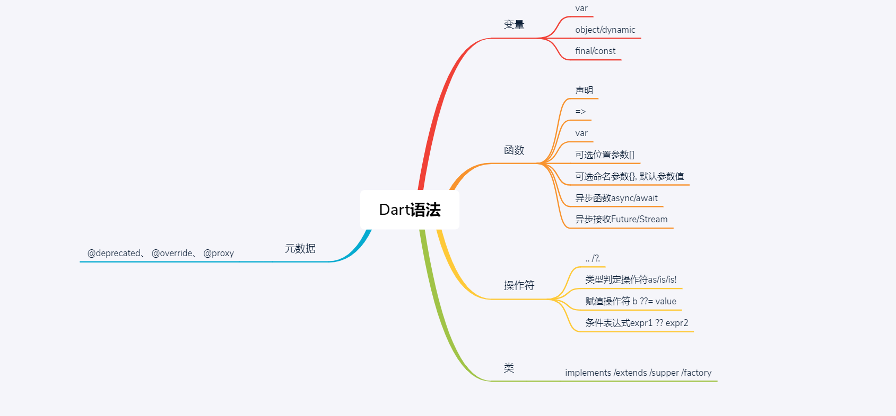

# Dart语法

# scope_model
## 三个主要类
> Model 继承扩展这个类, 监听变化
> ScopedModel 将Model封装到ScopedModel, 可以让Model访问到所有子组件
> ScopedModelDescendant 找到合适的ScopedModel, 自动重建变化的Model

[参考](https://pub.dev/packages/scoped_model)

# 常见组件
> Padding 填充布局
> Flex 弹性布局
> align 对齐布局

> CheckBox 复选框
> MaterialApp 使用墨水设计风格的应用
> Dropdown 下拉菜单
> GridView 网格视图列表, ListView
> Slider 滑动条 
> Opacity 不透明度, 控制组件显示隐藏

> GestureDetector 手势识别
> Stack 帧布局, 层叠堆放
> Center 中心布局
> TabBar 选项栏
> FloatingActionButton 漂浮按钮
> Scaffold 布局控件, 参数appbar, body, floatingActionButton, drawer...

