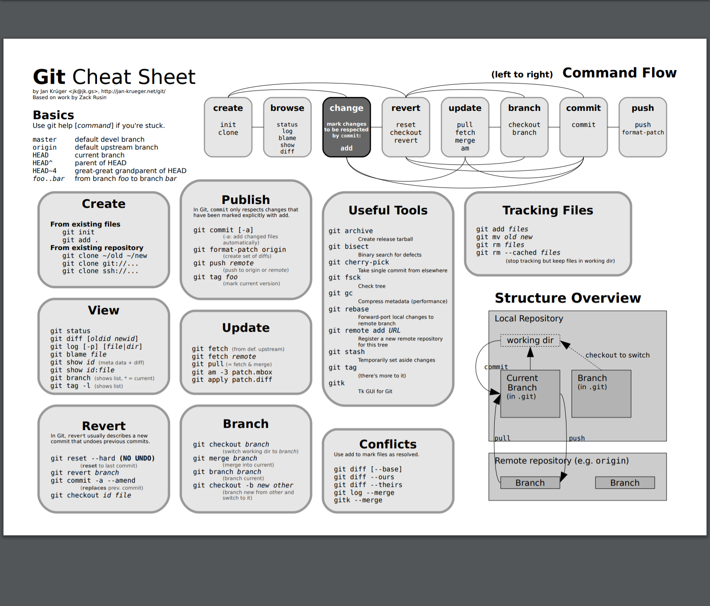

# 基本概念


- Workspace：工作区，能看到的目录
- Index / Stage：暂存区
- Repository：仓库区（或本地仓库）
- Remote：远程仓库


__HEAD__: 指向该分支上的最后一次提交，待补充

__master__: 只是这个repository中默认创建的第一个branch

__origin__: 远程仓库在本地的标签或者别名，git clone url 默认创建的指向这个远程代码库的标签

# 新建代码库


```shell
# 在当前目录新建一个Git代码库
git init
# 新建一个目录，将其初始化为Git代码库
$ git init [project-name]
# 下载一个项目和它的整个代码历史
# url git@github.com:bzadhere/myim.git 或 https://github.com/bzadhere/myim.git
git clone [url] [dir]
```


```shell
# 添加ssh keys，按三次回车（密码为空），生成密匙。
$ ssh-keygen -t rsa -C "youremail@example.com"

# github上，进入 Account Settings（账户配置），左边选择SSH Keys， 
# Add SSH Key,title随便填，粘贴在你电脑上生成的key
# ~/.ssh 目录下有公钥, 或ssh-keygen创建, 生成公钥id_rsa.pub和私钥id_rsa 

$ ssh -T git@github.com
Hi xxxx! You've successfully authenticated, but GitHub does not provide shell access.
```
<!-- more -->


# 配置说明


```shell
# 用户主目录下全局配置~/.gitconfig, 项目目录下项目配置.git/config, 依次加载变量覆盖
# 显示当前的Git配置
$ git config --list

# 编辑Git配置文件
$ git config -e [--global]

# 设置提交代码时的用户信息
$ git config [--global] user.name "[name]"
$ git config [--global] user.email "[email address]"

# 别名
git config --global alias.st status;
git config --global alias.ci commit;
git config --global alias.co checkout;
git config --global alias.br branch;
git config --global alias.last 'log -1 HEAD';


[imdev@localhost .git]$ cat config
[core]
        repositoryformatversion = 0
        filemode = true
        bare = false
        logallrefupdates = true
        quotepath=false #避免中文文件名显示乱码
[remote "origin"]
        url = git@github.com:bzadhere/myim.git
        fetch = +refs/heads/*:refs/remotes/origin/*
[branch "master"]
        remote = origin
        merge = refs/heads/master
[user]
        name = bzadhere
        email = bzadhere@gmail.com
```


# 分支操作

```shell
# 列出所有本地分支, -r 列出所有远程分支, -a 列出所有本地和远程分支
git branch

# 新建一个分支, 并停留在当前分支
git branch (branch-name)

# 新建一个分支，并切换到该分支
git checkout -b (branch-name)

# 新建一个分支，指向指定commit
$ git branch [branch] [commit]
# 新建一个分支，与指定的远程分支建立追踪关系
$ git branch --track [branch] [remote-branch]

# 切换到一个分支，并更新工作区
git checkout (branch-name)
# 切换到上一个分支
$ git checkout -

# 选择一个commit，合并进当前分支
git cherry-pick [commit]

# 删除分支
git branch -d (branch-name)
# 删除远程分支
git push origin --delete [branch-name]
git branch -dr [remote/branch]

# 合并指定分支到当前分支
git merge <branch-name>
```
-----
# 标签操作
```shell
# 列出所有tag
$ git tag

# 新建一个tag在当前commit
$ git tag [tag]
$ git tag -a v1.0

# 新建一个tag在指定commit
$ git tag [tag] [commit]
$ git tag v1.0 c3d2d07

# 删除本地tag
$ git tag -d [tag]

# 删除远程tag
$ git push origin :refs/tags/[tagName]

# 查看tag信息
$ git show [tag]

# 提交指定tag
$ git push [remote] [tag]

# 提交所有tag
$ git push [remote] --tags

# 新建一个分支，指向某个tag
$ git checkout -b [branch] [tag]

```
-----

# 查看信息

```shell
# 显示有变更的文件
$ git status -s

# 显示当前分支的版本历史
$ git log

# 显示commit历史，以及每次commit发生变更的文件
$ git log --stat

# 搜索提交历史，根据关键词
$ git log -S [keyword]

# 显示某个commit之后的所有变动，每个commit占据一行
$ git log [tag] HEAD --pretty=format:%s

# 显示某个commit之后的所有变动，其"提交说明"必须符合搜索条件
$ git log [tag] HEAD --grep feature

# 显示某个文件的版本历史，包括文件改名
$ git log --follow [file]
$ git whatchanged [file]

# 显示指定文件相关的每一次diff
$ git log -p [file]

# 显示过去5次提交
$ git log -5 --pretty --oneline

# 显示所有提交过的用户，按提交次数排序
$ git shortlog -sn

# 显示指定文件是什么人在什么时间修改过
$ git blame [file]

# 显示暂存区和工作区的差异
$ git diff

# 显示暂存区和上一个commit的差异
$ git diff --cached [file]

# 显示工作区与当前分支最新commit之间的差异
$ git diff HEAD

# 显示两次提交之间的差异
$ git diff [first-branch]...[second-branch]

# 显示今天你写了多少行代码
$ git diff --shortstat "@{0 day ago}"

# 显示某次提交的元数据和内容变化
$ git show [commit]

# 显示某次提交发生变化的文件
$ git show --name-only [commit]

# 显示某次提交时，某个文件的内容
$ git show [commit]:[filename]

# 显示当前分支的最近几次提交
$ git reflog

# 简洁版本--oneline, 分支合并--graph
[imdev@localhost ~/myim]$ git log --oneline --graph
*   6ee178b Merge branch 'tmpim'
|\  
| * c3d2d07 modify from tmpim
* | ebe63a1 modify from master
|/  
* 5b824c1 add test.txt
* 7706505 add dir
* 7d4976b add dir
* 8782412 add file

# --reverse 逆向, --author=zhangbb 指定用户, --no-merges 隐藏合并提交
# --before={1.weeks.ago} 一周前, --after={2010-04-18}, 4.18号之后; --since, --util

# 分支还没合并进主干的修改
git log master..branch
```
------
# 远程仓库

```shell

# 下载远程仓库的所有变动
$ git fetch [remote]

# 显示所有远程仓库
$ git remote -v

# 显示某个远程仓库的信息
$ git remote show [remote]

# 增加一个新的远程仓库，并命名shortname
$ git remote add [shortname] [url]

# 取回远程仓库的变化，并与本地分支合并
$ git pull [remote] [branch]

# 上传本地指定分支到远程仓库
$ git push [remote] [branch]

# 强行推送当前分支到远程仓库，即使有冲突
$ git push [remote] --force

# 推送所有分支到远程仓库
$ git push [remote] --all

# 重命名
git remote rename old new
# 删除
git remote rm [shortname]

```

------
# 代码提交
```shell

# 提交暂存区到仓库区
$ git commit -m [message]

# 提交暂存区的指定文件到仓库区
$ git commit [file1] [file2] ... -m [message]

# 提交工作区自上次commit之后的变化，直接到仓库区
$ git commit -a

# 提交时显示所有diff信息
$ git commit -v

# 使用一次新的commit，替代上一次提交
# 如果代码没有任何新变化，则用来改写上一次commit的提交信息
$ git commit --amend -m [message]

# 重做上一次commit，并包括指定文件的新变化
$ git commit --amend [file1] [file2] ...

```
------
# 增删文件

```shell

# 添加指定文件到暂存区
$ git add [file1] [file2] ...

# 添加指定目录到暂存区，包括子目录
$ git add [dir]

# 添加当前目录的所有文件到暂存区
$ git add .

# 添加每个变化前，都会要求确认
# 对于同一个文件的多处变化，可以实现分次提交
$ git add -p

# 删除工作区文件，并且将这次删除放入暂存区
$ git rm [file1] [file2] ...

# 停止追踪指定文件，但该文件会保留在工作区
$ git rm --cached [file]

# 改名文件，并且将这个改名放入暂存区
$ git mv [file-original] [file-renamed]

# 忽略文件或文件夹，在项目根目录下面 添加 .gitignore文件 
# 只能忽略那些原来没有被track的文件，如果某些文件已经被纳入了版本管理中，则修改.gitignore是无效的
vim .gitignore
# 忽略*.o和*.a文件
 *.[oa]
# 忽略*.b和*.B文件，my.b除外
*.[bB]
!my.b
# 忽略dbg文件和dbg目录
dbg
# 只忽略dbg目录，不忽略dbg文件
dbg/
# 只忽略dbg文件，不忽略dbg目录
dbg
!dbg/
# 忽略.gitignore本身
!.gitignore
# 只忽略当前目录下的dbg文件和目录，子目录的dbg不在忽略范围内
/dbg
# 以'#'开始的行，被视为注释.
 * ？：代表任意的一个字符
    * ＊：代表任意数目的字符
    * {!ab}：必须不是此类型
    * {ab,bb,cx}：代表ab,bb,cx中任一类型即可
    * [abc]：代表a,b,c中任一字符即可
    * [ ^abc]：代表必须不是a,b,c中任一字符
```


# 版本合并

```shell

# 合并一个分支上改动的部分文件到master
git checkeout master
git checkeout --path branch file

# 签出指定文件
git checkout [<options>] [<branch>] -- <file>
# 从上一次提交中签出指定文件
git checkout -- a.txt
# 从指定的提交历史中签出指定文件
git checkout 830cf95f56ef9a7d6838f6894796dac8385643b7 -- a.txt
# 从其他分支签出指定文件
git checkout master -- a.txt
# 签出某个后缀的文件 或 指定目录
git checkout -- *.txt
git checkout -- css/

```
------

# 回退撤销
最后三个版本 HEAD~3包含(HEAD, HEAD^, HEAD~2)

```shell

# 恢复暂存区的指定文件到工作区
$ git checkout [file]

# 恢复某个commit的指定文件到暂存区和工作区
$ git checkout [commit] [file]

# 恢复暂存区的所有文件到工作区
$ git checkout .

# 重置暂存区的指定文件，与上一次commit保持一致，但工作区不变
$ git reset [file]

# 重置暂存区与工作区，与上一次commit保持一致
$ git reset --hard

# 重置当前分支的指针为指定commit，同时重置暂存区，但工作区不变
$ git reset [commit]

# 重置当前分支的HEAD为指定commit，同时重置暂存区和工作区，与指定commit一致
$ git reset --hard [commit]

# 重置当前HEAD为指定commit，但保持暂存区和工作区不变
$ git reset --keep [commit]

# 新建一个commit，用来撤销指定commit
# 后者的所有变化都将被前者抵消，并且应用到当前分支
$ git revert [commit]

# 暂时将未提交的变化移除，稍后再移入
$ git stash
$ git stash pop

# 除了--hard还是不要用了
git reset [--soft | --mixed | --hard | --merge | --keep] [-q] [<commit>]


# 文件执行了git add操作，但想撤销对其的修改（index内回滚）
git reset HEAD fileName # 取消暂存
git checkout fileName # 撤销修改

// 修改最近三次提交信息, 删除某次提交, 编辑删除即可
git rebase -i HEAD~3
```

__已经git push推送到远程仓库中__
```
// 若有tag
git checkout <tag>

// 回到当前HEAD指向
git checkout <branch_name>

// 撤销指定文件到指定版本
git log <filename>  
git checkout <commitID> <filename> # 回滚到指定commitID

// 删除最后一次远程提交
git revert HEAD          # 放弃指定提交的修改，生成一次新的提交, 以前的历史记录都在
git push origin master

git reset --hard HEAD^   # 将HEAD指针指到指定提交，历史记录中不会出现放弃的提交记录
git push origin master -f # -f 将旧版本强制推送更新到远程仓库

// 回滚某次提交
git revert commitID

```

# 保存修改
```shell
# 暂存修改, 工作目录恢复到修改前, save [message]
$ git stash
# 查看暂存修改
git stash list
# 查看最近一个修改的diff, 
git stash show
# 取出和删除指定修改
git stash apply stash@{2}
git stash drop stash@{2}
# 取出最近一个修改
git stash apply

# 取出并删除最近一个修改
git stash pop
# 从暂存区创建一个分支
$ git stash branch testchanges
# 删除全部stash
git stash clear

```

# 命令总结

[官方地址](https://git-scm.com/book/zh/v2)



# 练习

```
1. 配置
2. 创建分支，切换
3. 文件修改，状态查看，日志查看(指定时间条件)，提交(批量或单个), 忽略文件或文件夹，回退
4. 同步分支，合并，冲突解决，撤销，更新某些指定文件
5. 暂存当前工作
6. 推送到远程仓库，同步远程仓库到本地
7. 文档查看, git cmd --help
```


```
git init
git add README.md
git commit -m "first commit"
git remote add origin git@*************.git
git push -u origin master

# tmpim分支创建切换
[imdev@localhost ~/myim]$ git branch
* master
[imdev@localhost ~/myim]$ git branch tmpim
[imdev@localhost ~/myim]$ git checkout tmpim
Switched to branch 'tmpim'
[imdev@localhost ~/myim]$ git branch
  master
* tmpim

# master 合并 tmpim修改
[imdev@localhost ~/myim]$ echo "hello world!" > test.txt
[imdev@localhost ~/myim]$ ls
ob_rel  Readme  source  test.txt
[imdev@localhost ~/myim]$ git add test.txt 
[imdev@localhost ~/myim]$ git commit test.txt -m 'add test.txt'
[tmpim 5b824c1] add test.txt
 1 file changed, 1 insertion(+)
 create mode 100644 test.txt
[imdev@localhost ~/myim]$ git checkout master
Switched to branch 'master'
[imdev@localhost ~/myim]$ ls
ob_rel  Readme  source
[imdev@localhost ~/myim]$ git merge tmpim
Updating 7706505..5b824c1
Fast-forward
 test.txt | 1 +
 1 file changed, 1 insertion(+)
 create mode 100644 test.txt
[imdev@localhost ~/myim]$ ls
ob_rel  Readme  source  test.txt

# 分支合并冲突
[imdev@localhost ~/myim]$ git checkout master
Switched to branch 'master'
Your branch is ahead of 'origin/master' by 2 commits.
  (use "git push" to publish your local commits)
[imdev@localhost ~/myim]$ git merge tmpim
Auto-merging test.txt
CONFLICT (content): Merge conflict in test.txt
Automatic merge failed; fix conflicts and then commit the result.
[imdev@localhost ~/myim]$ cat test.txt 
hello world!
<<<<<<< HEAD
by zhangbb
=======
by tmpim
>>>>>>> tmpim
[imdev@localhost ~/myim]$ vi test.txt 
.......
[imdev@localhost ~/myim]$ git status -s
UU test.txt
[imdev@localhost ~/myim]$ git add test.txt 
[imdev@localhost ~/myim]$ git status -s
M  test.txt
[imdev@localhost ~/myim]$ git commit

```

