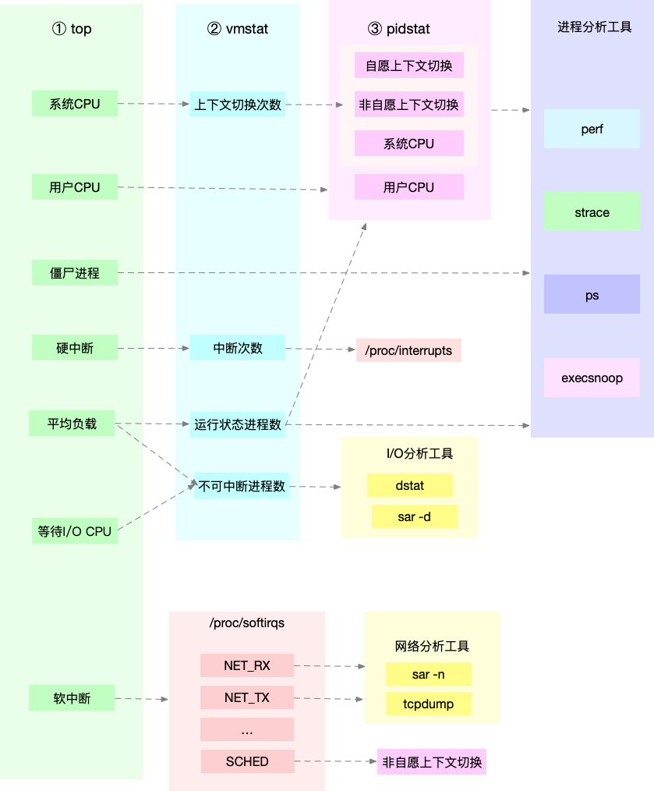

# 第一章 序

Linux 资源可能会碰到的性能问题，包括CPU性能、磁盘IO、内存以及网络性能

鸡汤提神：
”想要得到你就要学会付出，要付出还要坚持；如果你真的觉得很难，那你就放弃，如果你放弃了就不要抱怨。
人生就是这样，世界是平衡的，每个人都是通过自己的努力，去决定自己生活的样子”

## 总结
鸡汤可以调整心态续命; 学习要会抓重点
<!-- more -->
# 第二章 目录

性能分析，其实就是找出应用或系统的瓶颈，并设法去避免或者缓解，更高效的利用资源 
处理更多的请求。

性能分析套路:
* 选择指标评估应用程序和系统性能
* 为应用程序和系统设置性能目标
* 进行性能基准测试
* 性能分析定位瓶颈
* 优化系统和应用程序
* 性能监控和告警


建立整体系统性能的全局观是最核心, 工具图谱和学习思维导图, 以及几个学习小技巧

## 总结
要学会思维导图整理思路

# 第三章 平均负载

## 什么是平均负载
平均负载, 是指在单位时间内, 系统处于可运行和不可中断状态的平均进程数, 也就是平均活跃进程。 
与CPU的使用率并没有直接的关系。

在 sched/loadavg.c 中计算平均值的算法为EMA，这种算法的目的主要是“距离目标预测窗口越近，  
则数据的价值越高，对未来影响越大”

linux下进程有五种状态, 可运行状态是指在使用CPU或在等待CPU队列中的进程, 用PS可以看到R状态。   
不可中断状态进程是指正处于内核关键流程中的进程, 并且这些流程是不可打断的, 比如等待  
I/O响应（Uninterruptible Sleep，也称为Disk sleep)PS看到的D状态。

不可中断状态是系统对进程和硬件的一种保护机制。比如在写磁盘数据时，为了保证一致性, 必须等待磁盘 
响应。

可以用man查看uptime的说明, uptime看到的是活跃进程数的衰减平均值

## 平均负载为多少时合理

1. 查看CPU个数 lscpu 或者 grep 'model name' /proc/cpuinfo | wc -linux下进程有五种状态

2. uptime 分析系统负载趋势, 1分钟的值> 5分钟的值> 15分钟的值 说明负载在增加, 如果是4个CPU, 
平均负载是1, 说明CPU有75%的空闲

3. 案例
一个单CPU的平均负载1.73, 0.60, 7.98, 整体趋势看, 负载在降低


## 平均负载与 CPU 使用率
CPU使用率, 是单位时间内CPU的繁忙情况。平均负载统计是包括了等待CPU和等待I/O的进程。
所以平均负载高, cpu使用率不一定高。

stress CPU压测工具
mpstat 多核CPU性能分析工具, 实时查看CPU指标
pidstat 进程性能分析工具, 实时查看进程CPU、内存、IO情况、上下问切换等指标

## 平均负载案例分析
1. 场景一：CPU密集型进程
```
[root@zhangbb ~]# stress --cpu 1 --timeout 600
stress: info: [2089] dispatching hogs: 1 cpu, 0 io, 0 vm, 0 hdd

[root@zhangbb ~]# uptime
 16:09:48 up 209 days,  5:29,  8 users,  load average: 1.03, 0.41, 0.40

[root@zhangbb ~]# mpstat  1 60
Linux 3.10.0-693.11.6.el7.x86_64 (zhangbb)      02/20/2019      _x86_64_        (1 CPU)

04:09:32 PM  CPU    %usr   %nice    %sys %iowait    %irq   %soft  %steal  %guest  %gnice   %idle
04:09:33 PM  all   99.01    0.00    0.00    0.00    0.00    0.00    0.99    0.00    0.00    0.00
04:09:34 PM  all  100.00    0.00    0.00    0.00    0.00    0.00    0.00    0.00    0.00    0.00
04:09:35 PM  all  100.00    0.00    0.00    0.00    0.00    0.00    0.00    0.00    0.00    0.00

[root@zhangbb ~]# pidstat -u 1 1
Linux 3.10.0-693.11.6.el7.x86_64 (zhangbb)      02/20/2019      _x86_64_        (1 CPU)

04:16:35 PM   UID       PID    %usr %system  %guest    %CPU   CPU  Command
04:16:36 PM     0       455    0.99    0.00    0.00    0.99     0  rsyslogd
04:16:36 PM     0      2090   97.03    0.00    0.00   97.03     0  stress
04:16:36 PM     0     28600    0.99    0.99    0.00    1.98     0  pritunl
04:16:36 PM   992     28606    0.99    0.00    0.00    0.99     0  mongod

```

2. 场景二：I/O密集型进程
```
// 一个进程不停的sync
[root@zhangbb ~]# stress -i 1 --timeout 600
stress: info: [3110] dispatching hogs: 0 cpu, 1 io, 0 vm, 0 hdd

[root@zhangbb ~]# uptime
 16:19:34 up 209 days,  5:39,  8 users,  load average: 5.41, 6.15, 3.59

//虚拟机，缓冲区可能比较小，无法产生大的IO压力，这样大部分就都是系统调用的消耗了
//使用下一代stress-ng，它支持更丰富的选项，比如 stress-ng -i 1 --hdd 1 --timeout 600（--hdd表示读写临时文件）
[root@zhangbb ~]# mpstat 1 3
Linux 3.10.0-693.11.6.el7.x86_64 (zhangbb)      02/20/2019      _x86_64_        (1 CPU)

04:20:15 PM  CPU    %usr   %nice    %sys %iowait    %irq   %soft  %steal  %guest  %gnice   %idle
04:20:16 PM  all    2.33    0.00   77.91   19.77    0.00    0.00    0.00    0.00    0.00    0.00
04:20:17 PM  all    2.27    0.00   77.27   19.32    0.00    0.00    1.14    0.00    0.00    0.00
04:20:18 PM  all    3.33    0.00   76.67   20.00    0.00    0.00    0.00    0.00    0.00    0.00
Average:     all    2.65    0.00   77.27   19.70    0.00    0.00    0.38    0.00    0.00    0.00

[root@zhangbb ~]# pidstat -u 1 3
Linux 3.10.0-693.11.6.el7.x86_64 (zhangbb)      02/20/2019      _x86_64_        (1 CPU)

04:19:50 PM   UID       PID    %usr %system  %guest    %CPU   CPU  Command
04:19:51 PM     0       253    0.00    5.56    0.00    5.56     0  kworker/0:1H
04:19:51 PM     0      3111    1.11   76.67    0.00   77.78     0  stress
04:19:51 PM     0     20180    0.00    1.11    0.00    1.11     0  kworker/u2:0
04:19:51 PM     0     28600    2.22    0.00    0.00    2.22     0  pritunl
04:19:51 PM   992     28606    1.11    0.00    0.00    1.11     0  mongod

```

3. 场景三：大量进程场景
```
stress -c 8 --timeout
进程数超过CPU，
```

uptime + mpstat + pidstat
看平均负载 ==> 分析CPU使用场景 ==>　确定具体进程

## 总结
要会分析CPU使用典型场景, 这章只是为了说明平均负载


# 第四章 CPU上下文切换

CPU寄存器是CPU内置的容量小、但速度极快的内存。
程序计数器用来存储CPU正在执行的指令位置、或者即将执行下一条指令的位置。
以上两个是CPU运行任务前依赖的环境, 也被称为CPU上下文。切换就是保存和加载新的 
任务上下文到CPU寄存器和计数器。

根据任务的不同, CPU上下文切换分为几个场景, 进程、线程、中断上下文切换。
系统调用通常称为特权模式的切换，而不是上下文切换。实际上，系统调用过程中, 
CPU上下文切换是无法避免的。

## 进程上下文切换
一个进程切换到另一个进程, 在进程调度的时候发生。linux为每个CPU维护一个就绪队列 
将活跃进程按照优先级和CPU排序时间排序, 选择优先级高或等待CPU时间最长的进程运行。

进程调度场景：
1. 为保证所有进程公平调度, CPU时间被划分为一段段的时间片，被轮流分配给各个进程。 
时间片耗尽,进程被挂起, 切换到其他正在等待CPU的进程。
2. 进程资源不足, 挂起, 运行其他进程
3. sleep挂起
4. 有优先级高的进程
5. 发生硬件中断, 挂起, 执行内核中中断服务程序

## 线程上下文切换
线程和进程最大的区别在于, 线程是调度的基本单位, 进程则是资源拥有的基本单位。
内核调度对象实际是线程, 进程给线程提供了虚拟内存、全局变量等资源。

同个进程的线程上下文切换，因为虚拟内存共享, 只需要切换线程私有数据, 寄存器等不共享数据。

## 硬件中断上下文切换
有限级最高

## 总结
明白原理, 要能说得上来

# 第五章 上下文切换分析实践

## 系统上下文切换

```
[root@zhangbb ~]# vmstat
procs -----------memory---------- ---swap-- -----io---- -system-- ------cpu-----
 r  b   swpd   free   buff  cache   si   so    bi    bo   in   cs us sy id wa st
29  0      0  72276  11420 436708    0    0     1     7    1    1  0  0 99  0  0

// cs(context switch) 每秒上下文切换
// in(interrupt) 每秒中断次数
// r(Running or Runnable) 就绪队列的长度, 正在运行和等待的CPU进程数
// b(Block) 处于不可中断状态睡眠的进程数

```

## 进程上下文切换

```
[root@zhangbb ~]# pidstat -w 1
Linux 3.10.0-693.11.6.el7.x86_64 (zhangbb)      02/21/2019      _x86_64_        (1 CPU)

02:14:40 PM   UID       PID   cswch/s nvcswch/s  Command
02:14:42 PM     0         3      3.92      0.00  ksoftirqd/0
02:14:42 PM     0         9     13.73      0.00  rcu_sched
02:14:42 PM     0        10      0.98      0.00  watchdog/0
02:14:42 PM     0       253      0.98      0.00  kworker/0:1H
02:14:42 PM     0       336      1.96      0.00  systemd-journal
02:14:42 PM     0       846      0.98      0.00  php-fpm
02:14:42 PM     0      1028      0.98      0.00  kworker/0:0
02:14:42 PM     0      1494      8.82      0.00  kworker/0:1
02:14:42 PM     0      1778      0.98      0.98  pidstat
02:14:42 PM     0     16712      0.98      0.00  kworker/u2:0
02:14:42 PM     0     28600      0.98      0.00  pritunl
02:14:42 PM     0     29204      1.96      0.00  dockerd

// cswch 每秒自愿上下文切换(进程无发获取资源导致切换, 例如I/O、内存不足)
// nvcswch 每秒非自愿上下文切换(进程由于时间片已到导致切换, 例如大量进程争抢CPU)
```

## 实验

```
// 10个线程运行, 5分钟基准测试, 模拟线程切换
[root@zhangbb ~]# sysbench --threads=10 --max-time=300 --max-requests=10000000 threads run

[root@zhangbb ~]# vmstat 1 1
procs -----------memory---------- ---swap-- -----io---- -system-- ------cpu-----
 r  b   swpd   free   buff  cache   si   so    bi    bo   in   cs us sy id wa st
10  1      0  70764  24052 423232    0    0     1     7    1    0  0  0 99  0  0

[root@zhangbb ~]# pidstat -wt -p 3355
Linux 3.10.0-693.11.6.el7.x86_64 (zhangbb)      02/21/2019      _x86_64_        (1 CPU)

02:31:56 PM   UID      TGID       TID   cswch/s nvcswch/s  Command
02:31:56 PM     0      3355         -      0.00      0.00  sysbench
02:31:56 PM     0         -      3355      0.00      0.00  |__sysbench
02:31:56 PM     0         -      3356      0.07      0.43  |__sysbench
02:31:56 PM     0         -      3357      0.07      0.44  |__sysbench
02:31:56 PM     0         -      3358      0.06      0.45  |__sysbench
02:31:56 PM     0         -      3359      0.07      0.44  |__sysbench
02:31:56 PM     0         -      3360      0.07      0.43  |__sysbench
02:31:56 PM     0         -      3361      0.07      0.43  |__sysbench
02:31:56 PM     0         -      3362      0.07      0.43  |__sysbench
02:31:56 PM     0         -      3363      0.07      0.43  |__sysbench
02:31:56 PM     0         -      3364      0.07      0.43  |__sysbench
02:31:56 PM     0         -      3365      0.07      0.43  |__sysbench

// cs和in数据都不大，神奇的

```

## 总结
单看上下切换意义不大，在CPU高的时候观察分析切换趋势


# 第六章 CPU使用率
linux定义节拍率(内核表示HZ)，触发时间中断，并使用全局变量jiffies记录节拍数。

```
[root@zhangbb ~]# grep 'CONFIG_HZ=' /boot/config-$(uname -r)
CONFIG_HZ=1000

[root@zhangbb ~]# cat /proc/stat |grep cpu
cpu  7069586 162259 3931778 1794587448 203158 0 55664 3714828 0 0
cpu0 7069586 162259 3931778 1794587448 203158 0 55664 3714828 0 0
// 
```

## CPU使用率指标 
user(us): 用户态CPU时间, 不包括nice, 包括guest
nice(ni): 低优先级用户态时间
system(sys): 内核态CPU时间
idle(id): 空闲时间, 不包括等待I/O时间
iowait(wa): 等待I/O的CPU时间
irq(hi): 硬中断的CPU时间
softirq(si): 软中断的CPU时间
steal(st): 被其他虚拟机占用的CPU时间
guest(): 运行虚拟机的CPU时间
guest_nice(gnice): 以低优先级运行虚拟机的时间

## CPU使用率计算公式

CPU使用率 = 1 -  $\dfrac{空闲时间}{总CPU时间}$ 

CPU平均使用率 = 1 -  $\dfrac{空闲时间new - 空闲时间old}{总CPU时间new - 总CPU时间old}$

性能工具输出的是一段时间内的CPU平均使用率, 注意时间间隔的设置。
top默认3秒时间间隔, ps用的是整个进程的生命周期。

## 工具
```
// top, 按1可以显示每个CPU
top - 14:48:43 up 24 days, 19:08, 11 users,  load average: 3.16, 3.09, 3.06
Tasks: 329 total,   1 running, 328 sleeping,   0 stopped,   0 zombie
%Cpu0  :  3.1 us,  3.4 sy,  0.0 ni, 93.5 id,  0.0 wa,  0.0 hi,  0.0 si,  0.0 st
%Cpu1  :  2.0 us,  4.7 sy,  0.0 ni, 92.9 id,  0.0 wa,  0.0 hi,  0.3 si,  0.0 st
%Cpu2  : 90.7 us,  0.3 sy,  0.0 ni,  8.9 id,  0.0 wa,  0.0 hi,  0.0 si,  0.0 st
%Cpu3  :  8.1 us,  1.0 sy,  0.0 ni, 90.2 id,  0.0 wa,  0.0 hi,  0.7 si,  0.0 st
%Cpu4  : 97.0 us,  0.0 sy,  0.0 ni,  3.0 id,  0.0 wa,  0.0 hi,  0.0 si,  0.0 st
%Cpu5  : 13.3 us,  3.0 sy,  0.0 ni, 82.7 id,  0.0 wa,  0.0 hi,  1.0 si,  0.0 st
%Cpu6  :  3.1 us,  5.2 sy,  0.0 ni, 91.7 id,  0.0 wa,  0.0 hi,  0.0 si,  0.0 st
%Cpu7  :  1.4 us,  1.7 sy,  0.0 ni, 96.9 id,  0.0 wa,  0.0 hi,  0.0 si,  0.0 st
KiB Mem:  66109508 total, 65666692 used,   442816 free,   223228 buffers
KiB Swap:  2103292 total,  2103284 used,        8 free. 33262276 cached Mem

  PID USER      PR  NI    VIRT    RES    SHR S  %CPU  %MEM     TIME+ COMMAND                                        
23553 zjv8cs    20   0 23.118g  88184  75864 S 198.7 0.133  68458:16 sframe                                         
28988 zjv8cs    20   0 24.418g  37268  19044 S 6.312 0.056 265:23.24 sframe                                         
10138 zjv8cs    20   0 25.083g  54204  24276 S 5.980 0.082 171:07.74 sframe                                         
 1253 zjv8cs2   20   0 19.784g  19176   8492 S 4.651 0.029  71:39.65 sframe                                         
 1260 zjv8cs2   20   0 19.846g  19288   8596 S 4.319 0.029  71:15.20 sframe                                         
26254 zjv8cs    20   0 23.542g  18972   8452 S 4.319 0.029 220:11.03 sframe                                         
12796 zjv8cs2   20   0 20.365g  20172   8612 S 3.987 0.031 161:11.72 sframe  

[root@zhangbb ~]# pidstat 1 1 
Linux 3.10.0-693.11.6.el7.x86_64 (zhangbb)      02/22/2019      _x86_64_        (1 CPU)

02:50:39 PM   UID       PID    %usr %system  %guest    %CPU   CPU  Command
02:50:40 PM     0     18909    0.00    1.98    0.00    1.98     0  pidstat
02:50:40 PM     0     28600    1.98    1.98    0.00    3.96     0  pritunl

Average:      UID       PID    %usr %system  %guest    %CPU   CPU  Command
Average:        0     18909    0.00    1.98    0.00    1.98     -  pidstat
Average:        0     28600    1.98    1.98    0.00    3.96     -  pritunl

// -g 选项是告诉perf record额外记录函数的调用关系, 相当与gstack
perf record -g -p 1663
perf report -i perf.data
```

## 找CPU使用率高的进程

```
1. top 看整体CPU，但找不到对应进程

2. pstree |grep stress 查看进程关系也找不到

//这个时候perf出场了
3. perf record -g 跑一段时间就可以找到

4. execsnoop 一段bin/bash脚本监控短时进程

```

[execsnoop](https://github.com/brendangregg/perf-tools/blob/master/execsnoop)

## 总结
看懂CPU使用率, 短时进程占用CPU需要仔细找


# 第七章 大量不可中断和僵尸进程

## 进程状态

* R(Running/Runnable) 进程在CPU的就绪队列中, 正在运行或正在等待运行
* D(Disk Sleep) 不可中断状态睡眠, 一般表示与硬件进行交互不允许中断
* Z(Zombile) 进程已经结束, 父进程没有回收它的资源
* S(Interruptible Sleep) 可中断状态睡眠, 因等待某个事件而被挂起
* I(Idle) 空闲状态, 内核上没有任何负载
* T/t  暂停(向进程发送SIGSTOP, SIGCONT恢复运行)或跟踪状态(gdb触发断点后变为跟踪状态)
* X(Dead) 消亡

僵尸进程产生(最后init进程回收)：
当一个进程没有用你waitpid() 或 wait() 来等待子进程结束, 回收子进程资源。
子进程结束时会向父进程发送SIGCHLD信号, 父进程可以注册信号函数, 异步回收资源。

## 查看进程状态
```
Tasks:  84 total,   1 running,  83 sleeping,   0 stopped,   0 zombie
%Cpu(s):  0.0 us,  6.2 sy,  0.0 ni, 93.8 id,  0.0 wa,  0.0 hi,  0.0 si,  0.0 st
KiB Mem :  1016232 total,   598872 free,   123164 used,   294196 buff/cache
KiB Swap:  2093052 total,  2093052 free,        0 used.   738928 avail Mem 

  PID USER      PR  NI    VIRT    RES    SHR S %CPU %MEM     TIME+ COMMAND                                          
    1 root      20   0   43304   3652   2472 S  0.0  0.4   0:00.92 systemd                                          
    2 root      20   0       0      0      0 S  0.0  0.0   0:00.00 kthreadd 
	
$ ps aux | grep /app
root      4009  0.0  0.0   4376  1008 pts/0    Ss+  05:51   0:00 /app
root      4287  0.6  0.4  37280 33660 pts/0    D+   05:54   0:00 /app
root      4288  0.6  0.4  37280 33668 pts/0    D+   05:54   0:00 /app

```

Tasks 统计了所有进程的状态;
s表示会话的领导进程, +表示前台进程组。
> 会话是指共享同一个控制终端的一个或多个进程组
> 进程组表示一组相关联的进程, 比如子进程是父进程的组成员

僵尸进程, top+mpstat+strace 都分析不出具体进程哪里导致, 用perf record -g 

```
# -a 表示输出命令行选项
# p 表 PID
# s 表示指定进程的父进程
$ pstree -aps 3084
systemd,1
  └─dockerd,15006 -H fd://
      └─docker-containe,15024 --config /var/run/docker/containerd/containerd.toml
          └─docker-containe,3991 -namespace moby -workdir...
              └─app,4009
                  └─(app,3084)

```

# 第八章 Linux中断

中断是一种异步事件处理机制, 可以提高系统并发处理能力。
linux中断分为两个部分：
* 上半部分用来快速处理中断, 在中断禁止模式下运行, 主要处理跟硬件相关的或时间敏感的工作(硬中断)
* 下半部分用来处理上半部分未完成的工作, 通常以内核线程的方式运行(软中断)

例如网卡收到数据, 通过硬中断的方式通知内核有数据到了。上半部分就是把数据存到内存中, 更新硬件寄存 
器状态标记读完了, 再发送一个软中断信号; 下半部分从内存中找到数据, 按照协议逐层解析和处理, 直到把 
数据送给应用程序。
下半部分为软中断, 网络收发, 内核调度, 定时和 RCU(Read-Copy Update) 锁等也是软中断

```
// 软中断有10种类型, NET_TX 发送, NET_RX 收到
52_zjdev[/data01/zjgrp/zjdev]%cat /proc/softirqs
                    CPU0       CPU1       CPU2       CPU3       CPU4       CPU5       CPU6       CPU7       
          HI:          0          0          0          1          0          1          0          0
       TIMER:  624542203  618314692  623983342  624076875  624124123  624035463  623433144  624038509
      NET_TX:       1354      10585       1286       2616       1214       1197       1352       1312
      NET_RX:   27576207  417105033   31251647   28771418   27476757   28494061   29043344   27354831
       BLOCK:          0          0          0          0          0          0          0          0
BLOCK_IOPOLL:          0          0          0          0          0          0          0          0
     TASKLET:         96        536         87        129         78         92         76         81
       SCHED:  187960212  193268976  186768826  186464769  186313710  186328311  185646819  185912615
     HRTIMER:      31725      48363      32398      31972      32393      31312      33647      31754
         RCU:  312851620  621342389  314557141  626218602  314804587  626018159  625412616  626075625
		 
// 硬中断.......
cat /proc/interrupts

// 软中断内核线程, ksoftirqd/CPU 编号

52_zjdev[/data01/zjgrp/zjdev]%ps aux | grep softirq

root         3  0.0  0.0      0     0 ?        S    1月28   0:14 [ksoftirqd/0]
root        13  0.0  0.0      0     0 ?        S    1月28   0:48 [ksoftirqd/1]
root        18  0.0  0.0      0     0 ?        S    1月28   0:25 [ksoftirqd/2]
root        23  0.0  0.0      0     0 ?        S    1月28   0:16 [ksoftirqd/3]
root        28  0.0  0.0      0     0 ?        S    1月28   0:14 [ksoftirqd/4]
root        33  0.0  0.0      0     0 ?        S    1月28   0:14 [ksoftirqd/5]
root        38  0.0  0.0      0     0 ?        S    1月28   0:13 [ksoftirqd/6]
root        43  0.0  0.0      0     0 ?        S    1月28   0:12 [ksoftirqd/7]
zjdev    23982  0.0  0.0  12964   932 pts/9    S+   10:34   0:00 grep softirq
```

# 第九章 软中断CPU使用率升高

工具：
sar: 系统活动报告工具, 实时查看系统当前活动
hpping3：tcp/id 协议数据包工具, sync flood

```
# top 运行后按数字 1 切换到显示所有 CPU
$ top
top - 10:50:58 up 1 days, 22:10,  1 user,  load average: 0.00, 0.00, 0.00
Tasks: 122 total,   1 running,  71 sleeping,   0 stopped,   0 zombie
%Cpu0  :  0.0 us,  0.0 sy,  0.0 ni, 96.7 id,  0.0 wa,  0.0 hi,  3.3 si,  0.0 st
%Cpu1  :  0.0 us,  0.0 sy,  0.0 ni, 95.6 id,  0.0 wa,  0.0 hi,  4.4 si,  0.0 st
...

  PID USER      PR  NI    VIRT    RES    SHR S  %CPU %MEM     TIME+ COMMAND
    7 root      20   0       0      0      0 S   0.3  0.0   0:01.64 ksoftirqd/0
   16 root      20   0       0      0      0 S   0.3  0.0   0:01.97 ksoftirqd/1
 2663 root      20   0  923480  28292  13996 S   0.3  0.3   4:58.66 docker-containe
 3699 root      20   0       0      0      0 I   0.3  0.0   0:00.13 kworker/u4:0
 3708 root      20   0   44572   4176   3512 R   0.3  0.1   0:00.07 top
    1 root      20   0  225384   9136   6724 S   0.0  0.1   0:23.25 systemd
    2 root      20   0       0      0      0 S   0.0  0.0   0:00.03 kthreadd
...


[root@localhost ~]# watch -d cat /proc/softirqs
Every 2.0s: cat /proc/softirqs                                                               Tue Feb 26 21:54:03 2019
                    CPU0
          HI:          6
       TIMER:      67166
      NET_TX:       1817
      NET_RX:       6051
       BLOCK:       9899
BLOCK_IOPOLL:          0
     TASKLET:         45
       SCHED:          0
     HRTIMER:          0
         RCU:      16504
```

## 总结
软中断CPU使用率升高是个常见的性能问题, 实际生产一般是网络收发导致, 尤其是网络接收软中断

# 第十章 系统CPU瓶颈分析套路





