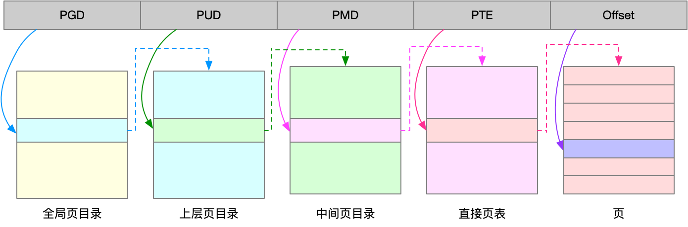
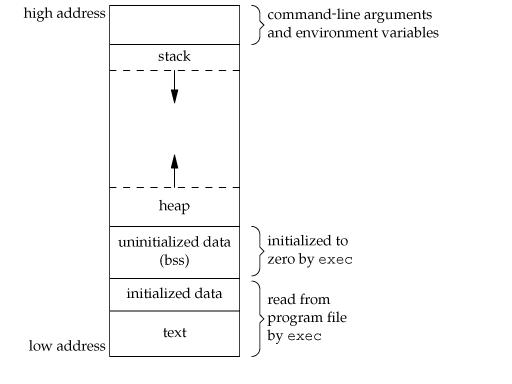
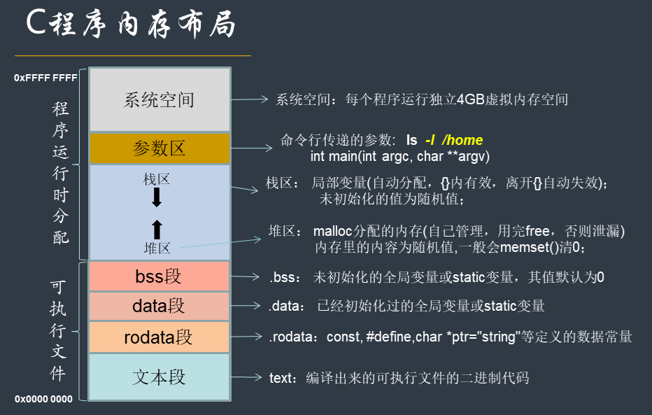

# linux内存工作原理

linux内核给每个进程提供了一个独立的虚拟地址空间, 并且这个地址空间是连续的。

## 内存映射
虚拟地址空间分为内核空间和用户空间, 常见的32位和64位虚拟地址空间如下：

<!-- more -->

内存映射, 就是将虚拟内存地址映射到物理内存地址。内核为每个进程都维护一张 
页表, 记录映射关系：


页表实际存储在内存管理单元MMU中, 这样处理器直接通过硬件找出访问的内存。 
当进程访问虚拟地址在页表中查不到时, 会产生缺页异常, 进入内核空间分配物理 
内存, 更新进程页表, 最后返回用户空间, 恢复进程。

MMU最小单位4KB, 每次内存映射4KB或4KB的整数倍。

linux通过多级页表和大页两种机制来管理页表。


## 虚拟内存空间分布


C程序内存分布：

1.程序段:程序段为程序代码在内存中的映射.一个程序可以在内存中多有个副本.
2.初始化过的数据:在程序运行值初已经对变量进行初始化的
3.未初始化过的数据:在程序运行初未对变量进行初始化的数据
4.堆(stack):存储局部,临时变量,在程序块开始时自动分配内存,结束时自动释放内存.存储函数的返回指针.
5.栈(heap):存储动态内存分配,需要程序员手工分配,手工释放.



[虚拟内存参考](https://blog.holbertonschool.com/hack-the-virtual-memory-malloc-the-heap-the-program-break/)

## 内存分配和回收
小于128K用brk()分配, 否则用mmap()在文件映射段找一块内存分配。brk在释放时不会还给系统, 
缓存起来重复利用, 会产生内存碎片。mmap频繁会产生大量缺页异常, 内核管理负担增大。

系统在内存紧张时回收机制, LRU/SWAP/OOM

```
$ dmesg | grep -i "Out of memory"
Out of memory: Kill process 9329 (java) score 321 or sacrifice child

```


## 查看内存
free/top/ps

SHR 并不一定是共享的, 包括程序代码段, 非共享链接库

# 内存中的Buffer和cache
## 定义
Buffer->磁盘数据缓冲区, cache->文件数据缓存

用以下案例, vmstat 观察
```
// 首先清理缓存
$ echo 3 > /proc/sys/vm/drop_caches

// 写文件
$ dd if=/dev/urandom of=/tmp/file bs=1M count=500

// 写磁盘, 相当于清磁盘
// 然后运行 dd 命令向磁盘分区 /dev/sdb1 写入 2G 数据
$ dd if=/dev/urandom of=/dev/sdb1 bs=1M count=2048

// 读文件
// 运行 dd 命令读取文件数据
$ dd if=/tmp/file of=/dev/null

// 读磁盘
// 运行 dd 命令读取文件
$ dd if=/dev/sda1 of=/dev/null bs=1M count=1024

```

```
手动释放缓存区内存的方法
1）清理pagecache（页面缓存）
[root@backup ~]# echo 1 > /proc/sys/vm/drop_caches 或者 sysctl -w vm.drop_caches=1
 
2）清理dentries（目录缓存）和inodes
[root@backup ~]# echo 2 > /proc/sys/vm/drop_caches  或者 sysctl -w vm.drop_caches=2
 
3）清理pagecache、dentries和inodes
[root@backup ~]# echo 3 > /proc/sys/vm/drop_caches  或者 sysctl -w vm.drop_caches=3
　
上面三种方式都是临时释放缓存的方法，要想永久释放缓存，需要在/etc/sysctl.conf文件中配置：  
vm.drop_caches=1/2/3，然后sysctl -p生效即可！
 
另外，可以使用sync命令来清理文件系统缓存，还会清理僵尸(zombie)对象和它们占用的内存
[root@backup ~]# sync
```

## 查看工具
[BCC](https://github.com/iovisor/bcc)

cachestat: 系统缓存命中情况
cacheop: 进程缓存命中情况

centos上安装相当不方便


# 内存泄漏排查和优化
valgrind/memleak/

存在需要大量内存场景, 考虑栈内存或者内存池, 大页来优化内存分配管理

# Swap交换分区
## 原理说明
内存紧张时, linux通过直接回收和定期扫描方式, 来释放文件页和内存页, 把内存分配给 
更需要的进程：
* 文件页直接清空, 或写回磁盘后释放缓存
* 匿名页需要通过swap换入换出


内核有个专门的线程来定期回收内存, kswapd0


阀值通过 /proc/zeroinfo 来查看, 通过/proc/sys/vm/min_free_kbytes 设置回收阀值

系统内存有剩余, 还是使用了swap。NUMA架构下, CPU分到不同的node上, 每个node 
有自己的本地空间。

## 查看工具
```
[root@localhost ~]# numactl --hardware
available: 1 nodes (0)
node 0 cpus: 0
node 0 size: 1023 MB
node 0 free: 174 MB
node distances:
node   0 
  0:  10 
  
// 系统只有一个node, 内存大小1023M, 剩余174M

[root@localhost ~]# cat /proc/zoneinfo
Node 0, zone      DMA
  pages free     1209
        min      176
        low      220
        high     264
        scanned  0
        spanned  4095
        present  3998
        managed  3977
    nr_free_pages 1209
    nr_alloc_batch 44
    nr_inactive_anon 462
    nr_active_anon 332
    nr_inactive_file 1476
// free 剩余内存页, 同nr_free_pages
// nr_active_anon/nr_inactive_anon 活跃和匿名内存页
// nr_inactive_file 非活跃文件页
// 当node内存不足, 从其他node寻找空闲内存, 或从本地内存回收。
// 调整 /proc/sys/vm/zone_reclaim_mode 设置内存回收策略
```

/proc/sys/vm/swappiness 调整使用Swap的积极程度(范围0～100), 设置成0, 
当剩余内存 + 文件页小于页高阀值, 还是会发生swap

## 案例分析
```
// 写入空设备，实际上只有磁盘的读请求
$ dd if=/dev/sda1 of=/dev/null bs=1G count=2048

// S 显示swap使用情况
[root@localhost ~]# sar -r -S 1
Linux 3.10.0-693.el7.x86_64 (localhost.localdomain)     02/28/2019      _x86_64_        (1 CPU)

03:56:49 AM kbmemfree kbmemused  %memused kbbuffers  kbcached  kbcommit   %commit  kbactive   kbinact   kbdirty
03:56:50 AM    170920    845312     83.18         0    629936    364252     11.71    197604    523108         0

03:56:49 AM kbswpfree kbswpused  %swpused  kbswpcad   %swpcad
03:56:50 AM   2092556       496      0.02        40      8.06

// 关闭swap
swapoff -a
// 清空swap
swapoff -a && swapon -a 

```

# 内存分析套路


