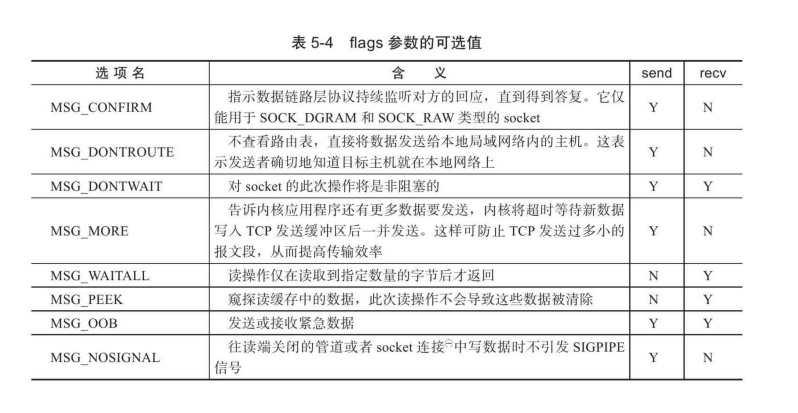

# 服务器编程

# TCP/IP协议详解

## TCP/IP协议簇


## IP协议详解


## TCP 协议详解


# 高性能服务器编程


## 网络编程基础API

### 网络地址

```c++
// 专用地址
#include <bits/socket.h>
struct sockaddr
{
    sa_family_t sa_family;
    char sa_data[14];
}

// 通用地址
struct sockaddr_in
{
    sa_family_t sin_family;  // AF_UNIX 地址簇
    u_uint16_t sin_port;     // 端口, 网络字节序
    struct in_addr sin_addr; // IPv4地址
}
struct in_addr
{
    u_uint32_t s_addr; // IPv4地址，网络字节序
}

// IPv6地址不一样

```

### 字节序转换

```c++
#incude <netinet.h>
unsigned long int htonl(unsigned long int hostlong);
unsigned short int htons(unsigned short int hostshort);

unsigned long int ntohl( unsigned long int netlong); 
unsigned short int ntohs( unsigned short int netshort);
```


### IP地址转换

```c++
#include <arpa/inet.h>
// 将十进制IP地址转换成网络字节序地址
int_addr_t inet_addr(const char* strptr);

// 同inet_addr, 返回结果在保存在inp中, 成功返回1，失败返回0
int inet_aton(const char* cp, struct in_addr* inp);

// 将网络地址转换成十进制点分字符串, 内部用静态变量存储结果
char* inet_ntoa(struct in_addr in);

// 通用转换, 支持IPv4和IPv6
#inlcude <arpa/inet.h>

// 转换成网络地址
int inet_pton(int af, const char* src, void* dst);
af: AF_UNIX/AF_UNIX6
src: 十进制网络地址
dst: 网络字节序地址

// 转换成十进制地址
const char* inet_ntop(int af, const void* src, char* dst, socklen_t cnt);
cnt: 存储单元大小，可用宏定义

#define INET_ADDRSTRLEN 16
#define INET6_ADDRSTRLEN 46
```


### 创建socket

```c++
#include <sys/type.h>
#include <sys/socket.h>

int socket(int domain, int type, int protocol);
domain: PF_INET/PF_INET6
type: SOCK_STREAM/SOCK_DGRAM   // &SOCK_NONBLOCK or &SOCK_CLOEXEC
return: fd 成功, -1 失败
```


### 命名socket

```c++
#include <sys/type.h>
#include <sys/socket.h>

int bind(int sockfd, const struct sockaddr* my_addr, socklen_t addrlen);
return: 0 成功, 1 失败
```


### 监听socket

```c++
#include <sys/type.h>
#incude <sys/socket.h>

int listen(int socketfd, int backlog);
backlog: 半连接（SYN_RCVD）队列大小
return: 0 成功 -1 失败
```


### 接受连接

```c++
#include <sys/type.h>
#include <sys/socket.h>

int accept(int sockfd, struct sockaddr* addr, socklen_t* addrlen );
sockfd: 监听fd
addr: 对端地址
addrlen: 地址长度
return: fd 成功，-1 失败
desc: 从监听队列(半连接队列)中取出fd
```


### 发起连接

```c++
#include <sys/type.h>
#include <sys/socket.h>

int connect(int sockfd, struct sockaddr* serv_addr, socklen_t len);
sockfd: socket调用返回套接字
serv_addr: 服务端地址
socklen_t: 服务端长度
return: 0 成功, -1 失败
errno: ECONNREFUSED 目标端口不存在，被拒绝
	   ETIMEDOUT  连接超时
```


### 关闭连接

```c++
#include <unistd.h>

int close(int fd);

desc: 将fd引用计数-1, 如fork时fd引用计数+1, 为0时关闭连接
      读写同时关闭

#include <sys/socket.h>
    
int shutdown(int sockfd, int howto);
howto: SHUT_RD/ SHUT_WR/ SHUT_RDWR
desc: 可以将读写分别单独关闭
return: 0 成功, -1 失败

```


### 读写数据

```c++
// ---------------------
// TCP数据读写专用函数-----
#include <sys/type.h>
#include <sys/socket.h>

int recv(int sockfd, void* buf, size_t len, int flags);
return: 0 对端已关闭,  -1 失败
flags: 见截图 MSG_OOB 外带数据(紧急指针)一般让对端丢弃缓冲区数据，如ftp中断命令
另外要接收SIGURG信号, 需设置套接字归进程所有,带外数据不论发送多少只能读取一个有效字节
    
int send(int sockfd, const void* buf, size_t len, int flags);
len: 指定读写大小
return: -1 失败
    
// ---------------------
// UDP数据读写专用函数-----
#inlucde <sys/type.h>
#include <sys/socket.h>
    
int recvfrom(int sockfd, void* buf, size_t len, int flags, struct sockaddr* src_addr, socklen_t* addrlen);

int sendto(int sockfd, const void* buf, size_t len, int flags, struct sockaddr* dst_addr, socklen_t addrlen);

desc: 设置地址为NULL， 可以用于TCP

// ---------------------
// 数据读写通用函数--------
#inlcude <sys/socket.h>

int recvmsg(int sockfd, struct msghdr *msg, int flags);

int sendmsg(int sockfd, struct msghdr *msg, int flags);
    
struct msghdr { 
    void* msg_name;/* socket 地址*/ 
    socklen_t msg_namelen;/* socket 地址 的 长度*/ 
    struct iovec* msg_iov;/* 分散 的 内存 块， 见 后文*/ 
    int msg_iovlen;/* 分散 内存 块 的 数量*/ 
    void* msg_control;/* 指向 辅助 数据 的 起始 位置*/ 
    socklen_t msg_ controllen;/* 辅助 数据 的 大小*/ 
    int msg_flags;/* 复制 函数 中的 flags 参数， 并在 调用 过程中 更新*/ 
};

struct iovec { 
    void* iov_base;/* 内存 起始 地址*/ 
    size_ t iov_len;/* 这块 内存 的 长度*/ 
};

```



### 带外标记

```c++
#include <sys/socket.h>

int sockatmark(int sockfd);
return: 0 无外带数据, 1 有外带数据(recv, MSG_OOB接收紧急数据)
```


### 从fd获取地址信息

```c++
#include <sys/socket.h>

int getsockname(int sockfd, struct sockaddr* addr, socklen_t* len);
int getpeername(int sockfd, struct sockaddr* addr, socklen_t* len);

return: 0 sucess, -1 failed
desc: 结果存储在addr变量中
```


### socket 选项

```c++
#include <sys/socket.h>

int getsockopt(int sockfd, int level, int option_name, void* option_value, socklen_t* len);

int setsockopt(int sockfd, int level, int option_name, void* option_value, socklen_t len);
/*
level: SOL_SOCKET 通用sock/ IPPROTO_IP / IPPROTO_IP6 / IPPROTO_TCP

option_name: SO_REUSEADDR  可占用TIME_WAIT状态的socket
             SO_RCVBUF, SO_SNDBUF 缓冲区大小
    		 SO_RCVLOWAT, SO_SNDLOWAT 可读写低水位标志, 默认1字节, 可读/可写 大于 低水位，通知程序可读/可写
    		 SO_LINGER 控制close关闭TCP连接的行为
*/

struct linger { 
    int l_ onoff; // 开启（ 非 0） 还是 关闭（ 0） 该 选项
    int l_ linger; // 滞留 时间
};
```


### 网络信息API

```c++
#include <netdb.h>

// ------------------
// 获取服务完整信息-----
struct hostent* gethostbyname(const char* name);
struct hostent* gethostbyaddr(const void* addr, size_t len, int type);
addr: 目标主机IP地址
len: 地址长度
type: AF_INET/AF_INET6
desc: 获取主机完整信息
    
struct hostent { 
    char* h_name;/* 主机 名*/ 
    char** h_aliases;/* 主机 别名 列表， 可能有 多个*/ 
    int h_addrtype;/* 地址 类型（ 地址 族）*/ 
    int h_length;/* 地址 长度*/ 
    char** h_addr_list/* 按 网络 字节 序 列出 的 主机 IP 地址 列表*/ 
};

// ------------------
// 获取服务完整信息-----
struct servent* getservbyname(const char* name, const char* proto);
struct servent* getservbyport(int port, const char* proto);
proto: "TCP"/ "UDP"
    
struct servent { 
    char* s_name;/* 服务 名称*/ 
    char** s_aliases;/* 服务 的 别名 列表， 可能有 多个*/ 
    int s_port;/* 端口 号*/ 
    char* s_proto;/* 服务 类型, 通常 是 tcp 或者 udp*/ 
}; 
 
// ------------------
// 通过主机名获取IP地址，通过服务名获取端口号
int getaddrinfo(...);
void freeaddrinfo(struct addrinfo* res);

// 通过socket 地址获取主机名或服务名
int getnameinfo(...);
```

### 错误码转换

```c++
#include <netdb.h>

const char* gai_strerror(int error);
```


## 高级I/O函数

### pipe

```c++
#include <unistd.h>

int pipe(int fd[2]);
fd[0] 和 fd[1] 分别对应管道的两端, fd[0]写入只能从fd[1]读出

#include <sys/type.h>
#include <sys/socket.h>
    
int socketpair(int domain, int type, int fd[2]);
domain: AF_UNIX
desc: 双向管道
```


### dup/dup2

```c++
#include <unistd.h>

int dup(int file_describe);
int dup2(int file_fd1, int file_fd2);
return: 系统当前可用最小整数值
desc: 把标准输入重定向到文件 或标准输出重新定到文件，管道，网络

close(STDOUT_FILENO); // 关闭标准输出, 系统值1
dup(sockfd); // 返回1, 重定向到了网络

```


### readv/writev

```c++
#include <sys/uio.h>

ssize_t readv( int fd, const struct iovec* vector, int count);
ssize_t writev( int fd, const struct iovec* vector, int count);

// 简化版recvmsg,sendmsg
```


### sendfile

```c++
#include <sys/sendfile.h>

ssize_t sendfile(int out_fd, int in_fd, off_t* offset, size_t count);
out_fd: 待写入fd
in_fd: 待读出fd
offset: 开始位置
count: 长度
// 描述符之间直接传递数据，在内核中完成，零拷贝
```


### mmap/munmap

```c++
#include <sys/mman.h>

// 申请一段内存空间, 进程间通信的共享内存
void* mmap(void* start, size_t length, int prot, int flags, int fd, off_t offset);
start: 指定起始地址, NULL时系统自动分配
prot: 权限 PROT_READ/PORT_WIRTE/PROT_EXEC/PROT_NONE
flags: 控制内容被修改后程序行为 MAP_SHARED
fd: 文件描述符
offset: 文件映射便宜位置,不需要映射整个文件
return:　返回指向内存的指针

int munmap(void* start, size_t length);


```


### splice

```c++
#include <fcntl.h>

// 用于两个文件描述符之间移动数据，也是零拷贝
ssize_ t splice( int fd_in, loff_t* off_in, int fd_out, loff_t* off_out, size_t len, unsigned int flags);
flags: SPLICE_F_NONBLOCK

```

发

### tee

```c++
#include <fcntl.h>

// 管道文件描述符之间复制数据
ssize_t tee( int fd_in, int fd_out, size_t len, unsigned int flags);

```


### fcntl

```c++
#include <fcntl.h>

int fcntl(int fd, int cmd...);

cmd: F_GETFL/F_SETFL

int setnonblocking( int fd) 
{ 
	int old_ option= fcntl( fd, F_GETFL);
	int new_ option= old_option| O_NONBLOCK;
	fcntl( fd, F_SETFL, new_ option); 
	return old_ option;
}
```

