# 服务器编程

# TCP/IP协议详解

## TCP/IP协议簇

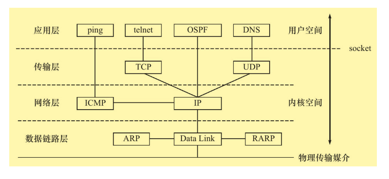

数据链路层：实现了网卡接口的网络驱动程序，以处理数据在物理媒介(以太网)上的传输

网络层：数据包的选路和转发

传输层：为两台主机上的程序提供端到端服务

应用层：负责处理应用程序的逻辑


TCP协议：为应用层提供可靠的、面向连接的和基于流的服务

UDP协议：与TCP相反，为应用层提供不可靠、无连接和基于数据报的服务

ARP工作原理：主机向所在的网络广播一个ARP请求, 请求包含目标主机的网络地址。此网络上的其他主机收到这个请求，但只有被请求的目标机器会回应一个ARP应答，其中包含自己的物理地址。

```shell
# 查看ARP缓存
arp

# DNS服务文件
/etc/resolv.conf

# 查看DNS
host -t A www.baidu.com
```


## IP协议详解

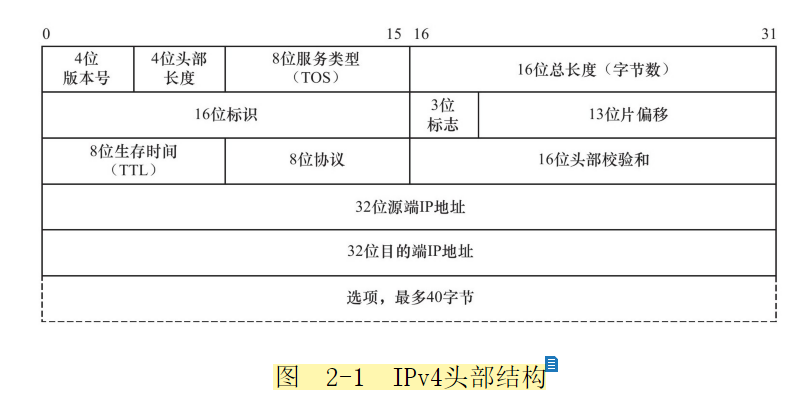

IP分片：

```shell
# MTU 1500, ICMP 头部8个字节, 所以1473 + 8 > 1500 , 可以分片
51_zjdev[/data01/zjgrp/zjdev]%ping 10.19.14.52 -s 1473
PING 10.19.14.52 (10.19.14.52) 1473(1501) bytes of data.
1481 bytes from 10.19.14.52: icmp_seq=1 ttl=64 time=1.08 ms
1481 bytes from 10.19.14.52: icmp_seq=2 ttl=64 time=0.494 ms
1481 bytes from 10.19.14.52: icmp_seq=3 ttl=64 time=0.553 ms

51_zjdev[/data01/zjgrp/zjdev]%sudo tcpdump -i eth0 -ntv icmp
tcpdump: listening on eth0, link-type EN10MB (Ethernet), capture size 65535 bytes
IP (tos 0x0, ttl 64, id 541, offset 0, flags [+], proto ICMP (1), length 1500)
    10.19.14.51 > 10.19.14.52: ICMP echo request, id 16156, seq 1, length 1480
IP (tos 0x0, ttl 64, id 541, offset 1480, flags [none], proto ICMP (1), length 21)
    10.19.14.51 > 10.19.14.52: ip-proto-1

# 查看MTU
[root@localhost ~]# ifconfig -a
enp0s3: flags=4163<UP,BROADCAST,RUNNING,MULTICAST>  mtu 1500
        inet 192.168.1.113  netmask 255.255.255.0  broadcast 192.168.1.255
```


IP路由机制：IP完全匹配，匹配网络段，默认路由

IP转发：/etc/sys/net/ipv4/ip_forward ，一般是接收和发送，但也可以转发

重定向：

IPv6头部结构：

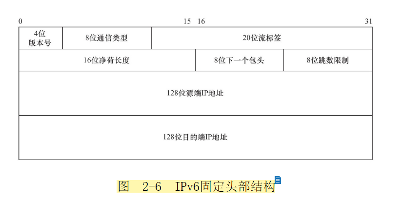

## TCP 协议详解

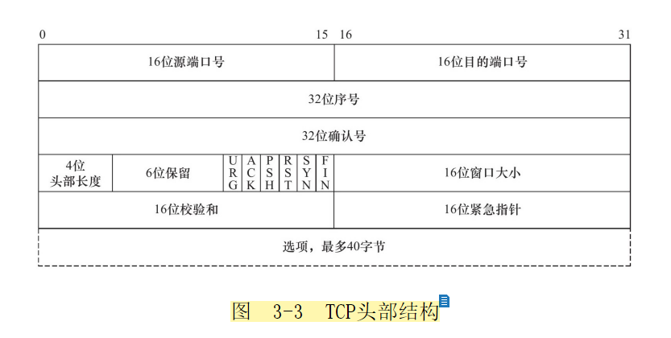


TCP头部选项：

连接超时：iptables -I INPUT -p tcp -- syn -i eth0 -j DROP

TCP状态转移：

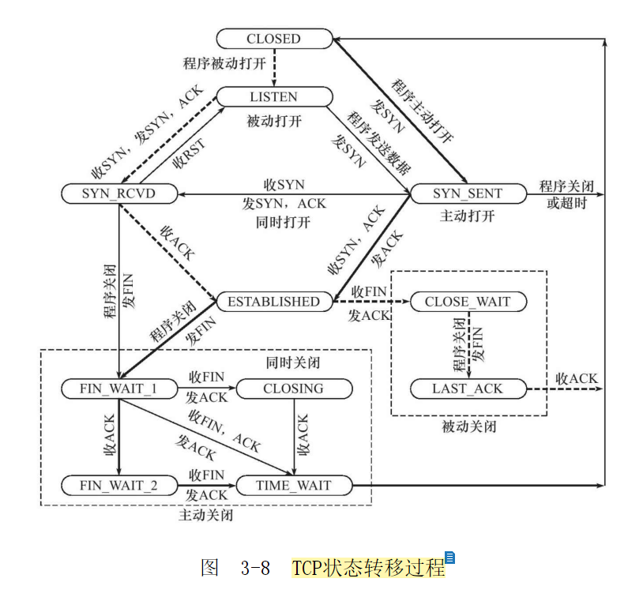

TIME_WAIT存在原因：可靠的终止TCP链接；保证迟来的TCP报文有足够的时间被识别并被丢弃。

RST复位报文场景：访问不存在的端口，异常终止链接，处理半打开链接。

Nagel算法：在任意时刻，发送的TCP报文在未被确认到达之前不能发送其他报文，避免拥塞。

TCP超时重传：

TCP拥塞控制：慢启动，拥塞避免，快速重传，快速恢复


# 高性能服务器编程


## 网络编程基础API

### 网络地址

```c++
// 专用地址
#include <bits/socket.h>
struct sockaddr
{
    sa_family_t sa_family;
    char sa_data[14];
}

// 通用地址
struct sockaddr_in
{
    sa_family_t sin_family;  // AF_UNIX 地址簇
    u_uint16_t sin_port;     // 端口, 网络字节序
    struct in_addr sin_addr; // IPv4地址
}
struct in_addr
{
    u_uint32_t s_addr; // IPv4地址，网络字节序
}

// IPv6地址不一样

```

### 字节序转换

```c++
#incude <netinet.h>
unsigned long int htonl(unsigned long int hostlong);
unsigned short int htons(unsigned short int hostshort);

unsigned long int ntohl( unsigned long int netlong); 
unsigned short int ntohs( unsigned short int netshort);
```


### IP地址转换

```c++
#include <arpa/inet.h>
// 将十进制IP地址转换成网络字节序地址
int_addr_t inet_addr(const char* strptr);

// 同inet_addr, 返回结果在保存在inp中, 成功返回1，失败返回0
int inet_aton(const char* cp, struct in_addr* inp);

// 将网络地址转换成十进制点分字符串, 内部用静态变量存储结果
char* inet_ntoa(struct in_addr in);

// 通用转换, 支持IPv4和IPv6
#inlcude <arpa/inet.h>

// 转换成网络地址
int inet_pton(int af, const char* src, void* dst);
af: AF_UNIX/AF_UNIX6
src: 十进制网络地址
dst: 网络字节序地址

// 转换成十进制地址
const char* inet_ntop(int af, const void* src, char* dst, socklen_t cnt);
cnt: 存储单元大小，可用宏定义

#define INET_ADDRSTRLEN 16
#define INET6_ADDRSTRLEN 46
```


### 创建socket

```c++
#include <sys/type.h>
#include <sys/socket.h>

int socket(int domain, int type, int protocol);
domain: PF_INET/PF_INET6
type: SOCK_STREAM/SOCK_DGRAM   // &SOCK_NONBLOCK or &SOCK_CLOEXEC
return: fd 成功, -1 失败
```


### 命名socket

```c++
#include <sys/type.h>
#include <sys/socket.h>

int bind(int sockfd, const struct sockaddr* my_addr, socklen_t addrlen);
return: 0 成功, 1 失败
```


### 监听socket

```c++
#include <sys/type.h>
#incude <sys/socket.h>

int listen(int socketfd, int backlog);
backlog: 半连接（SYN_RCVD）队列大小
return: 0 成功 -1 失败
```


### 接受连接

```c++
#include <sys/type.h>
#include <sys/socket.h>

int accept(int sockfd, struct sockaddr* addr, socklen_t* addrlen );
sockfd: 监听fd
addr: 对端地址
addrlen: 地址长度
return: fd 成功，-1 失败
desc: 从监听队列(半连接队列)中取出fd
```


### 发起连接

```c++
#include <sys/type.h>
#include <sys/socket.h>

int connect(int sockfd, struct sockaddr* serv_addr, socklen_t len);
sockfd: socket调用返回套接字
serv_addr: 服务端地址
socklen_t: 服务端长度
return: 0 成功, -1 失败
errno: ECONNREFUSED 目标端口不存在，被拒绝
	   ETIMEDOUT  连接超时
```


### 关闭连接

```c++
#include <unistd.h>

int close(int fd);

desc: 将fd引用计数-1, 如fork时fd引用计数+1, 为0时关闭连接
      读写同时关闭

#include <sys/socket.h>
    
int shutdown(int sockfd, int howto);
howto: SHUT_RD/ SHUT_WR/ SHUT_RDWR
desc: 可以将读写分别单独关闭
return: 0 成功, -1 失败

```


### 读写数据

```c++
// ---------------------
// TCP数据读写专用函数-----
#include <sys/type.h>
#include <sys/socket.h>

int recv(int sockfd, void* buf, size_t len, int flags);
return: 0 对端已关闭,  -1 失败
flags: 见截图 MSG_OOB 外带数据(紧急指针)一般让对端丢弃缓冲区数据，如ftp中断命令
另外要接收SIGURG信号, 需设置套接字归进程所有,带外数据不论发送多少只能读取一个有效字节
    
int send(int sockfd, const void* buf, size_t len, int flags);
len: 指定读写大小
return: -1 失败
    
// ---------------------
// UDP数据读写专用函数-----
#inlucde <sys/type.h>
#include <sys/socket.h>
    
int recvfrom(int sockfd, void* buf, size_t len, int flags, struct sockaddr* src_addr, socklen_t* addrlen);

int sendto(int sockfd, const void* buf, size_t len, int flags, struct sockaddr* dst_addr, socklen_t addrlen);

desc: 设置地址为NULL， 可以用于TCP

// ---------------------
// 数据读写通用函数--------
#inlcude <sys/socket.h>

int recvmsg(int sockfd, struct msghdr *msg, int flags);

int sendmsg(int sockfd, struct msghdr *msg, int flags);
    
struct msghdr { 
    void* msg_name;/* socket 地址*/ 
    socklen_t msg_namelen;/* socket 地址 的 长度*/ 
    struct iovec* msg_iov;/* 分散 的 内存 块， 见 后文*/ 
    int msg_iovlen;/* 分散 内存 块 的 数量*/ 
    void* msg_control;/* 指向 辅助 数据 的 起始 位置*/ 
    socklen_t msg_ controllen;/* 辅助 数据 的 大小*/ 
    int msg_flags;/* 复制 函数 中的 flags 参数， 并在 调用 过程中 更新*/ 
};

struct iovec { 
    void* iov_base;/* 内存 起始 地址*/ 
    size_ t iov_len;/* 这块 内存 的 长度*/ 
};

```


### 带外标记

```c++
#include <sys/socket.h>

int sockatmark(int sockfd);
return: 0 无外带数据, 1 有外带数据(recv, MSG_OOB接收紧急数据)
```


### 从fd获取地址信息

```c++
#include <sys/socket.h>

int getsockname(int sockfd, struct sockaddr* addr, socklen_t* len);
int getpeername(int sockfd, struct sockaddr* addr, socklen_t* len);

return: 0 sucess, -1 failed
desc: 结果存储在addr变量中
```


### socket 选项

```c++
#include <sys/socket.h>

int getsockopt(int sockfd, int level, int option_name, void* option_value, socklen_t* len);

int setsockopt(int sockfd, int level, int option_name, void* option_value, socklen_t len);
/*
level: SOL_SOCKET 通用sock/ IPPROTO_IP / IPPROTO_IP6 / IPPROTO_TCP

option_name: SO_REUSEADDR  可占用TIME_WAIT状态的socket
             SO_RCVBUF, SO_SNDBUF 缓冲区大小
    		 SO_RCVLOWAT, SO_SNDLOWAT 可读写低水位标志, 默认1字节, 可读/可写 大于 低水位，通知程序可读/可写
    		 SO_LINGER 控制close关闭TCP连接的行为
*/

struct linger { 
    int l_ onoff; // 开启（ 非 0） 还是 关闭（ 0） 该 选项
    int l_ linger; // 滞留 时间
};
```


### 网络信息API

```c++
#include <netdb.h>

// ------------------
// 获取服务完整信息-----
struct hostent* gethostbyname(const char* name);
struct hostent* gethostbyaddr(const void* addr, size_t len, int type);
addr: 目标主机IP地址
len: 地址长度
type: AF_INET/AF_INET6
desc: 获取主机完整信息
    
struct hostent { 
    char* h_name;/* 主机 名*/ 
    char** h_aliases;/* 主机 别名 列表， 可能有 多个*/ 
    int h_addrtype;/* 地址 类型（ 地址 族）*/ 
    int h_length;/* 地址 长度*/ 
    char** h_addr_list/* 按 网络 字节 序 列出 的 主机 IP 地址 列表*/ 
};

// ------------------
// 获取服务完整信息-----
struct servent* getservbyname(const char* name, const char* proto);
struct servent* getservbyport(int port, const char* proto);
proto: "TCP"/ "UDP"
    
struct servent { 
    char* s_name;/* 服务 名称*/ 
    char** s_aliases;/* 服务 的 别名 列表， 可能有 多个*/ 
    int s_port;/* 端口 号*/ 
    char* s_proto;/* 服务 类型, 通常 是 tcp 或者 udp*/ 
}; 
 
// ------------------
// 通过主机名获取IP地址，通过服务名获取端口号
int getaddrinfo(...);
void freeaddrinfo(struct addrinfo* res);

// 通过socket 地址获取主机名或服务名
int getnameinfo(...);
```

### 错误码转换

```c++
#include <netdb.h>

const char* gai_strerror(int error);
```


## 高级I/O函数

### pipe

```c++
#include <unistd.h>

int pipe(int fd[2]);
fd[0] 和 fd[1] 分别对应管道的两端, fd[0]写入只能从fd[1]读出

#include <sys/type.h>
#include <sys/socket.h>
    
int socketpair(int domain, int type, int fd[2]);
domain: AF_UNIX
desc: 双向管道
```


### dup/dup2

```c++
#include <unistd.h>

int dup(int file_describe);
int dup2(int file_fd1, int file_fd2);
return: 系统当前可用最小整数值
desc: 把标准输入重定向到文件 或标准输出重新定到文件，管道，网络

close(STDOUT_FILENO); // 关闭标准输出, 系统值1
dup(sockfd); // 返回1, 重定向到了网络

```


### readv/writev

```c++
#include <sys/uio.h>

ssize_t readv( int fd, const struct iovec* vector, int count);
ssize_t writev( int fd, const struct iovec* vector, int count);

// 简化版recvmsg,sendmsg
```


### sendfile

```c++
#include <sys/sendfile.h>

ssize_t sendfile(int out_fd, int in_fd, off_t* offset, size_t count);
out_fd: 待写入fd
in_fd: 待读出fd
offset: 开始位置
count: 长度
// 描述符之间直接传递数据，在内核中完成，零拷贝
```


### mmap/munmap

```c++
#include <sys/mman.h>

// 申请一段内存空间, 进程间通信的共享内存
void* mmap(void* start, size_t length, int prot, int flags, int fd, off_t offset);
start: 指定起始地址, NULL时系统自动分配
prot: 权限 PROT_READ/PORT_WIRTE/PROT_EXEC/PROT_NONE
flags: 控制内容被修改后程序行为 MAP_SHARED
fd: 文件描述符
offset: 文件映射便宜位置,不需要映射整个文件
return:　返回指向内存的指针

int munmap(void* start, size_t length);


```


### splice

```c++
#include <fcntl.h>

// 用于两个文件描述符之间移动数据，也是零拷贝
ssize_ t splice( int fd_in, loff_t* off_in, int fd_out, loff_t* off_out, size_t len, unsigned int flags);
flags: SPLICE_F_NONBLOCK

```

发

### tee

```c++
#include <fcntl.h>

// 管道文件描述符之间复制数据
ssize_t tee( int fd_in, int fd_out, size_t len, unsigned int flags);

```


### fcntl

```c++
#include <fcntl.h>

int fcntl(int fd, int cmd...);

cmd: F_GETFL/F_SETFL

int setnonblocking( int fd) 
{ 
	int old_ option= fcntl( fd, F_GETFL);
	int new_ option= old_option| O_NONBLOCK;
	fcntl( fd, F_SETFL, new_ option); 
	return old_ option;
}
```

## linux 服务程序规范

### 日志

```c++
#include <syslog.h>

void syslog(int priority, const char* message...);

// 设置格式
void openlog(const char* ident, int logopt, int facility);
ident: 指定字符串添加到日期和时间之后
logopt: LOG_PID 日志消息中包含进行ID
    
// 设置日志级别
int setsyslogmask(int mask);

// 关闭日志功能
void closelog();
```


### 用户信息

```c++
#include <sys/type.h>
#include <unistd.h>

uid_t getuid();
uid_t geteuid();
gid_t getgid();
gid_t getegid();

...set...

// 有效用户ID, 任何用户执行su命令，有效用户就是root，可以访问/etc/passwd
// uid 是启动进程的用户ID, euid是文件所有者的ID
```


### 进程间关系

```c++
#include <unistd.h>

// 进程组ID
pid_t getpgid(); 
int setpgid(pid_t pid, pid_t pgid);

// 会话 = 进程组首领的PGID
pid_t getsid(pid_t pid);
pid_t setsid(void);

// example
ps -o pid ,ppid, gpid, sid, comm |less
```


### 系统资源限制

```c++
#include <sys/resource.h>

int getrlimmt(int resource, struct rlimit* rlim);
int setrlimit(int resource, struct rlimt* rlim);
```


### 改变工作目录和根目录

```c++
#include <unistd.h>

char* getcwd(char* buf, size_t size);
buf: 存放工作目录绝对路径的存储
size: 存储长度

int chdir(const char* path);
path: 切换的目标目录

int chroot(const char* path);
path: 目标根目录
desc: 读取的是新根下的目录和文件，这是一个与原系统根下文件不相关的目录结构
```


### 服务程序后台化

```c++
#include <>

int daemon(int nochdir, int noclose);
nochdir: 0 表示"/", 否则用当前工作目录
noclose: 0 标准输入/输出/错误 重定向到 /dev/null
```


## 高性能服务器框架

### 服务器模型

异步I/O 立即返回，不论是I/O否阻塞，内核完成I/O操作后通知应用程序。
同步I/O 向应用程序通知的是就绪事件(I/O阻塞，复用，信号)，而异步I/O通知的是完成事件。

服务器一般处理三种事件：I/O事件，信号事件，定时时间。

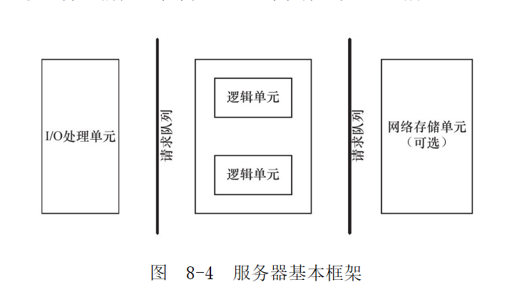

### 两种事件处理模式

Reactor模式：主线程监听，可读/可写 事件 放入请求队列，唤醒工作线程处理
Proactor模式：主线程处理所有I/O操作，通知工作线程读写结果


### 两种并发编程模式

如果程序是计算密集型，并发编程没有优势。如果程序是I/O密集型，等待I/O线程放弃CPU，其他线程执行。

__半同步/半异步__：同步是指代码按照顺序执行，异步是指程序执行需要系统事件来驱动。
同步线程处理逻辑，异步线程处理I/O事件。
异步线程监听请求，派发socket，通知某个工作在同步模式的线程读取并处理。如下图中每个线程都有自己的监听。

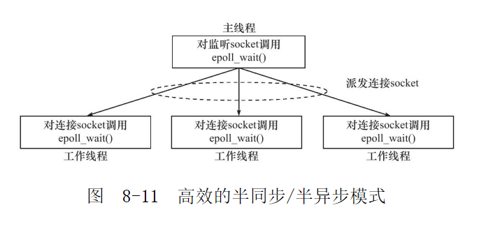


__领导者/追随者__：多个工作线程轮流，在某一时间点，只有一个领导者，负责监听I/O事件，其他线程则都是追随者，休眠在线程池中等待成为领导者。缺点是一个线程无法管理多个连接。

组件包括：句柄集(HandleSet)，线程集(ThreadSet)，事件处理器(EventHandle)，具体事件处理器(ConcreteEventHanle)

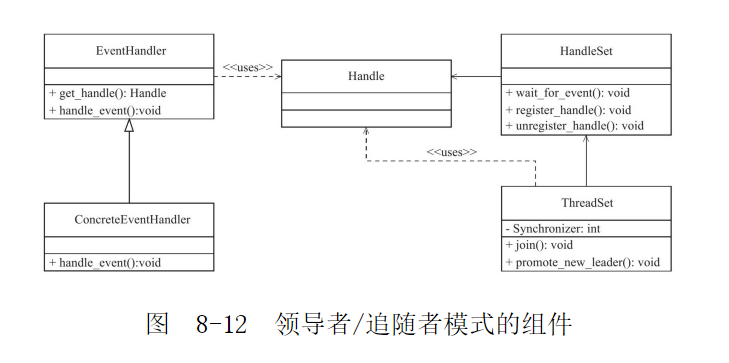


### 有限状态机

逻辑单元内部高效编程方法，一个消息码对应一个逻辑函数。

### 其他高效编程建议

池、数据复制、上下文切换和锁


## I/O 复用

### select

```c++
#include <sys/select.h>
int select(int nfds, fd_set* readfds, fd_set* writefds, fd_set*exceptfds, timeval* timeout);

// nfds 最大描述符的值+1
// 返回0 没有描述符就绪; 返回-1 失败; 收到信号 立即返回-1 errno EAGAIN

// 设置fd_set
FD_ZERO( fd_ set* fdset);/* 清除 fdset 的 所有 位*/ 
FD_SET( int fd, fd_ set* fdset);/* 设置 fdset 的 位 fd*/ 
FD_CLR( int fd, fd_ set* fdset);/* 清除 fdset 的 位 fd*/ 
int FD_ISSET( int fd, fd_ set* fdset); /* 测试 fdset 的 位 fd 是否 被 设置*/

// 0 立即返回， NULL 一直阻塞直到有描述符就绪
struct timeval { 
long tv_ sec;	/* 秒数*/ 
long tv_ usec;	/* 微秒数*/
}
```

__文件描述符就绪条件__

可读：

> 1 内核读缓冲区可读数据大于或等于其低水位标记SO_RCVLOWAT
> 2 对端关闭连接，该socket的读返回0
> 3 监听socket上有新的连接请求
> 4 socket上有未处理的错误。用getsockopt来读取和清除该错误

可写：

> 1 内核写缓冲区空闲数据大于或等于其低水位标记SO_SNDLOWAT
> 2 socket写操作关闭，对该被关闭的socket执行写操作会触发一个SIGPIPE信号
> 3 socket使用非阻塞connect 连接成功或失败(超时)之后  ，其中errno=EINPROGRESS 正在建立连接
> 4 socket上有未处理的错误。用getsockopt来读取和清除该错误

```c++

int error= 0; 
socklen_ t length= sizeof( error); 
/*调用 getsockopt 来 获取 并 清除 sockfd 上 的 错误*/ 
if( getsockopt( sockfd, SOL_SOCKET, SO_ERROR, &error, &length) ＜ 0)
{
}
```


异常：

> 外带数据


### poll

```c++
#include <poll.h>
int poll(struct pollfd *fds, nfds_t nfds, int timeout);

// fds 是一个pollfd类型的数组
struct pollfd
{
    int fd;	/* 文件描述符*/
    short events; /* 注册事件*/
    short revents; /* 就绪事件，由内核填充*/
}
// nfds 个数
// timeout -1 一直阻塞，0 立即返回
// 返回值同select
```


### epoll

```c++
#include <sys/epoll.h>
int epoll_create(int size);
// 创建内核事件表

int epoll_ctl(int epfd, in op, int fd, epoll_event* event);
// 操作内核事件表 
// op = EPOLL_CTL_ADD, EPOLL_CTL_DEL, EPOLL_CTL_MOD
struct epoll_event
{
    uint32_t events; /* 事件 EPOLLIN EPOLLOUT EPOLLET EPOLLONESHOT*/
    epoll_data_t data; /* 用户数据 常用的是data.fd */
}


int epoll_wait(int epfd, struct epoll_event* events, int maxevents, int timeout);
// 等待就绪, events 是数组
```


LT 水平触发，默认方式，事件不处理下次还会触发；

ET 边缘触发，事件必须被处理，下次不会触发。


### 区别比较

|                                  | select                                                       | poll                                                         | epoll                                                        |
| -------------------------------- | ------------------------------------------------------------ | ------------------------------------------------------------ | ------------------------------------------------------------ |
| 事件集合                         | 3个参数分别传入感兴趣的可读、可写、异常等事件，内核修改反馈其中就绪事件。每次调用都需要重置这3个参数 | 统一处理所有时间类型，因此只需要一个参数。用户通过pollfd.events传入感兴趣事件，内核通过修改pollfd.revents反馈其中就绪的事件 | 内核通过一个事件表管理用户感兴趣的事件。因此epoll_wait时无需反复传入用户感兴趣的事件。epoll_wait第二个参数events仅用来反馈就绪的事件 |
| 应用索引就绪文件描述符时间复杂度 | O(n)                                                         | O(n)                                                         | O(1)                                                         |
| 支持最大文件描述符数量           | 一般限制是1024                                               | 65535                                                        | 65535                                                        |
| 工作模式                         | LT                                                           | LT                                                           | LT/ET                                                        |
| 内核实现和工作效率               | 采用轮询方式来检测就绪事件，O(n)                             | 轮询，O(n)                                                   | 采用回调方式来检测就绪事件，O(1)                             |


### 同时处理TCP和UDP

tcpfd和udpfd可以同时绑定到一个端口，把两个fd都加到事件列表中可以同时监听


## 信号

### 发送和处理

```c++
#include <sys/types.h>
#include <signal.h>
int kill(pid_t pid, int sig);

// pid>0 发给指定进程, =0 发给所在进程组内其他成员, =-1 发给除init外所有进程, <-1 发给进程组中所有成员

// 信号默认处理：结束进程、忽略信号、结束进程并生成core文件、暂停进程、继续进程
```


### 信号处理函数

```c++
// 信号处理
#include <bits/signum.h>
#define SIG_DFL((sighandler_ t) 0) // 恢复某个信号的默认行为
#define SIG_IGN((sighandler_ t) 1) // 屏蔽某个信号

// 信号处理自定义
#include <signal.h>
typedef void (*sighandler_t)(int)； 
sighandler_t signal(int signum, sighandler_t handler)); 

signal(SIGINT, SIG_DFL); // 恢复信号默认处理

int sigaction(int sig,const struct sigaction *act,struct sigaction *oldact));
struct sigaction
{
    void     (*sa_handler)(int);  // 函数指针, 类似signal处理，相当于兼容
    void     (*sa_sigaction)(int, siginfo_t *, void *); // 包含SA_SIGINFO时用这个
    sigset_t  sa_mask; 	// 信号集，信号函数执行期间屏蔽某个信号，正在处理的信号不会再发生
    int       sa_flags; // 值的“按位或”组合
    void     (*sa_restorer)(void); // 废弃
};

// SA_RESTART：使被信号打断的系统调用自动重新发起
// SA_NOCLDSTOP：sig参数是 SIGCHLD，子进程暂停不会生成 SIGCHLD 信号
// SA_NOCLDWAIT：sig参数是 SIGCHLD，子进程结束不会产生僵尸进程

// SA_RESETHAND：信号处理之后重新设置为默认的处理方式
// SA_NODEFER：使对信号的屏蔽无效，即在信号处理函数执行期间仍能发出这个信号
// SA_SIGINFO：使用 sa_sigaction 成员而不是 sa_handler 作为信号处理函数

```


### 信号集

```c++
// 一组信号
#include <signal.h>
int sigemptyset(sigset_t *set); // 清空信号集
int sigfillset(sigset_t *set); // 
int sigaddset(sigset_t *set, int signum); // 增加信号
int sigdelset(sigset_t *set, int signum); // 删除信号
int sigismember(const sigset_t *set, int signum); // 判断信号是否在信号集中

int sigprocmask(int how, const sigset_t *set, sigset_t *oldset);
// 设置或查看信号集掩码
// how： SIG_BLOCK 阻塞 SIG_UNBLOCK 非阻塞，SIG_SETMASK 直接set设置为掩码
// set: NULL oldset返回信号集

int sigpending(sigset_t *set); //读取当前进程的未觉信号集 

int sigsuspend(const sigset_t *mask); // 先设置信号集，再挂起进程，直到信号函数处理完才返回-1
// 如果接收到信号终止了程序，sigsuspend就不会返回
// 如果接收到的信号没有终止程序，sigsuspend就返回-1，并将errno设置为EINTR

int pause(void); // 进程挂起，直到收到信号函数执行完，才返回-1
```

```markdown
man帮助说明：

Signal mask and pending signals
       A signal may be blocked, which means that it will not be delivered
       until it is later unblocked.  Between the time when it is generated
       and when it is delivered a signal is said to be pending.

       Each thread in a process has an independent signal mask, which
       indicates the set of signals that the thread is currently blocking.
       A thread can manipulate its signal mask using pthread_sigmask(3).  In
       a traditional single-threaded application, sigprocmask(2) can be used
       to manipulate the signal mask.

执行信号的处理动作称为信号递达（Delivery），信号从产生到递达之间的状态，称为信号未决（Pending）。进程可以选择阻塞（Block）某个信号。
被阻塞的信号产生时将保持在未决状态，直到进程解除对此信号的阻塞，才执行递达的动作。

注意，阻塞和忽略是不同的，只要信号被阻塞就不会递达，而忽略是在递达之后可选的一种处理动作。每个进程都有一个用来描述哪些信号递送到进程时将被阻塞的信号集，该信号集中的所有信号在递送到进程后都将被阻塞。

特别提醒：如果一个信号被进程阻塞，它就不会传递给进程，但会停留在待处理状态，当进程解除对待处理信号的阻塞时，待处理信号就会立刻被处理。可靠信号解除阻塞后会排队被处理。
```


### 统一事件源

信号处理函数执行和主循环是两条不同的执行路线。信号对应逻辑尽量放在主循环中，信号处理函数通过写管道，用epoll监听同I/O事件一样被处理。


### 网络编程相关信号

SIGHUP: 有终端的程序挂起；对后台程序来说强制重读配置文件，如xinetd

SIGPIPE: 往一个读端关闭的管道或者socket写数据会引发该信号, errno=EPIPE。
send函数的MSG_NOSIGNAL禁止该信号，可以通过errno判断对端读是否关闭。

```
以poll为例，当管道的读端关闭时，写端文件描述符上的POLLHUP事件将被触发；当socket连接被对方关闭时，socket上的POLLRDHUP事件将被触发。
```


SIGURG: 内核通知应用程序的外带数据到达两种方式，一个是select的异常，还有是SIGURG信号


## 定时器

### socket选项

SO_RCVTIMEO和SO_SNDTIMEO 设置接收和发送超时时间

send/sendmsg/recv/recvmsg/accept/connect 

```c++
struct timeval timeout;
timeout.tv_sec= time; 
timeout.tv_usec= 0; 
socklen_t len= sizeof(timeout); 
ret= setsockopt(sockfd, SOL_SOCKET, SO_ SNDTIMEO, &timeout, len);
```


### SIGALARM信号

基于升序链表的定时器：节点包含超时时间，用户数据，回调函数，指针等

处理非活动连接：KEEPALIVE或程序自己做


### I/O复用函数定时

略

### 高性能定时器

__时间轮__：插入删除O(1)，执行定时O(n), 固定频率循环

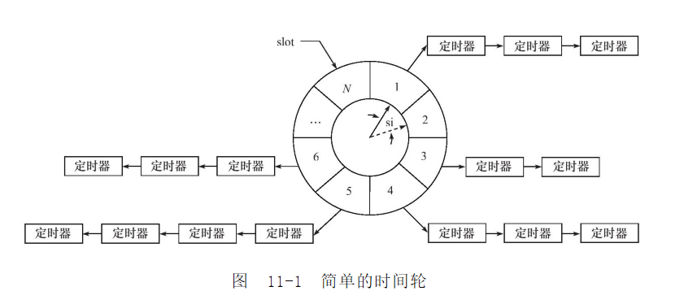

__时间堆__: 以最小超时值作为tick，依次遍历


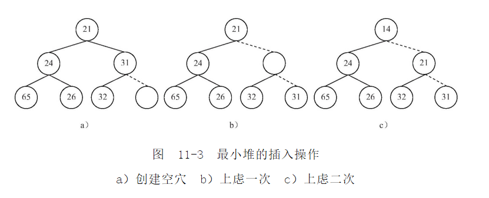


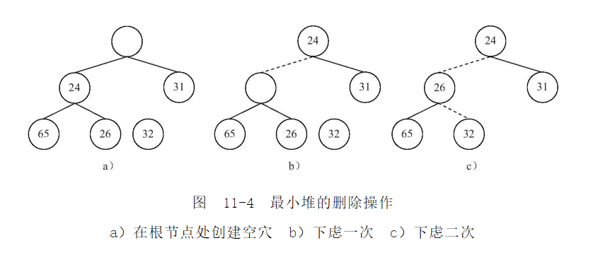

数组如何实现？


## 多进程编程

### fork

```c++
#include <sys/types.h>
#include <unistd.h>

pid_t fork(void);
// 返回两次, 父进程中返回子进程的pid，子进程中返回0
```

子进程的代码和父进程完全相同，子进程会(写时复制)复制父进程的 堆数据、栈数据、静态数据。文件描述符/工作目录引用计数会+1。

### exec

子进程需要执行其他程序，替换当前进程映像

```c++
#include <unistd.h>

extern char** environ; 
int execl( const char* path, const char* arg,...); 
int execlp( const char* file, const char* arg,...); 
int execle( const char* path, const char* arg,..., char* const envp[]); 
int execv( const char* path, char* const argv[]); 
int execvp( const char* file, char* const argv[]); 
int execve( const char* path, char* const argv[], char* const envp[]);
// path 完整的路径 file 可执行文件 arg 入参 envp 环境变量
// 一般不返回，出错时才返回-1
```


### 僵尸进程

僵尸进程：父进程结束或者异常终止，而子进程继续运行。由init进程接管，僵尸进程会一直占据内核资源，需要回收。

```c++
#include <sys/wait.h>

pid_t wait(int *status);  // 等待任意一个子进程结束
pit_t waitpid(pid_t pid,int *status,int options); // 等待指定或任意子进程结束
// 调用前子进程已经结束返回0，正常结束返回pid

// 子进程结束会发生 SIGCHLD，waitpid 最好是在子进程退出后调用
static void handle_ child(int sig)
{
    pid_ t pid;
    int stat;
    while ((pid = waitpid(-1, ＆ stat, WNOHANG)) ＞ 0)
    { /*对 结束 的 子 进程 进行 善后处理*/
    }
}
```


### 管道

fork后fd[2]两个文件描述符保持打开，父子进程必须一个关闭fd[0]，一个关闭fd[1]


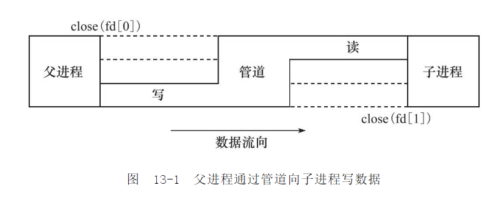

### 信号量

信号量取值可以是任何自然数，一般用二进制

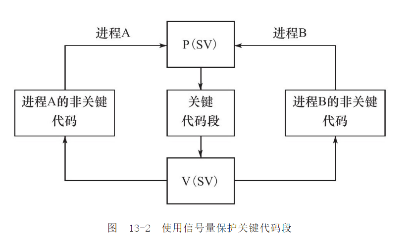

```c++
#include <sys/types.h>
#include <sys/ipc.h>
/* desc: 文件名到键值映射 
*  param: pathname 路径 proj 任意取1～255
*  return: 成功返回IPC键值
*/
key_t ftok (char*pathname, char proj)

#include <sys/sem.h >
/*
* desc: 创建新的信号量集 或 获取已经存在的信号量集
* param: key 键值 , 取IPC_PRIVATE(名字取IPC_NEW更合适)直接创建
		num_sems 数量 
		sem_flags IPC_CREATE|IPC_EXCL 已存在返回-1 类似open的mode参数
* return: 成功返回 新建的或已存在 正整数信号量集标识符 引用, 识别返回-1 errno
*/
int semget(key_t key, int num_sems, int sem_flags);


/* 系统为每个IPC对象保存的结构体 */
struct ipc_perm {
key_t   key ;          /* 此IPC对象的key键 */
uid_t   uid ;          /* 此IPC对象用户ID */
gid_t   gid ;          /* 此IPC对象组ID */
uid_t   cuid ;         /* IPC对象创建进程的有效用户ID */
gid_t   cgid ;         /* IPC对象创建进程的有效组ID */
mode_t   mode ;        /* 此IPC的读写权限 0666*/
ulong_t  seq ;         /* IPC对象的序列号 */
} ;

/*
* desc: 
* param: sem_id 信号量集标识符
		 sem_ops 数组
		 struct sembuf
		 {
		 	short sem_num; 	// 一组信号量, 下标从0开始
		 	short sem_op; 	// 小于0如-1 期望获得, 大于0如+1 释放，等于0 等待信号量值变0
		 	short sem_flg; 	// 一般是SEM_UNDO 系统跟踪信号在进程结束时释放
		 					// IPC_NOWAIT 等待信号量操作时立即返回
		 }
		 num_sem_ops 数组个数
* return: 成功返回0，失败返回-1
*/
int semop( int sem_id, struct sembuf* sem_ops, size_t num_sem_ops);

/*
* desc: 释放
* param: sem_id: 信号量集标识符
		 sem_num: 信号量索引下标
		 command: SETVAL 设置信号量值 GETVAL 获取信号量值 IPC_RMID 删除信号量
* return: 
*/
int semctl(int sem_id, int sem_num, int command, ...);

```


### 共享内存


```c++
#include <sys/shm.h>

/*
* desc: 创建 或 获取 一段共享内存
* param: key 键值 size 多少字节 shmflg 一般用(IPC_CREATE|IPC_EXCL|0666) 
* return: 成功返回正整数值 失败返回-1
*/
int shmget(key_t key, size_t size, int shmflg);

/*
* desc: 
* param: shm_id 共享内存标识符 shm_addr NULL 系统分配 或 指定共享内存关联到进程哪块地址 
		 shmflg SHM_RDONLY 只读, 默认可读写 SHM_REMAP 重新关联一段共享内存
* return: 成功返回0 失败返回-1
*/
int shmat(int shm_id, const void* shm_addr, int shmflg);
int shmdt(cosnt void* shm_addr);


/*
* desc: 释放 共享内存
* param: shm_id 共享内存标识符, command IPC_RMID 用用就好了, buf NULL
* return: 0 sucess , -1 failed
*/
int shmctl(int shm_id, int command, struct shmid_ds *buf);


// 共享内存POSIX方法, 略.....
```


### 消息队列


```c++
#include <sys/msg.h>

/*
* desc: 创建 或 获取 一个消息队列
* param: key 键值, msgflg 同sem_flags
* return: >0 sucess, -1 failed
*/
int msgget(key_t key, int msgflg);

/*
* desc: 添加一条消息到消息队列中
* param: msqid 消息队列标识符 msg_ptr 必须是 msgbuf 结构
		 struct msgbuf{
		 	long mtype;		 // 消息类型
		 	char mtext[512]; // 内容
		 }
		 msg_sz mtext 长度, 0 表示无内容
		 msgflg IPC_NOWAIT 队列满的时候立即返回，默认阻塞
* return: 0 sucess, -1 failed
*/
int msgsnd(int msqid, const void* msg_ptr, size_t msg_sz, int msgflg);

/*
* desc: 从队列中读取一个消息
* param: msqid 消息队列标识符, msg_ptr msgbuf, msg_sz 消息长度, 
		 mtype =0 取队列中第一个消息, >0 取队列中第一个是消息号的, <0 绝对值小于该消息号 
		 msgflg IPC_NOWAIT 队列空时立即返回
* return: 0 sucess, -1 failed
*/
int msgrcv(int msqid, const void* msg_ptr, size_t msg_sz, long int mtype, int msgflg);


```


### System V IPC 区别

|          | 头文件    | 创建   | 控制   | 操作          |
| -------- | --------- | ------ | ------ | ------------- |
| 信号量   | sys/sem.h | semget | semctl | semop         |
| 共享内存 | sys/shm.h | shmget | shmctl | shmat/shmdt   |
| 消息队列 | sys/msg.h | msgget | msgctl | msgrcv/msgsnd |


### IPC命令

```shell
host-10-19-14-51:/data01/zjgrp/zjv8cs> ipcs

--------- 消息队列 -----------
键         msqid      拥有者     权限       已用字节数   消息        
0x0000bff0 4751360    zjv8cs2    666        0            0           
0x000022b8 4521985    ocs_ruler  666        0            0           

------------ 共享内存段 --------------
键         shmid      拥有者     权限       字节       连接数     状态        
0x012285cf 51118080   billing    666        1761104    0                       
0x0100cd0c 49938433   zjv8cs     666        1761104    44  

--------- 信号量数组 -----------
键         semid      拥有者     权限       nsems     
0x010285f1 2424832    billing    666        100       
0x0108cd24 2326529    zjv8cs     666        10

# 删除ipcrm
```


## 多线程编程

### 线程概述

线程的实现方式有三种模式：完全在用户空间调度、完全由内核调度、双层调度

线程库：基本都用NPTL

```shell
[root@localhost ~]# getconf GNU_LIBPTHREAD_VERSION
NPTL 2.17

# 用户能创建最大线程数
51_zjdev[/data01/zjgrp/zjdev]%cat /proc/sys/kernel/threads-max 
1032676
```


 ### 线程相关函数

```c++
#include <pthread.h>

/*
* desc: 线程创建
* param: thread 整数
* 	attr 线程属性
*	start 线程开始函数
*	arg	开始函数入参
*	return: 0 sucess, 
*/
int pthread_create(thread_t* thread, pthread_attr_t* attr, void*(*start)(void*),void*arg );

/*
* desc: 线程干净、安全的退出，函数结束时调用
* param: retval 线程回收者退出信息, 不返回给调用者
* return: 永远不会失败
*/
void pthread_exit(void* retval);

/*
* desc: 回收线程, 进程中所有线程都可以调用
* param: thread 线程标识符, retval 目标线程返回退出的信息
* return: 一直阻塞, 直到线程结束
*/
int pthread_join(pthread_t thread, void** retval);

/*
* desc: 取消(终止)一个线程, 发出cancel信号
*/
int pthread_cancel(pthread_t thread);

/*
* desc: 取消信号处理方式, PTHREAD_CANCEL_ENABLE(默认响应) / PTHREAD_CANCEL_DISABLE(忽略)
*/
int pthread_setcancelstate(int state, int *oldstate);

/*
* desc: 取消信号响应方式, PTHREAD_CANCEL_DEFFERED 下一个取消点退出	 
*	PTHREAD_CANCEL_ASYCHRONOUS 立即退出
*/
int pthread_setcanceltype(int type, int *oldtype);

/*
* desc: 设置取消点; 检查cancel状态, 是就退出, 不是就立即返回
*/
void pthread_testcancel(void)
```


### 互斥锁

```c++
#include <pthread.h>
int pthread_mutex_init(pthread_mutex_t *mutex, const pthread_mutexattr_t *mutexattr);
int pthread_mutex_destroy(pthread_mutex_t *mutex);
int pthread_mutex_lock(pthread_mutex_t *mutex);
int pthread_mutex_trylock(pthread_mutex_t *mutex);
int pthread_mutex_unlock(pthread_mutex_t *mutex);
```


### 条件变量

```c++
int pthread_cond_init(pthread_cond_t *cond,pthread_condattr_t *cond_attr);     
int pthread_cond_wait(pthread_cond_t *cond,pthread_mutex_t *mutex); // 加入等待队列
int pthread_cond_timewait(pthread_cond_t *cond,pthread_mutex *mutex,const timespec *abstime);
int pthread_cond_destroy(pthread_cond_t *cond);  
int pthread_cond_signal(pthread_cond_t *cond); // 唤醒一个wait
int pthread_cond_broadcast(pthread_cond_t *cond); // 唤醒全部wait，一个一个唤醒 

// 部分源码, 注意cond 里面有 value 和 mutex
pthread_cond_wait(mutex, cond):
    value = cond->value; /* 1 */
    pthread_mutex_unlock(mutex); /* 2 */
    pthread_mutex_lock(cond->mutex); /* 10 */
    if (value == cond->value) { /* 11 */
        me->next_cond = cond->waiter;
        cond->waiter = me;
        pthread_mutex_unlock(cond->mutex);
        unable_to_run(me);
    } else
        pthread_mutex_unlock(cond->mutex); /* 12 */
    pthread_mutex_lock(mutex); /* 13 */


pthread_cond_signal(cond):
    pthread_mutex_lock(cond->mutex); /* 3 */
    cond->value++; /* 4 */
    if (cond->waiter) { /* 5 */
        sleeper = cond->waiter; /* 6 */
        cond->waiter = sleeper->next_cond; /* 7 */
        able_to_run(sleeper); /* 8 */
    }
    pthread_mutex_unlock(cond->mutex); /* 9 */
```


[队列样例](https://blog.csdn.net/e891377/article/details/107954024)

[signal 和 broadcast 区别](https://pubs.opengroup.org/onlinepubs/009695399/functions/pthread_cond_broadcast.html)

虚假唤醒：一个pthread_cond_signal唤醒了多个pthread_cond_wait(正常唤醒一个)

原因：系统中断，进程收到信号后，wait, read, recv 立即返回，errno为EINTR
			应用层问题，没有循环pthread_cond_wait

```c++
// thread1
lock	/*6*/
consume	/*7*/
unlock	/*8*/
// thread2
lock	
	if(empty) pthread_cond_wait	/*1*/
consume	/*9  此时队列为空，不能消费了*/
unlock
// thread3
lock                /*2*/
producer			/*3*/
pthread_cond_signal /*4*/
unlocak				/*5*/
        
// wait 和 wait 之间 错过了signal， 白白等待signal. 优化用while判断
// thread1
lock	/*6*/
consume	/*7*/
unlock	/*8*/
// thread2
lock	
	while(empty) pthread_cond_wait	/*1, 9 此时队列被其他线程消费成空，继续等待*/
consume	
unlock
// thread3
lock                /*2*/
producer			/*3*/
pthread_cond_signal /*4*/
unlocak				/*5*/
        
```


## 进程池和线程池


## 系统检测工具


```shell
# 查看系统全部内核参数
[root@localhost ~]# sysctl -a

# /proc/sys/fs


# /proc/sys/net


```


