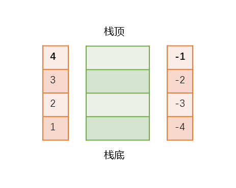

# 基础
全文基于lua5.1
## 栈

Lua和C语言数据交换, 有两个问题, 动态和静态类型之间区别, 自动和手动内存管理的区别
Lua设计了一个抽象的栈, 用于与其他语言数据交换, 栈中元素可以保存任何Lua类型的值



<!-- more -->

```c
// 一个栈里可以有不同类型的值，通过数据结构TValue保存
struct TValue
{
	Value value;   // 值
    int tt;        // 值类型
}

union Value
{
    GCObject* gc;   // 存需要回收的值
    void* p;        // lua中的light userdata结构
    lua_Number n;   // 存int或float
    int b;          // 存boolean
}

// number, boolean, nil, light userdata 直接存，不需要回收
// table, userdata、 函数、线程、和字符串 会自动回收
union GCObject
{
    GCHeader gch;
    union TString ts;
    union UData u;
    union Clourse cl;
    struct Table h;
    struct Proto p;
    struct UpVal uv;
    struct lua_State th;
}

```

## CAPI

> lua.h 基础函数, lua_ 开头, Lua没有定义全局变量, lua_State 动态结构保持所有状态
> lauxlib.h 辅助函数 luaL_ 开头, 基于基础函数api, 侧重解决具体业务
> lualib.h 定义了标准库, 用户可以包含这个文件, 来统一openlibs, 如 luaL_openlibs


### 压栈

```c++
// 入栈, 常量nil, 布尔, 双精度浮点, 整数
void lua_pushnil(lua_State* L); 
void lua_pushboolean(lua_State* L, int bool);
void lua_pushnumber(lua_State* L, lua_Number n);
void lua_pushinteger(lua_State* L, lua_Integer n);

// 入栈 零结尾字符串, Lua 对这个字符串做一次内存拷贝（或是复用一个拷贝），函数返回后s可释放
// 入栈 任意长度len字符串 
void lua_pushstring (lua_State *L, const char *s);
void lua_pushlstring(lua_State* L, const char* s, size_t len);

void lua_push(lua_State* L, const char* s);

// 将idx索引上的值的副本压入栈顶
void lua_pushvalue(lua_State* L, int index); 

// 将一个 C 函数压入堆栈
void lua_pushcfunction (lua_State *L, lua_CFunction f); 
typedef int (*lua_CFunction) (lua_State *L); 

// 把一个新的 C closure 压入堆栈
// 与函数关联的值被叫做 upvalue， 在函数被调用的时候访问的到
void lua_pushcclosure (lua_State *L, lua_CFunction fn, int n);

// light userdata 表示一个指针，一个像数字一样的值，没有独立的 metatable ，而且也不会被回收
void lua_pushlightuserdata (lua_State *L, void *p);

// 把 L 中提供的线程压栈。如果这个线程是当前状态机的主线程的话，返回 1
int lua_pushthread (lua_State *L);

// 把 t[k] 值压入堆栈， 这里的 t 是指有效索引 index 指向的值， 而 k 则是栈顶放的值
void lua_gettable (lua_State *L, int index);

// 把 t[k] 值压入堆栈，这里的 t 是指有效索引 index 指向的值
void lua_getfield (lua_State *L, int index, const char *k);

// 把全局变量 name 里的值压入堆栈
void lua_getglobal (lua_State *L, const char *name);
#define lua_getglobal(L,s)  lua_getfield(L, LUA_GLOBALSINDEX, s)

// 把给定索引指向的值的元表压入堆栈
// 如果索引无效，或是这个值没有元表，函数将返回 0 并且不会向栈上压任何东西
int lua_getmetatable (lua_State *L, int index);

// 从栈上弹出一个 key（键）， 然后把索引指定的表中 key-value（健值）对压入堆栈
// 如果表中以无更多元素， 那么 lua_next 将返回 0 （什么也不压入堆栈）
int lua_next (lua_State *L, int index);

// 典型用法遍历一张表
     /* table 放在索引 't' 处 */
     lua_pushnil(L);  /* 第一个 key */
     while (lua_next(L, t) != 0) {
       /* 用一下 'key' （在索引 -2 处） 和 'value' （在索引 -1 处） */
       printf("%s - %s\n",
              lua_typename(L, lua_type(L, -2)),
              lua_typename(L, lua_type(L, -1)));
       /* 移除 'value' ；保留 'key' 做下一次迭代 */
       lua_pop(L, 1);
     }

```
### 出栈

```c++
// 从堆栈中弹出 n 个元素
void lua_pop (lua_State *L, int n);

// 返回栈中元素个数
int lua_gettop(lua_State* L); 

// 从栈中弹出n个元素, 将栈顶设置到指定位置, 修改栈元素个数, 不足用nil补充, 多余的丢弃
void lua_settop(lua_State* L, int index);
#define lua_pop(L, n) lua_settop(L, -(n)-1) 

lua_settop(L, 0); // 特例清除栈

// 作一个等价于 t[k] = v 的操作，这里 t 是一个给定有效索引index 处的值，
// v 指栈顶的值，而 k 是栈顶之下的那个值, 从堆栈弹出k,v
void lua_settable (lua_State *L, int index);

// 等价于 t[k] = v 的操作，这里 t 是给出的有效索引index 处的值，而v 是栈顶的那个值。
// 从堆栈弹出栈顶值v
void lua_setfield (lua_State *L, int index, const char *k);

// 从堆栈上弹出一个值，并将其设到全局变量 name 中
void lua_setglobal (lua_State *L, const char *name);
  #define lua_setglobal(L,s)   lua_setfield(L, LUA_GLOBALSINDEX, s)

// 把一个 table 弹出堆栈，并将其设为给定索引处的值的 metatable
int lua_setmetatable (lua_State *L, int index);

// Lua 中数字的类型。确省是 double ，但是你可以在 luaconf.h 中修改它。
typedef double lua_Number;

//  从栈中获取一个值
int lua_toboolean(lua_State* L, int index);
lua_Number lua_tonumber(lua_State* L, int index);
lua_Integer lua_tointeger(lua_State* L, int index);
const char* lua_tolstring(lua_State* L, int index, size_t *len);
// 返回指定的索引处的值的长度
size_t lua_objlen(lua_State* L, int index);

```

### 数组

```c++
// 把 t[n] 的值压栈， 这里的 t 是指给定索引 index 处的一个值。它不会触发元方法。
void lua_rawgeti (lua_State *L, int index, int n);
// 等价于 t[n] = v， 这里的 t 是指给定索引 index 处的一个值， 而 v 是栈顶的值。不会触发元方法
void lua_rawseti (lua_State *L, int index, int n);

```

### 检查

```c++
// 确保堆栈上至少有 extra 个空位
// 如果不能把堆栈扩展到相应的尺寸，函数返回 false
// 这个函数永远不会缩小堆栈； 如果堆栈已经比需要的大了，那么就放在那里不会产生变化
int lua_checkstack (lua_State *L, int extra);

// 返回给定索引处的值的类型
// LUA_TNIL, LUA_TBOOLEAN, LUA_TNUMBER, LUA_TSTRING, LUA_TTHREAD, LUA_TUSERDATA, LUA_TFUNCTION
int lua_type (lua_State *L, int index);
// 返回 tp 表示的类型名
const char *lua_typename  (lua_State *L, int tp);

int lua_iscfunction (lua_State *L, int index);
int lua_isfunction (lua_State *L, int index);
int lua_islightuserdata (lua_State *L, int index);
int lua_isnil (lua_State *L, int index);
int lua_isnumber (lua_State *L, int index);
int lua_isstring (lua_State *L, int index);
int lua_istable (lua_State *L, int index);
int lua_isthread (lua_State *L, int index);
int lua_isuserdata (lua_State *L, int index);
int lua_lessthan (lua_State *L, int index1, int index2);
// 查询元素, 索引:1 入栈第一个元素, 2 入栈第二个元素; -1 栈顶元素, -2 
int lua_is(lua_State* L, int index);

```


```c++

void lua_remove(lua_State* L, int index);
void lua_insert(lua_State* L, int index);
void lua_replace(lua_State* L, int index);
```


### 创建

```c++
// 创建新的状态机;参数 f 是一个分配器函数;第二个参数 ud ，这个指针将在每次调用分配器时被直接传入
lua_State *lua_newstate (lua_Alloc f, void *ud);

// 创建一个空 table ，并将之压入堆栈
void lua_newtable (lua_State *L);

lua_newtable(L);//要给lua脚本返回一个table类型，先要new一个，压入栈顶
lua_pushnumber(L, 1); //将key先压入栈
lua_pushstring(L, "table2lua"); //再将value压入栈
lua_settable(L, -3);//settable将操作-2，-1编号的键值对设置到table中，并把key-value从栈中移除

// 创建一个新线程，并将其压入堆栈，并返回维护这个线程的 lua_State 指针
// 这个函数返回的新状态机共享原有状态机中的所有对象（比如一些 table），但是它有独立的执行堆栈
// 没有显式的函数可以用来关闭或销毁掉一个线程，靠垃圾回收
lua_State *lua_newthread (lua_State *L);

// 分配一块指定大小的内存块，把内存块地址作为一个完整的 userdata 压入堆栈，并返回这个地址
// 有着自己的元表，而且它在被GC回收时，可以被监测到
void *lua_newuserdata (lua_State *L, size_t size);
```


### 函数注册

```c++
// 把 C 函数 f 设到全局变量 name 中
void lua_register (lua_State *L,
                   const char *name,
                   lua_CFunction f);
#define lua_register(L,n,f) \
    (lua_pushcfunction(L, f), lua_setglobal(L, n))
```


### 函数调用

```c++
void lua_call (lua_State *L, int nargs, int nresults);
// case
     lua_getfield(L, LUA_GLOBALSINDEX, "f");          /* 将调用的函数 */
     lua_pushstring(L, "how");                          /* 第一个参数 */
     lua_getfield(L, LUA_GLOBALSINDEX, "t");          /* table 的索引 */
     lua_getfield(L, -1, "x");         /* 压入 t.x 的值（第 2 个参数）*/
     lua_remove(L, -2);                           /* 从堆栈中移去 't' */
     lua_pushinteger(L, 14);                           /* 第 3 个参数 */
     lua_call(L, 3, 1); /* 调用 'f'，传入 3 个参数，并索取 1 个返回值 */
     lua_setfield(L, LUA_GLOBALSINDEX, "a");      /* 设置全局变量 'a' */

lua_pcall (lua_State *L, int nargs, int nresults, int errfunc);

// lua_CFunction
     static int foo (lua_State *L) {
       int n = lua_gettop(L);    /* 参数的个数 */
       lua_Number sum = 0;
       int i;
       for (i = 1; i <= n; i++) {
         if (!lua_isnumber(L, i)) {
           lua_pushstring(L, "incorrect argument");
           lua_error(L);
         }
         sum += lua_tonumber(L, i); /* 取值 */
       }
       lua_pushnumber(L, sum/n);   /* 第一个返回值 */
       lua_pushnumber(L, sum);     /* 第二个返回值 */
       return 2;                   /* 返回值的个数 */
     }
```


# 应用
## C调用lua文件中的变量/函数

```c++
// lua文件
width = 30
height = 80

// c应用
void load(lua_State* L, int* w, int* h)
{
  if(luaL_loadfile(L, fname) || lua_pcall(L, 0, 0, 0))
    error(L, "cannot run config file %s", lua_tostring(L, 0));
  lua_getglobal(L, "width");
  lua_getglobal(L, "height");
  
  *w = lua_tointeger(L, -2);
  *h = lua_tointeger(L, -1);
}

// table, 获取全局变量backgroud, 确认类型, get_field获取值
backgroud = {r=1, g=2, b=3}

  if(luaL_loadfile(L, fname) || lua_pcall(L, 0, 0, 0))
    error(L, "cannot run config file %s", lua_tostring(L, 0));
	
  lua_getglobal(L, backgroud);
  if(!lua_istable(L, -1))
    error(L, " is not a table");

  red = getfield(L, "r")
  ...
  
// c 调用lua函数
function f (x, y)
  return x*y;
end

void f(int x, int y)
{
  // 压入函数和参数
  lua_getglobal(L, f);
  lua_pushinteger(L, 1);
  lua_pushinteger(L, 20);
  
  // 调用lua函数
  if(lua_pcall(L, 2, 1, 0) != 0)
    error(...)
  
  // 检查结果
  if(lua_isinteger(L, -1) == 0)
	int z = lua_tointeger(L, -1);
  else
    return -1;
    
  // 清除结果
  lua_pop(L, -1);
  return z;
}

```


## Lua调用C函数

```c++
// 定义c函数
static int l_sin(lua_State* L)
{
  double d = luaL_checknumber(L, 1);
  lua_pushnumber(L, sin(d));
  return 1;
}

// lua调用
lua_pushfunction(L, l_sin);
lua_setglobal(L, "mysin");

// 获取目录路径
static int l_dir(lua_State* L)
{
  ...
  lua_newtable(L);
  int i=1;
  while((entry = readdir(dir)) != NULL)
  {
    lua_pushnumber(L, i++); // 压入KEY
	lua_pushstring(L, entry->dname); // 压入value
	lua_settable(L, -3);
  }
  ...
}

```


## Lua调用C模块

```c++
// 1. 定义C模块函数
static int l_dir(lua_State* L)
{...}

// 2. 声明数组, 包含字符串名称和函数指针
static const struct LuaL_Reg mylib[] = {
  {"dir", l_dir},
  {NULL, NULL}
}

// 3. 声明一个主函数
int luaopen_mylib()
{
  luaL_register(L, mylib);
  return 1;
}

// 4. lua调用so 或 重新编译添加到标准库列表中打开
require "mylib"

luaL_openlibs 打开标准库列表(linit.c)
```


# 编写C函数技巧
## 数组/字符串操作

```
// 数组操作, index 表示 table 在栈里的位置, key 表示元素在table中的位置(从1开始)
// 取值, stack[index][key]
void lua_rawgeti(lua_State* L, int index, int key);
// 赋值, 将栈顶的值赋值到 stack[index][key]
void lua_rawseti(lua_State* L, int index, int key);

-- 定义一个全局table
LanguagesTable = 
{
    "lua",
    "c",
    "c++",
    "java",
    "python",
}

//-- 定义一个打印函数
function func_printarray()
    print("\n");
    for index,value in pairs(LanguagesTable) do
        print("["..index.."] = ".. value);
    end
end

//-- c++代码
lua_State *L = lua_open();
luaL_openlibs(L);

luaL_dofile(L,"rawgetitest.lua");   // 加载执行lua文件
lua_getglobal(L,"LanguagesTable");  // 将全局表压入栈


lua_rawgeti(L, -1, 2);              // 取LanguagesTable[2]的值, -1 是栈中位置
if(lua_isnil(L, -1))
{
	printf("c++ --> [2] = nil\n");
}
else
{
	printf("c++ --> [2] = %s\n", lua_tostring(L, -1)); // 输出 c
}
lua_pop(L,1);                       // 弹出栈顶变量


lua_getglobal(L, "func_printarray");// 改变之前先调用打印函数，查看原数组
lua_pcall(L, 0, 0, 0);              // 输出 LanguagesTable 一共5个元素

lua_pushstring(L, "php");           // 将要赋值的结果压入栈
lua_rawseti(L, -2, 4);              // 赋值操作, -2是table在栈中位置

lua_pushstring(L, "swift");         // 将要赋值的结果压入栈
lua_rawseti(L, -2, 8);              // 赋值操作, -2是table在栈中位置

lua_getglobal(L, "func_printarray");// 改变之后再调用打印函数，查看改变后的结果
lua_pcall(L, 0, 0, 0);              // LanguagesTable[4] = php, LanguagesTable[8] = swift, 一共6个元素

lua_close(L);                       //关闭lua环境  


// ------------------------------
// 把s[i, j]子串传递给lua
lua_pushlstring(L, s+i, j-i+1);

```


## 在C函数中保存状态
C API提供3中方式：注册表(全局table, 多个模块共享), 环境(模块私有数据), upvalue(在特定函数中可见)

### 注册表
```
// 获取全局变量
lua_getfield(L, LUA_REGISTRINDEX, "KEY");

// 创建一个唯一的key, 取值
int r = luaL_ref(L, LUA_REGISTRINDEX);
lua_rawgeti(L, LUA_REGISTRINDEX, r);

// 释放引用和该值
luaL_unref(L, LUA_REGISTRINDEX);

// 保存字符串
static char KEY = 'key'
lua_pushlightuserdata(L, (void*)&KEY);
lua_pushstring(L, myStr);
lua_settable(L, LUA_REGISTRINDEX);

// 检索一个字符串
lua_pushlightuserdata(L, (void*)&KEY);
lua_gettable(L, LUA_REGISTRINDEX);
myStr = lua_tostring(L, -1);
```

### 环境
在本模块中可见
```
{
  lua_newtable(L);
  lua_replace(L, LUA_ENVIRONINDEX);
  luaL_register(L, "name", tab); // 创建一个name的table, 用tab去填充
}
```

### upvalue
相当于一个静态变量, 在一个特性函数中可见
```

```

# 用户自定义类型

[参考](https://www.cnblogs.com/sifenkesi/p/3897245.html)
## userdata
```
// 申请指定大小内存, 压栈,  返回内存地址
void* lua_newuserdata(lua_State* L, size_t size);
CUser* p = (CUser*)lua_touserdata(L, 1);

// 检查 cond 是否为真。如果不为真，以标准信息形式抛出一个错误
void luaL_argcheck (lua_State *L,
                    int cond,
                    int arg,
                    const char *extramsg);
```

## 元素
怎么确第一个参数就是我们想要的数组userdata, 不是其他的userdata?
用名称来标记
```
// 如果registry已经有tnme键值，则函数返回0; 否则创建一个[tname, metatable]，并放入registry，并返回1。
int luaL_newmetatable (lua_State *L, const char *tname);

// 获取registry中的tname对应的metatable，并入栈
int luaL_getmetatable (lua_State *L, const char *tname);

// 将栈顶对象的metatable设置为registry表中键tname对应的值
void luaL_setmetatable (lua_State *L, const char *tname);

// 检查栈的指定位置是否为元表，并且是否具有和指定名称相匹配的表
void* luaL_checkudata(lua_State*L,int index,const char*tname);

// 注意区分
void lua_setmetatable (lua_State *L, int index);
int lua_getmetatable (lua_State *L, int index);
```

## 轻量级
用户管理内存, 保持指针
void lua_pushlightuserdata(lua_State* L, void* p);


# 多线程
多线程的目的是为了协同程序, 挂起某些程序的执行, 并在稍后恢复。
从C API角度看, 一个线程一个栈; 
只要创建一个Lua状态, 就会自动在这个状态中创建一个线程。

```
// L1 以一个空栈进行运行, L 的栈顶就是这个新线程
lua_State* L1 = lua_newstate(L);

printf("%d\n", lua_gettop(L1));  --> 0
printf("%d\n", lua_typename(L)); --> thread

// L1 会被垃圾回收
lua_pop(L1);   

// 执行函数或在lua_yield后恢复
lua_resume(lua_State* L, int narg);
// 挂起lua调用成, 也就是C程序
lua_yield(L, nres);

// 线程之间数据交换
lua_pushstring(L2, lua_tostring(L1, 1));

```

# 内存管理
垃圾回收，原子操作


