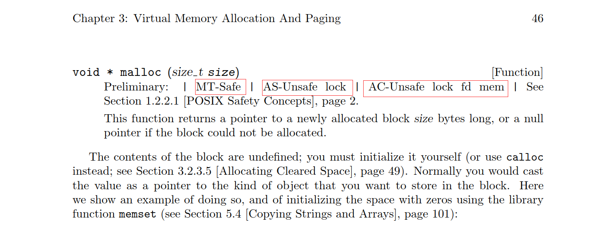

# 进程bt信息
<! -- more -->
```
(gdb) bt
#0  0x00007ff5083f65cb in __lll_lock_wait_private () from /lib64/libc.so.6
#1  0x00007ff508382bca in _L_lock_10550 () from /lib64/libc.so.6
#2  0x00007ff508380705 in malloc () from /lib64/libc.so.6
#3  0x00007ff5086bdc47 in start_fde_sort (count=33, accu=0x7ff4cab0b1a0) at ../../../libgcc/unwind-dw2-fde.c:409
#4  init_object (ob=0x7ff4babf1be0 <current_sl>) at ../../../libgcc/unwind-dw2-fde.c:771
#5  search_object (ob=ob@entry=0x7ff4babf1be0 <current_sl>, pc=pc@entry=0x7ff5086bca07 <_Unwind_Backtrace+55>)
    at ../../../libgcc/unwind-dw2-fde.c:961
#6  0x00007ff5086be492 in _Unwind_Find_registered_FDE (bases=0x7ff4cab0b528, 
    pc=0x7ff5086bca07 <_Unwind_Backtrace+55>) at ../../../libgcc/unwind-dw2-fde.c:1025
#7  _Unwind_Find_FDE (pc=0x7ff5086bca07 <_Unwind_Backtrace+55>, bases=bases@entry=0x7ff4cab0b528)
    at ../../../libgcc/unwind-dw2-fde-dip.c:448
#8  0x00007ff5086baee6 in uw_frame_state_for (context=context@entry=0x7ff4cab0b480, fs=fs@entry=0x7ff4cab0b2d0)
    at ../../../libgcc/unwind-dw2.c:1241
#9  0x00007ff5086bc130 in uw_init_context_1 (context=context@entry=0x7ff4cab0b480, 
    outer_cfa=outer_cfa@entry=0x7ff4cab0b730, outer_ra=0x7ff5083f6f46 <backtrace+86>)
    at ../../../libgcc/unwind-dw2.c:1562
#10 0x00007ff5086bca08 in _Unwind_Backtrace (trace=0x7ff5083f6dd0 <backtrace_helper>, 
    trace_argument=0x7ff4cab0b730) at ../../../libgcc/unwind.inc:283
#11 0x00007ff5083f6f46 in backtrace () from /lib64/libc.so.6
#12 0x00007ff508324d52 in backtrace_and_maps () from /lib64/libc.so.6
#13 0x00007ff5083777ff in __libc_message () from /lib64/libc.so.6
#14 0x00007ff50837d06e in malloc_printerr () from /lib64/libc.so.6
#15 0x00007ff50837d32c in malloc_consolidate () from /lib64/libc.so.6
#16 0x00007ff50837e588 in _int_malloc () from /lib64/libc.so.6
#17 0x00007ff508380710 in malloc () from /lib64/libc.so.6
#18 0x00007ff508c59258 in operator new (sz=sz@entry=1024) at ../../../../libstdc++-v3/libsupc++/new_op.cc:50
#19 0x00007ff50a0ccc0d in allocate (this=0x7ff4b085a878, __n=<optimized out>)
    at /usr/local/gcc-5.5.0/include/c++/5.5.0/ext/new_allocator.h:104
#20 allocate (__a=..., __n=<optimized out>) at /usr/local/gcc-5.5.0/include/c++/5.5.0/bits/alloc_traits.h:491
#21 _M_allocate (this=0x7ff4b085a878, __n=<optimized out>)
    at /usr/local/gcc-5.5.0/include/c++/5.5.0/bits/stl_vector.h:170
#22 std::vector<std::__cxx11::basic_string<char, std::char_traits<char>, std::allocator<char> >, std::allocator<std::__cxx11::basic_string<char, std::char_traits<char>, std::allocator<char> > > >::_M_emplace_back_aux<std::__cxx11::b---Type <return> to continue, or q <return> to quit---
asic_string<char, std::char_traits<char>, std::allocator<char> > >(std::__cxx11::basic_string<char, std::char_traits<char>, std::allocator<char> >&&) (this=0x7ff4b085a878)
    at /usr/local/gcc-5.5.0/include/c++/5.5.0/bits/vector.tcc:412
#23 0x00007ff4fdaab81d in push_back (
    __x=<unknown type in /data01/zjgrp/zjv8cs2/lib/libjsoncppD.so, CU 0x2217a, DIE 0x35d11>, this=0x7ff4b085a878)
    at /usr/local/gcc-5.5.0/include/c++/5.5.0/bits/stl_vector.h:932
#24 Json::Value::resolveReference (this=0x7ff4b085a870, key=0x7ff4c428ca30 "list_12_BONUS_INFO_LIST", 
    isStatic=isStatic@entry=false) at src/lib_json/json_value.cpp:1052
#25 0x00007ff4fdaab947 in Json::Value::operator[] (this=<optimized out>, key=<optimized out>)
    at src/lib_json/json_value.cpp:1034
#26 0x00007ff4fe2f820f in sdl::JsonEncoder::PutListBegin (this=0x7ff4af3479d0, 
    szListName=0x7ff4d0880501 "BONUS_INFO_LIST", iSize=<optimized out>) at src/codec_json.cpp:1054
#27 0x00007ff5012cd013 in sdl::visitor::encode_list_vector (pEncoder=0x7ff4af3479d0, sdltype=<optimized out>, 
    pVal=0x7ff4cab0c830, name=0x7ff4d0880501 "BONUS_INFO_LIST") at src/sdl_stream.cpp:897
#28 0x00007ff5012ccdf5 in sdl::visitor::encode_struct (pEncoder=0x7ff4af3479d0, sdltype=<optimized out>, 
    pVal=0x7ff4cab0c710, name=<optimized out>) at src/sdl_stream.cpp:874
#29 0x00007ff4d0fcd31d in visit (p=0x7ff4cab0c710, sdltype=11, this=0x7ff4cab0c530)
    at /data01/zjgrp/zjv8bm/ob_rel/include/public/sdl/sdl_stream.h:311
#30 operator<< (v=..., this=0x7ff4cab0c530) at /data01/zjgrp/zjv8bm/ob_rel/include/public/sdl/sdl_stream.h:365
#31 charging::dump_xdr<MRatmsInterfaceRatingDef::SRatingUpdate> (data=..., level=1) at ../base/dump_xdr.h:16
#32 0x00007ff4d0fdf43d in charging::CMdbOperatorChain::Update (this=0x7ff4c429f130, xdr=..., subXdr=..., 
    baseData=...) at mdb_operate_chain.cpp:99
#33 0x00007ff4d274325a in charging::CRevRatingAlgo::risk_addup_charge (this=this@entry=0x7ff4c41feef0, xdr=..., 
    subXdr=..., pData=pData@entry=0x7ff4cab0cef0) at RiskRatingAlgo.cpp:336
#34 0x00007ff4d2743b4d in charging::RiskRatingAddupAlgo::DoIt (this=0x7ff4c41feef0, xdr=..., subXdr=..., 
    pData=0x7ff4cab0cef0) at RiskRatingAlgo.cpp:443
#35 0x00007ff4d274afca in charging::CRatingInterface::rating_algo (this=this@entry=0x7ff4cab0d787, listXdr=..., 
    algoType=algoType@entry=7, pSession=pSession@entry=0x7ff4c4019b90) at ratingInterface.cpp:57
#36 0x00007ff4d27561c7 in MRatingApp::CIRatingAppImp::risk_addup (this=this@entry=0x7ff4cab0d7f0, 
    pSession=pSession@entry=0x7ff4c4019b90, listXdr=..., cErrorMsg=...) at rating_sdl_i.cpp:78
#37 0x00007ff4d2752fcf in MRATINGAPP_IRATINGAPP_RISK_ADDUP (pSession=pSession@entry=0x7ff4c4019b90, in=..., 
    out=..., pErrorMsg=pErrorMsg@entry=0x1d79c18) at rating_imp.cpp:184
#38 0x00007ff4db5d145f in tp::AppLib::ExecIntf (
---Type <return> to continue, or q <return> to quit---
    funcHandle=funcHandle@entry=0x7ff4d2752d60 <MRATINGAPP_IRATINGAPP_RISK_ADDUP(sdl::SdlSession*, sdl::CSdlBasicParamObject&, sdl::CSdlBasicParamObject&, sdl::CSdlErrorMsg*)>, 
    pIntfName=pIntfName@entry=0x1a40270 "MRATINGAPP_IRATINGAPP_RISK_ADDUP", 
    pSession=pSession@entry=0x7ff4c4019b90, paramIn=..., paramOut=..., cErrorMsg=...) at tp_interface.cpp:38
#39 0x00007ff4db5d7fad in tp::Service::ExecService (this=this@entry=0x1a38b40, pRet=pRet@entry=0x1d7aec8, 
    pAttr=pAttr@entry=0x1d7aef0) at tp_service.cpp:74
#40 0x00007ff4f81a5d1f in tp::RpcReqProcess::ProcessRpcTask (this=this@entry=0x1d79970, 
    pReqMsg=pReqMsg@entry=0x7ff4cab0e250, pResMsg=pResMsg@entry=0x7ff4cab0e260, pService=0x1a38b40)
    at rpc_proc.cpp:121
#41 0x00007ff4f81a625f in tp::RpcReqProcess::ProcessRpcReq (this=this@entry=0x1d79970, 
    pRpcReq=pRpcReq@entry=0x7ff4cab0e250, pRpcResp=pRpcResp@entry=0x7ff4cab0e260) at rpc_proc.cpp:208
#42 0x00007ff4f81a6aa4 in tp::RpcReqProcess::Run (this=0x1d79970, inMsg=..., outMsg=...) at rpc_proc.cpp:62
#43 0x00007ff4f81a2553 in tp::SCB4DirectProc::OnReadable (this=0x1d8aa10, pChannel=0x7ff4b40020b0)
    at event_proc.cpp:39
#44 0x00007ff506dc1394 in OnChannelEvent (ops=1, pChannel=0x7ff4b40020b0, this=0x1d841e0)
    at src/cdk_rpc_socket_server.cpp:109
#45 cdk::rpc::SocketServer::SocketServerImpl::OnEvent (this=0x1d841e0, hSock=<optimized out>, ops=1, 
    pArg=<optimized out>) at src/cdk_rpc_socket_server.cpp:87
#46 0x00007ff507636cc4 in cdk::io::EventLoop2::EventCallback (fd=29, events=<optimized out>, arg=0x1d8a490)
    at src/linux/../cdk_os_io_eventloop2.h:93
#47 0x00007ff50232ecbb in event_persist_closure () from /data01/zjgrp/zjv8cs2/lib/libevent-2.0.so.5
#48 0x00007ff50232ee31 in event_process_active_single_queue () from /data01/zjgrp/zjv8cs2/lib/libevent-2.0.so.5
#49 0x00007ff50232f100 in event_process_active () from /data01/zjgrp/zjv8cs2/lib/libevent-2.0.so.5
#50 0x00007ff50232f79b in event_base_loop () from /data01/zjgrp/zjv8cs2/lib/libevent-2.0.so.5
#51 0x00007ff507635f7a in cdk::io::EventLoop2::Run (this=0x1d8a490, timeout=<optimized out>)
    at src/linux/../cdk_os_io_eventloop2.h:184
#52 0x00007ff506dc044c in cdk::rpc::SocketServer::Run (this=0x1d841c0, iTimeout=iTimeout@entry=5000)
    at src/cdk_rpc_socket_server.cpp:362
#53 0x00007ff4f81a8c0e in tp::RpcServerRunnable::Run (this=0x1d84140) at rpc_server_imp.cpp:357
#54 0x00007ff50a0dbde6 in cdk::Thread::Run (this=0x1d8caa0) at src/cdk_thread.cpp:118
#55 0x00007ff50a0dc719 in cdk::ExecFunc (pData=0x1d8caa0) at src/cdk_thread.cpp:35
#56 0x00007ff509a6f0a4 in start_thread () from /lib64/libpthread.so.0
#57 0x00007ff5083ea04d in clone () from /lib64/libc.so.6
```

# malloc原理分析

## libc库版本和源码
```
52_zjdev[/data01/zjgrp/zjdev]%ls -ltr /lib64/libc.so.6
lrwxrwxrwx 1 root root 12 1月  23 2018 /lib64/libc.so.6 -> libc-2.19.so
```

[glibc源码下载](http://www.gnu.org/software/libc/sources.html)

[API手册](http://www.gnu.org/software/libc/manual/)

## malloc 



> MT-Safe Multi Thread 多线程安全
> AS-Safe Async Singal 异步信号不安全
> AC-Safe Async Cancel 异步取消不安全

## 内存管理

## 源码分析


