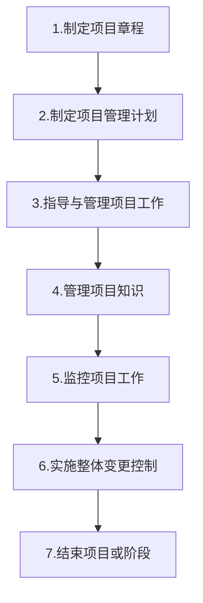
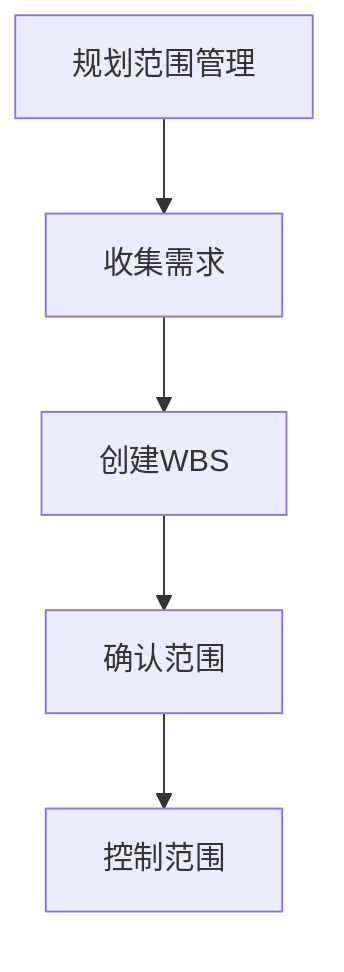
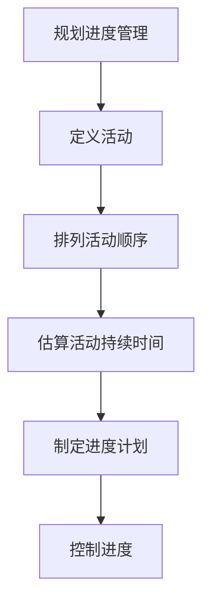
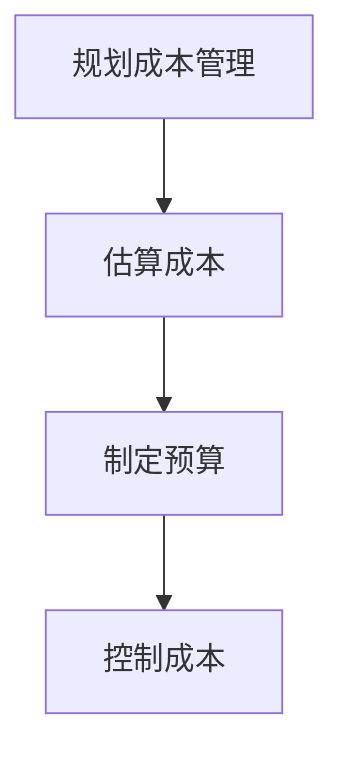
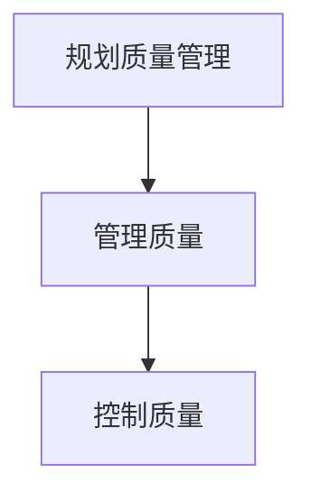
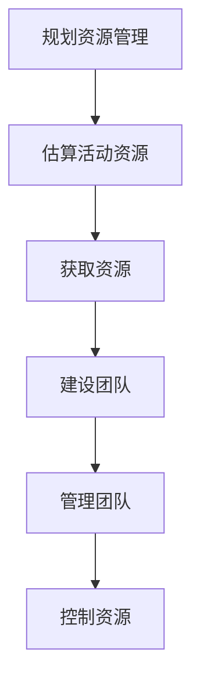
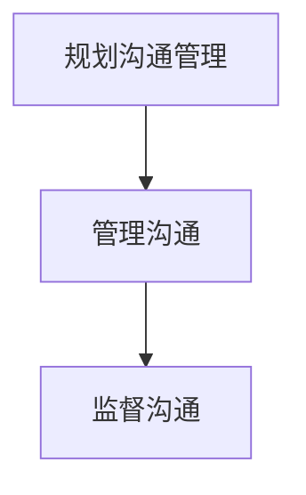
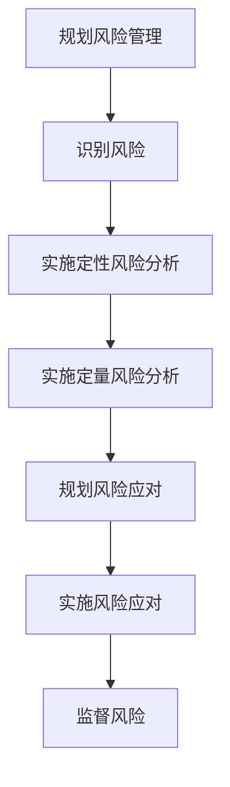
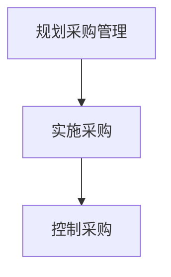
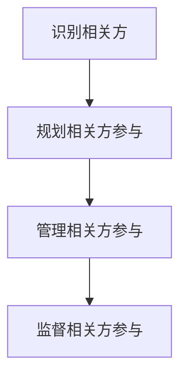

# 第一章 引论

1） 组织项目管理：

项目=> 项目集(成果交付)=> 项目组合管理(价值决策)=> 运营(商业价值实现)

2） 项目和开发生命周期

预测(瀑布)，迭代，增量，适应(敏捷，快速变更)，混合

3）项目生命周期：开始项目，组织与准备，执行项目工作，结束项目

​	项目管理过程：输入+工具与技术=输出

​	项目管理过程组：启动过程(定义)，规划过程(明确范围和目标)，执行过程(完成任务)，监控过程(跟踪进展和绩效)，收尾过程(结束)

​	项目管理知识领域：整合管理，范围管理，进度管理，成本管理，质量管理，资源管理，沟通管理，风险管理，采购管理，相关方管理

​	项目管理数据和信息：工作绩效数据(工作量化数据-输入)， 工作绩效信息(成果状态，变更请求落实情况，预测估算完工-输出)，工作绩效报告(信息汇总输出)

4）商业文件：
__项目商业论证__(可行性研究，内容包括业务需要，形式分析，推荐，评估)；
__项目效益管理计划__(内容包括 目标，战略，时限，测量指标，风险)。项目发起人制定和维护，项目经理负责提供建议和见解，并保持一致目标；

# 第二章 项目的运行环境

事业环境因素，
组织过程资产

# 第三章 项目经理的角色

醒目管理办公室(PMO)，分为三类：支持型，控制型，指令型。可以终止项目，审计，跨项目沟通协调。
职能经理：专注于某个职能领域或业务部门的管理和监督
运营经理：负责保证业务的高效性
项目经理：由执行组织委派，领导团队实现项目目标的个人

PMI人才三角：技术项目管理，领导力，战略和商务管理

# 第四章 项目整合管理

制定项目章程=>制定项目管理计划=>

# 1 项目整合管理

# 2 项目范围管理

# 3 项目进度管理

# 4 项目成本管理

# 5 项目质量管理

# 6 项目资源管理

# 7 项目沟通管理

# 8 项目风险管理

# 9 项目采购管理

# 10 项目相关方管理

# 错题笔记

## 第六章 项目进度管理

1. 资源平衡和资源平滑区别

|                | 资源平衡                                         | 资源平滑                         |
| -------------- | ------------------------------------------------ | -------------------------------- |
| 对关键路径影响 | 有影响(一般是延长)                               | 无影响                           |
| 使用情景       | 资源在特定时间内可用，资源数量限制，资源过度分配 | 不均寻使用资源，超出资源数量限制 |
| 使用时间点     | 一般在关键路径法之后，资源平滑之前               | 在资源平衡之后开展               |
| 调整对象       | 一般针对关键资源                                 | 一般针对非关键资源               |

2. 哪个活动会减少时间？减少时间，即压缩进度。增加风险的进度压缩技术是快速跟进。

3. 项目关键路径：时间最长的线条

4. 项目未能实现一个里程碑存在进度偏差，领导担忧。项目经理展示 啥?
   应展示进度相关计划，项目章程中的里程碑计划，专门展示进度。
   WBS里的里程碑强调范围，没有进度概念。

## 第7章 项目成本管理

挣值分析记忆

| 缩写 | 原文         | 名称             | 说明                                                  |
| ---- | ------------ | ---------------- | ----------------------------------------------------- |
| PV   | Plan value   | 计划价值         | 为计划工作经批准的预算                                |
| EV   | Earned value | 挣值             | 已完成计划的价值之和(批准的预算)                      |
| AC   | Actual cost  | 实际成本         | 某个时间点已完成工作的实际成本                        |
| BAC  |              | 完工预算         | 为将要执行的工作所建立的预算总和                      |
|      |              |                  |                                                       |
| CV   |              | 成本偏差         | EV-AC                                                 |
| SV   |              | 进度偏差         | EV-PV                                                 |
| VAC  |              | 完工偏差         | BAC-EAC                                               |
|      |              |                  |                                                       |
| CPI  |              | 成本绩效指数     | EV/AC                                                 |
| SPI  |              | 进度绩效指数     | EV/PV                                                 |
|      |              |                  |                                                       |
| EAC  |              | 完工估算         | 完成所有工作预期总成本，截至目前实际成本+完工尚需估算 |
| ETC  |              | 完工尚需估算     |                                                       |
| TCPI |              | 完工尚需绩效指数 |                                                       |

## 第8章 项目质量管理

1 质量标准不一致，采用客户的标准

2 

1. 团队成员和客户沟通；要确保所有客户交互与批准的沟通管理计划保持一致

2. 项目交接，很难对付的相关方；完成相关方分析，更新相关方参与计划

3. 项目经理在被要求时才报告KPI；在该时间投入的重要性方面，对项目经理进行培训

4. 项目A可交付，项目B希望学习项目A进行外部会议，但没预算。谁受益，谁花钱。提出对额外资金的变更请求，以便举行该会议。

5. 项目处于收尾阶段，用户提出功能变更请求。当前项目先收尾，其次选择变更。

6. 年度绩效会议，一个重要相关方可能被排除在外。执行相关方分析，并更新相关方登记造册(解决)。

7. 项目需要专业知识超出公司能力，无法为精确的工作说明书获得足够的信息。采用 工料(T&M) 合同，寻求外部援助。

8. 沟通三种方式：互动式，推式，拉式。达成一致意见，互动式最好。

9. 预期货币价值(EMV)=风险影响*风险概率  ；增加1000元，发生概率50%，则是-1000 x 50%

10. 外包质量有问题，项目经理怎么提高服务质量。采购问题，找合同。提交变更请求，将资源的技能质量标准乃入合同

11. 一家外部金融机构在项目执行期间成为新的关键相关方。重点管理。

    相关方分析工具：
    权利大、利益高：重点管理
    权利大、利益低：令其满意
    权利小、利益高：随时告知
    权利小、利益小：监督

12. 绩效数据优先顺序；帕累托图 --排序缺陷，纠正错误

    控制图：：①诊断：评估一个过程的稳定性。②控制：决定某一过程何时需要调整，何时需要保持原有状态

    散点图：显示两个变量（因变量、自变量）的关系，用于发现两个参数之间的关系

    因果图

13. 在项目技术团队审核期间，先前识别的一个风险已经通过审核。一个已识别的风险没有发生，怎么办？

    风险登记册中标记关闭，减少相关应急储备

1. 项目执行阶段，某签约公司绩效低下，未能达到预期。供应商不符合要求，必须解决问题。确定造成该问题的根本原因

2. 在某个项目中，相关方负责与供应商的关系，项目经理负责交付结果。供应商抱怨了一些问题，项目经理怎么做？不论抱怨什么，都属于相关方的问题，应该管理相关方。供应商存在冲突的时候组织三方讨论会

3. 风险登记册中记录了一项风险，某种材料价格会上涨。某风险在风险监管期间发生了变化，应进行风险再评估。重新评估该风险的影响和战略

4. 测试、开发、产品远程工作，故障增加。虚拟团队，不正规的需求沟通导致故障增加。首选沟通管理计划

5. 项目进度计划的输入：范围、里程碑列表、活动清单

6. 开展项目，项目必须符合某项被忽略的监管要求。忽略事业环境因素，先分析影响。选 寻求理解该监管要求，相当于分析

7. 项目质量需求已被识别，正在测试和评估。项目经理要对测试结果和质量需求进行对比，确保结果被接受。

   质量控制过程，就是检查。尚未完成，只能选 质量审查

8. 项目执行6个月后被终止，项目经理该做什么？不论项目正常或异常终止，都要进行项目收尾

9. 如何确认资源有没收到影响，应该查看资源日历，或项目团队派工单，

10. 开工会议(kick-off meeting) ，有时差，不能同时参与。团队成员必须要参加，但可以分别召开

11. 运营和项目团队分别报告一个供应商产品问题。项目管理在任务分配时强调单点责任，选 定义清晰的执行、负责、咨询和知情矩阵
12. 在项目启动阶段，事业环境因素变更对预算产生影响，完成工作范围事项不切实际。识别到项目可行性问题，首先上报发起人
13. 供应未及时交付重要材料，可能延迟进度计划。该情况属于风险识别或发生，应分析影响，采取风险应对措施。
14. 交互式沟通，会受到反馈
15. 新项目，项目启动相关
16. 政府新规影响项目，标准程序是：记录问题日志，上报发起人。

1. 用户正在力图影响项目的进展方向。相关方阻碍项目，应管理相关方。选择 采取冲突解决措施
2. 项目经理发现质量问题，应该采取 正面 和 书面 沟通，避免扯皮
3. 相关方不熟悉敏捷开发，抱怨，并要求优先开展未来一项工作。敏捷开发由项目成员根据规划任务优先级确定。团队成员没有考虑相关方意见，属于相关方参与计划。
4. 项目章程输入：创建假设日志，记录高层级的战略和和运营制约因素。比较契合题目提到的战略
5. 项目三个月要交付，为确保目标怎么办？分析【确保实现目标，查看、参考之前的经验教训，或利用公司组织过程资产。强调项目目标的两个考点：指定项目章程和开工会议。】选择 确定关键成功因素和高层及交付战略
6. 质量成本考虑，质量不测最划算的。选择 未达到(质量)的一致性成本低于 达到的一致性成本，补偿5%的故障率
7. 项目发起人告知项目要保密，项目文件直接交付给他们。分析【一般入库，后续借鉴，需保密，应遵循发起人请求】选择 将发起人请求告知审计团队
8. 项目收尾，必须总结经验教训。
9. 资源平滑不改变工期，资源平衡延长进度，调整完工日期，改变工期。
10. 项目执行期间，关键成员辞职。分析【分析对项目影响，再确定应对措施】选 提出项目问题，分析影响，并制定缓解计划

1. 如何识别相关方？分析【用什么工具】选 相关方分析

2. 某个项目落后进度计划，职能部门经理将其他项目优先安排。公司要求项目经理采用一种组织结构，避免再次发生，项目经理应该怎么做？选 从职能变为强矩阵，因为项目经理对资源有更多控制

3. 团队分散各个区域，项目经理难以执行一个持续改进要去。项目经理应该怎么办？

   分析【收集需求工具】，选择 问卷调查 ，受众多，分散、快速、统计分析

4. 虚拟团队沟通问题。分析【促进沟通】选 轮流安排会议，以便团队成员之间互动

5. WBS缺失，范围缺少。分析【补充范围】选 提出变更请求，分析对范围的影响

6. 在项目启动阶段，项目经理被要求更短的时间表，但不切实际。分析【发起人提要求，管理相关方】

   选 与相关方开会，。。。。达成一致意见

7. 发现成本超支后，找原因，预测对最终预算影响。选 查看商业论证确定盈利状态，必要时建议变更

8. 总结经验教训的好处，对未来工作改进

9. 关键资源无法投入所需时间，实际落后进度计划。选择 参照相关方登记造册，解决资源优先级问题

10. 客户要求缩短最长耗时任务。选 向客户展示关键路径，并鼓励他们聚焦缩短这些活动时间

11. 质量要求定义 “尽可能高”。质量要求必须可量化，需重新制定。

12. 三年的项目要求一年完成。分析原因，选 理解更短时间内完成项目原因

13. 采购团队导致关键人物路径延期。分析【相关方参与问题，应尽早参与】选 与采购团队开会讨论这些需求

14. 项目经理开展一个未完成的项目，识别 高层级，假设和制约因素。分析【制定项目章程输入】 选 分析业务文件

15. 项目经理与智能部门经理 就范围 没有达成一致。分析【相关方反对，阻碍，应该说服】 选择 将范围内的分歧问题记录，并分别进行管理

16. 

模拟一：

1. 地震导致项目截止日期推迟，项目团队面临着不降低质量情况下将影响降至最低压力。若要确保维持质量，怎么办？分析【确保维持质量】，选择 遵循质量管理计划，同时快速跟进该项目

2. 与发起人协商后，项目经理制定了项目管理计划。下一步应该做什么？

   选 让项目相关方参与，以更新该计划

3. 审查项目章程，认为范围过于宽松，下一步做什么？分析【项目边界问题，找相关方收集需求，高层级属于项目章程】选 访谈相关方，识别高层需求

4. 分析【项目目标，获得承诺，角色与职责，都是开工大会】

5. 采购结束前需要审计，采购工作完成，应该更新经验教训登记册

6. 优势、劣势、机会与威胁(SWOT)分析，是识别风险工具

7. 项目经理发现存在多个具有相互竞争需求的业务领域。获得相关方共识，应该做什么？

   分析【多方意见冲突，开会引导】选 与相关方开会，以获得必要信息

8. WBS缺少依赖关系以及所需资源信息。若要评估项目持续时间，怎么做？

   分析【WBS字典内容】

9. 难以找到技术熟练的资源，他们产生了高额的成本。应该做什么？分析【识别成本偏差，先预测，再分析影响】选 分析增加成本对总体预算的影响

10. 估算一个新项目的成本，希望利用之前项目的成本估算。应该审查那一份文件？分析【项目成本数据，收尾报告有】

11. 新法规影响项目进度和预算，开始规划项目阶段前，应该怎么做？分析【项目早期识别的风险，一般纳入项目章程。识别假设条件更好】选 将该风险包含在项目章程中

12. 在经验教训会议上，团队反馈非常低，怕影响奖金。怎么做？选 进行匿名电子调查

13. 项目开始几周后，社区煽动破坏项目工作。应该怎么做？分析【经典相关方管理问题，管理识别相关方参与】

    选 将该社区作为相关方添加进相关方参与计划中

14. 在项目规划阶段，一位关键相关方未考虑一项关键需求。怎么办？分析【万金油选项】选 向相关方保证考虑他们的意见，保证相关方参与

15. 供应上未能及时交付。分析【采购问题，找合同】

16. 当地卫生局要求团队成员限制进出该地区。管理这个风险，项目经理应该怎么做？

    分析【风险问题，先登记，再上报】选 更新风险登记造册

17. 项目已经准备好收尾，但审计认为项目归档存在缺陷。由于发起人对归档不感兴趣，项目经理应该做什么？

    分析【审计发现流程有问题，应该改进，走变更】选 更新组织归档标准

18. 新资源了解项目，首先应该查看 【项目管理计划】

19. 大型项目敏捷开发，几个团队正在同时开展新功能和增强功能方便问题。面临严重的扩展挑战，以确保不同功能的创建协作。项目经理应作什么？ 分析【敏捷相关？】选 执行充分的前期规划以管理依赖关系

20. 项目相关方分析工具【数据收集技术】

21. 相关方冲突，最好是引导式研讨会

22. 预算超支拉回控制，因此签发一项变更请求。若要支持这项变更请求，项目经理需要做什么？

    分析【预算超支纠正，先分析根本原因，再变更过程控制】选 执行根本原因分析

23. 开会，就是交互式沟通

24. 一个团队有各国成员，项目经理担心文化差异可能产生的误解。项目经理通过什么确保项目目标达成共识？

    分析【项目章程 包含 项目目标】 选 项目章程

25. 在项目执行过程中，一名相关方希望知道谁有权分配资源。应该怎么做?

    分析【项目章程中规定】

26. 一个项目相关方不同意项目功能的实施。项目经理首先应该做什么？

    分析【先记录问题，再执行相关方管理】 选 将其记录在问题日志中

27. 团队和供应商争论一个可交付成果。团队指出不满足一项特定需求，供应商不知道。项目经理首先应该查阅哪份文件？

    分析【采购问题，找合同，其次工作说明书SOW】

28. 项目缺乏相关方支持，以及未能提供信息，若要避免这个问题，项目经理应该做什么？

    分析【相关方管理问题】 选 在启动阶段识别关键相关方并进行优先级排序

29. 为了满足项目截至日期，一个相关方提交了一个修改执行过程的请求。项目经理应做什么？

    分析【流程变更，与项目团队一起讨论好】

30. 供应商满足需求更换材料。为确保成本基准不受影响，审查哪个文件？

    分析【应急储备 确保成本基准不变，作为预算分配，是成本绩效一部分】

31. 团队成员分散于多个国家，为简化项目状态更新，一个地区经理启动了一个本地化语言社交账户。项目经理应该怎么做？

    分析【沟通问题，使用了新的工具，纳入沟通管理计划】

32. 项目经理的任务是提高组织对其公司项目的认识。若要实现这一点，项目经理应该怎么做？

    分析【更好的了解项目、重视项目，是沟通和相关方管理问题】

33. 一些相关方不愿意批准项目管理计划，将来也不准备阅读。应该怎么办？

    分析【不愿意批准，所以没看，不是沟通问题，相关方态度问题】

    选 更新问题日志，问题升级上报给发起人

34. 在项目执行阶段举行评审会议，最终用户和项目发起人对关键功能演示感到满意，下一步应该做什么？

    分析【验收一定要书面签字】

35. 一个工程师要休三个月产假，若要确定这是风险、问题还是机会，项目经理应该评估哪一项？

    分析【区分问题和风险，看概率；区分问题还是机会，看影响(正面、负面)】

36. 定期虚拟会议，团队两名特定成员经常争辩和发生分歧，让其他成员分心。项目经理应该怎么做？

    分析【有冲突属于团队发展震荡阶段】

37. 计划90天的项目要求在60天内完成。项目经理应该怎么办？

    分析【时间不够，只能赶工】

38. 在项目开展六个月后，项目经理了解到需要变更，会增加预算。应该做什么？

    分析【典型变更问题，变更过程】

39. 要求比预期计划提前收尾，项目经理应该做什么？

    分析【变更进度计划】

40. 产品经理建议设计变更，增加竞争力，但需要额外的活动。项目经理应该做什么？

    分析【范围变更，走流程】

41. NPV 净现值，大于零，越大越好，投资回收期越短越好。

42. 与关键相关方举行了成本效益分析会议，以确定项目边界合理性。在审核结果后，发现预期收益不一致。项目经理应该做什么？

    分析【商业论证中成本效益分析有误，应该联系相关方或发起人】

43. 在不影响成本的前提下添加一项新功能。项目经理应该做什么？

    分析【变更流程】

44. 

