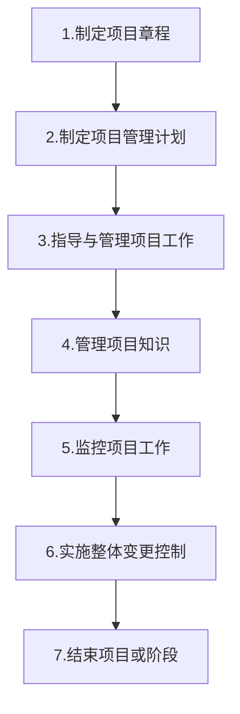
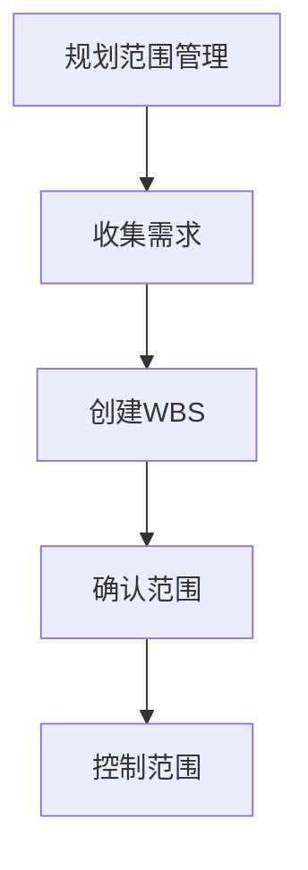
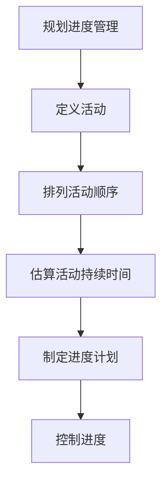
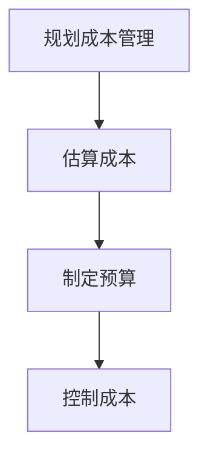
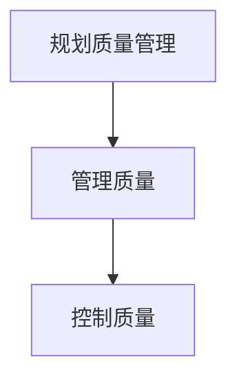
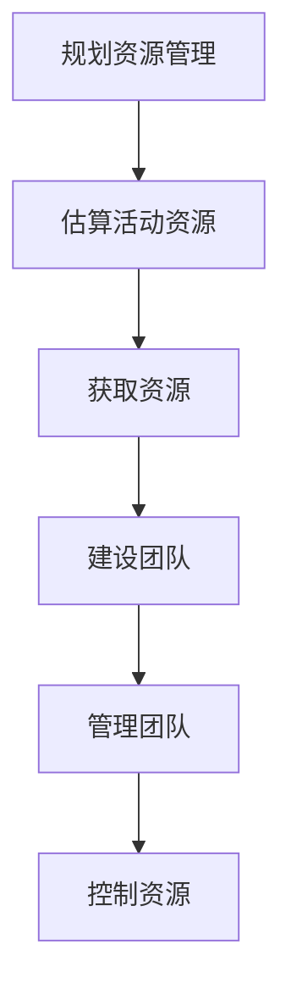
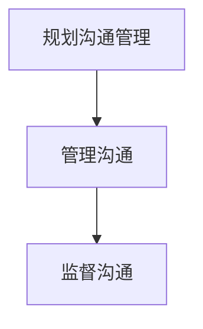
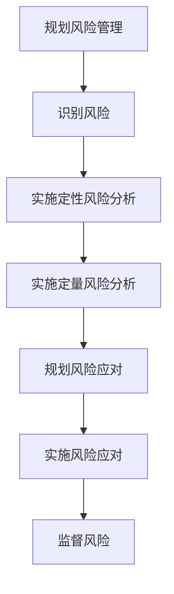
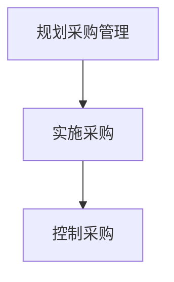
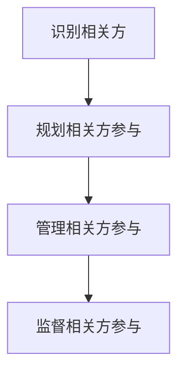

# 第一章 引论

1） 组织项目管理：

项目=> 项目集(成果交付)=> 项目组合管理(价值决策)=> 运营(商业价值实现)

2） 项目和开发生命周期

预测(瀑布)，迭代，增量，适应(敏捷，快速变更)，混合

3）项目生命周期：开始项目，组织与准备，执行项目工作，结束项目

​	项目管理过程：输入+工具与技术=输出

​	项目管理过程组：启动过程(定义)，规划过程(明确范围和目标)，执行过程(完成任务)，监控过程(跟踪进展和绩效)，收尾过程(结束)

​	项目管理知识领域：整合管理，范围管理，进度管理，成本管理，质量管理，资源管理，沟通管理，风险管理，采购管理，相关方管理

​	项目管理数据和信息：工作绩效数据(工作量化数据-输入)， 工作绩效信息(成果状态，变更请求落实情况，预测估算完工-输出)，工作绩效报告(信息汇总输出)

4）商业文件：
__项目商业论证__(可行性研究，内容包括业务需要，形式分析，推荐，评估)；
__项目效益管理计划__(内容包括 目标，战略，时限，测量指标，风险)。项目发起人制定和维护，项目经理负责提供建议和见解，并保持一致目标；

# 第二章 项目的运行环境

事业环境因素，
组织过程资产

# 第三章 项目经理的角色

醒目管理办公室(PMO)，分为三类：支持型，控制型，指令型。可以终止项目，审计，跨项目沟通协调。
职能经理：专注于某个职能领域或业务部门的管理和监督
运营经理：负责保证业务的高效性
项目经理：由执行组织委派，领导团队实现项目目标的个人

PMI人才三角：技术项目管理，领导力，战略和商务管理

# 第四章 项目整合管理

制定项目章程=>制定项目管理计划=>

# 1 项目整合管理

# 2 项目范围管理

# 3 项目进度管理

# 4 项目成本管理

# 5 项目质量管理

# 6 项目资源管理

# 7 项目沟通管理

# 8 项目风险管理

# 9 项目采购管理

# 10 项目相关方管理

# 错题笔记

## 第六章 项目进度管理

1. 资源平衡和资源平滑区别

|                | 资源平衡                                         | 资源平滑                         |
| -------------- | ------------------------------------------------ | -------------------------------- |
| 对关键路径影响 | 有影响(一般是延长)                               | 无影响                           |
| 使用情景       | 资源在特定时间内可用，资源数量限制，资源过度分配 | 不均寻使用资源，超出资源数量限制 |
| 使用时间点     | 一般在关键路径法之后，资源平滑之前               | 在资源平衡之后开展               |
| 调整对象       | 一般针对关键资源                                 | 一般针对非关键资源               |

2. 哪个活动会减少时间？减少时间，即压缩进度。增加风险的进度压缩技术是快速跟进。

3. 项目关键路径：时间最长的线条

4. 项目未能实现一个里程碑存在进度偏差，领导担忧。项目经理展示 啥?
   应展示进度相关计划，项目章程中的里程碑计划，专门展示进度。
   WBS里的里程碑强调范围，没有进度概念。

## 第7章 项目成本管理

挣值分析记忆

| 缩写 | 原文         | 名称             | 说明                                                  |
| ---- | ------------ | ---------------- | ----------------------------------------------------- |
| PV   | Plan value   | 计划价值         | 为计划工作经批准的预算                                |
| EV   | Earned value | 挣值             | 已完成计划的价值之和(批准的预算)                      |
| AC   | Actual cost  | 实际成本         | 某个时间点已完成工作的实际成本                        |
| BAC  |              | 完工预算         | 为将要执行的工作所建立的预算总和                      |
|      |              |                  |                                                       |
| CV   |              | 成本偏差         | EV-AC                                                 |
| SV   |              | 进度偏差         | EV-PV                                                 |
| VAC  |              | 完工偏差         | BAC-EAC                                               |
|      |              |                  |                                                       |
| CPI  |              | 成本绩效指数     | EV/AC                                                 |
| SPI  |              | 进度绩效指数     | EV/PV                                                 |
|      |              |                  |                                                       |
| EAC  |              | 完工估算         | 完成所有工作预期总成本，截至目前实际成本+完工尚需估算 |
| ETC  |              | 完工尚需估算     |                                                       |
| TCPI |              | 完工尚需绩效指数 |                                                       |

## 第8章 项目质量管理

1 质量标准不一致，采用客户的标准

2 

