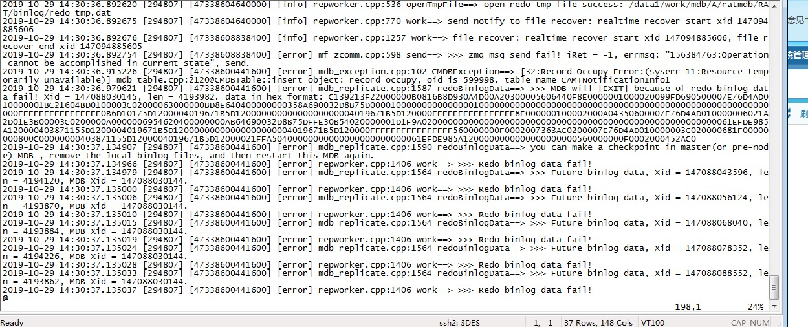

# 代码开发

照搬浙江V8代码，做适配修改，具体要点如下：


| 模块     | 说明                                                         |
| -------- | ------------------------------------------------------------ |
| xc       | xcd模板实现                                                  |
| 批价     | 结构调整(接口离线/在线/漫游/回退/5G融合计费)，去掉按量接口，提醒等相关功能；                                    xc查询接口，在线冲销(最好封装成接口)，科目转换，新增业务功能 |
| 计费mdb  | 调整上下行包定义，表定义，业务接口具体逻辑                                                                                   mapreduce 路由适配 |
| 查询代理 | TG(socket消息收发) 和 工具(压测和对账) 直接用，TP 业务接口做调整 |


# 数据割接

1）PM_EXPRESSIONS 条件表达式，USE_TRIGGER按模块区分
2）科目转换


# 环境准备

1）V5/V8 自测流程搭建，便于开发去复现问题
2）编译时去掉O2，便于GDB调试


# 遇到过的问题

## 1）xc 
a）建议 index 定义尽量显示，少用indexs=“KEY"，查询sqlite文件时方便点

```c++
<container indexs="PROD_PROP_ID" name="PM_PROD_BILL_EXT_PROP" type="hash_multimap">
```

b） PM_CURVE_SEGMENT.TAIL_ROUND 等 小数精度加载到xc时转换成了整数，注意下

```c++
TO_CHAR(A.RATE_ROUND, '0D99') AS RATE_ROUND
```


## 2）批价

对账问题，没有太大参考意义，具体情况具体分析。基本都是某个字段的差异(STD_UNIT, CHARGE1) 


## 3）计费mdb
a）mdb无缝ck，代码中去掉sleep相关操作

b)   统一设置 MDB CK 后缀名，主端格式为 *.mdb.xy.yyyymmdd  , 备端 *.mdb.stb.xy.yyyymmdd 

```c++
RATMDB_CAMTFreeResource.mdb.01.20191115
```

c）批价查询接口，查多个mdb时，一个查询/接收完后再顺序处理下一个mdb(mapreduce 重载ReqAndRes4Queryratingmdb)

d）mapreduce 在gmake clean_all  会删除rdl 对应的*h/*cpp 文件，gmake install_headers 后自动重新生成，覆盖掉了开发提交的修改。在mapreduce 的Makefile中去掉IMPL_RDL = .rdl 依赖，由开发提交和控制rdl 对应的h/cpp 文件。后续QA编译不会再自动生成rdl接口代码文件。

e）计费MDB A2 HA和容 在binlog乱序时 异常退出，主端先执行truncate(告警导出)，再执行insert(批价更新) ，备端先执行了insert ，导致出错。



## 4）查询代理

对账一把，具体问题具体分析