# CentOS网络配置说明

```shell
# 网络类型：Ethernet以太网
TYPE=Ethernet  
# MAC地址，ip addr 查看
HWADDR=08:00:27:a7:93:d6
# 引导协议：自动获取、static静态、none不指定          		
BOOTPROTO=none            
# 启动默认路由           		
DEFROUTE=yes              
# 不启用IPV4错误检测功能           		
IPV4_FAILURE_FATAL=no         
# 启用IPV6协议       		
IPV6INIT=yes                   
# 自动配置IPV6地址      		
IPV6_AUTOCONF=yes
# 启用IPV6默认路由		
IPV6_DEFROUTE=yes
# 不启用IPV6错误检测功能
IPV6_FAILURE_FATAL=no
# 网卡设备的别名
NAME=eno16777736
# 网卡设备的UUID唯一标识号                     		
UUID=90528772-9967-46da-b401-f82b64b4acbc
# 开机自动激活网卡	
ONBOOT=yes 
# 网卡的IP地址
IPADDR=192.168.1.199     
# 子网掩码的位数, 如 NETMASK=255.255.255.0 和 PREFIX=24 的作用是一样的，PREFIX优先起作用            		
PREFIX=24                            		
# 默认网关IP地址
GATEWAY=192.168.1.1                  		
# 子网掩码，不需要修改
NETMASK=255.255.255.0
IPV6_PEERDNS=yes 
IPV6_PEERROUTES=yes 
# DNS域名解析服务器的IP地址
DNS1=6.6.6.6 
DNS2=6.6.6.6 

```


# 历史方案

虚拟机可以访问网络, 和宿主机可以相互访问

## 环境

vbox: 版本 5.2.*
linux: Centos7*
笔记本使用办公室有线网络

## vbox配置

1. 管理->主机网络管理->不启用dhcp, 设置虚拟网关
<!-- more -->
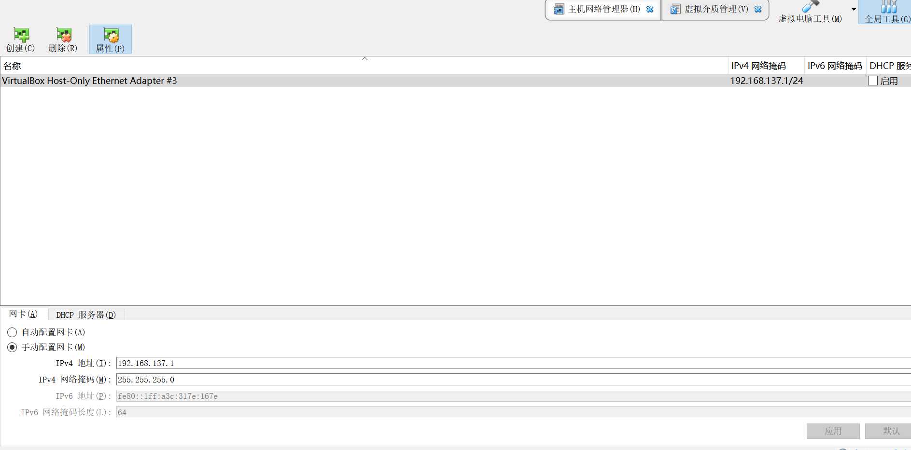

2. 管理->全局设置->网络
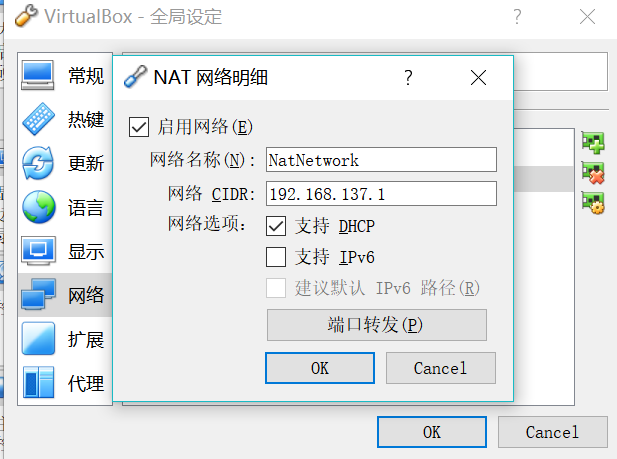
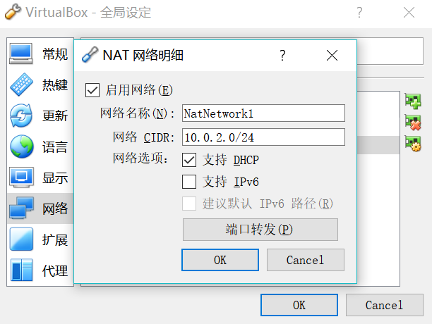

3. 设置->网络->网卡1->网卡2
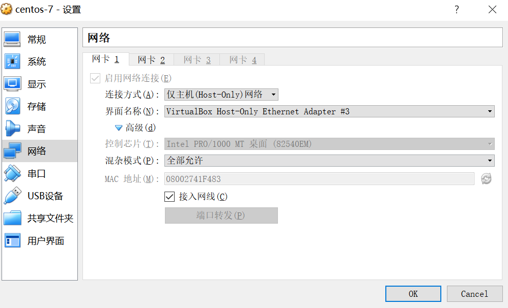
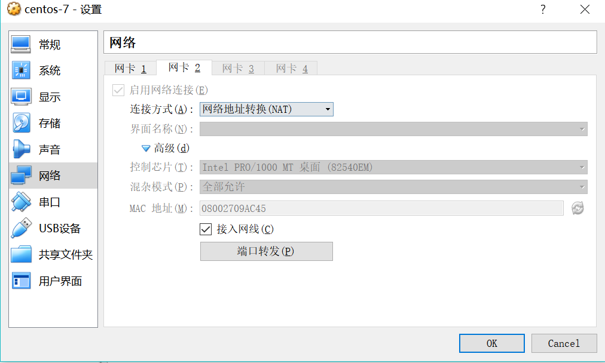

4. 宿主机网络共享
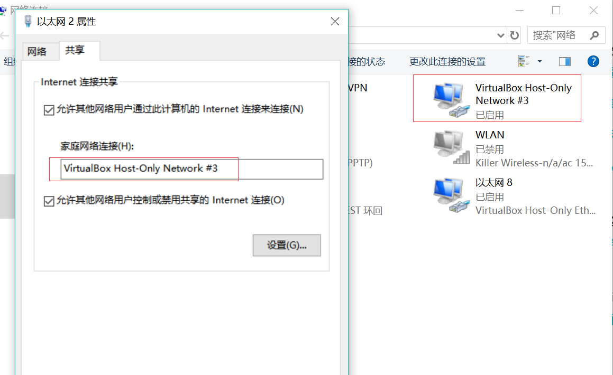

## centos配置

```
[root@localhost ~]# cat /etc/sysconfig/network-scripts/ifcfg-enp0s3
TYPE=Ethernet
PROXY_METHOD=none
BROWSER_ONLY=no
BOOTPROTO=static
#BOOTPROTO=dhcp
DEFROUTE=yes
IPV4_FAILURE_FATAL=no
IPV6INIT=yes
IPV6_AUTOCONF=yes
IPV6_DEFROUTE=yes
IPV6_FAILURE_FATAL=no
IPV6_ADDR_GEN_MODE=stable-privacy
NAME=enp0s3
UUID=cf96977f-80a6-4fb6-a68d-0a8836ee8287
DEVICE=enp0s3
ONBOOT=yes
PREFIXO0=24
IPADDR=192.168.137.20
NETMASK=255.255.255.0
PREFIX=8
GATEWAY=192.168.137.1
DNS1=10.1.1.8               // 需要和宿主机的DNS一致
#DNS2=10.70.180.80
DNS2=8.8.8.8

[root@localhost ~]# cat /etc/sysconfig/network-scripts/ifcfg-enp0s8
TYPE=Ethernet
PROXY_METHOD=none
BROWSER_ONLY=no
#BOOTPROTO=static
BOOTPROTO=dhcp
DEFROUTE=yes
IPV4_FAILURE_FATAL=no
IPV6INIT=yes
IPV6_AUTOCONF=yes
IPV6_DEFROUTE=yes
IPV6_FAILURE_FATAL=no
IPV6_ADDR_GEN_MODE=stable-privacy
NAME=enp0s8
UUID=f0095258-92b9-3ea4-bcb7-5f9eee4eda2b  // nmcli con show 找到UUID(NetworkManager)
DEVICE=enp0s8
ONBOOT=yes
PREFIXO0=24
#IPADDR=192.168.137.20
#NETMASK=255.255.255.0
PREFIX=8
#GATEWAY=192.168.137.1
#DNS1=10.70.75.253
#DNS2=10.70.180.80
#DNS2=8.8.8.8
DWADDR=08:00:27:09:ac:45  // ip add 找到MAC地址

// 默认使用enp0s8
[root@localhost ~]# route -n
Kernel IP routing table
Destination     Gateway         Genmask         Flags Metric Ref    Use Iface
0.0.0.0         10.0.3.2        0.0.0.0         UG    0      0        0 enp0s8
10.0.3.0        0.0.0.0         255.255.255.0   U     0      0        0 enp0s8
169.254.0.0     0.0.0.0         255.255.0.0     U     1002   0        0 enp0s3
169.254.0.0     0.0.0.0         255.255.0.0     U     1003   0        0 enp0s8
192.0.0.0       0.0.0.0         255.0.0.0       U     0      0        0 enp0s3


[root@localhost ~]# cat /etc/resolv.conf
; generated by /usr/sbin/dhclient-script
nameserver 10.70.75.253
nameserver 10.70.180.80
nameserver 10.70.75.253
nameserver 10.70.180.80
search localdomain

[root@localhost ~]# ifconfig
enp0s3: flags=4163<UP,BROADCAST,RUNNING,MULTICAST>  mtu 1500
        inet 192.168.137.20  netmask 255.0.0.0  broadcast 192.255.255.255
        inet6 fe80::a00:27ff:fe41:f483  prefixlen 64  scopeid 0x20<link>
        ether 08:00:27:41:f4:83  txqueuelen 1000  (Ethernet)
        RX packets 316  bytes 33319 (32.5 KiB)
        RX errors 0  dropped 0  overruns 0  frame 0
        TX packets 212  bytes 41130 (40.1 KiB)
        TX errors 0  dropped 0 overruns 0  carrier 0  collisions 0

enp0s8: flags=4163<UP,BROADCAST,RUNNING,MULTICAST>  mtu 1500
        inet 10.0.3.15  netmask 255.255.255.0  broadcast 10.0.3.255
        inet6 fe80::a00:27ff:fe09:ac45  prefixlen 64  scopeid 0x20<link>
        ether 08:00:27:09:ac:45  txqueuelen 1000  (Ethernet)
        RX packets 70  bytes 8437 (8.2 KiB)
        RX errors 0  dropped 0  overruns 0  frame 0
        TX packets 89  bytes 8116 (7.9 KiB)
        TX errors 0  dropped 0 overruns 0  carrier 0  collisions 0

lo: flags=73<UP,LOOPBACK,RUNNING>  mtu 65536
        inet 127.0.0.1  netmask 255.0.0.0
        inet6 ::1  prefixlen 128  scopeid 0x10<host>
        loop  txqueuelen 1  (Local Loopback)
        RX packets 0  bytes 0 (0.0 B)
        RX errors 0  dropped 0  overruns 0  frame 0
        TX packets 0  bytes 0 (0.0 B)
        TX errors 0  dropped 0 overruns 0  carrier 0  collisions 0

```

## 问题

enp0s8 如果没有自动生成配置文件, 手工添加;
更换网络后, 注意DNS也对应更改下;

## 原主机网络设备管理

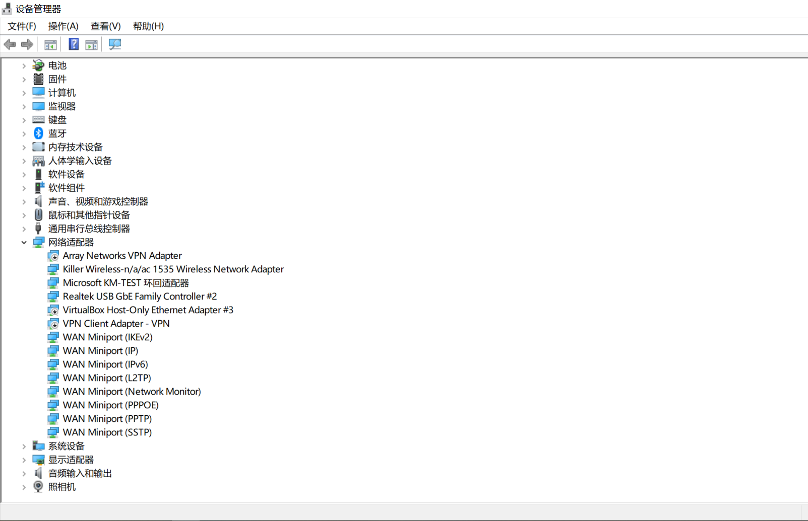

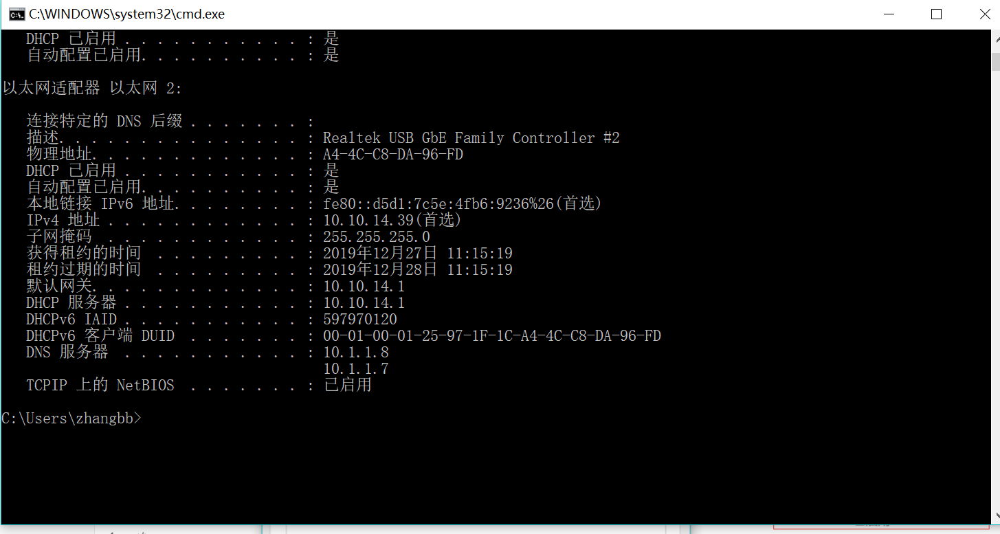


# 网络地址转换NAT

## 环境

vbox: 版本 6.1*
linux: Centos7*

## vbox 配置

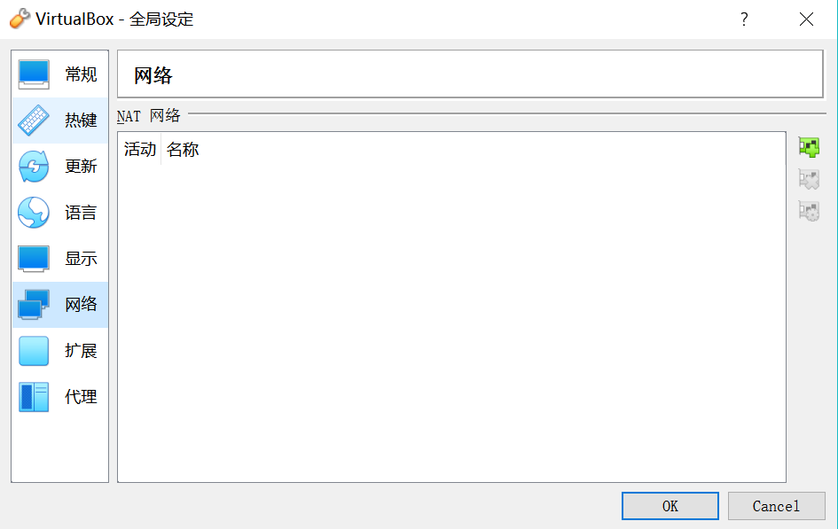


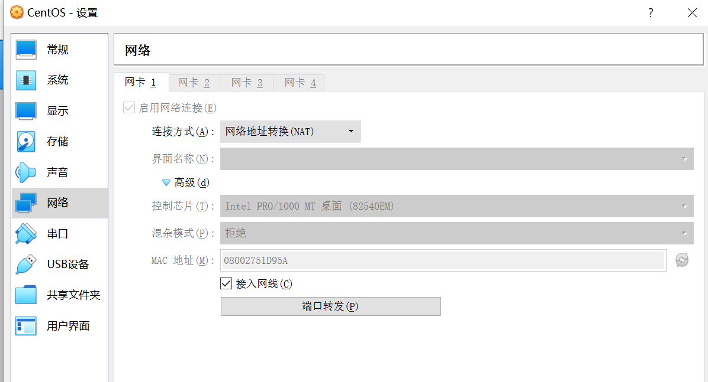

## CentOS配置

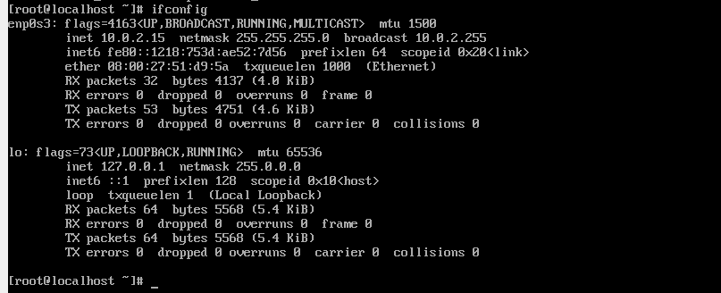


# 桥接网卡

## vbox设置

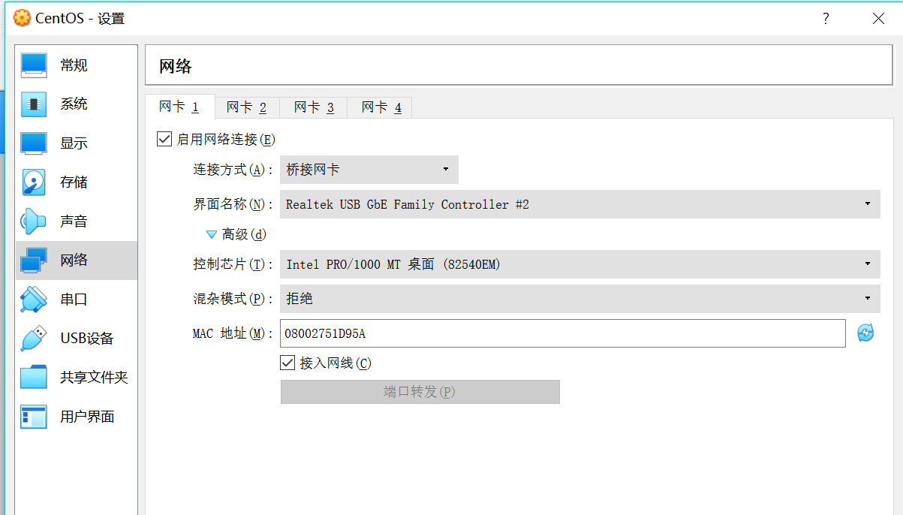

## CentOS配置

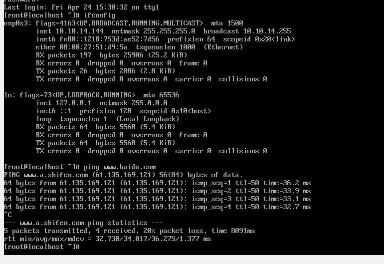

```shell
[root@localhost ~]# cat /etc/sysconfig/network-scripts/ifcfg-enp0s3 
TYPE="Ethernet"
PROXY_METHOD="none"
BROWSER_ONLY="no"
BOOTPROTO="dhcp"
DEFROUTE="yes"
IPV4_FAILURE_FATAL="no"
IPV6INIT="yes"
IPV6_AUTOCONF="yes"
IPV6_DEFROUTE="yes"
IPV6_FAILURE_FATAL="no"
IPV6_ADDR_GEN_MODE="stable-privacy"
NAME="enp0s3"
UUID="2bf83a8e-995a-4734-bd5c-3fa287976897"
DEVICE="enp0s3"
ONBOOT="yes"
[root@localhost ~]# 
```


# 手册翻译

VirtualBox版本6.1， 帮助=》内容

## 联网模式介绍

* 未指定。该模式下，向访客报告网卡存在，但没有网络链接。就像以太网线没有插入网卡一样。使用这个模式，可以拉出一个虚拟网线和打乱网络链接，对于通知访客系统没有可用网络并强制重新配置很有用。
* 网络地址转换(NAT)。如果您只需要浏览Web，下载文件和查看来宾内部的电子邮件，则此默认模式应已足够，您可以跳过本节的其余部分。请注意，使用Windows文件共享时有某些限制。
* NAT网络。NAT网络是允许出站连接的一种内部网络。
* 桥接网络。这是为了满足更高级的网络需求，例如网络模拟和来宾中运行的服务器。启用后，Oracle VM VirtualBox会连接到已安装的网卡之一并直接交换网络数据包，从而规避了主机操作系统的网络堆栈。
* 内部网络。这可用于创建不同种类的基于软件的网络，该网络对选定的虚拟机可见，但对主机上或外部世界上运行的应用程序不可见。
* 仅主机(Host-only)网络。这可用于创建包含主机和一组虚拟机的网络，而无需主机的物理网络接口。而是在主机上创建类似于环回接口的虚拟网络接口，以提供虚拟机和主机之间的连接。
* 通用驱动。通过允许用户选择可以包含在Oracle VM VirtualBox中或在扩展包中分发的驱动程序，共享相同通用网络接口的稀有模式。
  * UDP隧道。用于通过现有网络基础架构直接，轻松，透明地互连运行在不同主机上的虚拟机
  * VDE（虚拟分布式以太网）网络。用于连接到Linux或FreeBSD主机上的虚拟分布式以太网交换机。目前，此选项需要从源代码编译Oracle VM VirtualBox，因为Oracle软件包不包括它。

连网模式概述：

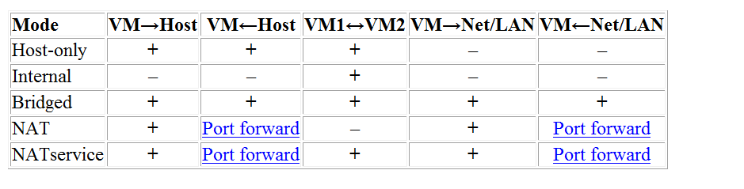

## 6.3 网络地址转换（NAT）

网络地址转换（NAT）是从虚拟机访问外部网络的最简单方法。通常，它不需要在主机网络和来宾系统上进行任何配置。因此，它是Oracle VM VirtualBox中的默认联网模式。

启用了NAT的虚拟机的行为就像是一台通过路由器连接到Internet的真实计算机。在这种情况下，路由器是Oracle VM VirtualBox网络引擎，该引擎透明地映射来往虚拟机的流量。在Oracle VM VirtualBox中，此路由器放置在每个虚拟机和主机之间。由于默认情况下虚拟机无法相互通信，因此这种隔离可最大程度地提高安全性。

NAT模式的缺点是，就像路由器后面的专用网络一样，虚拟机是不可见的，并且无法从外部Internet访问。除非设置端口转发，否则无法以这种方式运行服务器。请参见第6.3.1节“使用NAT配置端口转发”。

来宾操作系统发出的网络帧由Oracle VM VirtualBox的NAT引擎接收，该引擎提取TCP / IP数据并使用主机操作系统重新发送。对于主机上的应用程序，或与主机相同网络上的另一台计算机，数据似乎是由主机上的Oracle VM VirtualBox应用程序使用属于主机的IP地址发送的。 Oracle VM VirtualBox侦听对发送的软件包的答复，然后重新打包并将它们重新发送到其专用网络上的来宾计算机。

虚拟机从集成到Oracle VM VirtualBox的DHCP服务器接收专用网络上的网络地址和配置。这样分配给虚拟机的IP地址通常与主机位于完全不同的网络上。由于可以将虚拟机的多个卡设置为使用NAT，因此第一张卡连接到专用网络10.0.2.0，第二张卡连接到网络10.0.3.0，依此类推。如果需要更改来宾分配的IP范围，请参见第9.8节“精细调整Oracle VM VirtualBox NAT引擎”。

### 6.3.1 使用NAT配置端口转发

由于虚拟机连接到Oracle VM VirtualBox内部的专用网络并且对主机不可见，因此主机或同一网络上的其他计算机将无法访问客户机上的网络服务。但是，就像物理路由器一样，Oracle VM VirtualBox可以通过端口转发使选定的服务对来宾外部的世界可用。这意味着Oracle VM VirtualBox侦听主机上的某些端口，并在相同或不同端口上将到达主机的所有数据包重新发送给来宾。

对于主机上的应用程序或网络上的其他物理或虚拟机，看起来好像代理的服务实际上在主机上运行。这也意味着您不能在主机的相同端口上运行相同的服务。但是，您仍然可以获得在虚拟机中运行服务的优势。例如，主机或其他虚拟机上的服务不会因服务中的漏洞或错误而受损或崩溃，并且该服务可以在与主机系统不同的操作系统中运行。

要配置端口转发，可以使用图形化的端口转发编辑器，该编辑器可在网络设置对话框中找到，用于配置为使用NAT的网络适配器。在这里，您可以将主机端口映射到来宾端口，以将网络流量路由到来宾中的特定端口。

或者，可以使用命令行工具VBoxManage。请参见第8.8节“ VBoxManage Modifyvm”。

您将需要知道服务使用的来宾端口，并决定要使用主机上的端口。您可能要在来宾和主机上使用相同的端口。您可以使用主机上服务尚未使用的任何端口。例如，要在来宾中建立到ssh服务器的入站NAT连接，请使用以下命令：

```
VBoxManage modifyvm "VM name" --natpf1 "guestssh,tcp,,2222,,22"
```

在上面的示例中，任何主机接口上到达端口2222的所有TCP流量都将转发到来宾中的端口22。协议名称tcp是必填属性，用于定义应使用哪种协议进行转发，也可以使用udp。 guestsh名称仅是描述性的，如果省略，将自动生成。 --natpf之后的数字表示网卡，与其他VBoxManage命令一样。

要删除此转发规则，请使用以下命令：

```
VBoxManage modifyvm "VM name" --natpf1 delete "guestssh"
```

如果出于某种原因，来宾使用了未从内置DHCP服务器租用的静态分配的IP地址，则在注册转发规则时需要指定来宾IP，如下所示：

```
VBoxManage modifyvm "VM name" --natpf1 "guestssh,tcp,,2222,10.0.2.19,22"
```

此示例与上一个示例相同，除了被告知NAT引擎可以在10.0.2.19地址找到该来宾。

要将所有传入流量从特定主机接口转发到来宾，请按以下方式指定该主机接口的IP：

```
VBoxManage modifyvm "VM name" --natpf1 "guestssh,tcp,127.0.0.1,2222,,22"
```

本示例将所有通过端口2222到达本地主机接口的127.0.0.1处的TCP通信转发到来宾中的端口22。

可以在VM运行时配置传入的NAT连接，请参见第8.13节“ VBoxManage controlvm”。

### 6.3.2 使用NAT进行PXE引导

现在在NAT模式下支持PXE引导。如果在保存用户的VirtualBox.xml文件的目录中存在目录TFTP，则NAT DHCP服务器将提供格式为vmname.pxe的启动文件名。用户有责任提供vmname.pxe。

### 6.3.3 NAT限制

用户应了解NAT模式的一些限制，如下所示：

* ICMP协议限制。一些常用的网络调试工具（例如ping或traceroute）依赖于ICMP协议来发送和接收消息。 Oracle VM VirtualBox ICMP支持有一些限制，这意味着ping应该可以工作，但其他一些工具可能无法可靠地工作。
* 接收UDP广播。来宾不能可靠地接收UDP广播。为了节省资源，在访客在特定端口上发送UDP数据后，它仅侦听一定时间。因此，基于广播的NetBios名称解析并非始终有效，但WINS始终有效。解决方法是，可以使用\\ server \ share表示法使用所需服务器的数字IP。
* 不支持某些协议。不支持TCP和UDP以外的协议。不支持GRE。这意味着不能使用某些VPN产品，例如Microsoft的PPTP。还有其他仅使用TCP和UDP的VPN产品。
* 转发低于1024的主机端口。在基于UNIX的主机（例如Linux，Oracle Solaris和Mac OS X）上，无法从非root用户运行的应用程序绑定到1024以下的端口。因此，如果您尝试配置此类端口转发，则VM将拒绝启动。

这些限制通常不会影响标准网络使用。但是NAT的存在也会产生细微的影响，可能会干扰正常运行的协议。一个示例是NFS，其中通常将服务器配置为拒绝来自非特权端口的连接，这些端口不低于1024。

## 6.4 NAT网络

网络地址转换（NAT）服务的工作方式与家用路由器类似，将使用该服务的系统分组到一个网络中，并防止该网络外部的系统直接访问其内部的系统，但允许内部的系统相互通信并与之通信。外部系统在IPv4和IPv6上使用TCP和UDP。

NAT服务已连接到内部网络。要使用它的虚拟机应连接到该内部网络。创建NAT服务时选择内部网络的名称，如果内部网络尚不存在，则将创建内部网络。以下是创建NAT网络的示例命令：

```
VBoxManage natnetwork add --netname natnet1 --network "192.168.15.0/24" --enable
```

在此，natnet1是要使用的内部网络的名称，而192.168.15.0/24是NAT服务接口的网络地址和掩码。默认情况下，在此静态配置中，将为网关分配地址192.168.15.1，该地址位于接口地址之后，但是此地址可能会更改。要将DHCP服务器连接到内部网络，请修改示例命令，如下所示：

```
VBoxManage natnetwork add --netname natnet1 --network "192.168.15.0/24" --enable --dhcp on
```

要将DHCP服务器添加到现有网络，请使用以下命令：

```
VBoxManage natnetwork modify --netname natnet1 --dhcp on
```

要禁用DHCP服务器，请使用以下命令：

```
VBoxManage natnetwork modify --netname natnet1 --dhcp off
```

DHCP服务器提供已注册名称服务器的列表，但不映射来自127/8网络的服务器。

要启动NAT服务，请使用以下命令：

```
VBoxManage natnetwork start --netname natnet1
```

如果网络连接了DHCP服务器，则它将与NAT网络服务一起启动。

要停止NAT网络服务以及任何DHCP服务器：

```
VBoxManage natnetwork stop --netname natnet1
```

删除NAT网络服务：

```
VBoxManage natnetwork remove --netname natnet1
```

如果在内部网络上启用了DHCP服务器，则此命令不会删除DHCP服务器。

支持端口转发，对于IPv4使用--port-forward-4开关，对于IPv6使用--port-forward-6开关。例如：

```
VBoxManage natnetwork modify \
  --netname natnet1 --port-forward-4 "ssh:tcp:[]:1022:[192.168.15.5]:22"
```

这会将端口转发规则从主机的TCP 1022端口添加到IP地址为192.168.15.5的客户机上的端口22。主机端口，来宾端口和来宾IP是必填项。要删除规则，请使用以下命令：

```
VBoxManage natnetwork modify --netname natnet1 --port-forward-4 delete ssh
```

可以将NAT服务绑定到指定的接口。例如：

```
VBoxManage setextradata global "NAT/win-nat-test-0/SourceIp4" 192.168.1.185
```

要查看已注册的NAT网络列表，请使用以下命令：

```
VBoxManage list natnetworks
```

## 6.5 桥接网络

通过桥接网络，Oracle VM VirtualBox使用主机系统上的设备驱动程序来过滤来自物理网络适配器的数据。因此，该驱动程序称为净过滤器驱动程序。这使Oracle VM VirtualBox可以拦截来自物理网络的数据并将数据注入到其中，从而有效地在软件中创建新的网络接口。当来宾使用这种新的软件接口时，它看起来像是使用网络电缆将来宾物理连接到主机系统的主机系统。主机可以通过该接口向来宾发送数据，并从中接收数据。这意味着您可以在客户机与网络的其余部分之间设置路由或桥接。

注：即使对于桥接网络在Linux上不再需要TAP接口，您仍然可以将TAP接口用于某些高级设置，因为您可以将VM连接到任何主机接口。

要启用桥接网络，请打开虚拟机的“设置”对话框，转到“网络”页面，然后在“附加到”字段的下拉列表中选择“桥接网络”。从页面底部的列表中选择一个主机接口，其中包含系统的物理网络接口。例如，在典型的MacBook上，这将允许您在en1：AirPort（这是无线接口）和en0：Ethernet（这是通过网络电缆表示的接口）之间进行选择。

注：桥接到无线接口的方法与桥接到有线接口的方法不同，因为大多数无线适配器都不支持混杂模式。所有流量都必须使用主机的无线适配器的MAC地址，因此Oracle VM VirtualBox需要替换传出数据包的以太网标头中的源MAC地址，以确保将答复发送到主机接口。当Oracle VM VirtualBox看到带有目标IP地址的传入数据包属于虚拟机适配器之一时，它将用VM适配器的MAC地址替换以太网报头中的目标MAC地址，并将其继续传递。 Oracle VM VirtualBox检查ARP和DHCP数据包，以了解虚拟机的IP地址。

根据您的主机操作系统，以下限制适用：

* Mac OS X主机。当使用Mac的无线网络系统AirPort进行桥接网络时，功能受到限制。当前，Oracle VM VirtualBox仅通过AirPort支持IPv4和IPv6。对于其他协议，例如IPX，必须选择有线接口。

* Linux主机。使用无线接口进行桥接网络时，功能受到限制。当前，Oracle VM VirtualBox仅通过无线支持IPv4和IPv6。对于其他协议，例如IPX，必须选择有线接口。

  同样，已知在某些情况下，Marvell Yukon II EC超以太网NIC的sky2驱动程序提供的有线接口上的MTU设置为小于1500字节时，会导致数据包丢失。

  一些适配器会在硬件中剥离VLAN标签。这不允许您在具有2.6.27之前的Linux内核或Linux以外的主机操作系统的VM和外部网络之间使用VLAN中继。

* Oracle Solaris主机。不支持使用无线接口。由于Oracle Solaris网络子系统的技术限制，也不完全支持使用IPFilter筛选来宾流量。这些问题可以在更高版本的Oracle Solaris 11中解决。

在Oracle Solaris 11主机内部版本159及更高版本上，可以将Oracle Solaris Crossbow虚拟网络接口（VNIC）直接与Oracle VM VirtualBox一起使用，而无需进行任何其他配置，除了每个VNIC对于每个来宾网络接口而言都是唯一的。

将VLAN接口与Oracle VM VirtualBox一起使用时，必须根据PPA-hack命名方案来命名它们，例如e1000g513001。否则，访客可能会收到意外格式的数据包。

## 6.6 内部网络

内部网络类似于桥接网络，因为VM可以直接与外界通信。但是，外部世界仅限于同一主机上连接到同一内部网络的其他VM。

即使从技术上讲，使用内部网络可以完成的所有操作也可以使用桥接网络来完成，但是内部网络具有安全性优势。在桥接网络模式下，所有流量都通过主机系统的物理接口。因此，可以将诸如Wireshark的数据包嗅探器附加到主机接口，并记录通过它的所有流量。如果出于某种原因，如果您希望同一台计算机上的两个或多个VM进行私下通信，同时对主机系统和用户隐藏其数据，则桥接网络不是一种选择。

内部网络会根据需要自动创建。没有中央配置。每个内部网络都简单地通过其名称进行标识。一旦有一个以上具有相同内部网络ID的活动虚拟网卡，Oracle VM VirtualBox支持驱动程序将自动连接这些卡并充当网络交换机。 Oracle VM VirtualBox支持驱动程序实现了完整的以太网交换机，并支持广播/多播帧和混杂模式。

内部网络会根据需要自动创建。没有中央配置。每个内部网络都简单地通过其名称进行标识。一旦有一个以上具有相同内部网络ID的活动虚拟网卡，Oracle VM VirtualBox支持驱动程序将自动连接这些卡并充当网络交换机。 Oracle VM VirtualBox支持驱动程序实现了完整的以太网交换机，并支持广播/多播帧和混杂模式。

为了将VM的网卡连接到内部网络，请将其网络连接模式设置为Internal Networking。有两种方法可以实现此目的：

* 在Oracle VM VirtualBox图形用户界面中使用VM的“设置”对话框。在设置对话框的“网络”类别中，从网络模式的下拉列表中选择“内部网络”。从下面的下拉列表中选择一个现有内部网络的名称，或在“名称”字段中输入一个新名称。

* 使用命令行，例如：

  - ```
    VBoxManage modifyvm "VM name" --nic<x> intnet
    ```

  （可选）您可以使用以下命令指定网络名称：

  - ```
    VBoxManage modifyvm "VM name" --intnet<x> "network name"
    ```

如果未指定网络名称，则默认情况下，网卡将连接到网络intnet。

除非您在参与内部网络的来宾操作系统中将虚拟网卡配置为使用静态IP地址，否则您可能要使用Oracle VM VirtualBox内置的DHCP服务器来管理内部网络的IP地址。请参见第8.42节“ VBoxManage dhcpserver”。

作为安全措施，默认情况下，内部网络的Linux实现仅允许以相同用户ID运行的VM建立内部网络。但是，可以创建一个共享的内部网络接口，具有不同用户ID的用户可以访问该接口。


## 6.7 仅主机(Host-only)网络

可以将仅主机的网络视为桥接和内部网络模式之间的混合。与桥接网络一样，虚拟机可以彼此通信，也可以与主机进行通信，就像它们通过物理以太网交换机连接一样。与内部网络一样，不需要存在物理网络接口，并且由于虚拟机未连接到物理网络接口，因此它们无法与主机外部的世界进行通信。

使用仅主机网络时，Oracle VM VirtualBox在主机上创建一个新的软件接口，该接口随后出现在现有网络接口旁边。换句话说，对于桥接网络，现有物理接口用于将虚拟机连接到其中，而对于仅主机网络，则在主机上创建新的回送接口。而且，尽管使用内部网络，但无法看到虚拟机之间的流量，但是可以拦截主机上环回接口上的流量。

仅主机网络对于预配置的虚拟设备特别有用，在预配置的虚拟设备中，多个虚拟机一起运送并旨在进行协作。例如，一个虚拟机可能包含一个Web服务器，第二个虚拟机可能包含一个数据库，并且由于它们打算互相通信，因此该设备可以指示Oracle VM VirtualBox为这两个虚拟机建立仅主机的网络。然后，第二个桥接网络会将Web服务器连接到外部，以向其提供数据，但是外部无法连接到数据库。

要将虚拟机的虚拟网络接口更改为“仅主机”模式，请执行以下任一操作：

* 转到虚拟机的“设置”对话框中的“网络”页面，然后选择“仅主机网络”。
* 在命令行上，输入VBoxManage Modifyvm“ vmname --nicx hostonly”。请参见第8.8节“ VBoxManage Modifyvm”。

在将VM附加到仅主机网络之前，必须创建至少一个仅主机接口。您可以为此使用VirtualBox Manager。选择“文件”，“首选项”，“网络”，“仅主机网络”，（+）添加“仅主机网络”。

或者，您可以使用命令行：

```
VBoxManage hostonlyif create
```

对于仅主机网络，与内部网络一样，您可能会发现内置在Oracle VM VirtualBox中的DHCP服务器很有用。然后可以启用它来管理仅主机网络中的IP地址，因为否则您将需要静态配置所有IP地址。

* 在Oracle VM VirtualBox图形用户界面中，可以通过选择文件，首选项，网络在全局设置中配置所有这些项目。这列出了当前正在使用的所有仅主机网络。单击网络名称，然后单击“编辑”。然后，您可以修改适配器和DHCP设置。
* 或者，您可以在命令行上使用VBoxManage dhcpserver。请参见第8.42节“ VBoxManage dhcpserver”。

注：在Linux和Mac OS X主机上，仅主机接口的数量限制为128。对于Oracle Solaris和Windows主机没有此限制。


## 6.8 UDP隧道网络

通过这种联网模式，可以互连在不同主机上运行的虚拟机。

从技术上讲，这是通过将来宾网卡发送或接收的以太网帧封装到UDP / IP数据报中，然后通过主机可用的任何网络发送来完成的。

UDP隧道模式具有以下参数：

* 源UDP端口：主机侦听的端口。从任何源地址到达此端口的数据报都将转发到访客网卡的接收部分。
* 目的地址：传输数据的目标主机的IP地址。
* 目标UDP端口：发送的数据发送到的端口号。

在两个不同主机上互连两个虚拟机时，必须交换其IP地址。在单个主机上，必须交换源和目标UDP端口。

在以下示例中，主机1使用IP地址10.0.0.1，主机2使用IP地址10.0.0.2。要使用命令行进行配置：

```
VBoxManage modifyvm "VM 01 on host 1" --nic<x> generic
VBoxManage modifyvm "VM 01 on host 1" --nicgenericdrv<x> UDPTunnel
VBoxManage modifyvm "VM 01 on host 1" --nicproperty<x> dest=10.0.0.2
VBoxManage modifyvm "VM 01 on host 1" --nicproperty<x> sport=10001
VBoxManage modifyvm "VM 01 on host 1" --nicproperty<x> dport=10002
VBoxManage modifyvm "VM 02 on host 2" --nic<y> generic
VBoxManage modifyvm "VM 02 on host 2" --nicgenericdrv<y> UDPTunnel
VBoxManage modifyvm "VM 02 on host 2" --nicproperty<y> dest=10.0.0.1
VBoxManage modifyvm "VM 02 on host 2" --nicproperty<y> sport=10002
VBoxManage modifyvm "VM 02 on host 2" --nicproperty<y> dport=10001
```

当然，通过将两个主机上的目标地址参数都设置为127.0.0.1，您可以始终互连同一主机上的两个虚拟机。在这种情况下，它的作用类似于内部网络。但是，主机可以看到正常内部网络情况下无法看到的网络流量。

在基于UNIX的主机（例如Linux，Oracle Solaris和Mac OS X）上，无法从非root用户运行的应用程序绑定到1024以下的端口。结果，如果您尝试配置这样的源UDP端口，则VM将拒绝启动。


## 6.9 VDE网络

虚拟分布式以太网（VDE）是一种灵活的虚拟网络基础结构系统，以安全的方式跨越多个主机。它支持L2 / L3交换，包括生成树协议，VLAN和WAN仿真。它是Oracle VM VirtualBox的可选部分，仅包含在源代码中。

VDE是由意大利博洛尼亚大学副教授Renzo Davoli开发的项目。

基础结构的基本构建块是VDE交换机，VDE插头和将交换机互连的VDE电线。

Oracle VM VirtualBox VDE驱动程序具有一个参数：VDE网络。这是虚拟机将连接到的VDE网络交换机插座的名称。

以下基本示例显示了如何将虚拟机连接到VDE交换机。

## 6.10 网络输入/输出的限制带宽

Oracle VM VirtualBox支持限制用于网络传输的最大带宽。一个VM的多个网络适配器可以通过带宽组共享限制。这样的限制可能不止一个。

注：Oracle VM VirtualBox仅在传输方向上调整VM流量，从而延迟了虚拟机发送的数据包。它不限制虚拟机接收的流量。

限制是通过VBoxManage配置的。下面的示例创建一个名为Limit的带宽组，将限制设置为20 Mbps，并将该组分配给VM的第一个和第二个适配器：

```
VBoxManage bandwidthctl "VM name" add Limit --type network --limit 20m
VBoxManage modifyvm "VM name" --nicbandwidthgroup1 Limit
VBoxManage modifyvm "VM name" --nicbandwidthgroup2 Limit
```

组中的所有适配器共享带宽限制，这意味着在上面的示例中，两个适配器的带宽总和不能超过20 Mbps。但是，如果一个适配器不需要带宽，则另一个适配器可以使用其组中的剩余带宽。

可以在VM运行时更改每个组的限制，并立即获取更改。下面的示例将在上一个示例中创建的组的限制更改为100 Kbps：

```
VBoxManage bandwidthctl "VM name" set Limit --limit 100k
```

要完全禁用VM的第一个适配器的成形，请使用以下命令：

```
VBoxManage modifyvm "VM name" --nicbandwidthgroup1 none
```

通过为虚拟机指定零限制，还可以在VM运行时为分配给带宽组的所有适配器禁用整形。例如，对于名为“限制”的带宽组：

```
VBoxManage bandwidthctl "VM name" set Limit --limit 0
```


## 6.11 改善网络性能


Oracle VM VirtualBox提供了各种虚拟网络适配器，可以通过多种方式将其连接到主机的网络。根据使用的适配器和附件类型，网络性能会有所不同。在性能方面，virtio网络适配器优于Intel PRO / 1000仿真适配器，后者优于PCNet适配器系列。 virtio和Intel PRO / 1000适配器都享有分段和校验和卸载的优势。分段卸载对于实现高性能至关重要，因为分段卸载需要较少的上下文切换，从而大大增加了跨VM /主机边界的数据包大小。

注：Windows XP的virtio或Intel PRO / 1000驱动程序均不支持分段卸载。因此，Windows XP来宾永远无法达到与其他来宾类型相同的传输速率。有关其他信息，请参阅MS知识库文章842264。

三种附件类型：内部，桥接和仅主机，具有几乎相同的性能。内部类型要快一点，并且使用较少的CPU周期，因为数据包永远不会到达主机的网络堆栈。 NAT附件类型是所有附件类型中最慢，最安全的，因为它提供了网络地址转换。通用驱动程序附件是特殊的，不能视为其他附件类型的替代。

分配给VM的CPU数量并不能改善网络性能，在某些情况下，由于来宾中的并发性增加，可能会损害网络性能。

这是为了提高网络性能而需要检查的内容的简短摘要：

* 尽可能使用virtio网络适配器。否则，请使用Intel PRO / 1000适配器之一。
* 使用桥接附件而不是NAT。
* 确保在来宾操作系统中启用了分段卸载。通常，默认情况下将启用它。您可以在Linux guest虚拟机上使用ethtool命令检查和修改卸载设置。
* 使用第三方工具（例如Wireshark）对VM网络适配器上的网络流量进行全面详细的分析。为此，需要在VM的网络适配器上使用混杂模式策略。仅在以下网络类型上可以使用此模式：NAT网络，桥接适配器，内部网络和仅主机适配器。

要设置混杂模式策略，请从网络适配器的“网络设置”对话框中的下拉列表中选择，或使用命令行工具VBoxManage。请参见第8.8节“ VBoxManage Modifyvm”。

混杂模式策略如下：

* deny（拒绝），隐藏所有不适合VM网络适配器的流量。这是默认设置。
* allow-vms，从VM的网络适配器隐藏所有主机流量，但允许它查看与其他VM之间的流量。
* allow-all，这消除了所有限制。 VM的网络适配器可以查看所有流量。

