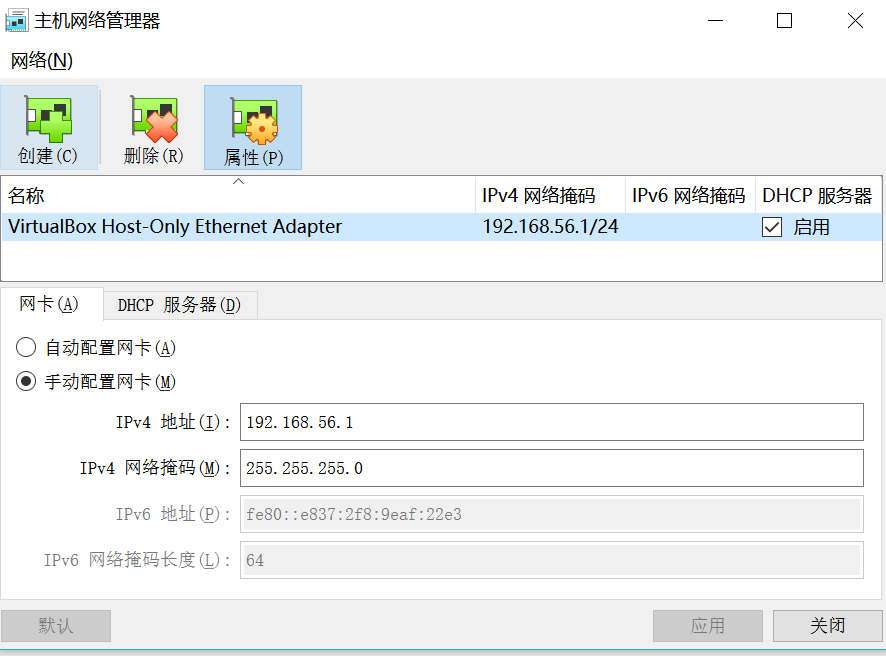
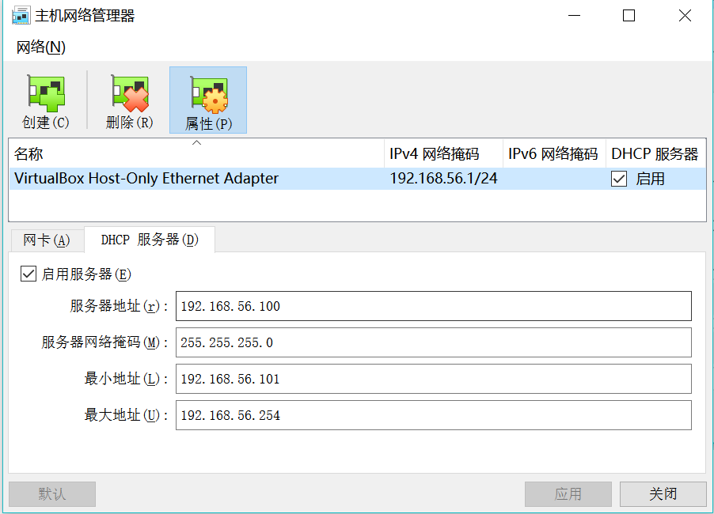

# CentOS网络配置说明

```shell
# 网络类型：Ethernet以太网
TYPE=Ethernet  
# MAC地址，ip addr 查看
HWADDR=08:00:27:a7:93:d6
# 引导协议：自动获取、static静态、none不指定          		
BOOTPROTO=none            
# 启动默认路由           		
DEFROUTE=yes              
# 不启用IPV4错误检测功能           		
IPV4_FAILURE_FATAL=no         
# 启用IPV6协议       		
IPV6INIT=yes                   
# 自动配置IPV6地址      		
IPV6_AUTOCONF=yes
# 启用IPV6默认路由		
IPV6_DEFROUTE=yes
# 不启用IPV6错误检测功能
IPV6_FAILURE_FATAL=no
# 网卡设备的别名
NAME=eno16777736
# 网卡设备的UUID唯一标识号                     		
UUID=90528772-9967-46da-b401-f82b64b4acbc
# 开机自动激活网卡	
ONBOOT=yes 
# 网卡的IP地址
IPADDR=192.168.1.199     
# 子网掩码的位数, 如 NETMASK=255.255.255.0 和 PREFIX=24 的作用是一样的，PREFIX优先起作用            		
PREFIX=24                            		
# 默认网关IP地址
GATEWAY=192.168.1.1                  		
# 子网掩码，不需要修改
NETMASK=255.255.255.0
IPV6_PEERDNS=yes 
IPV6_PEERROUTES=yes 
# DNS域名解析服务器的IP地址
DNS1=6.6.6.6 
DNS2=6.6.6.6 

```


# 历史方案

虚拟机可以访问网络, 和宿主机可以相互访问

## 环境

vbox: 版本 5.2.*
linux: Centos7*
笔记本使用办公室有线网络

## vbox配置

1. 管理->主机网络管理->不启用dhcp, 设置虚拟网关
<!-- more -->


2. 管理->全局设置->网络


3. 设置->网络->网卡1->网卡2


4. 宿主机网络共享


## centos配置

```
[root@localhost ~]# cat /etc/sysconfig/network-scripts/ifcfg-enp0s3
TYPE=Ethernet
PROXY_METHOD=none
BROWSER_ONLY=no
BOOTPROTO=static
#BOOTPROTO=dhcp
DEFROUTE=yes
IPV4_FAILURE_FATAL=no
IPV6INIT=yes
IPV6_AUTOCONF=yes
IPV6_DEFROUTE=yes
IPV6_FAILURE_FATAL=no
IPV6_ADDR_GEN_MODE=stable-privacy
NAME=enp0s3
UUID=cf96977f-80a6-4fb6-a68d-0a8836ee8287
DEVICE=enp0s3
ONBOOT=yes
PREFIXO0=24
IPADDR=192.168.137.20
NETMASK=255.255.255.0
PREFIX=8
GATEWAY=192.168.137.1
DNS1=10.1.1.8               // 需要和宿主机的DNS一致
#DNS2=10.70.180.80
DNS2=8.8.8.8

[root@localhost ~]# cat /etc/sysconfig/network-scripts/ifcfg-enp0s8
TYPE=Ethernet
PROXY_METHOD=none
BROWSER_ONLY=no
#BOOTPROTO=static
BOOTPROTO=dhcp
DEFROUTE=yes
IPV4_FAILURE_FATAL=no
IPV6INIT=yes
IPV6_AUTOCONF=yes
IPV6_DEFROUTE=yes
IPV6_FAILURE_FATAL=no
IPV6_ADDR_GEN_MODE=stable-privacy
NAME=enp0s8
UUID=f0095258-92b9-3ea4-bcb7-5f9eee4eda2b  // nmcli con show 找到UUID(NetworkManager)
DEVICE=enp0s8
ONBOOT=yes
PREFIXO0=24
#IPADDR=192.168.137.20
#NETMASK=255.255.255.0
PREFIX=8
#GATEWAY=192.168.137.1
#DNS1=10.70.75.253
#DNS2=10.70.180.80
#DNS2=8.8.8.8
DWADDR=08:00:27:09:ac:45  // ip add 找到MAC地址

// 默认使用enp0s8
[root@localhost ~]# route -n
Kernel IP routing table
Destination     Gateway         Genmask         Flags Metric Ref    Use Iface
0.0.0.0         10.0.3.2        0.0.0.0         UG    0      0        0 enp0s8
10.0.3.0        0.0.0.0         255.255.255.0   U     0      0        0 enp0s8
169.254.0.0     0.0.0.0         255.255.0.0     U     1002   0        0 enp0s3
169.254.0.0     0.0.0.0         255.255.0.0     U     1003   0        0 enp0s8
192.0.0.0       0.0.0.0         255.0.0.0       U     0      0        0 enp0s3


[root@localhost ~]# cat /etc/resolv.conf
; generated by /usr/sbin/dhclient-script
nameserver 10.70.75.253
nameserver 10.70.180.80
nameserver 10.70.75.253
nameserver 10.70.180.80
search localdomain

[root@localhost ~]# ifconfig
enp0s3: flags=4163<UP,BROADCAST,RUNNING,MULTICAST>  mtu 1500
        inet 192.168.137.20  netmask 255.0.0.0  broadcast 192.255.255.255
        inet6 fe80::a00:27ff:fe41:f483  prefixlen 64  scopeid 0x20<link>
        ether 08:00:27:41:f4:83  txqueuelen 1000  (Ethernet)
        RX packets 316  bytes 33319 (32.5 KiB)
        RX errors 0  dropped 0  overruns 0  frame 0
        TX packets 212  bytes 41130 (40.1 KiB)
        TX errors 0  dropped 0 overruns 0  carrier 0  collisions 0

enp0s8: flags=4163<UP,BROADCAST,RUNNING,MULTICAST>  mtu 1500
        inet 10.0.3.15  netmask 255.255.255.0  broadcast 10.0.3.255
        inet6 fe80::a00:27ff:fe09:ac45  prefixlen 64  scopeid 0x20<link>
        ether 08:00:27:09:ac:45  txqueuelen 1000  (Ethernet)
        RX packets 70  bytes 8437 (8.2 KiB)
        RX errors 0  dropped 0  overruns 0  frame 0
        TX packets 89  bytes 8116 (7.9 KiB)
        TX errors 0  dropped 0 overruns 0  carrier 0  collisions 0

lo: flags=73<UP,LOOPBACK,RUNNING>  mtu 65536
        inet 127.0.0.1  netmask 255.0.0.0
        inet6 ::1  prefixlen 128  scopeid 0x10<host>
        loop  txqueuelen 1  (Local Loopback)
        RX packets 0  bytes 0 (0.0 B)
        RX errors 0  dropped 0  overruns 0  frame 0
        TX packets 0  bytes 0 (0.0 B)
        TX errors 0  dropped 0 overruns 0  carrier 0  collisions 0

```

## 问题

enp0s8 如果没有自动生成配置文件, 手工添加;
更换网络后, 注意DNS也对应更改下;

## 原主机网络设备管理


# 网络地址转换NAT

## 环境

vbox: 版本 6.1*
linux: Centos7*

## vbox 配置







## CentOS配置


# 桥接网卡

## vbox设置


## CentOS配置


```shell
[root@localhost ~]# cat /etc/sysconfig/network-scripts/ifcfg-enp0s3 
TYPE="Ethernet"
PROXY_METHOD="none"
BROWSER_ONLY="no"
BOOTPROTO="dhcp"
DEFROUTE="yes"
IPV4_FAILURE_FATAL="no"
IPV6INIT="yes"
IPV6_AUTOCONF="yes"
IPV6_DEFROUTE="yes"
IPV6_FAILURE_FATAL="no"
IPV6_ADDR_GEN_MODE="stable-privacy"
NAME="enp0s3"
UUID="2bf83a8e-995a-4734-bd5c-3fa287976897"
DEVICE="enp0s3"
ONBOOT="yes"
[root@localhost ~]# 
```

