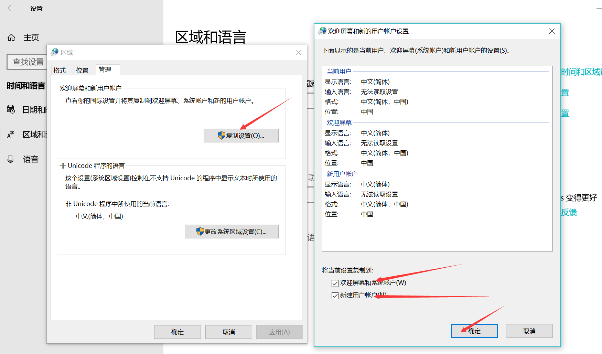

## 删除国际键盘

输入法切换时，英语-美式/英语-国际/中文。

设置=>时间和语言=>区域和语言=>管理语言设置

## 取消FN键盘

Fn + Esc 恢复或取消F1~F12

## WLAN不见了

麻烦右键1535驱动，选择卸载设备，不要勾选对话框，直接点击卸载

完成后，机器关机，然后开机后，马上连续敲击F2，进入后点击右下角restore setting，选择bios default，选择OK，然后点击右下角exit

重启电脑后，进入系统里查看wifi情况

选择网络还是没有无线，接下来考虑的是驱动或者系统问题

麻烦您右键左下角开始按钮--选择windows powershell（管理员 win+x），输入：netsh winsock  reset，回车运行，成功后，重启电脑

## 充电设置

开机F2进入BIOS设置，选择Power Managerment，选择Primary Battery Charge Configuration

## 系统清理

C:\Users\zhangbb\AppData

C:\Windows\Installer

## 快捷键

win + d  窗口最小化

win + e 打开我的电脑

win + x 设备管理器，任务管理器，磁盘管理，设置

win + r 运行。。。

 **ctrl + alt + delete** 注销，切换用户，任务管理器

 **ctrl + shift + delete** 快速清除浏览器缓存

## github无法访问

电脑管家=>工具箱=>DNS优选

常用DNS：
阿里云 (223.5.5.5,  223.6.6.6 )
Google Public DNS （8.8.8.8， 8.8.4.4） 
腾讯 119.29.29.29

C:\Windows\System32\drivers\etc 一般用不到，能访问的指定合适的DNS肯定可以访问

## c盘清理

C:\Users\zhangbb\AppData\Roaming\PCDr    dell诊断支持使用

C:\Program Files\WindowsApps   应用商店，不用可删除

> windows.old 升级备份，可删除

>  删除应用qq/微信缓存

> 关闭休眠：Cortana=>cmd=>以管理员身份运行=>powercfg /h off 

> 删除临时文件：设置=>系统=>存储=>C盘=>临时文件=>删除文件

> 虚拟内存更改：我的电脑=>右键属性=>高级系统设置=>高级=>（视觉效果)设置=>高级=>(虚拟内存)更改

## 开发环境

[Chocolatey Software | Chocolatey - The package manager for Windows](https://chocolatey.org/)

## 网络适配器不见了

网络相关服务被禁止了

1. win+R => msconfig => 服务 => 全部启用

## 禁止MaxxAudio图标

任务管理器 =>　启动　=>  禁止