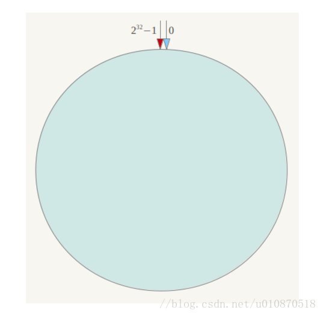
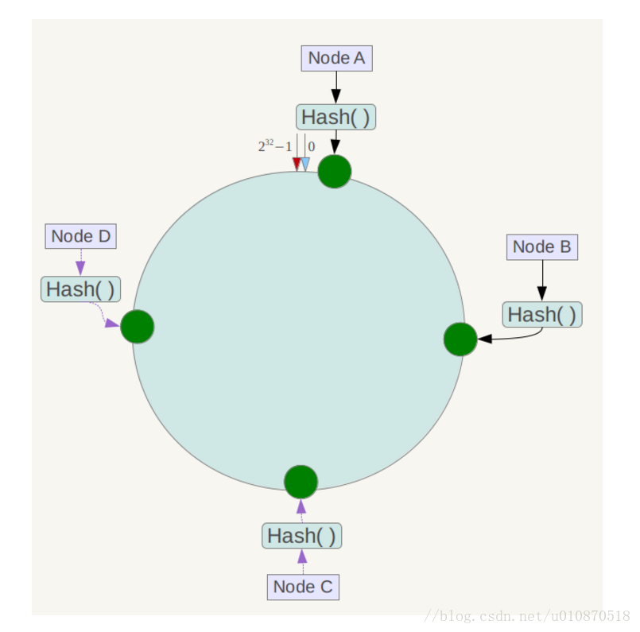
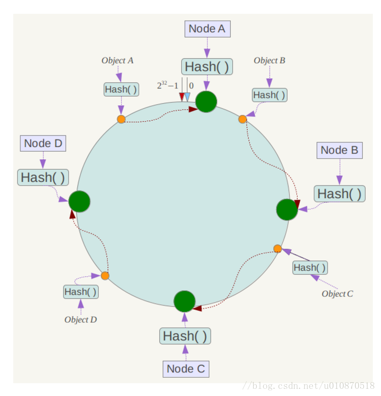
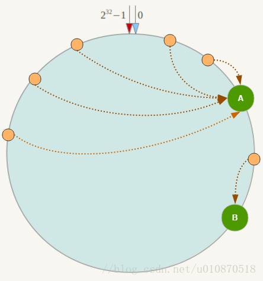
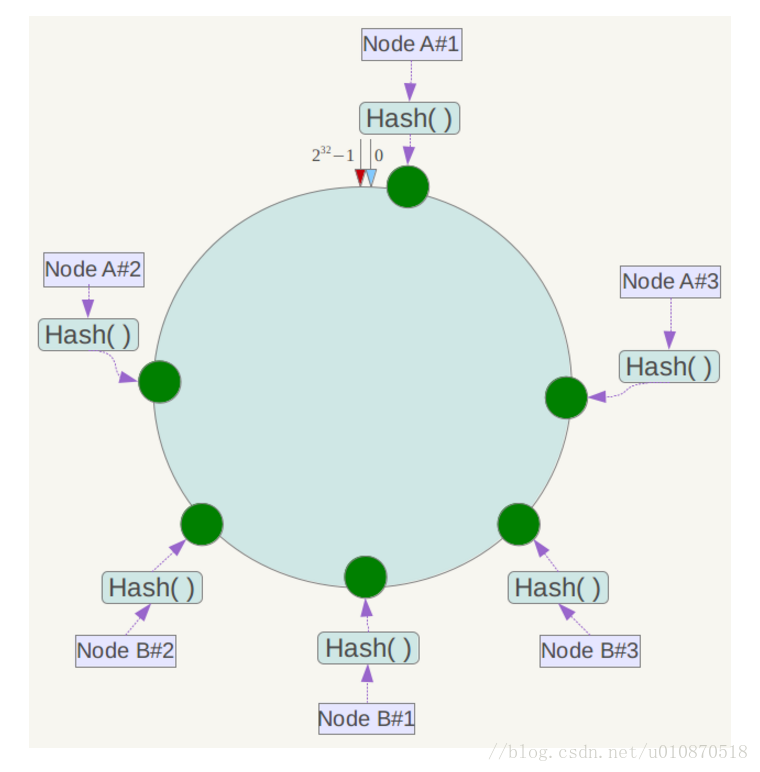

------

常规思路：
> 1.是什么
> 2.解决了什么问题
> 3.是怎么实现的

<!-- more -->

# hash问题
数据库中分库分表规则，按照hash取值、取模、按类别、按某一个字段。
例如redis集群使用hash的方式，对图片缓存, 对服务器的数量进行取模
hash(a.png)%4 = 2

当我们增加或减少一台服务器时，hash(a.png)%5=? hash(a.png)%3=？
redis缓存的图片就找不到了，都会想后端数据库直请求，引发缓存雪崩

# 一致性hash
一致性Hash算法是对2^32取模, 整个哈希值空间组织成一个虚拟的圆环，  
如假设某哈希函数H的值空间为0-2^32-1（即哈希值是一个32位无符号整形）  
整个哈希环如下:

整个空间按顺时针方向组织，圆环的正上方的点代表0，0点右侧的第一个点代表1，  
以此类推，2、3、4、5、6……直到2^32-1，也就是说0点左侧的第一个点代表2^32-1，   
0和2^32-1在零点中方向重合，我们把这个由2^32个点组成的圆环称为Hash环。

下一步将各个服务器使用Hash进行一个哈希，具体可以选择服务器的IP或主机名作  
为关键字进行哈希，这样每台机器就能确定其在哈希环上的位置，这里假设将上文  
中四台服务器使用IP地址哈希后在环空间的位置如下： 

下一步将各个服务器使用Hash进行一个哈希，具体可以选择服务器的IP或主机名作  
为关键字进行哈希，这样每台机器就能确定其在哈希环上的位置，这里假设将上文  
中四台服务器使用IP地址哈希后在环空间的位置如下： 

将数据key使用相同的函数Hash计算出哈希值，并确定此数据在环上的位置，从此位  
置沿环顺时针“行走”，第一台遇到的服务器就是其应该定位到的服务器！

例如我们有Object A、Object B、Object C、Object D四个数据对象，经过哈希计算  
后，在环空间上的位置如下：

根据一致性Hash算法，数据A会被定为到Node A上，B被定为到Node B上，C被定为到  
Node C上，D被定为到Node D上。

# 一致性Hash算法的容错性和可扩展性

一致性Hash算法对于节点的增减都只需重定位环空间中的一小部分数据，具有较好的  
容错性和可扩展性。

# Hash环的数据倾斜问题
一致性Hash算法在服务节点太少时，容易因为节点分部不均匀而造成数据倾斜（被缓存  
的对象大部分集中缓存在某一台服务器上）问题，例如系统中只有两台服务器，其环分布如下： 

此时必然造成大量数据集中到Node A上，而只有极少量会定位到Node B上。为了解决这  
种数据倾斜问题，一致性Hash算法引入了虚拟节点机制，即对每一个服务节点计算多个  
哈希，每个计算结果位置都放置一个此服务节点，称为虚拟节点。具体做法可以在服务  
器IP或主机名的后面增加编号来实现。

同时数据定位算法不变，只是多了一步虚拟节点到实际节点的映射，使很少的服务节点  
也能做到相对均匀的数据分布

