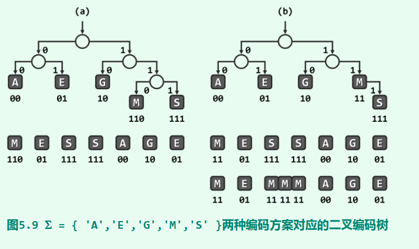

# 树

| 概念 | 描述 |
|:-|:-|
| 树的定义| tree 是一个有限非空集合, 其中一个元素为根(root), 余下的元素组成t的子树|
| 树的叶子| 没有孩子的节点称为叶子|
| 树的层级| level 根的级为1, 孩子的级为2|
| 树的高度| 叶节点的深度, 根节点的高度为0|
| 元素的度| degree of element 孩子的个数, 叶子节点的度为0|

# 二叉树
## 二叉树及其表示

二叉树的定义: tree 是一个有限非空集合; 根元素 + 2个二叉树组成, 分别称为t的左子树和右子树

有序二叉树: 节点的度数均不超过2个

满二叉树: 有2^h-1个元素

完全二叉树: 从满二叉树中删除k个元素,　称为完全二叉树,  满二叉树是完全二叉树的一个特例

特点：
	每个元素有两棵子树
	每个元素的子树都是有序的，可以用左右来区分
	
特性：
	1. 包含n(n>0)个元素的二叉树边数为n-1
	2. 若二叉树的高度或深度(层数)h, h>=0, 则该二叉树至少有h个元素, 最多有2^h-1个元素(满二叉树)
	3. 包含n个元素的二叉树最大高度为n, 最小为log2^(n+1)
	4. 设完全二叉树中一元素序号为i, 1<=i<=n, 则有以下关系:
		1) 当i=1时, 该元素为二叉树的根; 若i>1, 则该元素的父节点编号i/2
		2) 当2i>n时, 该元素无左孩子; 否则其左孩子编号为2i
		3) 当2i+1>n时, 该元素无右孩子; 否则该右孩子编号为2i+1
		
-------------------------------------------------------------------

## 编码树
PFC编码树, 每个字符对应叶子节点, 顺序？

## 二叉树的实现

## 二叉树的遍历

## Huffman 编码

公式化描述: 按层级的数组

链表描述: 
template <class T>
class BinaryTreeNode
{
public:
	Visit(BinaryTreeNode<T>* );
	void PreOrder(BinaryTreeNode<T>* );
	void InOrder(BinaryTreeNode<T>* );
	void PostOrder(BinaryTreeNode<T>* );
	void LevelOrder(BinaryTreeNode<T>* );

public:
	BinaryTreeNode(){}
	BinaryTreeNode(const T& e) { data = e; }
	BinaryTreeNode(const T&e, BinaryTreeNode* l, BinaryTreeNode* r)
	{
	}
private:
	T data;
	BinaryTreeNode<T>* liftChild = 0;
	BinaryTreeNode<T>* rightChild = 0;
}

遍历:
void PreOrder(BinaryTreeNode<T>* t)
{
  if(t)
  {
    Visit(t);
	PreOrder(t->leftChild);
	PreOrder(t->rightChild);
  }
}

void InOrder(BinaryTreeNode<T>* t)
{
  if(t)
  {
	InOrder(t->leftChild);
    Visit(t);
	InOrder(t->rightChild);
  }
}

void PostOrder(BinaryTreeNode<T>* t)
{
  if(t)
  {
    PostOrder(t->leftChild);
	PostOrder(t->rightChild);
    Visit(t);
  }
}

void LevelOrder(BinaryTreeNode<T>* t)
{
  LinkedQueue<BinaryTreeNode<T>*> list;
  while(t)
  {
    Visit(t);
	list.add(t->leftChild);
	list.add(t->rightChild);
	
	list.delete(t); // vector erase
	// return;
  }
}

--------------------------------------------------------------

类BinaryTree
template <class T>
class BinaryTree
{
public:
	BinaryTree(){root = 0;}
	~BinaryTree(){}
	bool IsEmpty(){ return root ? true : false; }
	bool RootValue(T& x);
	void MakeTree(T& e, BinaryTree& leftTree, BinaryTree& rightTree);
	void BreakTree(T& e, BinaryTree& leftTree, BinaryTree& rightTree);
	
	void PreOrder(void (*Visit)(BinaryTreeNode<T>* u))
	{ PreOrder(Visit, root); }
	void InOrder(void (*Visit)(BinaryTreeNode<T>* u))
	{ InOrder(Visit, root); }
	void PostOrder(void (*Visit)(BinaryTreeNode<T>* u))
	{ PostOrder(Visit, root); }
	void LevelOrder(void (*Visit)(BinaryTreeNode<T>* u))
	{ LevelOrder(Visit, root); }

private:
	BinaryTreeNode<T>* root;
}

bool RootValue(T& x)
{
  if(root)
  {
    x = root->data;
	return true;
  }
  else
  {
    return false;
  }
}

		

