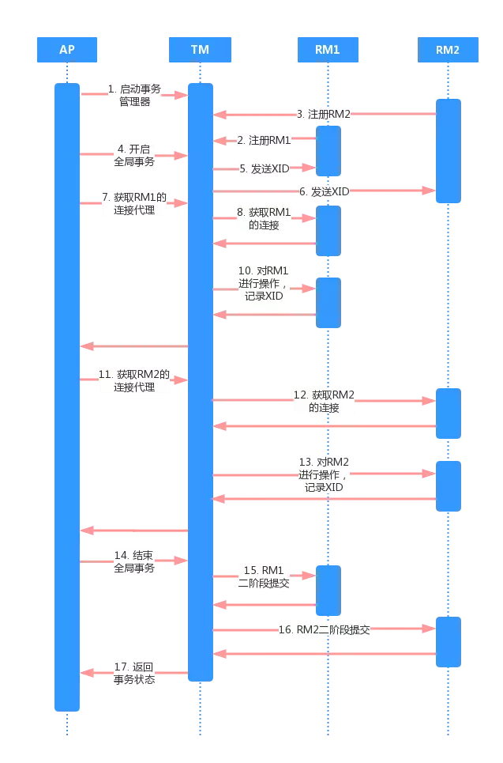
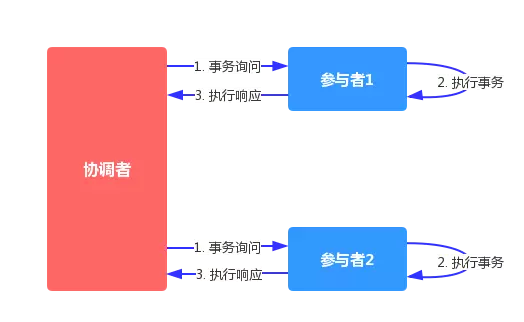

# 前言
由于BASE理论需要在一致性和可用性方面做出权衡，因此涌现了很多关于一致性的算法和协议。  
其中比较著名的有二阶提交协议（2 Phase Commitment Protocol），三阶提交协议（3 Phase   
Commitment Protocol）和Paxos算法。

本文要介绍的2PC协议，分为两个阶段提交一个事务。并通过协调者和各个参与者的配合，实现  
分布式一致性。

<!-- more -->

| 角色 | XA概念 | 作用 |
|:-    |:-      |:-    |
|协调者|事务管理器|协调各个参与者,对分布式事务进行提交或回滚|
|参与者|资源管理器|分布式集群中的节点|

# 分布式事务
分布式事务是指会涉及到操作多个数据库的事务。目的是为了保证分布式系统中的数据一致性
关键：
1. 需要记录事务在任何节点所做的所有动作
2. 事务进行的所有操作要么全部提交，要么全部回滚

# XA规范
XA规范是由 X/Open组织（即现在的 Open Group ）定义的分布式事务处理模型。 X/Open DTP   
模型（ 1994 ）包括：
> * 应用程序（ AP ）
> * 事务管理器（ TM ）：交易中间件等
> * 资源管理器（ RM ）：关系型数据库等
> * 通信资源管理器（ CRM ）：消息中间件等

XA规范定义了交易中间件与数据库之间的接口规范（即接口函数），交易中间件用它来通知数据  
库事务的开始、结束以及提交、回滚等。而XA接口函数由数据库厂商提供
> 二阶提交协议和三阶提交协议就是基于XA规范提出的其中，二阶段提交就是实现XA分布式事务的关键。

XA规范的流程，大致如图所示：

# 2PC
## 定义
每个参与者将操作成败通知协调者，再由协调者根据所有参与者的反馈情报，决定各参与者是否要提交操  
作还是中止操作。

## 准备阶段
准备阶段分为三个步骤：

1. 事务询问
协调者向所有的参与者询问，是否准备好了执行事务，并开始等待各参与者的响应。

2. 执行事务
各参与者节点执行事务操作。如果本地事务成功，将Undo和Redo信息记入事务日志  
中，但不提交；否则，直接返回失败，退出执行。

3. 各参与者向协调者反馈事务询问响应
如果参与者成功执行了事务操作，那么就反馈给协调者 Yes响应，表示事务可以执行  
提交；如果参与者没有成功执行事务，就返回No给协调者，表示事务不可以执行提交。

## 提交阶段
根据准备阶段的投票结果执行2种操作:提交事务或中断事务

### 提交事务过程
1. 发送提交请求
协调者向所有参与者发出commit请求。
2. 事务提交
参与者收到commit请求后，会正式执行事务提交操作，并在完成提交之后，释放整个事  
务执行期间占用的事务资源。
3. 反馈事务提交结果
参与者在完成事务提交之后，向协调者发送Ack信息。
4. 事务提交确认
协调者接收到所有参与者反馈的Ack信息后，完成事务。

### 中断事务过程
1. 发送回滚请求
协调者向所有参与者发出Rollback请求。
2. 反馈事务回滚结果
参与者在完成事务回滚之后，想协调者发送Ack信息。
3. 事务回滚
参与者接收到Rollback请求后，会利用其在提交阶段种记录的Undo信息，来执行事务回滚  
操作。在完成回滚之后，释放在整个事务执行期间占用的资源。
4. 事务中断确认
协调者接收到所有参与者反馈的Ack信息后，完成事务中断。

## 优缺点
> * 优点：原理简单，实现方便。
> * 缺点：同步阻塞，单点问题，数据不一致，容错性不好。

### 同步阻塞
所有的节点都在等待其他节点的响应，无法进行其他操作。这种同步阻塞极大的限制了分布式  
系统的性能。(mapreduce里面是顺序执行)

### 单点问题
协调者是个单点, 如果协调者在提交阶段出现问题，那么整个流程将无法运转

### 数据不一致
协调者向所有的参与者发送commit请求之后，发生了局部网络异常，或者是协调者在尚未发送  
完所有 commit请求之前自身发生了崩溃，导致最终只有部分参与者收到了commit请求。

### 容错性不好
如果在二阶段提交的提交询问阶段中，参与者出现故障，导致协调者始终无法获取到所有参与  
者的确认信息，这时协调者只能依靠其自身的超时机制，判断是否需要中断事务。显然，这种  
策略过于保守。换句话说，二阶段提交协议没有设计较为完善的容错机制，任意一个节点是失  
败都会导致整个事务的失败。

