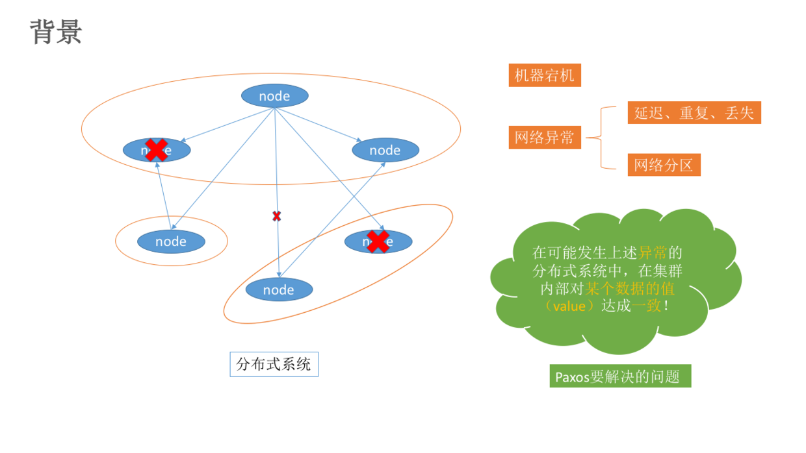
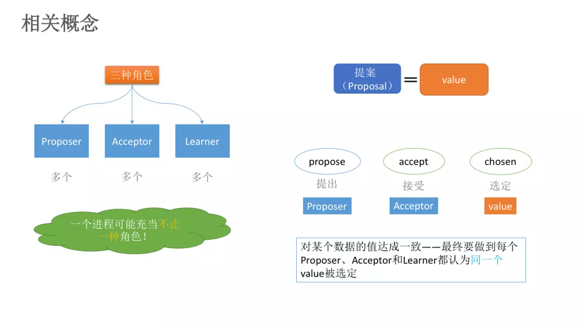
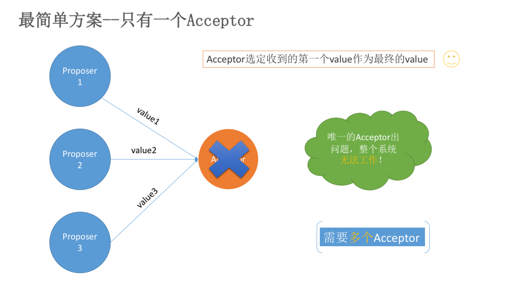
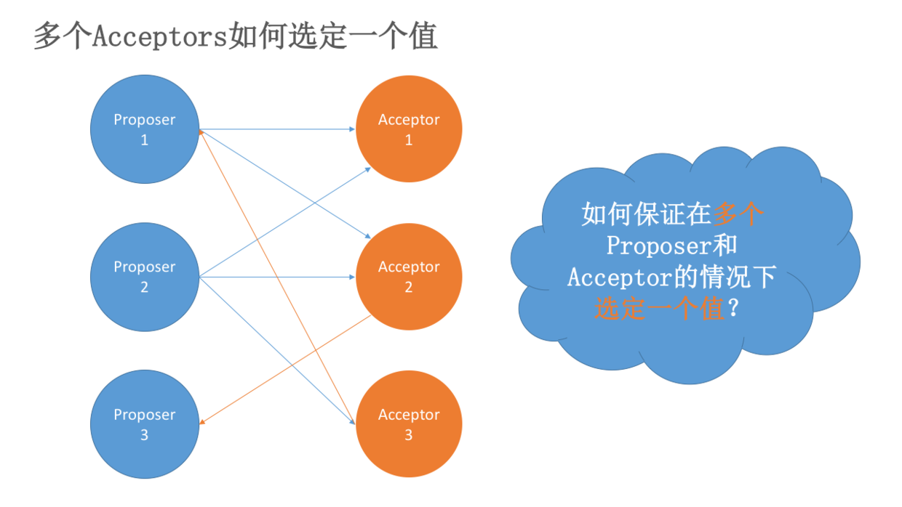
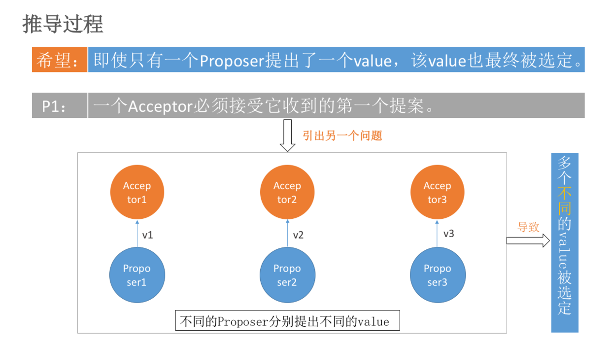
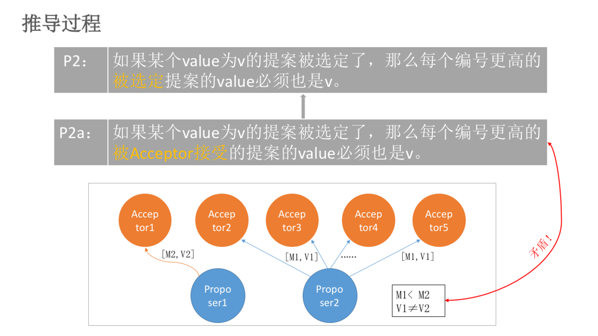
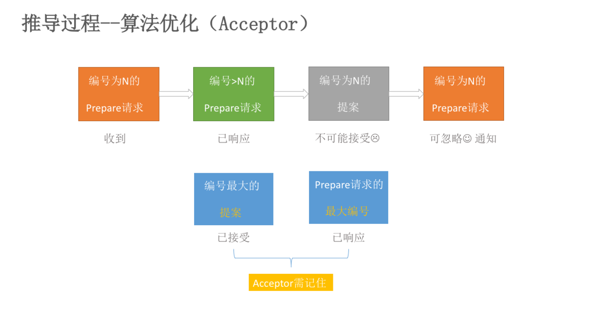
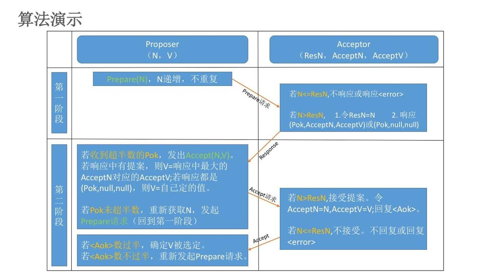
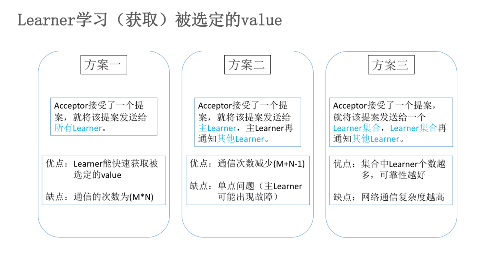
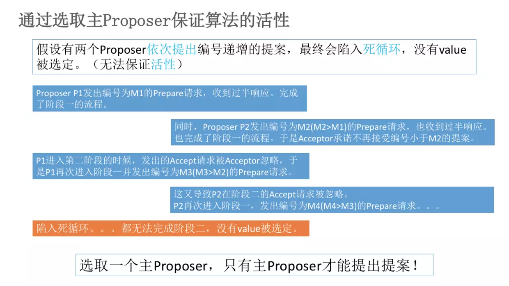

# 前言
世界上只有一种一致性算法, 就是Paxos(帕克索斯), 出自一位 Google 大神之口。

Paxos解决了2PC，3PC中的各种硬伤, 在很多大长都有工程实践。比如阿里的 OceanBase 分布式数据库，底层  
就是使用的 Paxos 算法。再比如 Google 的 chubby 分布式锁 也是用的这个算法。可见该算法在分布式系统  
中的地位，甚至于Paxos 就是 分布式一致性 的代名词。
<!-- more -->
------
# 1. Paxos算法是什么
Paxos 算法是 基于消息传递 且具有 高效容错特性 的一致性算法，目前公认的解决 分布式一致性问题 最有效  
的算法之一。
------
# 2. 解决了什么问题(产生背景)
在常见的 分布式系统 中，总会发生 节点宕机 或 网络异常 (包括消息的 重复、丢失、延迟、乱序、网络分区)  
等情况。Paxos 算法主要就是解决如何在一个 发生如上故障 的分布式系统中，快速正确的在集群内 对某个值达  
成一致，并且保证 整个系统的一致性。

------
# 3. 算法详解
## 角色 
> Proposer: Proposer 可以 提出提案 (Proposal)
> Acceptor: Acceptor 可以 接受提案。一旦接受提案，提案 里面的 value 值就被选定了
> Leaner: Acceptor 告诉 Learner 哪个提案被选定了，那么 Learner 就学习这个被选择的 value
在具体的实现中，一个进程即可能是Proposer,也可能是Acceptor，也可能是Learner。

注意：提案的范围>value.后面会讲到，[提案=编号+Value].也可表示为[M,V].以下描述中暂定: 提案=P，Value=V

## 问题描述
Paxos 算法的核心是 一致性。所以将从一致性问题的描述来讲解该算法怎么解决实际问题。
### 一致性算法的前置条件
> 在被提出的 P 中，只有一个 V 被选中
> 如果没有 P 被提出，就没有 V 被选中
> 在 P 被选定后，进程都可以学习被选中的 P

### 不同角色通过发送消息进行通信
1. 每个角色以任意的速度执行，可能因出错而停止，也可能会重启。一个 value 被选定后，所有的角色可能失败然  
后重启，除非那些失败后重启的角色能记录某些信息，否则等他们重启后无法确定被选定的值

2. 消息在传递过程中可能出现 任意时长的延迟，可能会 重复，也可能 丢失，但是消息不会被 损坏

## 推导过程
### 只有一个Acceptor

> 问题：如果这个 Acceptor 宕机，那么整个系统服务不可用

### 多个Acceptor

> 问题：如何在多 Proposer 和多 Acceptor 情况下，选定一个 value？

讲解步骤分两阶段：约定 P1 和 约定 P2。

### 约定P1
> * P1 ：一个 Acceptor 必须接受一个它收到的第一个 P。

如果每个 Proposer 会产生不同的 P，那么多个 Proposer 必定产生多个 P，发给多个 Acceptor。根据 约定 P1，  
Acceptor 分别接受到 P，就会导致不同的 V 被选定，如下图所示：

如上图所示，P1 会产生的问题: v1、v2、v3 都没有被选定，因为他们只有被一个 Acceptor 接受。
对于上述问题，我们需要一个额外的约定:

> * P1a : 一个提案 P 被选定，需要被半数以上 Acceptor 接受.

对于 P1a，其实就意味着 一个Acceptor必须接受不止一个提案。显然，这与 P1 相矛盾，所以需要重新设计提案。  
原来的设计是: [提案P = value]，现在重新设计 [提案P = 提案编号 + value]，可表示为 [M，V]。

新问题：多提案被选定，如何保证被选定的提案 P 具有相同的value?

### 约定P2
> * P2 : 如果提案 P[M0,V0] 被选定了，那么所有比 M0 编号更高的，且被选定的 P，其 value 的值也是 V0。

对于 P2 中的 “被选定”：一个提案要被选定，首先至少要被一个 Acceptor 批准。因此，可以理解 P2 为：

> * P2a : 如果提案 P[M0,V0] 被选定了，那么所有比 M0 编号更高的，且 [被Acceptor批准] 的P，其 value   
值也是 V0。

只要满足 P2a，就能满足 P2。多提案被选择 的问题解决了，但是由于 网络不稳定 或者 宕机 的原因(不可避免)  
会产生新问题：

假设有 5 个 Acceptor。Proposer2 提出 [M1,V1]的提案，Acceptor2~5（半数以上）均接受了该提案，于是  
对于  Acceptor2~5 和 Proposer2 来讲，它们都认为 V1 被选定。Acceptor1 刚刚从 宕机状态 恢复过来  
（之前 Acceptor1  没有收到过任何提案），此时 Proposer1 向 Acceptor1 发送了 [M2,V2] 的提案   
（V2≠V1且M2>M1）。对于 Acceptor1 来讲，这是它收到的 第一个提案。根据 P1（一个 Acceptor 必须接受  
它收到的 第一个提案），Acceptor1 必须接受该提案。同时 Acceptor1 认为 V2 被选定。

这就出现了两个问题：
1. Acceptor1 认为 V2 被选定，Acceptor2~5 和Proposer2 认为 V1 被选定。出现了不一致。
2. V1 被选定了，但是 编号更高 的被 Acceptor1 接受的提案 [M2,V2] 的 value 为 V2，且 V2≠V1。这就  
跟 P2a（如果某个 value 为 v的提案被选定了，那么每个 编号更高 的被 Acceptor 接受的提案的 value   
必须也是 v）矛盾了

基于以上问题，所有就有了 P2b:
> * P2b : 如果 P[M0,V0] 被选定后，任何 Proposer 产生的 P，其值也是 V0

对于 P2b 中的描述，怎样保证 任何Proposer产生的P，其值也是V0 ？只要满足 P2c 即可：
> * P2c: 对于任意的 M、V，如果 [M,V] 被提出，那么存在一个半数以上的 Acceptor 组成的组合 S，满足  
以下两个条件中的任何一个：
1. S 中没有一个接受过编号小于 M 的提案。
2. S 中的 Acceptor 接受过的最大编号的提案的 value 为 V。

## 算法流程
### Proposer提出提案
#### (一). 学习阶段：Prepare请求
Proposer 选择一个新的提案 P[MN,?] 向 Acceptor 集合 S（数目在半数以上）发送请求，要求  
 S 中的每一个 Acceptor 做出如下响应:
1. 如果 Acceptor 没有接受过提案，则向 Proposer 保证 不再接受编号小于N的提案
2. 如果 Acceptor 接受过请求，则向 Proposer 返回 已经接受过的编号小于N的编号最大的提案

#### (二). 接受阶段：Acceptor请求
1. 如果 Proposer 收到 半数以上 的 Acceptor 响应，则 生成编号为 N，value 为 V 的提案   
[MN,V]，V 为所有响应中 编号最大 的提案的 value
2. 如果 Proposer 收到的响应中 没有提案，那么 value 由 Proposer 自己生成，生成后将此  
提案发给 S，并期望 Acceptor 能接受此提案

### Acceptor接受提案
Acceptor 可以忽略任何请求（包括 Prepare 请求和 Accept 请求）而不用担心破坏 算法的安全性。  
什么时候 Acceptor 可以响应一个请求?

> * P1b：一个 Acceptor 只要尚未响应过任何编号大于 N 的 Prepare 请求，那么就可以接受这个  
编号为 N 的提案。

如果 Acceptor 收到一个编号为 N 的 Prepare 请求，在此之前它已经 响应过 编号大于 N 的   
Prepare 请求。根据 P1b，该 Acceptor 不可能接受编号为 N 的提案。因此，该 Acceptor 可以   
忽略 编号为 N 的 Prepare 请求。当然，也可以回复一个 error，让 Proposer 尽早知道自己的  
提案 不会被接受。

因此，一个 Acceptor 只需记住:
1. 已接受的编号最大的提案
2. 已响应的请求的最大编号

------
# 4. Paxos算法描述

------
# 5. Learner学习提案

------
# 6. 如何保证Paxos算法的活性

------
# 7. 小结
Paxos 在 节点宕机恢复、消息无序或丢失、网络分化 的场景下能保证 数据的一致性。而 Paxos  
的描述侧重于 理论，在实际项目应用中，处理了 N 多实际细节后，可能已经变成了另外一种算法，  
这时候正确性已经无法得到理论的保证。

要证明分布式一致性算法的正确性通常比实现算法还困难。所以很多系统实际中使用的都是以 Paxos  
理论 为基础而 衍生 出来的变种和简化版。例如 Google 的 Chubby、MegaStore、Spanner 等系统， 
ZooKeeper 的 ZAB 协议，还有更加容易理解的 Raft 协议。

