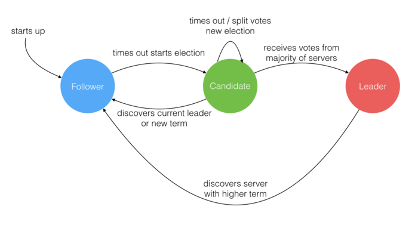
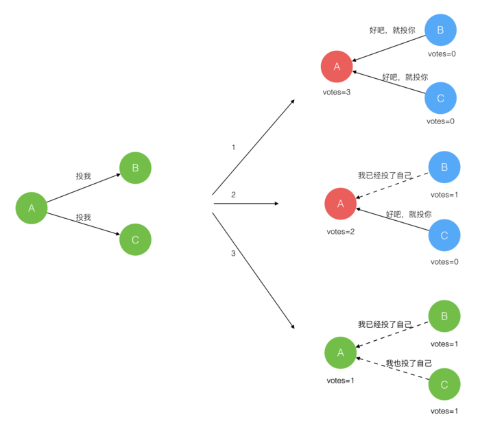
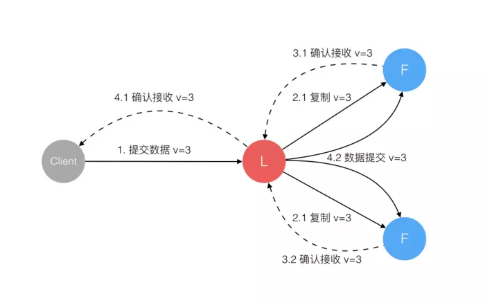
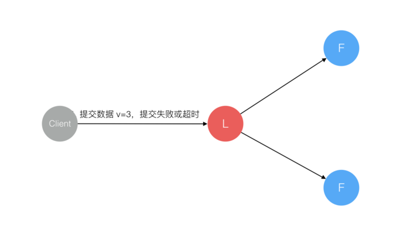
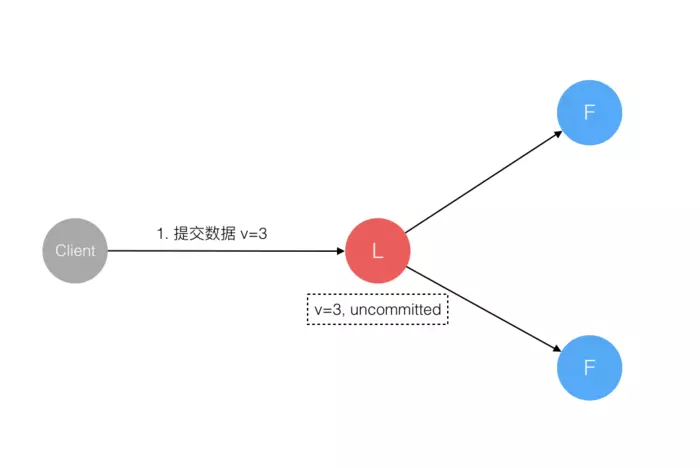

# 前言

Raft 也是一个 易于理解一致性算法，和 Paxos 目标相同, 区别在于选举的 具体过程 不同。

# 什么是Raft协议
Raft 协议组织的集群中有三类角色：
> * Leader（领袖）
> * Follower（群众）
> * Candidate（候选人）
<!-- more -->

一个 Server 进程在某一时刻，只能是其中 一种类型，但这不是固定的。不同的时刻，它可能拥有不同的类型，  
一个 Server 进程的类型是如何改变的，后面会有解释。

就像一个民主社会，领袖由民众投票选出。刚开始没有 领袖，所有集群中的 参与者 都是 群众，那么首先开启  
一轮大选。在大选期间 所有群众 都能参与竞选，这时所有群众的角色就变成了 候选人，民主投票选出领袖后  
就开始了这届领袖的任期，然后选举结束，所有除 领袖 的 候选人 又变回 群众角色 服从领袖领导。

这里提到一个概念 「任期」，用术语 Term 表达。关于 Raft 协议的核心概念和术语就这么多，而且和现实民主  
制度非常匹配，所以很容易理解。

三类角色的变迁图如下：

# Leader选举过程
在极简的思维下，一个最小的 Raft 民主集群需要 三个参与者（如下图：A、B、C），这样才可能投出多数票。

初始状态 ABC 都是 Follower，然后发起选举这时有 三种 可能的情形发生。下图中前二种都能选出 Leader，  
第三种则表明 本轮投票无效（Split Votes）。对于第三种，每方都投给了自己，结果没有任何一方获得多数票。  
之后 每个参与方 随机休息一阵（Election Timeout）重新发起投票直到一方获得多数票。这里的关键就是随机   
timeout，最先从 timeout 中恢复发起投票的一方，向还在 timeout 中的另外两方 请求投票，这时它就只能投  
给自己，导致很快达成一致。

选出 Leader 后，Leader 通过 定期 向所有 Follower 发送 心跳信息 维持其统治。若 Follower 一段时间未  
收到 Leader 的 心跳，则认为 Leader 可能已经挂了，然后再次发起 选举 过程。

# Leader对一致性的影响
Raft 协议 强依赖 Leader 节点的 可用性，以确保集群 数据的一致性。数据的流向 只能从 Leader 节点向   
Follower 节点转移。具体过程如下：

1. 当 Client 向集群 Leader 节点 提交数据 后，Leader 节点 接收到的数据 处于 未提交状态（Uncommitted）
2. 接着 Leader 节点会 并发地 向所有 Follower 节点 复制数据 并 等待接收响应
3. 集群中至少 超过半数 的节点 已接收 到数据后， Leader 再向 Client 确认数据 已接收
4. 一旦向 Client 发出数据接收 Ack 响应后，表明此时 数据状态 进入 已提交（Committed），Leader 节点再  
向 Follower 节点发通知告知该 数据状态已提交

在这个过程中，主节点 可能在 任意阶段 挂掉，看下 Raft 协议如何针对不同阶段保障 数据一致性 的。

## 情形1
数据到达 Leader 节点前，这个阶段 Leader 挂掉不影响一致性，不用多说。

## 情形2
数据到达 Leader 节点，但未复制到 Follower 节点。
这个阶段 Leader 挂掉，数据属于 未提交状态，Client 不会收到 Ack 会认为 超时失败 可安全发起 重试。

Follower 节点上没有该数据，重新选主 后 Client 重试 重新提交 可成功。原来的 Leader 节点 恢复 后作为 
Follower 加入集群，重新从 当前任期 的新 Leader 处 同步数据，强制保持和 Leader 数据一致。

## 情形3

## 情形4

## 情形5

## 情形6

## 情形7

## 验证结果
综上穷举分析了 最小集群（3 节点）面临的所有情况，可以看出 Raft 协议都能很好的应对 一致性问题，并且很  
容易理解。

# 小结
Paxos 算法是 Leslie Lamport 在 1990 年就公开发表在了自己的网站上，想想我们是什么时候才听说的？什么  
时候才有一个可用的实现？而 Raft 算法是 2013 年发表的，大家在参考 Raft开源实现库，可以看到有很多基于  
不同语言的 [开源实现库](https://raft.github.io/#implementations)，这就是 可理解性 的重要性。

