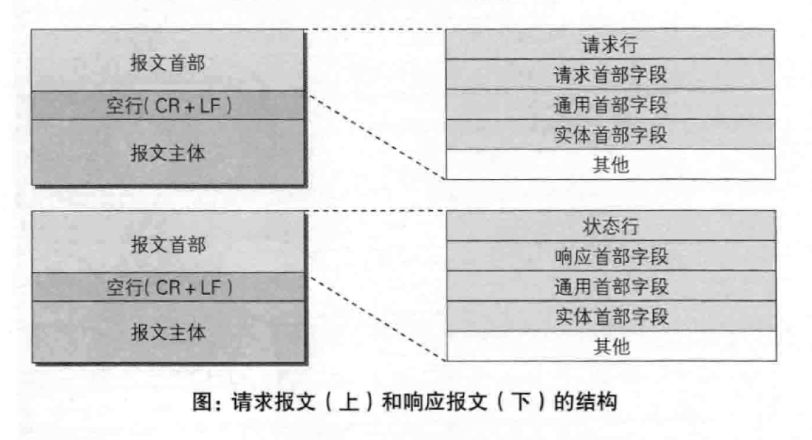

# 基本概念
## 定义
HTTP(Hypertext Transfer Protocol) 超文本传输协议, 用HTML超文本标记语言 
(Hypertext Markup Language)作为创建网页的标准

## 特点
支持客户/服务器模式
简单快速：客户向服务器请求服务时，只需传送请求方法和路径, 常用的有GET、HEAD、POST
灵活：允许传输任意类型的数据对象, 传输的类型由Content-Type加以标记
无连接：限制每次连接只处理一个请求, 处理完后关闭连接
无状态：协议对于事务处理没有记忆能力

<!-- more -->
## 网络基础
HTTP使用的传输层协议为可靠的TCP协议，而网络层使用的是IP协议

## URI和URL
URI(Uniform Resource Identifier) 统一资源标识符(RFC2396定义), 就是由某个协议 
方案表示的资源的定位标识符, URL是URI的子集
```
http://www.rfc.com/rfc/rfc.txt
ftp://ftp.rfc.com/rfc/rfc.txt
......
```

# 简单的HTTP协议

|方法|说明|
|:-|:-|
|GET|获取资源|
|POST|传输实际主体|
|PUT|传输文件|
|HEAD|获得报文首部|
|DELETE|删除文件|
|OPTIONS|询问支持的方法|
|TRACE|追踪路径|
|CONNECT|要求用隧道协议链接代理|

使用cookie进行状态管理

# http报文
由报文首部和报文主体组成, 一般CR(Carriage Return 回车符0x0d)+LF(Line Feed 换行符0x0a)来划分



## 压缩编码
常用的内容编码 gzip(GNU zip), compress(UNIX), default(zip), identity(不进行编码)

## 分块传输
from-data, byteranges

## 内容协商返回
服务器驱动(在服务端自动处理)/客户端驱动/透明协商

# http状态码

## 状态码类别
||类别|原因|
|:-|:-|:-|
|1xx|指示信息|接收的请求正在处理|
|2xx|成功|请求正常处理完毕|
|3xx|重定向|请求需要进行更进一步操作|
|4xx|客户端错误|服务器无法处理请求|
|5xx|服务端错误|服务器处理请求出错|

## 2xx 
200 ok 请求被正常处理
204 no content 请求被正常处理, 不返回任何实体, 浏览器页面不更新
206 Partial content 范围请求响应

## 3xx 
301 Moved Permanently 永久重定向, 请求资源已被分配了新的URI
302 Found 临时重定向, 请求资源已被分配了新的URI, 将来有可能还会发生改变
303 See Other 请求对应资源存在另一个URI, 用GET方法定向获取
304 Not Modified 客户端发送条件请求, 服务端允许访问资源, 但不满足条件, 返回304, 和重定向无关
307 Temporary Redirect 临时重定向, 禁止POST变成GET, 实际取决于浏览器

## 4xx 
400 bad request 请求报文语法错误
401 unauthorized 需要认证信息
403 forbidden 请求资费的访问被拒绝
404 not found 服务器上无法找到请求资源

## 5xx 
500 internal server err 服务端在执行请求发生了错误
503 service unavaliable 服务器无法处理请求, 负载太大或停机

# Web服务器 
## 代理
只是转发请求, 每次代理转发追加Via信息
## 网关
使通信线路上的服务器提供非HTTP协议服务
## 隧道
建立一条与其他服务器通信线路, 使用SSL等加密手段通信
## 缓存
指代理服务器或客户端本地磁盘内保存的副本

# http首部


# https


