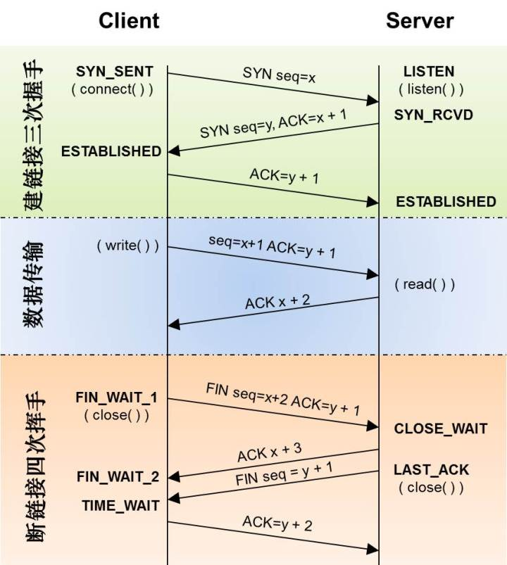
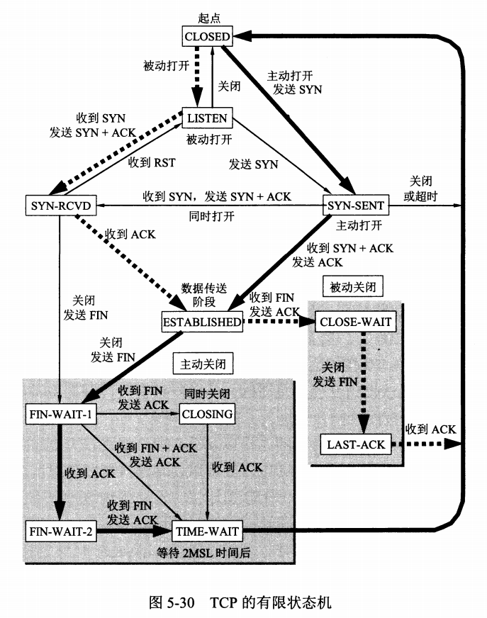

# 简历重构

[经验]( https://www.zhihu.com/question/29693016 )

## 项目描述

项目描述两三行，然后概括下我大概做了哪几个模块，完了。 

找2-3个亮点, 一句话高度概括，突出亮点。

比如：

>  我负责这个系统中爬虫的开发，终端控制管理，店铺管理

>负责系统中爬虫模块的开发，用于爬取影片的各种信息，包括年份，介绍，主演信息等

> 独立开发多线程影片信息爬虫工具， 并针对线程池性能、网络异常以及反爬虫措施进行多次优化，容错性良好并达到并发请求30+的QPS

面试的人有问题可以提，自己也可以掌握主动权，把握方向。


# 面试技巧

1 简历一行行看，不要给自己挖坑

2 心态平和，正常表达，逻辑清晰有条理

3 缘分和运气

4 要有信念， 努力+坚持


# 目标


# 学习准备

[ C/C++ 技术面试基础知识总结 ]( https://github.com/huihut/interview )

[ 技术面试必备基础 ]( https://github.com/CyC2018/CS-Notes )


## C/C++

const / static / this / inline / volatile / assert / sizeof / #program pack(n) / 位域 

extern / struct class union / explicit / friend / using / enum / decltype 

引用 / 成员初始化列表  / 面向对象 / 虚析构函数 / 纯虚函数 / 虚函数 纯虚函数 

虚函数表 指针 / 虚继承 / 模板类 函数 虚函数 / 抽象类 接口类 聚合类 / 内存分配管理 

delete this / 定义只能在堆或栈上生成的类 / 智能指针 / 强制类型转换运算符号 

### const 

修饰指针，分为指向常量的指针和指针常量

修改是引用，常量引用，避免拷贝和修改

```c++
int * const p //指针常量
    
int a，b；
int * const p=&a //指针常量
//那么分为一下两种操作
*p=9;//操作成功
p=&b;//操作错误

const int *p = &a; //常量指针
int a，b；
 const int *p=&a //常量指针
//那么分为一下两种操作
*p=9;//操作错误
p=&b;//操作成功

const int * const b = &a;//指向常量的指针常量
```


### static

1. 修饰变量，存储在静态区，在main函数前分配了空间

2. 修饰函数，表明函数作用范围，仅在定义该函数的文件内使用。一般为了避免与其他命名空间函数重名

3. 修饰成员变量，不需要生成对象就能访问，只保存一份

4. 修饰成员函数，不需要生成对象就能访问，在static函数内不能访问非静态成员

### this 指针

1. 定义：隐含于非静态成员函数的特殊指针，指向调用该函数的对象

2. 当一个对象调用成员函数时，编译程序先将对象地址赋值给this指针，存取数据成员都隐式使用this指针

3. 当一个成员函数被调用时，自动向它传递一个隐含的参数(指向成员函数所在对象的指针)

4. this 指针被隐含地声明为: ClassName \*const this，这意味着不能给 this 指针赋值；在 ClassName 类的 const 成员函数中，this 指针的类型为：const ClassName\* const，这说明不能对 this 指针所指向的这种对象是不可修改的（ 不能对这种对象的数据成员进行赋值操作 ）

5. this指针是一个右值，不能取地址 , 不能操作(&this)

6. 应用场景：

   ```c++
   // 链式调用, 返回本对象的引用
   A& add(int a)
   {
       m_a += a;
       return *this;
   }
   
   // 避免对同一对象赋值
   if(this == &other) 
       
   // 实现数据结构，如list
   
   _reverse_iterator_impl operator++()
   { 
       _M_value = _M_value->prev;
       return *this; 
   }
   
   ```

   

### inline 内联函数

#### __为什么需要__

效率高，省去函数调用开销，内联函数会在调用时 "内联的" 展开

```c++
inline int max(int a, int b)
{
 return a > b ? a : b;
}
则调用： cout<<max(a, b)<<endl;

在编译时展开为： cout<<(a > b ? a : b)<<endl;
```

#### __特征__

1)相当于把内联函数里面的内容写在调用内联函数处

2)相当于不用执行进入函数的步骤，直接执行函数体 

3)相当于宏定义，比宏多了类型检查，具有函数特征

4)编译器一般不内联包含循环、递归、switch 等复杂操作的内联函数 

5)在类声明中定义的函数，除了虚函数的其他函数都会自动隐式地当成内联函数 


#### 编译器对内联的处理

1）将内联函数体复制到调用点处

2）为内联函数中的局部变量分配空间

3）将内联函数的输入参数和返回值映射到调用方法的局部变量空间中

4） 如果 inline 函数有多个返回点，将其转变为 inline 函数代码块末尾的分支（使用 GOTO） 

5） 编译器一般不内联包含循环、递归、switch 等复杂操作的内联函数 

6） 在类声明中定义的函数(函数实现)，除了虚函数的其他函数都会自动隐式地当成内联函数 

#### 优缺点

优点：

1） 内联函数同宏函数一样将在被调用处进行代码展开，省去了参数压栈、栈帧开辟与回收，结果返回等，从而提高程序运行速度 

2） 内联函数相比宏函数来说，在代码展开时，会做安全检查或自动类型转换（同普通函数），而宏定义则不会 

3） 在类中声明同时定义的成员函数，自动转化为内联函数，因此内联函数可以访问类的成员变量，宏定义则不能 

4） 内联函数在运行时可调试，而宏定义不可以 

缺点：

1） 代码膨胀。内联是以代码膨胀（复制）为代价，消除函数调用带来的开销。如果执行函数体内代码的时间，相比于函数调用的开销较大，那么效率的收获会很少。另一方面，每一处内联函数的调用都要复制代码，将使程序的总代码量增大，消耗更多的内存空间 

2） inline 函数无法随着函数库升级而升级。inline函数的改变需要重新编译，不像 non-inline 可以直接链接 

3）是否内联，程序员不可控。内联函数只是对编译器的建议，是否对函数内联，决定权在于编译器。是否内联，程序员不可控。内联函数只是对编译器的建议，是否对函数内联，决定权在于编译器	

#### 虚函数可以内联吗

1） 虚函数可以是内联函数，内联是可以修饰虚函数的，但是当虚函数表现多态性的时候不能内联 

2） 内联是在编译器建议编译器内联，而虚函数的多态性在运行期，编译器无法知道运行期调用哪个代码，因此虚函数表现为多态性时（运行期）不可以内联 

3）  inline virtual 唯一可以内联的时候是：编译器知道所调用的对象是哪个类（如 `Base::who()`），这只有在编译器具有实际对象而不是对象的指针或引用时才会发生

### volatile

1）volatile 关键字声明的变量，每次访问时都必须从内存中取出值（没有被 volatile 修饰的变量，可能由于编译器的优化，从 CPU 寄存器中取值）

2）const 可以是 volatile （如只读的状态寄存器）

3）指针可以是volatile 

### assert

 断言，是宏，而非函数。

 assert 宏的原型定义在 ``（C）、``（C++）中，其作用是如果它的条件返回错误，则终止程序执行。可以通过定义 `NDEBUG` 来关闭 assert，但是需要在源代码的开头，`include ` 之前 

```
#define NDEBUG          // 加上这行，则 assert 不可用
#include <assert.h>

assert( p != NULL );    // assert 不可用
```


### sizeof

 sizeof 对数组，得到整个数组所占空间大小 ; sizeof 对指针，得到指针本身所占空间大小。

### 内存对齐

 设定结构体、联合以及类成员变量以 n 字节方式对齐 。

  一般编译器会处理内存对齐，为什么需要？

> 平台移植，一些平台只能取某些特定地址处取特定类型数据 
>
> 硬件原因，对齐后CPU访问内存速度提升，读取按2/4/8/16读取到寄存器中，不对齐多次读取特殊处理

```c++
#pragma pack(push)  // 保存对齐状态
#pragma pack(4)     // 设定为 4 字节对齐
// #pragma pack(push,4)
struct test
{
    char m1;
    double m4;
    int m3;
};

#pragma pack(pop)   // 恢复对齐状态

sizeof(test)=16

// 其他
#pragma pack(push,1)
typedef struct {
	unsigned short int	Rate;				// Playback rate (hertz).
	long	Size;				// Size of data (bytes).
	long	UncompSize;				// Size of data (bytes).
	unsigned char Flags;	// Holds flags for info
								//  1: Is the sample stereo?
								//  2: Is the sample 16 bits?
	unsigned char Compression;	// What kind of compression for this sample?
} AUDHeaderType;
#pragma pack(pop)
```

### 位域

类可以将其（非静态）数据成员定义为位域（bit-field），在一个位域中含有一定数量的二进制位。当一个程序需要向其他程序或硬件设备传递二进制数据时，通常会用到位域。 

- 位域的类型必须是整型或枚举类型，带符号类型中的位域的行为将因具体实现而定
- 取地址运算符（&）不能作用于位域，任何指针都无法指向类的位域

```c++
struct bs     
{     
unsigned int a:4;    
unsigned int :0;  /* 空域, 剩余28bit补全0 */     
unsigned int b:4; /* 从下一单元开始存放 */     
unsigned int c:4;     
};
// 整个结构体的总大小为最宽基本类型成员大小的整数倍
sizeof(bs)=8
sizeof(unsigned int)=4
    
#include <bitset>
bitset<2> foo(12);　　//12的二进制为1100（长度为４），但foo的size=2，只取后面部分，即00
string s = "100101";　　
bitset<4> bar(s);　　//s的size=6，而bitset的size=4，只取前面部分，即1001
foo&bar;
foo^bar;
foo|bar;
~foo;
if(foo[0] == false);
foo.to_string();
foo.to_ullong();

std::hash<std::bitset>(C++11)散列支持
```


### extern

1）被 extern 限定的函数或变量是 extern 类型的（ 不能和static同时修饰 ）。 B模块(编译单元)要是引用模块(编译单元)A中定义的全局变量或函数时，它只要包含A模块的头文件即可, 在编译阶段，模块B虽然找不到该函数或变量，但它不会报错，它会在连接时从模块A生成的目标代码中找到此函数 

2）被 extern "C" 修饰的变量和函数是按照 C 语言方式编译和链接的

```c++
#ifdef __cplusplus
extern "C" {
#endif

NAMESPACE_BILLING40_FRAME CThread* create_instanceRating();

#ifdef __cplusplus
}
#endif
```

### struct/class

struct 更适合看成是一个数据结构的实现体，class 更适合看成是一个对象的实现体。

 ```c++
// c
typedef struct Student {
    int age; 
} S;
// c
struct Student { 
    int age; 
};

typedef struct Student S;

// c++ 可以省略struct
 ```


### union 

联合（union）是一种节省空间的特殊的类，一个 union 可以有多个数据成员，但是在任意时刻只有一个数据成员可以有值。当某个成员被赋值后其他成员变为未定义状态 。具有如下特点：

1）默认访问控制符为 public，不能包含 protected 成员或 private 成员
2）可以含有构造函数、析构函数
3）不能继承自其他类，不能作为基类，不能含有虚函数，不能含有引用类型的成员
4）匿名 union 在定义所在作用域可直接访问 union 成员
5）全局匿名联合必须是静态（static）的

```c++
#include<iostream>

union UnionTest {
    UnionTest() : i(10) {};
    int i;
    double d;
};

static union {
    int i;
    double d;
};

int main() {
    UnionTest u;

    union {
        int i;
        double d;
    };

    std::cout << u.i << std::endl;  // 输出 UnionTest 联合的 10

    ::i = 20;
    std::cout << ::i << std::endl;  // 输出全局静态匿名联合的 20

    i = 30;
    std::cout << i << std::endl;    // 输出局部匿名联合的 30

    return 0;
}
```


### explicit(显示)关键字

1）修饰构造函数时，可以防止隐式转换和复制初始化
2）修饰转换函数时，可以防止隐式转换，但 按语境转换 除外

```c++
struct A
{
	A(int) { }
	operator bool() const { return true; }
};

struct B
{
	explicit B(int) {}
	explicit operator bool() const { return true; }
};

void doA(A a) {}

void doB(B b) {}

int main()
{
	A a1(1);		// OK：直接初始化
	A a2 = 1;		// OK：复制初始化
	A a3{ 1 };		// OK：直接列表初始化
	A a4 = { 1 };		// OK：复制列表初始化
	A a5 = (A)1;		// OK：允许 static_cast 的显式转换 
	doA(1);			// OK：允许从 int 到 A 的隐式转换
	if (a1);		// OK：使用转换函数 A::operator bool() 的从 A 到 bool 的隐式转换
	bool a6（a1）;		// OK：使用转换函数 A::operator bool() 的从 A 到 bool 的隐式转换
	bool a7 = a1;		// OK：使用转换函数 A::operator bool() 的从 A 到 bool 的隐式转换
	bool a8 = static_cast<bool>(a1);  // OK ：static_cast 进行直接初始化

	B b1(1);		// OK：直接初始化
	B b2 = 1;		// 错误：被 explicit 修饰构造函数的对象不可以复制初始化
	B b3{ 1 };		// OK：直接列表初始化
	B b4 = { 1 };		// 错误：被 explicit 修饰构造函数的对象不可以复制列表初始化
	B b5 = (B)1;		// OK：允许 static_cast 的显式转换
	doB(1);			// 错误：被 explicit 修饰构造函数的对象不可以从 int 到 B 的隐式转换
	if (b1);		// OK：被 explicit 修饰转换函数 B::operator bool() 的对象可以从 B 到 bool 的按语境转换
	bool b6(b1);		// OK：被 explicit 修饰转换函数 B::operator bool() 的对象可以从 B 到 bool 的按语境转换
	bool b7 = b1;		// 错误：被 explicit 修饰转换函数 B::operator bool() 的对象不可以隐式转换
	bool b8 = static_cast<bool>(b1);  // OK：static_cast 进行直接初始化

	return 0;
}
```


### friend友元类和友元函数

1）能访问私有函数

2）破坏封装性

3）友元关系单向不可传递

```c++
class A
{
public:
	friend ostream& operator<<( ostream& pOut, const CBSPkgDetail& pElement )
	{
		pOut << " CBSPkgDetail -- pkg_id:" << pElement.m_nPkgId
			<< " numerrator:"<<pElement.m_nNumerator
			<< " denominator:"<<pElement.m_nDenominator;
		return pOut;
	}
private:
	int m_nPkgId;
	int m_nNumerator;
	int m_nDenominator;
}

#include <iostream>

using namespace std;

class A
{
public:
    friend void set_show(int x, A &a);      //该函数是友元函数的声明
private:
    int data;
};

void set_show(int x, A &a)  //友元函数定义，为了访问类A中的成员
{
    a.data = x;
    cout << a.data << endl;
}
int main(void)
{
    class A a;
    set_show(1, a);
    return 0;
}
// ----------------------------
#include <iostream>
using namespace std;
class A
{
public:
    friend class C;                         //这是友元类的声明
private:
    int data;
};

class C             //友元类定义，为了访问类A中的成员
{
public:
    void set_show(int x, A &a) { a.data = x; cout<<a.data<<endl;}
};

int main(void)
{
    class A a;
    class C c;
    c.set_show(1, a);
    return 0;
}
```

### using

1）使用namespace
2） 在 C++11 中，派生类能够重用其直接基类定义的构造函数
3）在 C++11 中，定义别名

```c++
class Derived : Base {
public:
    using Base::Base;
    /* ... */
};
// 对于基类的每个构造函数，编译器都生成一个与之对应（形参列表完全相同）的派生类构造函数。
// 生成如下类型构造函数：
Derived(parms) : Base(args) { }

// c++11
template <typename T>
using Vec = MyVector<T, MyAlloc<T>>;
Vec<int> vec;
```

### :: 范围解析运算符


### enum 枚举类型

```c++
//限定作用域的枚举类型. 
enum class Phone : int{ //这里的:int指出了该enum的潜在类型. 
 Iphone,
 Nokia,
 Moto
};

// 限定类型
enum AttachType : unsigned char {
	ATTACH_NONE=0x00,				
	ATTACH_CELL=0x01,	
}

// 不限定
enum color { red, yellow, green };
enum { floatPrec = 6, doublePrec = 10 };
```

### decltype

 用于检查实体的声明类型或表达式的类型及值分类 

```c++
// 尾置返回允许我们在参数列表之后声明返回类型
template <typename It>
auto fcn(It beg, It end) -> decltype(*beg)
{
    // 处理序列
    return *beg;    // 返回序列中一个元素的引用
}
// 为了使用模板参数成员，必须用 typename
template <typename It>
auto fcn2(It beg, It end) -> typename remove_reference<decltype(*beg)>::type
{
    // 处理序列
    return *beg;    // 返回序列中一个元素的拷贝
}
```


### 引用

左值引用，常规引用，一般表示对象的身份。

```c++
int x = 20;    // 将左值看成是一个可以获取地址的量，它可以用来标识一个对象或函数
int& rx = x;   // 定义引用时必须初始化
```


右值引用就是必须绑定到右值（一个临时对象、将要销毁的对象）的引用，一般表示对象的值。

```
int&& rrx = 200; // 右值定义在c++11中用&&
int x = 20;    // 左值
int&& rx = x * 2;  // x*2的结果是一个右值，rx延长其生命周期
int&& rrx1 = x;   // 非法：右值引用无法被左值初始化, 因为左值不需要延长生命周期
const int&& rrx2 = x;  // 非法：右值引用无法被左值初始化
```

右值引用，可实现转移语义（Move Sementics）和精确传递（Perfect Forwarding）：

* 将内存的所有权从一个对象转移动另一个对象，高效的移动来替换低效率的复制，对象的移 
  动语义需要实现移动构造函数和移动赋值运算符(默认生成), STL等模板库(vector,list)已支持
* 定义一个函数模板，该函数模板可以接收任意类型参数，然后将参数转发给其他函数，且保证 
  目标函数接受的参数的类型与传递给模板函数的类型相同。

引用折叠规则(用于参数类型推导，参数可能是左值或右值)

- `X& &`、`X& &&`、`X&& &` 可折叠成 `X&`
- `X&& &&` 可折叠成 `X&&`

```c++
// 检查类是否有移动语义
std::cout << std::is_move_constructible<MyString>::value << '\n';

// 编译器区分了左值和右值，对右值调用了转移构造函数和转移赋值操作符
MyString(MyString&& str) { 
   std::cout << "Move Constructor is called! source: " << str._data << std::endl; 
   _len = str._len; 
   _data = str._data; 
   str._len = 0; 
   str._data = NULL; 
}
MyString& operator=(MyString&& str) { 
   std::cout << "Move Assignment is called! source: " << str._data << std::endl; 
   if (this != &str) { 
     _len = str._len; 
     _data = str._data; 
     str._len = 0; 
     str._data = NULL; 
   } 
   return *this; 
}

int main() { 
 MyString a; 
 a = MyString("Hello"); 
 std::vector<MyString> vec; 
 vec.push_back(MyString("World")); 
}

Move Assignment is called! source: Hello 
Move Constructor is called! source: World

// 左值引用当做右值引用来使用，使用std::move
template<class T> 
void swap(T& a, T& b) 
{ 
  T tmp(std::move(a));
  a = std::move(b); 
  b = std::move(tmp);
} 

// 目标函数
void foo(const string& str);   // 接收左值
void foo(string&& str);        // 接收右值

// 精确传递，定义一次，接受一个右值引用的参数，就能够将所有的参数类型原封不动的传递给目标函数
// std::forward
template <typename T> 
void forward_value(T&& val) { 
	process_value(val); 
}
// 右值实参为右值引用，左值实参仍然为左值引用（就是参数的属性不变）
int a = 0; 
const int &b = 1; 
forward_value(a); // int& 
forward_value(b); // const int& 
forward_value(2); // int&&
```

[参考]( https://www.ibm.com/developerworks/cn/aix/library/1307_lisl_c11/index.html )

### 宏

```

```


### 成员初始化列表

好处

1）更高效：少了一次调用默认构造函数的过程。

2）有些场合必须要用初始化列表：

1. 常量成员，因为常量只能初始化不能赋值，所以必须放在初始化列表里面
2. 引用类型，引用必须在定义的时候初始化，并且不能重新赋值，所以也要写在初始化列表里面
3. 没有默认构造函数的类类型，因为使用初始化列表可以不必调用默认构造函数来初始化 


### initializer_list 列表初始化

 用花括号初始化器列表初始化一个对象，其中对应构造函数接受一个 `std::initializer_list` 参数. 

```c++
#include <iostream>
#include <vector>
#include <initializer_list>
 
template <class T>
struct S {
    std::vector<T> v;
    S(std::initializer_list<T> l) : v(l) {
         std::cout << "constructed with a " << l.size() << "-element list\n";
    }
    void append(std::initializer_list<T> l) {
        v.insert(v.end(), l.begin(), l.end());
    }
};
template <typename T>
void templated_fn(T) {}

int main()
{
    S<int> s = {1, 2, 3, 4, 5}; // 复制初始化
    s.append({6, 7, 8});      // 函数调用中的列表初始化
    templated_fn<std::initializer_list<int>>({1, 2, 3}); // OK
    templated_fn<std::vector<int>({1, 2, 3});           // 也 OK
}
```


### 面向对象

#### 封装

- `public` 成员：可以被任意实体访问

- `protected` 成员：只允许被子类及本类的成员函数访问
- `private` 成员：只允许被本类的成员函数、友元类或友元函数访问

#### 继承

|          | public    | protected | private |
| -------- | --------- | --------- | ------- |
| 公有继承 | public    | protected | 不可见  |
| 私有继承 | private   | private   | 不可见  |
| 保护继承 | protected | protected | 不可见  |

私有继承子类也不能转换成相应的基类。

#### 多态

多态是以封装和继承为基础的，c++多态分类及实现：
1）重载多态（编译期）：函数重载，运算符重载
2）子类型多态（运行期）：虚函数
3）参数多态性(编译期)：类模板，函数模板
4）强制多态(运行/编译期)：基本类型转换，自定义类型转换


静态多态就是函数重载

动态多态

- 虚函数：用 virtual 修饰成员函数，使其成为虚函数

注意：
1）非类成员函数不能是虚函数
2）静态函数(static)不能是虚函数
3）构造函数不能是虚函数(因为在调用构造函数时，虚表指针还没有在对象空间中，必须要调用完构造函数后才会生成虚表指针)
4）内联函数不能是表现多态时的虚函数，详见内联说明

### 虚析构函数

虚析构函数是为了解决基类的指针指向派生类对象，并用基类的指针删除派生类对象。

### 纯虚函数

纯虚函数是一种特殊的函数，在基类中没有实现，留给派生类去实现。

```c++
virtual int A() = 0;
```


### 虚函数、纯虚函数

1）虚函数在子类里面可以不重写，但纯虚函数必须在子类实现才可以实例化类
2）虚函数的类用于“实现继承”，继承接口的同时也继承了父类的实现。纯虚函数关注的是接口的统一性，实现有子类完成
3）带纯虚函数的叫抽象类，这种类不能直接生成对象，而只有被继承实现其虚函数后才能被使用。抽象类被继承后，子类可以继续是抽象类，也可以是普通类。

### 虚函数指针、虚函数表

1）虚函数指针：在含有虚函数的类对象中，指向虚函数表，在运行时确定。
2）虚函数表：在程序只读数据段（ .rodata section ），存放虚函数指针，如果派生类实现了基类的某个虚函数，则在虚表中覆盖原本基类的那个指针，在编译时间根据类的声明创建

```c++
// g++ dump出的名称是其内部继承结构
g++ -fdump-class-hierarchy -std=c++11 -c test.cpp
// c++filt导出具有一定可读性的文档 test.cpp.002t.class
cat [g++导出的文档] | c++filt -n > [具有一定可读性的输出文档]


// 单继承
// 按函数声明顺序，父类虚函数放在子类函数前
struct A
{
    int ax;
    virtual void f0() {}
};

struct B : public A
{
    int bx;
    virtual void f1() {}
};

struct C : public B
{
    int cx;
    void f0() override {}
    virtual void f2() {}
};
                                                      C VTable（不完整)
struct C                                              +------------+
object                                                | RTTI for C |
    0 - struct B                            +-------> +------------+
    0 -   struct A                          |         |   C::f0()  |
    0 -     vptr_A -------------------------+         +------------+
    8 -     int ax                                    |   B::f1()  |
   12 -   int bx                                      +------------+
   16 - int cx                                        |   C::f2()  |
sizeof(C): 24    align: 8                             +------------+
                                                   
// 多重继承
// 每个父类都有一个虚函数指针
struct A
{
    int ax;
    virtual void f0() {}
};

struct B
{
    int bx;
    virtual void f1() {}
};

struct C : public A, public B
{
    int cx;
    void f0() override {}
    void f1() override {}
};
                                                C Vtable (7 entities)
                                                +--------------------+
struct C                                        | offset_to_top (0)  |
object                                          +--------------------+
    0 - struct A (primary base)                 |     RTTI for C     |
    0 -   vptr_A -----------------------------> +--------------------+       
    8 -   int ax                                |       C::f0()      |
   16 - struct B                                +--------------------+
   16 -   vptr_B ----------------------+        |       C::f1()      |
   24 -   int bx                       |        +--------------------+
   28 - int cx                         |        | offset_to_top (-16)|
sizeof(C): 32    align: 8              |        +--------------------+
                                       |        |     RTTI for C     |
                                       +------> +--------------------+
                                                |    Thunk C::f1()   |
                                                +--------------------+
// Thunk 作用是找到C::f1()的地址(偏移地址-16)
// 构造顺序A,B,C，析构C,B,A
B* pb = new C();
pb->f1();
                                           
-----多重继承
3340 Vtable for A                                                                                                       
3341 A::vtable for A: 3u entries
3342 0     (int (*)(...))0
3343 8     (int (*)(...))(& typeinfo for A)
3344 16    (int (*)(...))A::f0
3345 
3346 Class A
3347    size=16 align=8
3348    base size=12 base align=8
3349 A (0x0x2b37ee087600) 0
3350     vptr=((& A::vtable for A) + 16u)
3351 
3352 Vtable for B
3353 B::vtable for B: 3u entries
3354 0     (int (*)(...))0
3355 8     (int (*)(...))(& typeinfo for B)
3356 16    (int (*)(...))B::f1
3357 
3358 Class B
3359    size=16 align=8
3360    base size=12 base align=8
3361 B (0x0x2b37ee087660) 0
3362     vptr=((& B::vtable for B) + 16u)

3364 Vtable for C
3365 C::vtable for C: 7u entries
3366 0     (int (*)(...))0
3367 8     (int (*)(...))(& typeinfo for C)
3368 16    (int (*)(...))C::f0
3369 24    (int (*)(...))C::f1
3370 32    (int (*)(...))-16
3371 40    (int (*)(...))(& typeinfo for C)
3372 48    (int (*)(...))C::non-virtual thunk to C::f1()
3373 
3374 Class C
3375    size=32 align=8
3376    base size=32 base align=8
3377 C (0x0x2b37ee120700) 0
3378     vptr=((& C::vtable for C) + 16u)
3379   A (0x0x2b37ee0876c0) 0
3380       primary-for C (0x0x2b37ee120700)
3381   B (0x0x2b37ee087720) 16
3382       vptr=((& C::vtable for C) + 48u)
-----

```


### 虚继承

A=>Base, B=>Base, C=>A,B  Base存储了2份， C对象调用Base方法会有二义性问题。

虚继承是一种机制，类通过虚继承指出它希望共享虚基类的状态(公共基类存储1份)。

底层实现原理与编译器相关，一般通过**虚基类指针**和**虚基类表**实现，每个虚继承的子类都有一个虚基类指针（占用一个指针的存储空间，4字节）和虚基类表（不占用类对象的存储空间）（需要强调的是，虚基类依旧会在子类里面存在拷贝，只是仅仅最多存在一份而已，并不是不在子类里面了）；当虚继承的子类被当做父类继承时，虚基类指针也会被继承。

实际上，vbptr 指的是虚基类表指针（virtual base table pointer），该指针指向了一个虚基类表（virtual table），虚表中记录了虚基类与本类的偏移地址；通过偏移地址，这样就找到了虚基类成员，而虚继承也不用像普通多继承那样维持着公共基类（虚基类）的两份同样的拷贝，节省了存储空间。

```c++
// 典型应用
class istream : virtual public ios{...};
class ostream : virtual public ios{...};
class iostream : public istream, public ostream{...};
```


### 虚继承、虚函数

1）相同之处：都使用虚指针（占用类存储空间）和虚表（不占类存储空间）

2）不同之处：
	虚继承，虚基类存储在在继承类中，只占用存储空间；虚基类表存储的是虚基类相对直接继承类的偏移
	虚函数，虚函数不占用类存储空间，虚函数表存储的是虚函数地址

### 模板类、成员模板、虚函数

1）模板类中可以使用虚函数
2）一个类的成员模板(本身是模板的成员函数)不能是虚函数，不管是普通类还是类模；
	因为虚函数表里的虚函数指针是确定的，成员模板无法确定

### 抽象类、接口类、聚合类

1）抽象类：含有纯虚函数的类
2）接口类：只含有纯虚函数的抽象类
3）聚合类：用户可以直接访问成员，并且具有特殊的初始化语法形式。满足如下特点：
	a）所有成员都是public
	b）没有定义任何构造函数
	c）没有类内初始化
	d）没有基类，也没有virtual函数

### 内存分配管理

C++内存分配：堆/栈/全局(静态)/常量/ 自由存储区(通过new,delete动态分配和释放对象的抽象概念）

1）malloc：申请指定字节数内存，申请到内存中的初始值不确定
2）calloc：为指定长度的对象，分配能容纳其指定个数的内存。申请到的内存初始化为0
3）realloc：更改以前分配内存长度(增加或减少）。当增加长度时，将以前分配区的内容移动到一个足够大的区域，新增区域内的初始值不确定
4）alloca：在栈上申请内存。程序在出栈的时候，会自动释放。但需要注意的是alloca不可移植，在没有传统堆栈的机器上很难实现，所以不宜用在需要广泛移植的程序中。C99中支持变长数组(VLA)可以用来替代alloca

```c++
void* malloc (size_t size);
void* calloc (size_t num, size_t size);
void* realloc (void* ptr, size_t size);
void * __cdecl alloca(size_t); // 有些函数定义成__cdecl宏
```

5)new/delete
	a）new/new [] 完成两件事，先调用malloc分配内存，然后调用构造函数创建对象
	b）delete/delete [] 完成两件事, 先调用析构函数(清理资源)，再调用free释放空间
	c）new 在申请内存时会自动计算所需字节数，而malloc需要我们自己指定

6）定位new  允许我们向 new 传递额外的地址参数，从而在预先指定的内存区域创建对象 

```c++
// place_address 内存地址指针
new (place_address) type
new (place_address) type (initializers)
new (place_address) type [size]
new (place_address) type [size] { braced initializer list }

class Test
{
public:
Test(int i): m_i(i) {}
~Test(){cout<<"~Test."<<endl;}
public:
  int m_i;
};
int main()
{
  int* p = new int[1024];
  cout << "p=" << p << endl;

  Test* ptr = new(p) Test(5);
  cout<< "ptr->m_i=" << ptr->m_i << endl;
  cout<< "ptr=" << ptr<< endl;

  ptr = new(p+sizeof(Test)) Test(6);
  cout<< "ptr->m_i=" << ptr->m_i << endl;
  cout<< "ptr=" << ptr<< endl;
  delete[] p;
}
```


### delete this 合法吗？

合法，但：
1） 必须保证 this 对象是通过 `new` 分配的 （不是 `new[]`、不是 placement new、不是栈上、不是全局、不是其他对象成员） 
2）必须保证是最后一个调用this的成员函数，后面没有继续调用this了

### 如何定义一个只能在堆上(栈上)生成对象的类

**只能在堆上**

1）方法：将析构函数设置为私有
2）原因：c++是静态绑定语言，编译器管理栈上的生命周期，编译器在为对象分配栈空间时，会先检查类的析构函数的访问性，若析构函数不能访问，则不能在栈上创建

**只能在栈上**

1）方法：将new/delete重载为私有
2）原因：在堆上生成对象，用new关键字，过程分为两个阶段：new 在堆上找可用内存，分配对象；调用构造函数生成对象。new 设为私有，第一步无法完成

### 智能指针

C++标准库STL中，头文件#include <memory>
**1) shared_ptr**
多个智能指针可以共享同一个对象，对象的最末一个拥有着有责任销毁对象，并清理与该对象相关的所有资源。

* 支持定制型删除器（custom deleter），可防范 Cross-DLL 问题（对象在动态链接库（DLL）中被 new 创建，却在另一个 DLL 内被 delete 销毁）、自动解除互斥锁 

**2) weak_ptr**
weak_ptr 允许你共享但不拥有某对象，一旦最末一个拥有该对象的智能指针失去了所有权，任何 weak_ptr 都会自动成空（empty）。因此，在 default 和 copy 构造函数之外，weak_ptr 只提供 “接受一个 shared_ptr” 的构造函数。 

- 可打破环状引用（cycles of references，两个其实已经没有被使用的对象彼此互指，使之看似还在 “被使用” 的状态）的问题

**3) unique_ptr**
 unique_ptr 是 C++11 才开始提供的类型，是一种在异常时可以帮助避免资源泄漏的智能指针。采用独占式拥有，意味着可以确保一个对象和其相应的资源同一时间只被一个 pointer 拥有。一旦拥有着被销毁或编程 empty，或开始拥有另一个对象，先前拥有的那个对象就会被销毁，其任何相应资源亦会被释放。 

- unique_ptr 用于取代 auto_ptr

**4) auto_ptr**
 被 c++11 弃用，原因是缺乏语言特性如 “针对构造和赋值” 的 `std::move` 语义，以及其他瑕疵(不支持数组和容器)。 

```c++
// shared_ptr
get() // 获取原始指针
reset() // 释放关联内存块的所有权，计数减一, 如果是最后一个指向该资源的shared_ptr, 就释放这块内存
unique() // 判断是否是唯一指向当前内存的shared_ptr
use_count() // 返回引用计数
    
// weak_ptr
use_count() // 返回管理该对象的 shared_ptr 对象数量
expire()  // 检查被引用的对象是否已删除 
lock() // 创建管理被引用的对象的shared_ptr 
reset() // 将本身设置为空
int main() {
{
	std::shared_ptr<int> sh_ptr = std::make_shared<int>(10);
	std::cout << sh_ptr.use_count() << std::endl; // 1

	std::weak_ptr<int> wp(sh_ptr);
	std::cout << wp.use_count() << std::endl; // 1

	if(!wp.expired()){
		std::shared_ptr<int> sh_ptr2 = wp.lock(); //get another shared_ptr
		*sh_ptr = 100;
		std::cout << wp.use_count() << std::endl; // 2
        wp.reset();
        std::cout << wp.use_count() << std::endl; // 0
        std::cout << sh_ptr2.use_count() << std::endl; // 2
	}
}
//delete memory
}

// unique_ptr 
release() // 返回一个指向被管理对象的指针，并释放所有权 
reset()  // 参数可以为 空、内置指针，先将原来对象释放，再重新设置新对象
swap() // 交换被管理对象 

#include <iostream>
#include <vector>
#include <memory>
#include <cstdio>
#include <fstream>
#include <cassert>
#include <functional>
 
struct B {
  virtual void bar() { std::cout << "B::bar\n"; }
  virtual ~B() = default;
};
struct D : B
{
    D() { std::cout << "D::D\n";  }
    ~D() { std::cout << "D::~D\n";  }
    void bar() override { std::cout << "D::bar\n";  }
};
 
// a function consuming a unique_ptr can take it by value or by rvalue reference
std::unique_ptr<D> pass_through(std::unique_ptr<D> p)
{
    p->bar();
    return p;
}
 
void close_file(std::FILE* fp) { std::fclose(fp); }
 
int main()
{
  std::cout << "unique ownership semantics demo\n";
  {
      auto p = std::make_unique<D>(); // p is a unique_ptr that owns a D
      auto q = pass_through(std::move(p)); 
      assert(!p); // now p owns nothing and holds a null pointer
      q->bar();   // and q owns the D object
  } // ~D called here
 
  std::cout << "Runtime polymorphism demo\n";
  {
    std::unique_ptr<B> p = std::make_unique<D>(); // p is a unique_ptr that owns a D
                                                  // as a pointer to base
    p->bar(); // virtual dispatch
 
    std::vector<std::unique_ptr<B>> v;  // unique_ptr can be stored in a container
    v.push_back(std::make_unique<D>());
    v.push_back(std::move(p));
    v.emplace_back(new D);
    for(auto& p: v) p->bar(); // virtual dispatch
  } // ~D called 3 times
 
  std::cout << "Custom deleter demo\n";
  std::ofstream("demo.txt") << 'x'; // prepare the file to read
  {
      std::unique_ptr<std::FILE, decltype(&close_file)> fp(std::fopen("demo.txt", "r"),
                                                           &close_file);
      if(fp) // fopen could have failed; in which case fp holds a null pointer
        std::cout << (char)std::fgetc(fp.get()) << '\n';
  } // fclose() called here, but only if FILE* is not a null pointer
    // (that is, if fopen succeeded)
 
  std::cout << "Custom lambda-expression deleter demo\n";
  {
    std::unique_ptr<D, std::function<void(D*)>> p(new D, [](D* ptr)
        {
            std::cout << "destroying from a custom deleter...\n";
            delete ptr;
        });  // p owns D
    p->bar();
  } // the lambda above is called and D is destroyed
 
  std::cout << "Array form of unique_ptr demo\n";
  {
      std::unique_ptr<D[]> p{new D[3]};
  } // calls ~D 3 times
}
```


### 强制类型转换运算符

**static_cast**

* 用于非多态类型的转换
* 不执行运行时类型检查（转换安全性不如 dynamic_cast）
* 通常用于转换数值数据类型（如 float -> int）
* 可以在整个类层次结构中移动指针，子类转化为父类安全（向上转换），父类转化为子类不安全（因为子类可能有不在父类的字段或方法）

>  向上转换是一种隐式转换 

**dynamic_cast**

- 用于多态类型的转换
- 执行行运行时类型检查
- 只适用于指针或引用
- 对不明确的指针的转换将失败（返回 nullptr），但不引发异常
- 可以在整个类层次结构中移动指针，包括向上转换、向下转换

**const_cast**

- 用于删除 const、volatile 和 __unaligned 特性（如将 const int 类型转换为 int 类型 ）

**reinterpret_cast**

- 用于位的简单重新解释
- 滥用 reinterpret_cast 运算符可能很容易带来风险。 除非所需转换本身是低级别的，否则应使用其他强制转换运算符之一。
- 允许将任何指针转换为任何其他指针类型（如 `char*` 到 `int*` 或 `One_class*` 到 `Unrelated_class*` 之类的转换，但其本身并不安全）
- 也允许将任何整数类型转换为任何指针类型以及反向转换。
- reinterpret_cast 运算符不能丢掉 const、volatile 或 __unaligned 特性。
- reinterpret_cast 的一个实际用途是在哈希函数中，即，通过让两个不同的值几乎不以相同的索引结尾的方式将值映射到索引。

**bad_cast**

- 由于强制转换为引用类型失败，dynamic_cast 运算符引发 bad_cast 异常。

bad_cast 使用

```c++
try {  
    Circle& ref_circle = dynamic_cast<Circle&>(ref_shape);   
}  
catch (bad_cast b) {  
    cout << "Caught: " << b.what();  
} 
```

### 运行时类型信息 (RTTI)

typeid/typeinfo


### 编译器默认生成的函数

```c++
构造函数或拷贝构造函数生成条件：
// 1. 调用对象成员或基类的默认构造函数
// 2. 初始化虚表指针或许基类指针

赋值函数生成条件：有默认构造函数

析构函数，默认主动生成，但没实际汇编代码
    
// A如果没有默认构造函数，对象只是声明，没有真正的实例初始化<深度探索c++模型>
A obj;
A* p = new A();

// nm + c++filt 可以看生成了哪些默函数
```


## Effictive C++


## STL容器

array / vector / deque / forward_list / list / stack / queue / priority_queue / set / map

find / sort 

> 1周补充源码阅读, 11.11~11.17

## 数据结构

顺序结构：stack / queue / list / 链队列，单链表，双向链表，循环链表 / 

树：二叉/红黑/AVL/B/B+

### 1-顺序结构

#### 1.1-顺序栈(Sequence Stack)

```c++
typedef struct {
	ElemType *elem;
	int top;
	int size;
	int increment;
} SqStack;
```


#### 1.2-队列(Sqeuence Queue)


#### 1.3-顺序表(Sequence List)


### 2-链式结构

```c++
typedef struct LNode {
    ElemType data;
    struct LNode *next;
} LNode, *LinkList; 

```


#### 2.1-链队列(Link Queue)


#### 2.2-线性表的链式表示

单链表(Link List)

双向链表(Du-Link-List)

循环链表(Cri-Link-List)

### 3-哈希表

插入和查找的时间复杂度O(1)，也叫散列表
**哈希函数**  查找某个元素时减少比较次数
**构造方法 ** 
	1）直接定址， 取关键字或某个线性函数值为散列地址， H(key) = key 或 H(key) = a*key + b 
	2）除留余数， 求余， H(key) = key % p, p < m 
	3）数字分析，选出某几个关键字作为地址
	4）折叠， 将关键字分为位数相同的几部分，然后取这几部分的叠加和（舍去进位）作为散列地址 
	5）平方取中， 先计算出关键字值的平方，然后取平方值中间几位作为散列地址
**冲突处理方法**
	1）链地址法：key值相同的用单链表链接
	2）开放定址法：
			a）线性探测法，key值相同=>放到key值的下一个位置 Hi = (H(key)+i)%m
			b）二次探测法：key值相同=>  探查时从地址 d 开始，首先探查 T[d]，然后依次探查 T[d+1^2]，	
				T[d+2^2]，T[d+3^2],…，等，直到探查到 **有空余地址** 或者到 T[d-1]为止 , 无法探查到整个散列空间 
			c）随机探测法：H = (H(key) + 伪随机数)%m


>网络环境下的分布式缓存系统一般基于一致性哈希（Consistent hashing）。简单的说，一致性哈希将哈希值取值空间组织成一个虚拟的环，各个服务器与数据关键字K使用相同的哈希函数映射到这个环上，数据会存储在它顺时针“游走”遇到的第一个服务器。可以使每个服务器节点的负载相对均衡，很大程度上避免资源的浪费。

> 在动态分布式缓存系统中，哈希算法的设计是关键点。使用分布更合理的算法可以使得多个服务节点间的负载相对均衡，可以很大程度上避免资源的浪费以及部分服务器过载。 使用带虚拟节点的一致性哈希算法，可以有效地降低服务硬件环境变化带来的数据迁移代价和风险，从而使分布式缓存系统更加高效稳定。

**线性探测的哈希表数据结构和图片**

```c++
typedef char KeyType;

typedef struct {
	KeyType key;
}RcdType;

typedef struct {
	RcdType *rcd;
	int size;
	int count;
	bool *tag;
}HashTable;
```

  


### 4-递归

函数间接或直接的调用自身 
**递归与分治**
分治法：问题的分解，问题规模的分解
递归：折半查找，归并查找，快速排序

**递归与迭代**
迭代：反复用旧变量推出新值
折半查找，归并查找

```c++
// 折半查找（分治）
int bin_search(int a[], int size, int key)
{
    int low = 0;
    int high = size - 1;
    while(low <= high)
    {
        int mid = (low + high) / 2;
        if(a[mid] == key)
            return mid;
        else if(a[mid] > key)
            high = mid -1;
        else if(a[mid] < key)
            low = mid + 1;
    }
    return -1;
}
// 归并查找
merge_sort
// 快速排序
quick_sort
```


### 5-二叉树

**性质**
1）非空二叉树第 i 层最多 $$ 2^(i-1)  $$ 个结点(i>=1) 
2）深度为k的二叉树最多 $$ 2^(k) -1 $$ 个结点
3）包含n个元素的二叉树最大高度为n, 最小为log2^(n+1)
4）设完全二叉树中一元素序号为i, 1<=i<=n, 则有以下关系:
    1) 当i=1时, 该元素为二叉树的根; 若i>1, 则该元素的父节点编号i/2
    2) 当2i>n时, 该元素无左孩子; 否则其左孩子编号为2i
    3) 当2i+1>n时, 该元素无右孩子; 否则该右孩子编号为2i+1

**存储结构**

```c++
typedef struct BiTNode
{
    TElemType data;
    struct BiTNode *lchild, *rchild;
}BiTNode, *BiTree;

```

**遍历方式**

先序遍历，中序遍历，后序遍历，层级遍历

**分类**
1）满二叉树
2）完全二叉树(堆)，大顶堆(根>=左 && 根>= 右)，小顶堆(根<=左 && 根<= 右)
3）二叉查找树(二叉排序树)，左<根<右
4）平衡二叉树(AVL树)，|左子树高 - 右子树高| <= 1
5）最小失衡树：平衡二叉树插入新结点导致失衡，调整：
	a）LL型：根的左孩子右旋
	b）RR型：根的右孩子左旋
	c）LR型：根的左孩子左旋，再右旋
	d）RL型：右孩子的左子树，先右旋，再左旋

### 6-其他树


图：

> １周补充, 11.18~11.24

## 算法

排序 / 查找 / 图搜索 / 其他(分治、动态规划、贪心) 


> １周补充 , 11.24~12.1


## 设计模式 

23种设计模式 / 设计原则

> 1周补充，抽空


## 操作系统

### 进程和线程

对于有线程的系统：进程是资源分配的独立单位，线程是资源调度的独立单位。
对于没有线程的系统：进程是资源分配和调用的单位

### 进程间通信及优缺点

#### 1-管道(Pipe)

1）有名管道：一种半双工通信方式，它允许无亲缘关系进程的通信
		优点：可以实现任意进程间通信
		缺点：长期存在于系统，使用不当容易出错；缓冲区有限

2）无名管道： 一种半双工的通信方式， 只能在有亲缘关系的进程间通信
		优点：简单方便
		缺点：局限于单向通信；只能创建在亲缘进程之间；缓冲区有限( 在管道创建时，为缓冲区分配一个页面大小 )

```c++
#include <unistd.h>
int pipe(int fd[2])

#include <sys/types.h>
#include <sys/stat.h>
int mkfifo(const char * pathname, mode_t mode)

```


#### 2-信号量(Semaphore)

一个计数器，可以用来多个线程对共享资源的访问
优点：可以同步进程
缺点：信号量有限

```c++
// 1-----文件名到键值------
#include <sys/types.h>
#include <sys/ipc.h>
key_t ftok (char*pathname, char proj)

// 系统V信号灯API
#include <sys/types.h>
#include <sys/ipc.h>
#include <sys/sem.h>

// 2-----创建一个信号量------
int semget(key_t key, int nsems, int semflg) 
/*nsems 信号量集中信号量的个数
semflg IPC_CREAT 存在则返回该信号量集标识符, 不存在则创建
	   IPC_CREAT|IPC_EXCL 不存在则创建, 否则返回错误*/

// 3-----信号量值操作, 成功返回0，否则返回-1-----
int semop(int semid, struct sembuf *sops, unsigned nsops)
//{0,-1,SEM_UNDO}; 	/*将信号量对象中序号为0的信号量减1，申请资源*/
//{0,1,SEM_UNDO};  	/*将信号量对象中序号为0的信号量加1，释放资源*/
//{0,0,0};           /*进程被阻塞，直到对应的信号量值为0*/
struct sembuf {
    unsigned short      sem_num;        /* semaphore index in array */
    short           sem_op;     		/* semaphore operation */
    short           sem_flg;        	/* operation flags */
};
/*sem_op 大于0表示释放sem_op个数的共享资源, 小于0表示申请-sem_op个数的资源

sem_flg IPC_NOWAIT 释放资源不够时直接返回EAGAIN错误，不会睡眠
    	SEM_UNDO 进程崩溃时，内核自动恢复计数值

nsops  一般是1，只完成对一个信号量的操作*/
    
// 4-----创建，获取，删除, 设置值-----
int semctl(int semid, int semnum, int cmd, union semun arg) 
union semun {
   short val;          /*SETVAL用的值*/
   struct semid_ds* buf; /*IPC_STAT、IPC_SET用的semid_ds结构*/
   unsigned short* array; /*SETALL、GETALL用的数组值*/
   struct seminfo *buf;   /*为控制IPC_INFO提供的缓存*/
} arg;

/*cmd IPC_RMID 删除, SETVAL 设置初始值*/

```

#### 3-信号(Signal)

信号是在软件层次上对中断机制的模拟。信号来源：硬件来源（按键盘或其他硬件故障），软件来源(kill,raise).
信号的分类：可靠信号(支持排队，不会丢失)和不可靠信号(小于32)。实时信号(0～63，可靠)和非实时信号(不支持排队)
信号发送

```c++
#include <sys/types.h> 
#include <signal.h> 
int kill(pid_t pid,int signo)

int raise(int signo) 

int sigqueue(pid_t pid, int sig, const union sigval val) 
typedef union sigval {
    int  sival_int;
    void *sival_ptr;
}sigval_t;

unsigned int alarm(unsigned int seconds) 

int setitimer(int which, const struct itimerval *value, struct itimerval *ovalue)); 

void abort(void);
```

信号的安装

```
typedef void (*sighandler_t)(int)； 
sighandler_t signal(int signum, sighandler_t handler)); 

int sigaction(int signum,const struct sigaction *act,struct sigaction *oldact));
```


#### 4-消息队列(Message Queue)

是消息的链表，存放在内核中并由消息队列标识符标识
优点：任意进程间通信，通过系统调用函数实现消息发送和接收同步，使用方便
缺点：信息的复制额外消耗CPU的时间，不适合信息量大或操作频繁的场合

```c++
#include <sys/types.h>
#include <sys/ipc.h>
// 文件名到键值
key_t ftok (char*pathname, char proj)
// 创建消息队列
int msgget(key_t key, int msgflg)
// 收
int msgrcv(int msqid, struct msgbuf *msgp, int msgsz, long msgtyp, int msgflg)
// 发
int msgsnd(int msqid, struct msgbuf *msgp, int msgsz, int msgflg)
struct msgbuf{
long mtype;
char mtext[1];
};
// 设置或删除消息队列
int msgctl(int msqid, int cmd, struct msqid_ds *buf)

// 注意 msgbuf 可以是自定义结构
struct S_PUBLISH_DATA
{
	int32 topic;			//! 发布标题
	int32 biz_id;			//! 业务流程ID
	int32 flow_id;			//! 流程ID
	int32 pid;				//! 进程ID
	struct tm time;			//! 发布时间
	int32 content_len;		//! 内容长度
	char content[0];		//! 发布内容(变长)
};
```


#### 5-共享内存(Shared Memory)

映射到一段能被其他进程所访问的内存，这段共享内存由一个进程创建，但多个进程可以访问。

进程间需要共享的数据被放在一个叫做IPC共享内存区域的地方，所有需要访问该共享区域的进程都要把该共享区域映射到本进程的地址空间中去。 

优点：无需复制，快捷，信息量大
缺点：a)通信是通过将共享空间缓存区直接附加到进程的虚拟地址空间中来实现，因此进程间读写操作有同步问题
			b)利用内存缓冲区直接交换信息，内存的实体存在于计算机中，只能同一个计算机系统中的多个进程共享，不方便网络通信

```c++
#include <sys/ipc.h>
#include <sys/shm.h>
// 文件名到键值
key_t ftok (char*pathname, char proj)
// 创建
int shmget(key_t key, size_t size, int shmflg);
// 相当于attatch
void *shmat(int shm_id, const void *shm_addr, int shmflg);
// 相当于detach
int shmdt(const void *shmaddr);
// 控制操作，设置和删除
int shmctl(int shm_id, int command, struct shmid_ds *buf);


```


#### 6-套接字(Socket)

用于不同进程和主机间通信

```c++
// 描述套接口通用地址的数据结构
struct sockaddr {
    sa_family_t sa_family;  	/* address family, AF_xxx   */
    char        sa_data[14];    /* 14 bytes of protocol address */
};

// 描述因特网地址结构的数据结构
struct sockaddr_in
{
    unsigned short sin_family;   	/* 描述协议族 编程中只能是AF_INET*/
    in_port_t sin_port;         	/* 端口号 使用网络字节顺序*/
    struct in_addr sin_addr;        /* 因特网地址 */
    /* Pad to size of `struct sockaddr'.  */
    unsigned char sin_zero[8];      /* 为了让sockaddr与sockaddr_in两个数据结构保持大小相同而保										留的空字节 */
};

struct in_addr {
	unsigned long s_addr;		/*网络字节顺序存储IP地址*/
};

// 接口
int socket( int domain, int type, int ptotocol)
参数：domain 创建网际Ipv4域PF_INET, type SOCK_STREAM或SOCK_DGRAM，ptotocol一般填0

int bind( int sockfd, const struct sockaddr * my_addr, socklen_t my_addr_len)
参数：
    
int listen(int  sockfd, int  backlog)
参数： backlog 三次握手通过后，Accept queue 队列长度，最终取 min(128,backlog)

int connect( int sockfd, const struct sockaddr * servaddr, socklen_t addrlen)

int accept( int sockfd, struct sockaddr * cliaddr, socklen_t * addrlen)
    
int setsockopt(int sock, int level, int optname, const void *optval, socklen_t optlen)

// example
int main(){
    int nSock = socket( AF_INET, SOCK_STREAM, 0);
    if( -1 == nSock )
        return -1;
    
	int iOpt = 1;
	if(setsockopt(nSock,SOL_SOCKET,SO_REUSEADDR,(const char*)&iOpt, sizeof(iOpt) ) < 0)
        return -1;
    // setsockopt( m_nSock, IPPROTO_TCP, TCP_NODELAY, (const char*)&iOpt, sizeof(iOpt) ) 
    // setsockopt(nSock, SOL_SOCKET, SO_KEEPALIVE, (const char*)&iOpt, sizeof(iOpt) )

	struct sockaddr_in	sin;
	sin.sin_family		= AF_INET;
	sin.sin_addr.s_addr = htonl(INADDR_ANY); 
    // inet_pton(AF_INET, " 192.168.0.11", &serv_addr.sin_sddr) ;
	sin.sin_port		= htons(nPort);
    if( bind( nSock, (struct sockaddr*)&sin, sizeof(sin)) < 0 )
        return -1;
    
    ::listen( nSock, 256);
    
    nClientSock = ::accept( m_nSock, 
				(struct sockaddr*)&clientAddr, 
				&nClientLen);
}


```


### 线程间通信方式

线程间的通信目的主要是用于线程同步，所以线程没有像进程通信中的用于数据交换的通信机制。
锁机制：
	1）互斥锁，以排他方式防止数据结构被并发修改的方法
	2）读写锁，允许多个线程同时读共享数据，而对写操作是互斥的
	3）自旋锁， 互斥锁是当资源被占用，申请者进入睡眠状态 ；循环检测锁释放已经释放
	4）条件变量，阻塞进程，直到某个特定条件为真

信号量机制或信号机制

|      | 私有                               | 共享                               |
| ---- | ---------------------------------- | ---------------------------------- |
| 线程 | 线程栈，寄存器，程序计数器         | 堆，地址空间，全局变量，静态变量   |
| 进程 | 堆，栈，寄存器，全局变量，地址空间 | 代码段，公共数据，进程目录，进程ID |

### 死锁

避免死锁的方法：有序分配


### 字节序

 大端字节序：高位字节在前, 低位字节在后, 是人类读取字节的方法 (网络字节序)
 小端字节序：低位字节在前, 高位字节在后 

### 页面置换算法

在地址映射过程中，若在页面中发现所要访问的页面不在内存中，则产生缺页中断。当发生缺页中断时，如果操作系统内存中没有空闲页面，则操作系统必须在内存选择一个页面将其移出内存，以便为即将调入的页面让出空间。而用来选择淘汰哪一页的规则叫做页面置换算法。

#### 分类

- 全局置换：在整个内存空间置换
- 局部置换：在本进程中进行置换

#### 算法

全局：

- 工作集算法
- 缺页率置换算法

局部：

- 最佳置换算法（OPT）
- 先进先出置换算法（FIFO）
- 最近最久未使用（LRU）算法
- 时钟（Clock）置换算法


## 计算机网络 

### OSI七层

| OSI七层    | 功能                                         | 协议                                   |
| :--------- | :------------------------------------------- | :------------------------------------- |
| 应用层     | 负责为程序提供统一的接口                     | ftp telnet http dns                    |
| 表示层     | 负责把数据转换成兼容接收系统的格式           | NULL(JPEG、MPEG、ASII)                 |
| 会话层     | 负责维护计算机之间的通信连接                 | NULL(NFS、SQL、NETBIOS、RPC)           |
| 传输层     | 负责为数据加上传输表头(包含port), 形成数据包 | TCP UDP                                |
| 网路层     | 负责数据的路由和转发                         | IP ICMP IGMP（路由器） RIP             |
| 数据链路层 | 负责MAC寻址, 错误侦测和改错                  | ARP RARP MTU PPP（网桥，交换机）       |
| 物理层     | 负责在物理网络中传输数据帧                   | RJ45、CLOCK、IEEE802.3(中继器，集线器) |

#### 应用层

DNS ，FTP ，TELNET 
URL统一资源定位符 格式：`协议类型:[//服务器地址[:端口号]][/资源层级UNIX文件路径]文件名[?查询][#片段ID]`
HTTP 请求方法和状态码

#### **传输层**

TCP（Transmission Control Protocol，传输控制协议），UDP（User Datagram Protocol，用户数据报协议）

##### TCP如何保证可靠传输
ack确认，超时重传，流量控制，拥塞控制，
数据校验：TCP首部和IP首部都有校验和，范围不同。
数据合理分片和排序：IP分片 在以太网上，由于电气限制，一帧不能超过1518字节，除去以太网帧头14字节（mac地址等）和帧尾4字节校验，还剩1500字节，这个大小称为MTU（最大传输单元）。另外在TCP层有MSS协商，数据会分段，一般约定1460，这样就不会超过MTU。因此TCP传输不会造成IP层分片，在TCP层就分段好了，IP分片一般是给UDP和ICMP使用。

##### TCP首部

**最大24个字节，一般没有选项20个字节**


##### UDP首部


##### TCP与UDP的区别

1）TCP是面向连接的，UDP是无连接的
2）TCP的逻辑通信是全双工的可靠信道，UDP是不可靠信道
3）TCP只能是点对点，UDP可以一对多，一对一，多对一的交互通信
4）TCP面向字节流， 实际上是 TCP 把数据看成一连串无结构的字节流 ；UDP面向报文（不会拈包）
5）UDP没有拥塞控制， 因此网络出现拥塞不会使源主机的发送速率降低 
6）TCP首部开销20个字节，UDP首部开销8个字节

##### TCP粘包问题

TCP 是一个基于字节流的传输服务（UDP 基于报文的），“流” 意味着 TCP 所传输的数据是没有边界的 。
**产生原因**：1） 发送方 TCP默认会使用Nagle算法: 只有上一个分组得到确认，才会发送下一个分组; 收集多个小分组，在一个确认到来时一起发送 。2） 接受方 没有立即处理, TCP将收到的分组保存至接收缓存里, 缓冲区会存在多个包 。
**解决办法**：1） 发送发关闭Nagle算法, TCP_NODELAY选项 。2） 接受方 TCP协议没有处理机制, 通过应用层来处理。3） 应用层 定义消息包头(len+type)和包体(data), 收包时循环处理。

##### TCP流量控制

 让发送方的发送速率不要太快，要让接收方来得及接收 ，利用可变窗口进行流量控制。

##### TCP拥塞控制

 拥塞控制就是防止过多的数据注入到网络中，这样可以使网络中的路由器或链路不致过载 。

方法：慢开始，拥塞避免，快重传，快恢复。

##### TCP三次握手和四次挥手



为什么需要三次握手？ 

> 全双工, 告诉对方 发送/接受数据 能力OK 

为什么需要四次分手？ 

> 为了确保数据能够完成传输(确保对端收完数据)

为什么 TCP 连接时可以 ACK 和 SYN 一起发送，而释放时则 ACK 和 FIN 分开发送呢？ 

> 因为客户端请求释放时，服务器可能还有数据需要传输给客户端，因此服务端要先响应客户端 FIN 请求（服务端发送 ACK），然后数据传输，传输完成后，服务端再提出 FIN 请求（服务端发送 FIN）；而连接时则没有中间的数据传输，因此连接时可以 ACK 和 SYN 一起发送。


##### TCP的四种定时器

a）重传定时器，
b）坚持定时器，窗口探查， 解决零窗口大小通知可能导致的死锁问题 
c）保活定时器，keep-alive
d）2MSL定时器，time_wait保持2MSL： 
	1）是为了保证客户端发送的最后一个 ACK 报文能够到达服务端。 若未成功到达，则服务端超时重传 FIN+ACK 报文段，客户端再重传 ACK，并重新计时 
	2） 防止已失效的连接请求报文段出现在本连接中 。TIME-WAIT 持续 2MSL 可使本连接持续的时间内所产生的所有报文段都从网络中消失，这样可使下次连接中不会出现旧的连接报文段 

##### TCP状态机



#### **网络层**
IP ， 
ARP 工作原理
ICMP，网际控制报文协议，用于PING
IGMP，网际组管理协议 ，用于多播
IP 地址分类：

- `IP 地址 ::= {<网络号>,<主机号>}`

| IP 地址类别 | 网络号                                 | 网络范围               | 主机号 | IP 地址范围                  |
| ----------- | -------------------------------------- | ---------------------- | ------ | ---------------------------- |
| A 类        | 8bit，第一位固定为 0                   | 0 —— 127               | 24bit  | 1.0.0.0 —— 127.255.255.255   |
| B 类        | 16bit，前两位固定为 10                 | 128.0 —— 191.255       | 16bit  | 128.0.0.0 —— 191.255.255.255 |
| C 类        | 24bit，前三位固定为 110                | 192.0.0 —— 223.255.255 | 8bit   | 192.0.0.0 —— 223.255.255.255 |
| D 类        | 前四位固定为 1110，后面为多播地址      |                        |        |                              |
| E 类        | 前五位固定为 11110，后面保留为今后所用 |                        |        |                              |

##### IP头部格式 

最大24个字节，一般没有选项20个字节


#### **数据链路层**
主要信道：点对点信道，广播信道。数据单元：帧。
1）点对点信道：
		三个基本问题： 封装成帧 , 透明传输 ,  差错检测 
		点对点协议( Point-to-Point Protocol )： 用户计算机和 ISP 通信时所使用的协议 

2）广播信道：
		单播（unicast）帧（一对一）：收到的帧的 MAC 地址与本站的硬件地址相同 
		广播（broadcast）帧（一对全体）：发送给本局域网上所有站点的帧
		多播（multicast）帧（一对多）：发送给本局域网上一部分站点的帧

#### **物理层**
传输单位是比特
通道：
	a）单向通道(单工通道)：只有一个方向通信，没有反向交互，如广播
	b）双向交替通信(半双工通信)：双发可以发消息，但不能同时发送或接收
	c）双向同时通信(全双工通信)：通信双发可以同时发送和接收
通道复用技术：
	a） 频分复用： 不同用户在不同频带，所用用户在同样时间占用不同带宽资源 
	b） 时分复用 ： 不同用户在同一时间段的不同时间片，所有用户在不同时间占用同样的频带宽度 
	c） 波分复用 ： 光的频分复用 
	d） 码分复用 ： 不同用户使用不同的码，可以在同样时间使用同样频带通信 


### TCP/IP四层

| TCP/IP四层 | 功能                                                    |
| :--------- | :------------------------------------------------------ |
| 应用层     | 负责向用户提供一组应用程序, 比如HTTP/DNS/FTP            |
| 传输层     | 负责端到端的通信, 比如TCP/UDP                           |
| 网络层     | 负责网络包的封装、寻址和路哟, 比如IP/ICMP               |
| 网络接口层 | 负责在物理网络中传输数据帧, 比如MAC寻址, 错误侦测和改错 |


## 网络编程 

#### 网络模型

#### read/write 

socket 

#### select/poll/epoll

[参考](https://tiedan.website/2018/11/01/网络编程实践/) 

#### TCP队列

[]()

#### 发送大文件缓冲区满

#### TCP keep-alive


## 数据库

#### 常用数据模型

层次模型，
网状模型，
关系模型，
	a）关系，一个关系对应通常说的一张表
	b）元组，表中的一行即为一个元组
	c）属性，表中的一列即为一个属性
	d）码，表中可以唯一确定一个元组的的某个属性组
	e）域，一组具有相同数据类型的值的集合
	f）分量，元组中的一个属性值
	g）关系模型，对关系的描述，一般表示为 关系名(属性1，属性2 ......)
面向对象数据模型，
对象关系数据模型，
半结构化数据模型，非关系模型的、有基本固定结构模式的数据，例如日志文件、XML文档、JSON文档、Email等

#### 数据库常用操作

查询（选择，投影，链接【等值，自然，左外连接，右外连接】）、除、并、差、交、
笛卡尔积)、插入、删除、修改
关系模型中的三类完整性约束：实体完整性，参照完整性，用户定义完整性

#### 数据库完整性

数据库的完整性是指数据的正确性和相容性？
触发器：是用户定义在关系表中的一类由事件驱动的特殊过程

#### 索引

[MySQL索引背后的数据结构及算法原理]( http://blog.codinglabs.org/articles/theory-of-mysql-index.html )

#### 范式

[参考](https://tiedan.website/2018/11/13/数据库设计三范式/) 

1NF：属性(字段)是最小单位不可分割
2NF：满足1NF，每个非主属性完全依赖于主键(消除1NF非主属性对码的函数依赖)
3NF：满足2NF，任何非主属性不依赖于其他非主属性(消除2NF主属性对码的传递函数依赖)
BCNF（ 鲍依斯-科得范式 ）：满足3NF，任何非主属性不能对主键子集依赖( 消除 3NF 主属性对码的部分和传递函数依赖 )
4NF：满足3NF， 属性之间不能有非平凡且非函数依赖的多值依赖 

#### ACID

[参考](https://tiedan.website/2018/10/23/数据库事务及锁/) 

#### 并发控制

#### 分库分表

#### 分析与设计数据库模型过程

#### mysql优化

[参考](https://tiedan.website/2019/06/04/mysql深入浅出-笔记/) 


## 库与链接 


## gdb

[command](https://tiedan.website/2019/11/07/gdb-command/)

## 分布式系统 

概念 / 实践 / CAP/BASE/RPC/分布式锁


## 性能优化 

linux命令

[网络](https://tiedan.website/2019/03/05/linux性能优化之网络-笔记/) 

[内存](https://tiedan.website/2019/02/27/linux性能优化之内存-笔记/) 

[磁盘](https://tiedan.website/2019/02/28/linux性能优化之磁盘文件-笔记/) 

[性能](https://tiedan.website/2019/02/20/linux性能优化-笔记/) 


## 3rd 

tcmalloc / libevent / boost 

> 2周补充


