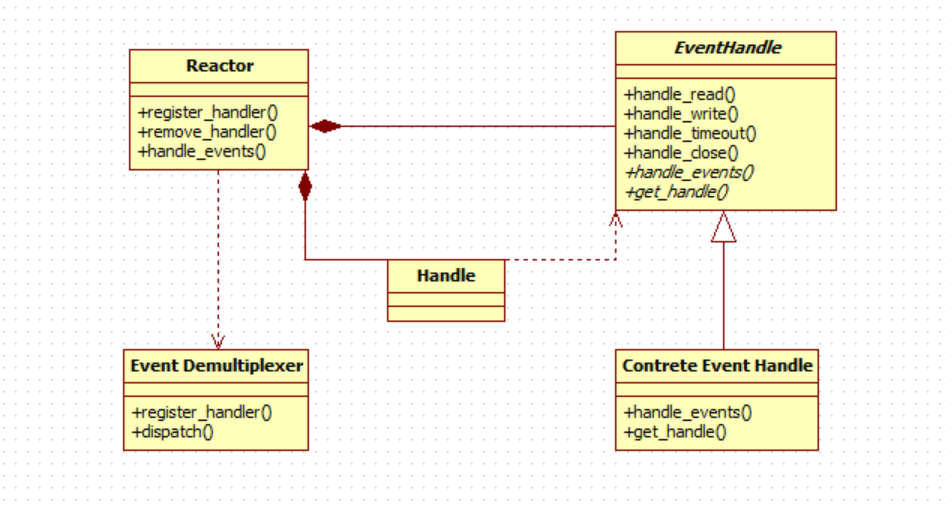

# 使用简介
1. 初始化 event_init()/event_base_new()
2. 通过event对象对文件描述符进行监控 event_set()/event_add()/event_dispatch() 
3. 读写I/O事件 bufferevent_enable()/bufferevent_disable(), bufferevent_read()/bufferevent_write() 
4. 定时事件 evtimer_set()/ evtimer_add()/ evtimer_del() 
5. 对文件描述符指定超时时间 timeout_set()/timeout_add()/timeout_del() 
6. 异步DNS evdns_init()/evdns_resolve_ipv4()/evdns_resolve_reverse() 
7. http server evhttp_new()/evhttp_bind_socket()/evhttp_set_cb()/evhttp_set_gencb() 
8. rpc server and clients


# 设计原理


基于Reactor模式
> Handle 事件源, 如Linux下的文件描述符
> Event Handle 为事件处理提供一组有效接口, 对应绑定一个事件源
> Reactor 事件管理接口, 内部使用Event Demultiplexer注册/注销事件, 运行事件循环, 当事件就绪时, 调用对应回调函数
> Event Demultiplexer 事件多路分发机制, 由select,poll,epoll等实现

# 源码分析
## event
用event_new创建时设置好监听事件/回调函数, 或event_set设置


```
struct event {
	struct event_callback ev_evcallback;  // 回调函数, event_base 调用

	/* for managing timeouts */
	union {
		TAILQ_ENTRY(event) ev_next_with_common_timeout;
		int min_heap_idx;			   // 索引值指明该event结构体在堆的位置
	} ev_timeout_pos;                  // 定时事件
	evutil_socket_t ev_fd;             // 文件描述符 或 信号

	struct event_base *ev_base;        // 管理者指针

	union {                                 // 用union节省内存, 只会用一种类型事件
		/* used for io events */
		struct {
			LIST_ENTRY (event) ev_io_next;  // 双向链表, 可以有多个文件描述符
			struct timeval ev_timeout;
		} ev_io;

		/* used by signal events */
		struct {
			LIST_ENTRY (event) ev_signal_next;
			short ev_ncalls;
			/* Allows deletes in callback */
			short *ev_pncalls;
		} ev_signal;
	} ev_;        // I/O 或 信号事件

	short ev_events;     // 关注的事件类型 I/O事件(EV_READ/EV_WRITE/EV_CLOSED)...
	short ev_res;		/* result passed to event callback */
	struct timeval ev_timeout;  // 超时时间
};

struct event_callback {
	TAILQ_ENTRY(event_callback) evcb_active_next;
	short evcb_flags;        // event 的状态跟踪, 已经初始化等状态
	ev_uint8_t evcb_pri;	/* smaller numbers are higher priority */
	ev_uint8_t evcb_closure;  // 回调函数类型, 在初始化event时赋值
	/* allows us to adopt for different types of events */
        union {
		void (*evcb_callback)(evutil_socket_t, short, void *);
		void (*evcb_selfcb)(struct event_callback *, void *);
		void (*evcb_evfinalize)(struct event *, void *);
		void (*evcb_cbfinalize)(struct event_callback *, void *);
	} evcb_cb_union;
	void *evcb_arg;
};

```



## event_base

根据event_config创建event_base


```
struct event_config {
	TAILQ_HEAD(event_configq, event_config_entry) entries;  // 字符串, 避免使用指定的I/O复用函数

	int n_cpus_hint;                           // CPU个数，仅提示
	struct timeval max_dispatch_interval;      
	int max_dispatch_callbacks;					// 
	int limit_callbacks_after_prio;				// 
	enum event_method_feature require_features; // 边缘触发/只用epoll等特性设置
	enum event_base_config_flag flags;          // 其他标记
};

enum event_base_config_flag {
	EVENT_BASE_FLAG_NOLOCK = 0x01,         // event_base 不分配锁, 多线程不安全
	EVENT_BASE_FLAG_IGNORE_ENV = 0x02,     // 不检测EVENT_*环境变量, 
	EVENT_BASE_FLAG_STARTUP_IOCP = 0x04,   // Windows必需的IOCP分发逻辑
	EVENT_BASE_FLAG_NO_CACHE_TIME = 0x08,  // timeout判断使用缓存时间, 否则每次通过系统时间获取(性能相对低)
	EVENT_BASE_FLAG_EPOLL_USE_CHANGELIST = 0x10,  // 若使用epoll, changelist可以更快的修改套接字监听状态
	EVENT_BASE_FLAG_PRECISE_TIMER = 0x20   // USING_TIMERFD
};

struct event_base {

	const struct eventop *evsel;  // 从全局 eventop 中选择对应的I/O复用函数
	void *evbase;                 // eventop 参数的对象
	struct event_changelist changelist;  // 变更
	
	struct event_io_map io;          // I/O 事件列表
	struct event_signal_map sigmap;  // 信号事件列表
	struct min_heap timeheap;        // 最小堆超时
	
	struct evcallback_list *activequeues;  // 需要执行的回调函数队列
	

};

struct event_base *
event_base_new_with_config(const struct event_config *cfg)
{
	...
	for (i = 0; eventops[i] && !base->evbase; i++) {
		if (cfg != NULL) {
			/* determine if this backend should be avoided */
			if (event_config_is_avoided_method(cfg,
				eventops[i]->name))
				continue;
			if ((eventops[i]->features & cfg->require_features)
			    != cfg->require_features)
				continue;
		}

		/* also obey the environment variables */
		if (should_check_environment &&
		    event_is_method_disabled(eventops[i]->name))
			continue;

		base->evsel = eventops[i];  // 选择I/O复用函数

		base->evbase = base->evsel->init(base);
	}
	...
}

```


## event_add

```
int
event_add_nolock_(struct event *ev, const struct timeval *tv,
    int tv_is_absolute)
{
	...
	if ((ev->ev_events & (EV_READ|EV_WRITE|EV_CLOSED|EV_SIGNAL)) &&
	    !(ev->ev_flags & (EVLIST_INSERTED|EVLIST_ACTIVE|EVLIST_ACTIVE_LATER))) {
		if (ev->ev_events & (EV_READ|EV_WRITE|EV_CLOSED))
			res = evmap_io_add_(base, ev->ev_fd, ev);          // 添加到I/O map, 一个fd可以有多个event
		else if (ev->ev_events & EV_SIGNAL)
			res = evmap_signal_add_(base, (int)ev->ev_fd, ev); // 添加到信号 map
		if (res != -1)
			event_queue_insert_inserted(base, ev);             // 把event注册到event_base中
		if (res == 1) {
			/* evmap says we need to notify the main thread. */
			notify = 1;
			res = 0;
		}
	}
	...
}

// 改变event 的状态, event_base中事件个数
static void
event_queue_insert_inserted(struct event_base *base, struct event *ev)
{
	EVENT_BASE_ASSERT_LOCKED(base);

	if (EVUTIL_FAILURE_CHECK(ev->ev_flags & EVLIST_INSERTED)) {
		event_errx(1, "%s: %p(fd "EV_SOCK_FMT") already inserted", __func__,
		    ev, EV_SOCK_ARG(ev->ev_fd));
		return;
	}

	INCR_EVENT_COUNT(base, ev->ev_flags);

	ev->ev_flags |= EVLIST_INSERTED;
}
```


## event_base_dispatch


```
int
event_base_loop(struct event_base *base, int flags)
{
		...
		event_queue_make_later_events_active(base);

		clear_time_cache(base);

		res = evsel->dispatch(base, tv_p);  // 调用系统的I/O复用函数, 添加到激活队列

		if (res == -1) {
			event_debug(("%s: dispatch returned unsuccessfully.",
				__func__));
			retval = -1;
			goto done;
		}

		update_time_cache(base);

		timeout_process(base);
		
		if (N_ACTIVE_CALLBACKS(base)) {
			int n = event_process_active(base);      // 先从队列中删除, 再执行回调函数
			if ((flags & EVLOOP_ONCE)
			    && N_ACTIVE_CALLBACKS(base) == 0
			    && n != 0)
				done = 1;
		} else if (flags & EVLOOP_NONBLOCK)
			done = 1;
	}
		...
}
```


## TAILQ_HEAD


```
```


## HT_HEAD


```
```


## 


# 应用
memcache

spserver

chrome


