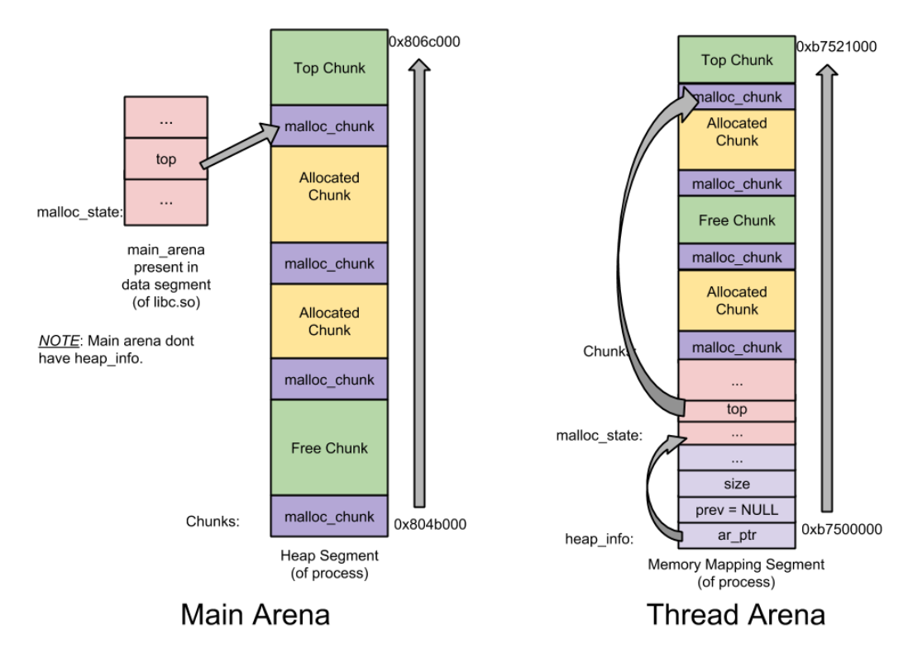
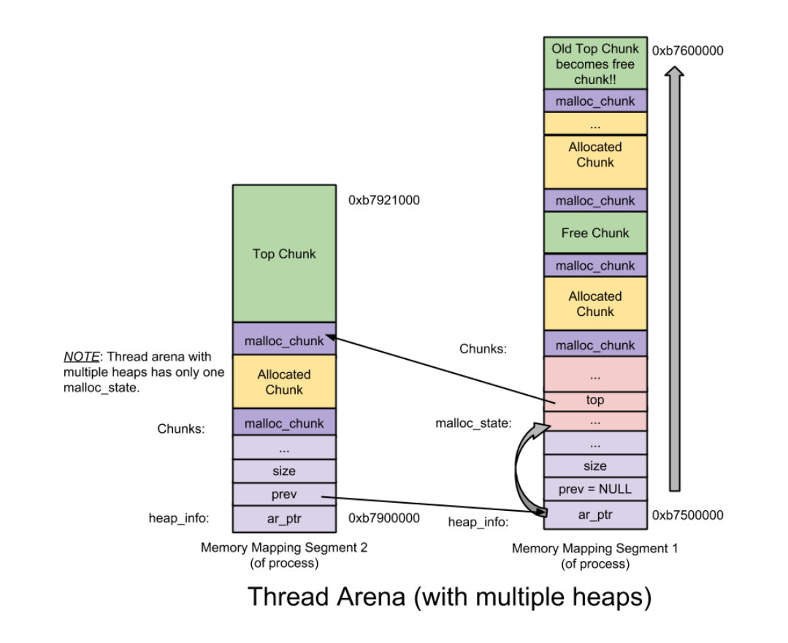

# glibc
每一种分配器都宣称自己快（fast）、可拓展（scalable）、效率高（memory efficient）

__数据结构__

|头部|名称|说明|
|:-|:-|:-|
|Arena header|malloc_state | 包括bins、top chunk、last remainder chunk等|
|Heap Header|heap_info | 每个thread arena 维护一个或多个堆|
|Chunk header|malloc_chunk|每个堆被分为若干 chunk, 每个都有自己的 chunk header|

# tcmalloc
tcmalloc是一个内存分配器，管理堆内存，主要影响malloc和free，用于降低频繁分配、释放内存造成的损耗,  
并且有效的控制内存碎片。

# 解决了什么问题

# 实现原理

