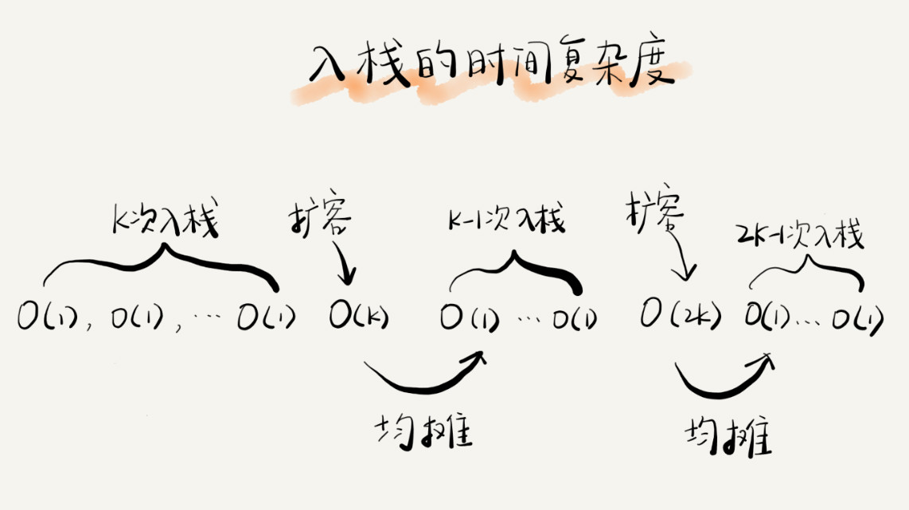

# 数组
数组Array是一种线性表数据结构。它用一组连续的内存空间，来存储一组具有相同类型的数据。

数组支持随机访问, 通过下标访问的时间复杂度为0(1)。一般用vector容器来替代

为什么下标从0开始, 地址偏移计算

<!-- more -->

# 链表
__单链表__ , __双向链表__ , __循环链表__

字符串回文判断思路:
1. 找到中间节点
2. 后半部分逆序
3. 比较
4. 后半部分恢复

## 如何轻松正确写出链表
* 重点留意边界处理
* 利用哨兵简化实现难度
* 举例画图, 辅助思考
* 多写多练, 没有捷径
> 单链表反转
> 链表中环的检测
> 两个有序的链表合并
> 删除链表倒数第 n 个结点
> 求链表的中间结点


# 栈
用数组实现的栈, 顺序栈; 用链表实现的栈, 链式栈; 操作受限的线性表数据结构

__支持动态扩容顺序栈__
入栈时间复杂度O(1), 有扩容时为O(n)


__栈在函数调用中的应用__

__栈在表达式求值中的应用__


__栈在括号匹配中的应用__

# 队列

先进者先出，这就是典型的“队列”(排队); 操作受限的线性表数据结构
用数组实现的队列叫作顺序队列，用链表实现的队列叫作链式队列

__基于链表的队列实现方法__


__循环队列__
确定好队空和队满的判定条件, 队空(head == tail), 队满(tail+1)%n=head

__阻塞队列和并发队列__
队列空取数据 或 队列满插入数据 会阻塞; 并发时需要加锁控制
轻松实现生产者-消费者模型


# 递归

// 递归部分

// 终止部分


# 排序

 ## $$ O(n^2) $$

冒泡，插入，选择

## $$ O(nlog n) $$

归并，快排


选择排序分区过程


```c++
// 归并
int sort(int arr[], int n)
{
    merge_sort(arr, 0, n-1);
}

void merge_sort(int arr[], int p, int r)
{
    if(p >= r) return;
    
    int q = (p + r)/2;
    merge_sort(arr, p, q);
    merge_sort(arr, q+1, r);
    merge(arr, p, q, r);
}

int merge(int arr[], int p, int q, int r)
{
    int* L = new int[q-p+1];
    int* R = new int[r-q+1];
    for(int i=p; i<=r; ++i)
    {
        if(i<=q)
            L[i] = arr[i];
        else
            R[i-q] = arr[i];
    }
    // copy
    int i=0;
    int j=0;
    for(int k=p; k<=r;)
    {
        if(L[i]<=R[j])
            arr[k++] = L[i++];
        else
            arr[k++] = R[j++];
    }
    delete []L;
    delete []R;
}

// 快排，求第K大的数
// 选择一个中位数
// 分区，小的放左边，大的放右边(采用插入排序，原地排序)
// 再分区，直到只有一个数
int partition(int arr[], int n)
{
    // 三数取中
}

int quick_sort(int arr[], int n)
{
    int p = partion(arr, n);
    
}


```

## $$  O(n) $$ 

桶排序，

计数排序，

基数排序


## 通用排序

如c++ sort()函数，数据量很小用插入排序，实现时数据量小(几KB)的时候用归并，大的(几M)用快排

快排优化：三数取中法

## 二分查找

时间复杂度 $$ O(log n) $$

```c++
// 递归

// 非递归

```


