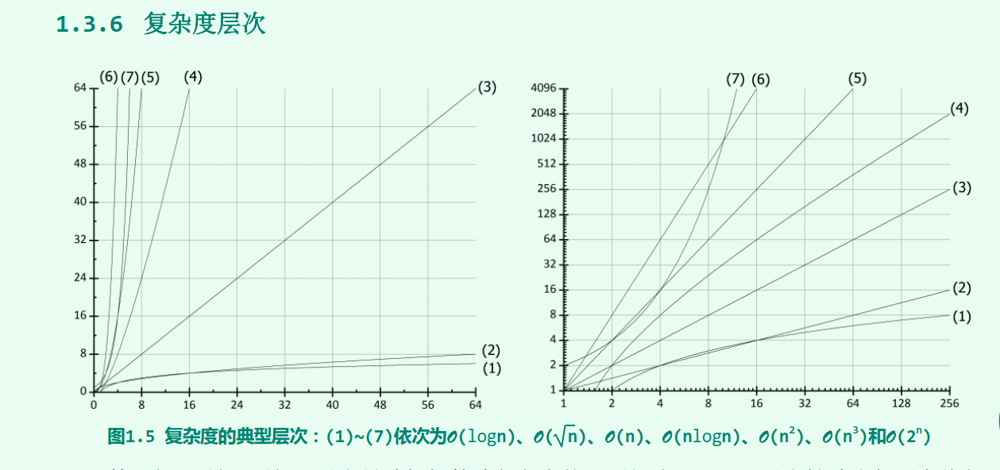
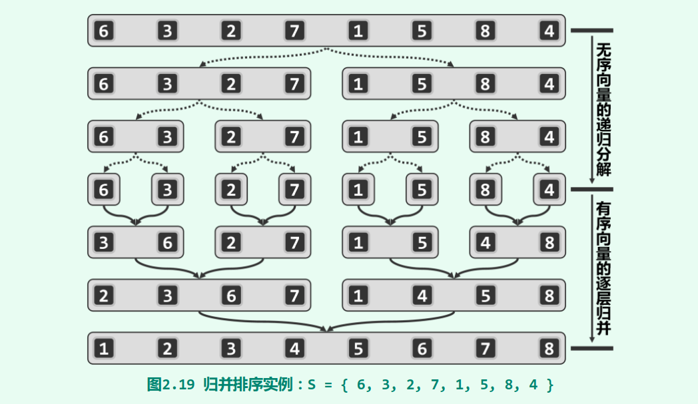
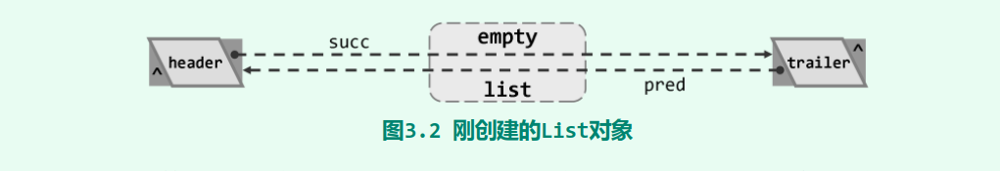
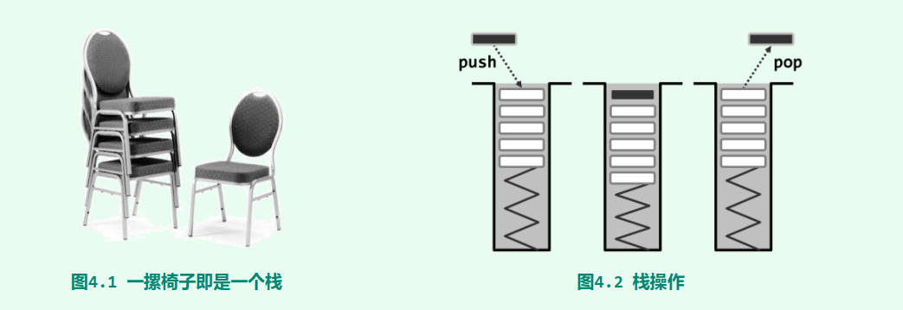
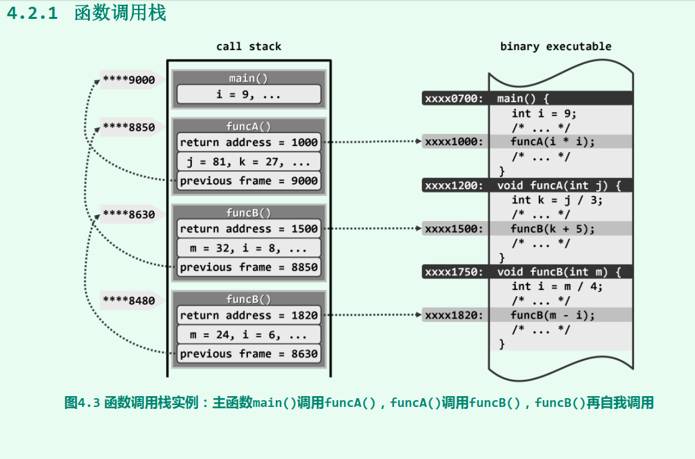

# 第一章 绪论
## 冒泡排序
> 1. 遍历A[0, n]
> 2. 依次比较相邻两个数, 若A[i-1]小于A[i], 则交换, 并设置循环遍历标记; 
> 3. 一次循环必然可确定一个最大值, n递减;

<!-- more -->

```
void bubble_sort(int A[], n)
{
	bool bSort = false;
	while(bSort)
	{
	  bSort = false;
	  for(int i=1; i<n; i++)
	  {
	    if(A[i-1]>A[i])
		{
		  swap(A[i-1], A[i]);
		  bSort = true;
		}
	  }
	  n--;
	}
}

```

## 复杂度度量
### 大O记号性质
a) 对于任意常数c>0, 有$ O(f(n)) = O(c*f(n)) $
b) 对于任意常数a>b>0, $ 有O(n^a + n^b) = O(n^a) $
冒泡时间复杂度: $ T(n)=O(2(n-1)^2) = O(2n^2 + 4n + 2) = O(2n^2) = O(n^2) $

$ \Omega $ 标记为最乐观的下限复杂度, $ \Theta $ 上限复杂度

### 复杂度分析
常数：$ T(n) = O(3) + O(2) + O(1) = O(7) = O(1) $
对数：$ O(\log_2 n) = O(\log n) $
指数：$ O(a^n) $



```
// 统计整数n二进制展开中数位1的个数
int countOnes(unsigned int n)
{
  int num = 0;
  while(n>0)
  {
    num += (1&n);
	n >> 1;
  }
  return num;
}
```

## 递归(recursive)
### 线性递归


### 二分递归


### 多分支递归

## ADT


# 第二章 向量
## 从数组到向量
前驱(prefix)，后继(suffix)
向量(vector)是线性数组的抽象和泛化。各元素的秩(rank)互异, 且均为[0, n) 内的整数。
需要考虑扩容(expand不够用成倍扩展)和缩容(shrink小于25%较少1/2空间)

## 归并排序
比较两个待归并的向量的首元素，取小的追加到输出向量末尾
时间复杂度$ O(\log n) $
```
template <class T>
void mergeSort(Rank lo, Rand hi)
{
	if(hi - lo < 2) return;
	int mi = (lo + hi) >> 1;
	mergeSort(lo, mi); 
	mergeSort(mi, hi);
	merge(lo, mi, hi);
}

template <class T>
void merge(Rank lo, Rank mi, Rank hi)
{
	
	
}

```


# 第三章 列表
插入排序, 选择排序, 归并排序
```
template <class T>
void list<T>::init()
{
  header = new ListNode<T>;
  trailer = new listNode<T>;
  header->pred = NULL;
  header->succ = trailer;
  trailer->pred = header;
  trailer->succ = NULL;
  _size = 0 // 记录规模
}
```


第4章 栈与队列
典型应用: 逆序输出(进制转换), 递归嵌套(栈混洗复制一个栈,括号匹配), 延迟缓冲, 逆波兰表达式




```
char digit[] = {'0','1','2','3','4','5','6','7','8','9','a','b','c','d','e'};
void convert(stack<char>& out, __int64 n, int base)
{
  if(n > 0)
  {
    convert(out, n/base, base); // 递归得到所有高位
	out.push(digit[n%base]); // 输出低位
  }
  /*
  while(n>0)
  {
    int pos = n%base;
	out.push(digit[pos]);
    n /= base;
  }
  */
}
```


