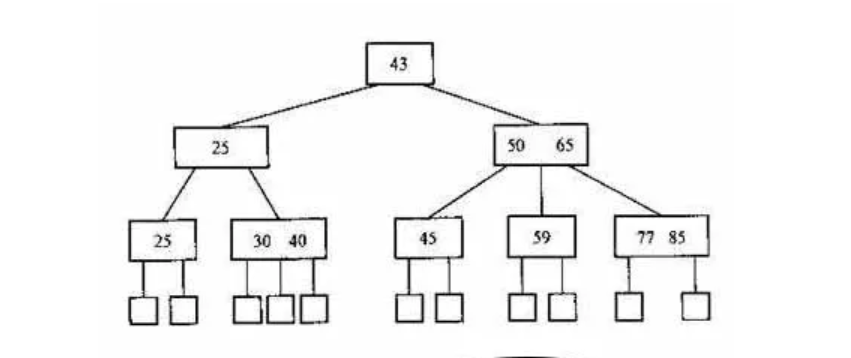

# 树的类别
二叉树、二叉搜索树、平衡二叉树、红黑树、B树、B+树、字典树

<!-- more -->

# 二叉树
二叉树，插入有序的数据，会退化成链表，需要调整数据均匀分布，保证平衡性(搜索效率)
书的查找性能取决于树的高度

# 二叉搜索树(BST)

# 平衡二叉树(AVL)
windows对进程地址空间的管理用到了AVL树

# 红黑树
广泛用在C++的STL中, 如map和set.

# B树
多路搜索树，每个节点可以拥有多于两个孩子节点。M路的B树最多有用M个孩子节点。

设计成多路是为了降低树的高度，但是无限多路时退化成有序数组。
一般用于文件索引，为什么不用红黑树和有序数组？
文件系统和数据库的索引都是存在硬盘上的，并且如果数据量大的话，不一定能一次性加载到内存中。
B树索引可以每次加载一个节点，一步一步往下找。在内存中黑红树比B树效率高，但涉及到磁盘，B树更优。

# B+树 
在B树基础上进行改造，数据都在叶子结点，同时叶子结点之间用指针形成链表。

为什么要这样设计？
这也是和业务场景相关的，数据库中select数据，不一定只选一条，很多时候会选多条，比如按照id排序后选10条。
如果是多条的话，B树需要做局部的中序遍历，可能要跨层访问。而B+树由于所有数据都在叶子结点，不用跨层，同  
时由于有链表结构，只需要找到首尾，通过链表就能把所有数据取出来了。

选出7~19，在叶子节点中就可以找到。

# 字典树(Trie)
用在统计和排序大量字符串，如自动机
一个典型应用是前缀匹配，比如在我们输入时，搜索引擎会给予提示
[字典树](https://github.com/julycoding/The-Art-Of-Programming-By-July/blob/master/ebook/zh/06.09.md)

