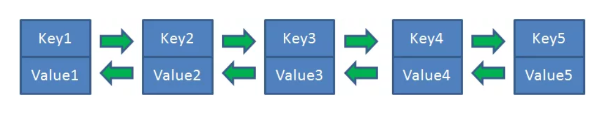

# LRU算法
## 算法原理
全称Least Recently Used, 也就是最近最少使用, 是一种内存管理算法, 最早应用于Linux系统。
基于一种假设：长期不被使用的数据, 在未来用到的几率不大。因此当数据占据一定阈值时，移除  
掉最近最少被使用的数据。

哈希表是由若干个Key-Value所组成。在“逻辑”上，Key-Value是无所谓排列顺序的。
在哈希链表当中，这些Key-Value不再是彼此无关的存在，而是被一个链条串了起来。每一个  
Key-Value都具有它的前驱Key-Value、后继Key-Value，就像双向链表中的节点一样。

