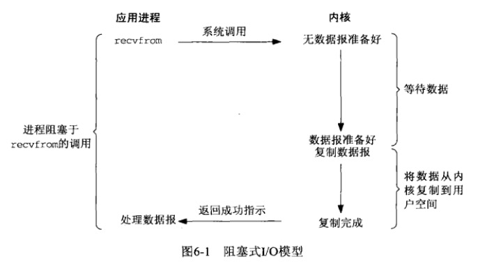
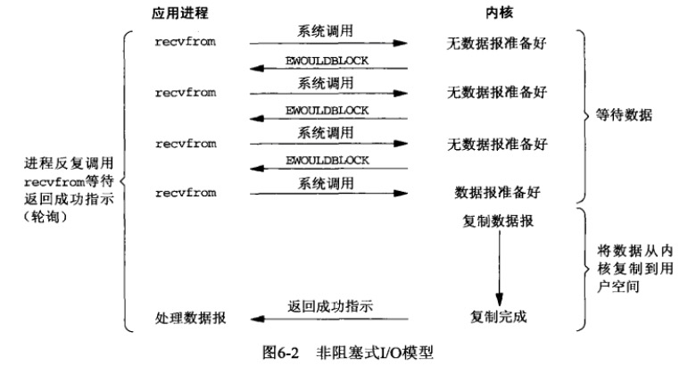
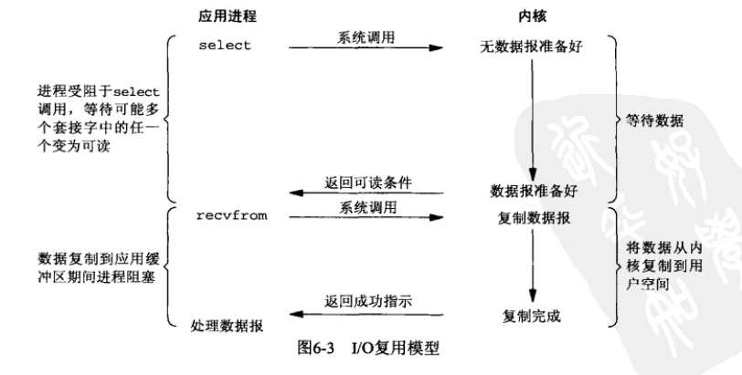
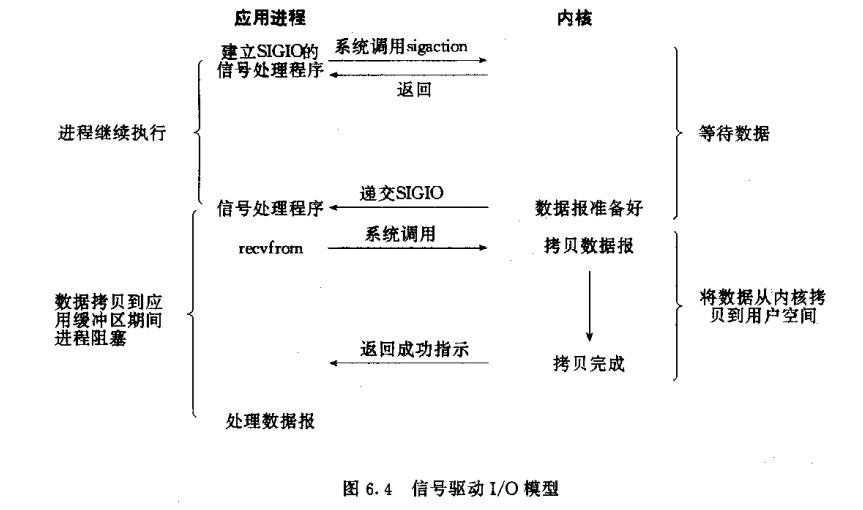
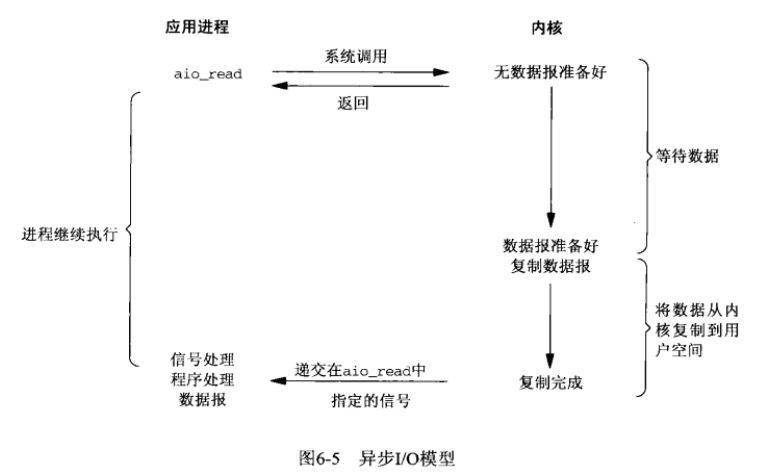
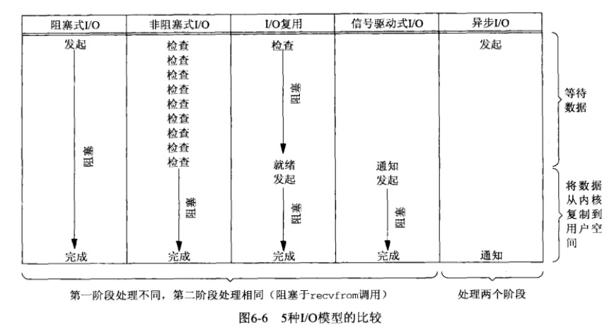

在Linux中，对于一次读取IO的操作, 包含两个阶段
> 1 Waiting for the data to be ready(等待数据到达内核缓冲区)
> 2 Copying the data from the kernel to the process(从内核缓冲区拷贝数据到程序缓冲区)

对于同步、异步IO, Stevens给的定义
> A synchronous I/O operation causes the requesting process to be  
blocked until that I/O operation completes;
>  An asynchronous I/O operation does not cause the requesting process to be blocked; 

<!-- more -->
根据IO操作和进程的关系，分为五种模型
# 阻塞IO

IO操作的两个阶段都阻塞, 用户进程一直等待系统调用返回

# 非阻塞IO

前三次调用立即返回, 第四次调用内核数据已经准备好, 但是从内核缓冲区拷贝数据到程序缓冲区时  
用户进程会等待系统调用返回

# IO复用

select等待数据到达内核缓冲区(或超时), recvfrom从内核缓冲区拷贝数据到程序缓冲区, 两个过程  
用户进程分别会阻塞等待调用返回

# 信号驱动

设置socket为一个信号驱动IO, 内核数据准备好后通知用户进程.   
用户进程调用recform, 等待从内核缓冲区拷贝数据到程序缓冲区, 这个过程用户进程阻塞等待

# 异步IO

用户进程调用aio_read后, 可以继续执行, 等待IO操作两个阶段完成收到信号通知, 读取数据

# 总结
前四种都是同步型IO操作, 只有异步IO才是异步型IO操作。
