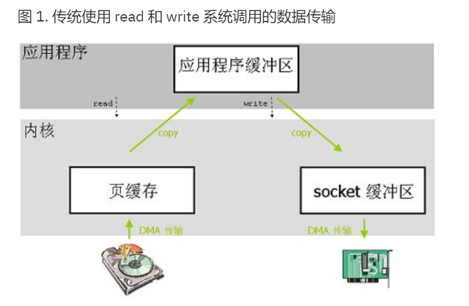
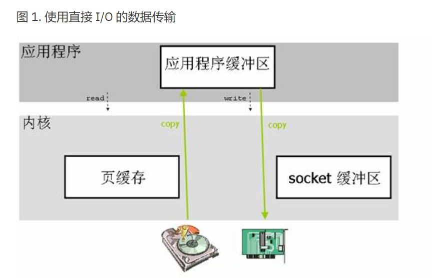
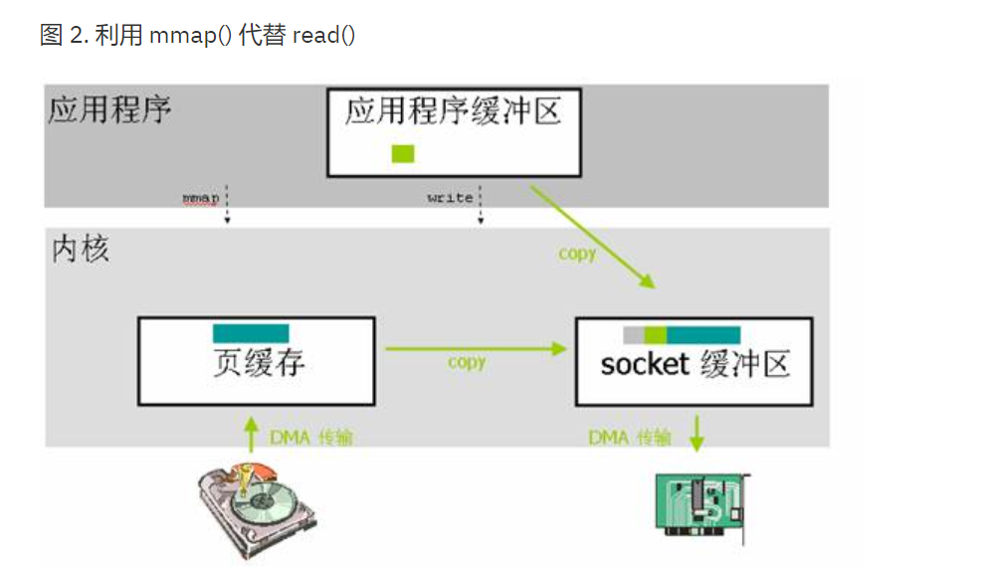
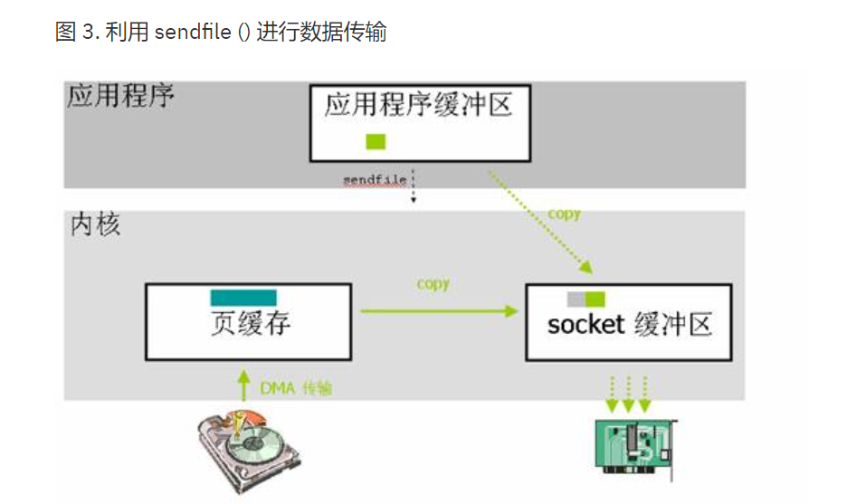
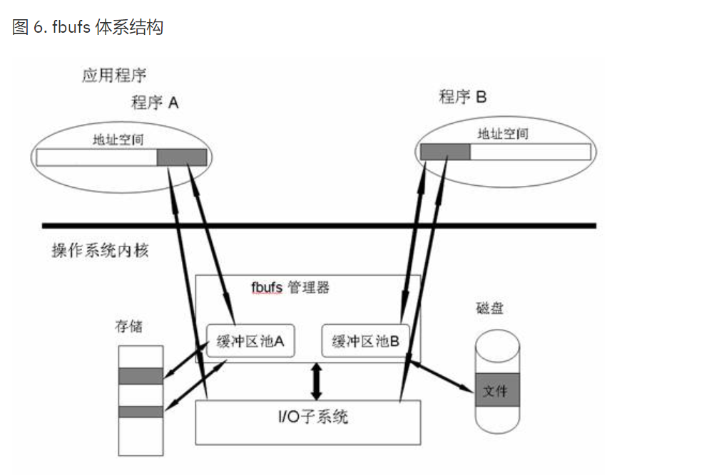

# 为什么需要零拷贝


# 零拷贝技术概述
简单一点来说，零拷贝就是一种避免 CPU 将数据从一块存储拷贝到另外一块存储的技术
避免数据拷贝

# 零拷贝技术分类
## 直接IO
对于这种数据传输方式来说，应用程序可以直接访问硬件存储，操作系统内核只是辅助数据  
传输：这类零拷贝技术针对的是操作系统内核并不需要对数据进行直接处理的情况，数据可  
以在应用程序地址空间的缓冲区和磁盘之间直接进行传输，完全不需要 Linux 操作系统内  
核提供的页缓存的支持。


```
int open(const char *pathname, int oflag, … /*, mode_t mode * / ) ;

O_DIRECT	该描述符提供对直接 I/O 的支持
```
打开文件指定O_DIRECT 属性时, read/write是直接I/O操作

> 优点 直接 I/O 最主要的优点就是通过减少操作系统内核缓冲区和应用程序地址空间的数据拷贝  
次数，降低了对文件读取和写入时所带来的 CPU 的使用以及内存带宽的占用
> 缺点 直接 I/O 的开销非常大, 造成磁盘的同步读, 也会导致应用程序关闭缓慢, 通常会和使用  
异步 I/O 结合使用

## mmap/sendfile/splice
避免数据在操作系统内核地址空间的缓冲区和用户应用程序地址空间的缓冲区之间进行拷贝

### mmap
通过使用 mmap() 来代替 read(), 应用程序调用了 write() 之后，操作系统内核将数据从原来的内  
核缓冲区中拷贝到与 socket 相关的内核缓冲区中


### sendfile
sendfile() 系统调用不需要将数据拷贝或者映射到应用程序地址空间中去，所以 sendfile()   
只是适用于应用程序地址空间不需要对所访问数据进行处理的情况


### splice
splice() 可以被看成是类似于基于流的管道的实现，管道可以使得两个文件描述符相互连接，  
splice 的调用者则可以控制两个设备（或者协议栈）在操作系统内核中的相互连接。在 Linux 2.6.23   
中，sendfile() 利用了 splice() 这种机制来实现的

```
long splice(int fdin, int fdout, size_t len, unsigned int flags);
```


## 写时复制
拷贝复制的一种策略, 例如fork/string都有使用, 缓冲区共享

* 快速缓冲区(Fast Buffers)原理介绍
应用程序将 fbuf 传递给操作系统内核，这样就能减少传统的 write 系统调用所产生的数据拷贝开销



